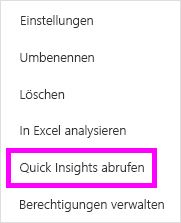

# Automatisches Erstellen von Einblicken in Daten mit Power BI
Sie besitzen ein neues Dataset und fragen sich, womit Sie beginnen sollen?  Sie müssen schnell ein Dashboard erstellen?  Sie möchten nach Einblicken suchen, die Sie möglicherweise übersehen haben?

Führen Sie schnelle Einblicke aus, um interessante interaktive Visualisierungen auf Grundlage Ihrer Daten zu generieren. Schnelle Einblicke können für ein gesamtes Dataset (schnelle Einblicke) oder eine bestimmte Dashboard-Kachel (bereichsbezogene Einblicke) ausgeführt werden. Sie können sogar Einblicke für einen Einblick ausführen.

> [!NOTE]
> Erkenntnisse funktionieren nicht mit DirectQuery. Sie funktionieren nur mit Daten, die in Power BI hochgeladen werden.
> 

Das Feature „Einblicke“ basiert auf einer wachsenden Reihe [erweiterter analytischer Algorithmen](service-insight-types.md), die in Verbindung mit Microsoft Research entwickelt wurden. Wir möchten damit auch in Zukunft noch mehr Benutzern auf neue und intuitive Weise Einblicke in ihre Daten bieten.

## Ausführen von schnellen Einblicken für ein Dataset
Lassen Sie sich von Amanda zeigen, wie Sie das Feature „Schnelle Einblicke“ auf ein Dataset anwenden, einen Einblick im Fokusmodus öffnen, einen der Einblicke als Kachel an das Dashboard anheften und dann Einblicke für eine Dashboardkachel abrufen.

<iframe width="560" height="315" src="https://www.youtube.com/embed/et_MLSL2sA8" frameborder="0" allowfullscreen></iframe>

Jetzt sind sie dran. Durchsuchen Sie Erkenntnisse, indem Sie das [Analysebeispiel für die Lieferantenqualität](sample-supplier-quality.md) verwenden.

1. Wählen Sie auf der Registerkarte **Datasets** die Auslassungspunkte (...) und dann **Quick Insights abrufen** aus.
   
    
   
    
2. Power BI verwendet [verschiedene Algorithmen](service-insight-types.md) zum Suchen nach Trends in Ihrem Dataset.
   
    
3. Innerhalb von Sekunden sind Ihre Einblicke bereit.  Wählen Sie **Einblicke anzeigen** aus, um Visualisierungen anzuzeigen.
   
    
   
    > [!NOTE]
    > Einige Datasets können keine Einblicke generieren, da die Daten statistisch nicht signifikant sind.  Weitere Informationen finden Sie unter [Optimieren von Daten für Einblicke](service-insights-optimize.md).
    > 
    
4. Die Visualisierungen werden in einem speziellen Bereich für **schnelle Einblicke** mit bis zu 32 getrennten Einblickkarten angezeigt. Jede Karte enthält ein Diagramm oder eine Grafik und eine kurze Beschreibung.
   
    

## Interaktion mit Karten für Einblicke

1. Zeigen Sie auf eine Karte, und wählen Sie das Anheftsymbol aus, um die Visualisierung einem Dashboard hinzuzufügen.

2. Zeigen Sie auf eine Karte, wählen Sie die Auslassungspunkte (...) und dann **Erkenntnisse anzeigen** aus. 

    Die Anzeige für Erkenntnisse wird im Fokusmodus geöffnet.
   
    
3. In diesem Modus haben Sie folgende Möglichkeiten:
   
   * Filtern Sie die Visualisierungen. Wenn der Bereich **Filter** nicht bereits geöffnet ist, erweitern Sie ihn, indem Sie den Pfeil auf der rechten Seite des Fensters auswählen.

       
   * Heften Sie die Erkenntniskarte an ein Dashboard an, indem Sie **Visualisierung anheften** auswählen.
   * Führen Sie Erkenntnisse auf der Karte selbst aus. Dies wird häufig als *bereichsbezogene Erkenntnisse* bezeichnet. Klicken Sie in der oberen rechten Ecke auf das Glühbirnensymbol  oder auf **Erkenntnisse abrufen**.
     
       
     
     Der Einblick wird auf der linken Seite angezeigt, und neue Karten (ausschließlich abhängig von den Daten in diesem Einblick) werden rechts angezeigt.
     
       
4. Wenn Sie zum Bereich für Einblicke zurückkehren möchten, wählen Sie links oben **Fokusmodus beenden** aus.

## Ausführen von Einblicken auf einer Dashboardkachel
Anstatt nach Erkenntnissen für ein gesamtes Dataset zu suchen, schränken Sie Ihre Suche ein, um eine bereichsbezogene Erkenntnis für die Daten auszuführen, die zum Erstellen einer einzelnen Dashboardkachel verwendet werden. 

1. Öffnen Sie ein Dashboard.
2. Zeigen Sie auf eine Kachel. Wählen Sie die Auslassungspunkte (...) und dann **Erkenntnisse anzeigen** aus. Die Kachel wird im [Fokusmodus](service-focus-mode.md) geöffnet. Die Einblickkarten werden rechts angezeigt.    
   
        
3. Ist einer der Einblicke für Sie interessant? Wählen Sie die entsprechende Einblickkarte aus, um weitere Informationen zu erhalten. Der ausgewählte Einblick wird auf der linken Seite angezeigt, und neue Einblickkarten (ausschließlich abhängig von den Daten in diesem Einblick) werden rechts angezeigt.    
4. Schlüsseln Sie Ihre Daten weiter auf. Wenn Sie für Sie interessante Einblicke finden, können Sie sie an Ihr Dashboard anheften, indem Sie rechts oben auf **Visualisierung anheften** klicken.

## Nächste Schritte
- Wenn Sie ein Dataset besitzen, [optimieren Sie es für Quick Insights](service-insights-optimize.md).
- Weitere Informationen zu den [verfügbaren Quick Insights-Typen](service-insight-types.md).

Weitere Fragen? [Wenden Sie sich an die Power BI-Community](http://community.powerbi.com/).

