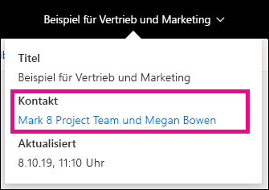
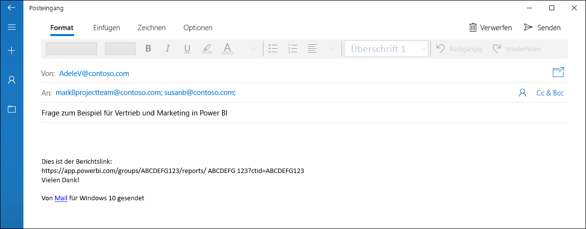
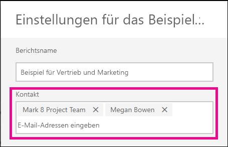

# Festlegen von Kontaktinformationen für Berichte und Dashboards im Power BI-Dienst
In diesem Artikel erfahren Sie, wie Sie Kontaktinformationen für ein Dashboard oder einen Bericht im Power BI-Dienst festlegen.

> [!NOTE]
> Kontaktinformationen können für Elemente in einem klassischen oder neuen Arbeitsbereich festgelegt werden. Sie können im Arbeitsbereichstyp „Mein Arbeitsbereich“ keine Kontaktinformationen für Elemente festlegen. Die Infokarte wird gezeigt, wenn Sie einen Bericht oder ein Dashboard im [neuen Design ](service-new-look.md) betrachten.

Sie können dem Kontakt für ein Element mehrere Benutzer oder Gruppen hinzufügen. Dabei kann es sich um die Folgenden handeln:
* Person
* Office 365-Gruppe
* Für E-Mail aktivierte Sicherheitsgruppe
* Verteilerliste

Standardmäßig ist die Person, die einen neuen Bericht oder ein Dashboard erstellt, der zuständige Kontakt. Wenn Sie einen Wert festlegen, wird der Standardwert überschrieben. Natürlich können Sie alle Personen oder Gruppen aus der Kontaktliste entfernen. In diesem Fall wird für klassische Arbeitsbereiche die Office 365-Gruppe für den Arbeitsbereich angezeigt. Für Arbeitsbereiche in der neuen Arbeitsbereichsumgebung wird die [Kontaktliste für den Arbeitsbereich](service-create-the-new-workspaces.md#workspace-contact-list) verwendet. Wenn die Kontaktliste für den Arbeitsbereich nicht festgelegt ist, werden die Arbeitsbereichsadministratoren gezeigt.

Die Kontaktinformationen werden Personen gezeigt, die das Element betrachten. 

 

Wenn Sie auf die Liste der Kontakte klicken, wird eine E-Mail erstellt, sodass Sie Fragen stellen oder Hilfe anfordern können. 

 
 
Die Kontaktlisteninformationen werden auch an anderer Stelle verwendet. Beispielsweise werden sie in einigen Fehlerszenarien im Fehlerdialogfeld angezeigt. Automatisierte E-Mail-Nachrichten, die mit dem Element verknüpft sind, wie Zugriffsanforderungen, werden an die Kontaktliste gesendet. 

> [!NOTE]
> Bei Veröffentlichung einer App werden die für einzelne Elemente festgelegten Kontaktinformationen auf die Person festgelegt, die die App veröffentlicht oder aktualisiert hat. Sie können die URL für die App-Unterstützung festlegen, damit App-Benutzer die benötigte Hilfe erhalten.

## Festlegen von Kontaktinformationen für einen Bericht
1. Wählen Sie in Ihrem Arbeitsbereich die Registerkarte **Berichte** aus.
2. Navigieren Sie zum gewünschten Bericht, und klicken Sie auf das Symbol **Einstellungen**.
3. Wechseln Sie zum Eingabefeld **Kontakt**, und legen Sie einen Wert fest.

     

## Festlegen von Kontaktinformationen für ein Dashboard
1. Wählen Sie im Arbeitsbereich die Registerkarte **Dashboards** aus.
2. Navigieren Sie zum gewünschten Dashboard, und klicken Sie auf das Symbol **Einstellungen**.
3. Wechseln Sie zum Eingabefeld **Kontakt**, und legen Sie einen Wert fest.

     

## Einschränkungen und Überlegungen
* Der Kontakt wird automatisch für neue Elemente festgelegt, die im Power BI-Dienst erstellt werden. Vorhandene Elemente zeigen den Standardwert des Arbeitsbereichs an.
* Sie können beliebige Benutzer oder Gruppen in der Kontaktliste festlegen, denen jedoch nicht automatisch Berechtigungen für das Element erteilt werden. Verwenden Sie die Freigabe, oder gewähren Sie Benutzern den benötigten Zugriff auf den Arbeitsbereich über eine Rolle. 
* Die Kontaktliste auf Elementebene wird beim Veröffentlichen nicht per Push in Apps übertragen. Die neue App-Navigation bietet eine Support-URL, die Sie konfigurieren können, um das Feedback einer großen Anzahl von App-Benutzern zu verwalten.

## Nächste Schritte

Weitere Fragen? [Wenden Sie sich an die Power BI-Community](https://community.powerbi.com/)
