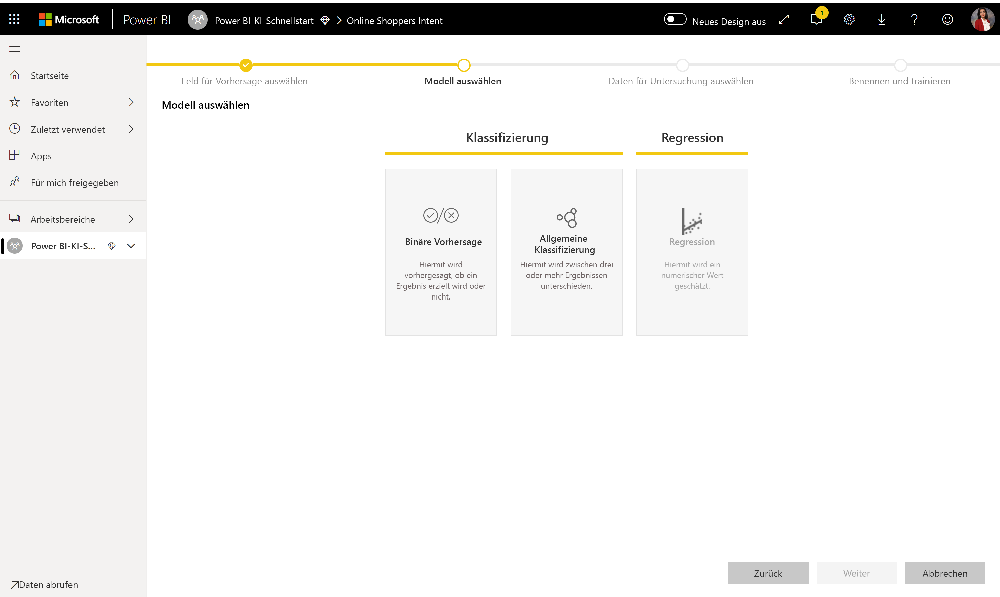
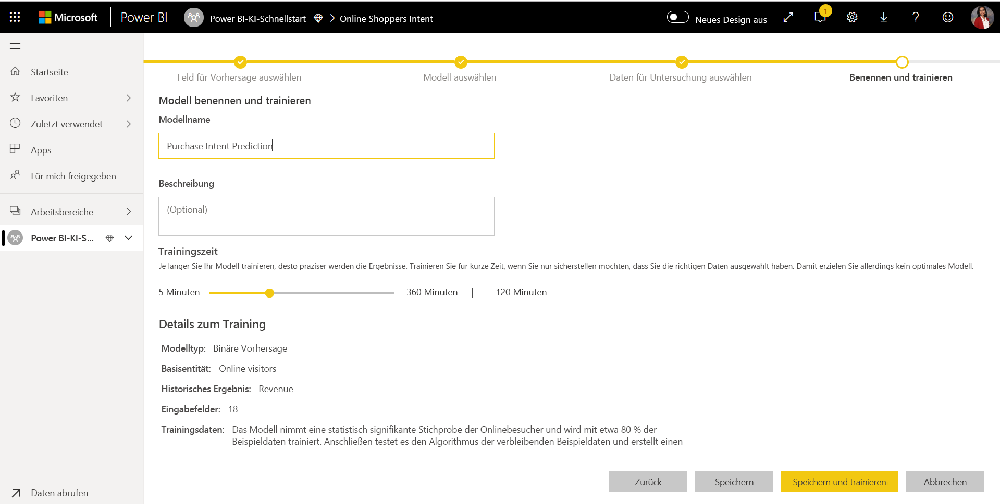
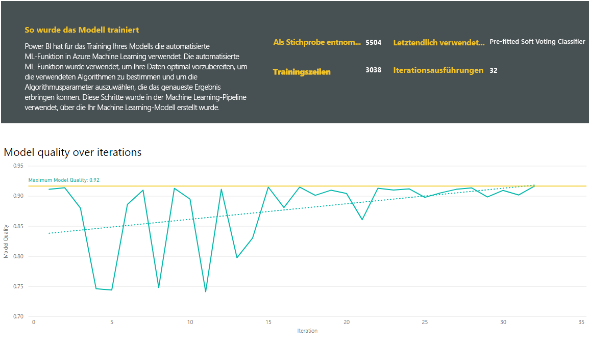
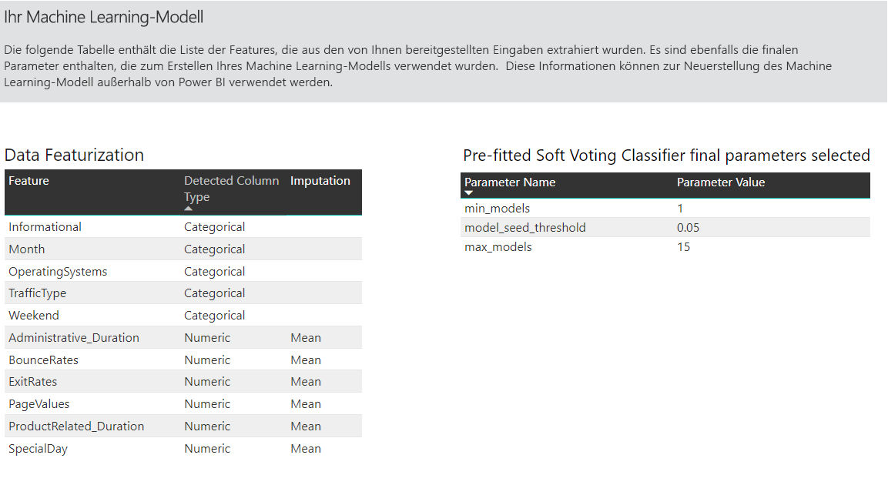
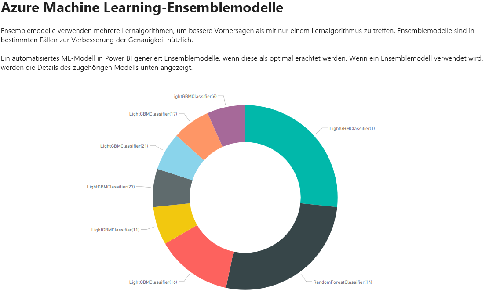
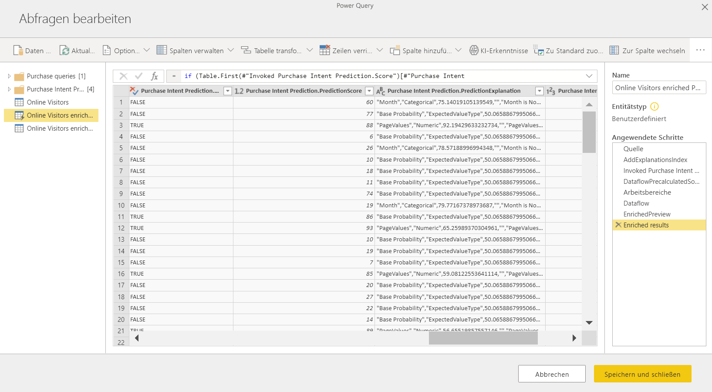
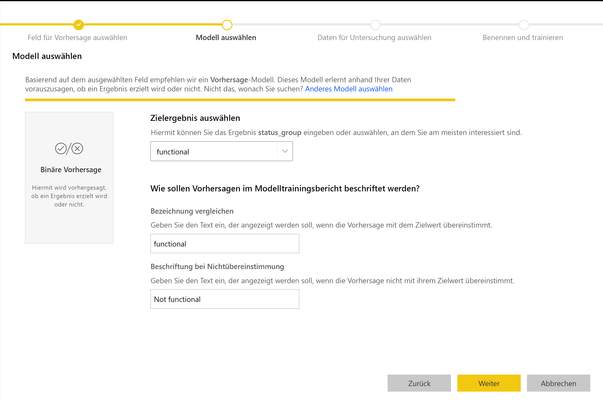
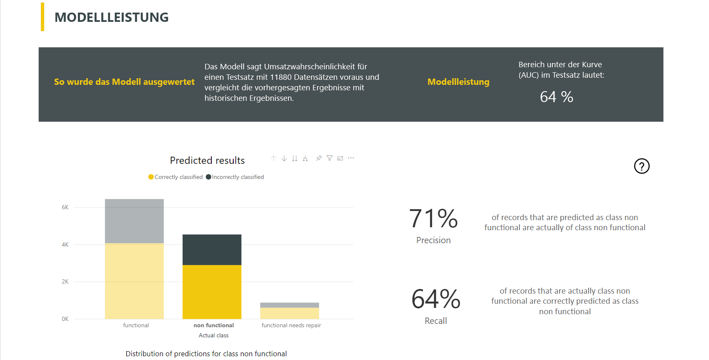
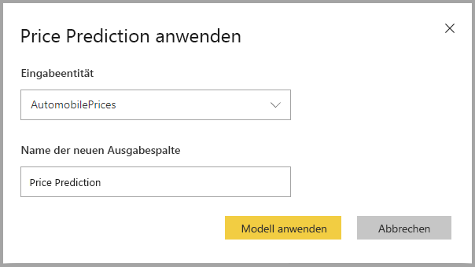

# Automatisiertes Machine Learning in Power BI

Automatisiertes maschinelles Lernen (AutoML) für Dataflows ermöglicht Business Analysts, ML-Modelle (Machine Learning) direkt in Power BI zu trainieren, zu prüfen und aufzurufen. Dazu gehört eine einfache Umgebung zur Erstellung eines neuen ML-Modells, in dem Analysten ihre Dataflows verwenden können, um die Eingabedaten zum Trainieren des Modells festzulegen. Der Dienst extrahiert automatisch die wichtigsten Features, wählt einen geeigneten Algorithmus aus, optimiert das ML-Modell und prüft es. Nach dem Trainieren eines Modells erstellt Power BI automatisch einen Leistungsbericht, der die Ergebnisse der Prüfung enthält. Das Modell kann anschließend für alle neuen oder aktualisierten Daten im Dataflow aufgerufen werden.

Automatisiertes maschinelles Lernen ist nur für Datenflows verfügbar, die in Power BI Premium und Embedded gehostet werden.

## Arbeiten mit AutoML

[Power BI-Dataflows](service-dataflows-overview.md) ermöglichen eine Self-Service-Datenaufbereitung durch Big Data-Analysen. AutoML ist in Dataflows integriert und ermöglicht Ihnen zum Erstellen von Machine Learning-Modellen die Aufbereitung Ihrer Daten direkt in Power BI.

AutoML in Power BI ermöglicht Datenanalysten den Einsatz von Dataflows, um Machine Learning Modelle in vereinfachter Weise zu erstellen, wobei nur Power BI-Fertigkeiten genutzt werden. Der größte Teil der Data Science hinter der Erstellung der ML-Modelle wird von Power BI automatisiert. Dies geschieht mithilfe von Vorkehrungen, die sicherstellen, dass das produzierte Modell eine gute Qualität aufweist. Außerdem erhalten Sie Einblick in den Prozess, der zum Erstellen des ML-Modells verwendet wird.

AutoML unterstützt für Dataflows das Erstellen von Modellen der Typen **Binäre Vorhersage**, **Klassifizierung** und **Regression**. Dies sind beaufsichtigte Machine Learning-Techniken, was bedeutet, dass sie aus den bekannten Ergebnissen früherer Beobachtungen lernen, um die Ergebnisse anderer Beobachtungen vorherzusagen. Das Eingabedataset zum Trainieren eines AutoML-Modells besteht aus einer Reihe von Datensätzen, die mit den bekannten Ergebnissen **beschriftet**  sind.

AutoML in Power BI integriert [automatisiertes Machine Learning](https://docs.microsoft.com/azure/machine-learning/service/concept-automated-ml) aus [Azure Machine Learning](https://docs.microsoft.com/azure/machine-learning/service/overview-what-is-azure-ml) zur Erstellung Ihrer Machine Learning-Modelle. Sie benötigen jedoch kein Azure-Abonnement, um AutoML in Power BI zu nutzen. Der Prozess des Trainings und Hostings der ML-Modelle wird vollständig vom Power BI-Dienst verwaltet.

Nachdem ein ML-Modell trainiert wurde, erstellt AutoML automatisch einen Power BI-Bericht, der die wahrscheinliche Leistung Ihres ML-Modells erklärt. AutoML legt den Schwerpunkt auf Erklärbarkeit, indem es die wichtigsten Einflussfaktoren unter Ihren Eingaben hervorhebt, die die von Ihrem Modell gelieferten Vorhersagen beeinflussen. Der Bericht enthält auch Schlüsselmetriken für das Modell.

Andere Seiten des generierten Berichts zeigen eine statistische Zusammenfassung zum Modell und die Trainingsdetails. Die statistische Zusammenfassung ist für Benutzer von Interesse, die die üblichen Data-Science-Measures der Modellleistung einsehen möchten. In den Trainingsdetails sind alle Iterationen mit den zugehörigen Modellierungsparametern zusammengefasst, die zur Erstellung Ihres Modells erfolgt sind. Außerdem wird beschrieben, wie die einzelnen Eingaben zur Erstellung des ML-Modells verwendet wurden.

Danach können Sie Ihr ML-Modell auf Ihre Daten anwenden, um es zu bewerten. Bei der Aktualisierung des Dataflows werden Ihre Daten mit Vorhersagen aus Ihrem ML-Datenmodell aktualisiert. Power BI bietet auch eine individualisierte Erklärung für die jeweilige Vorhersage, die das ML-Modell liefert.

## Erstellen eines Machine Learning-Modells

In diesem Abschnitt wird das Erstellen eines AutoML-Modells beschrieben.

### Datenaufbereitung zum Erstellen eines ML-Modells

Um ein Machine Learning-Modell in Power BI zu erstellen, müssen Sie zunächst einen Dataflow für die Daten mit den historischen Ergebnisinformationen erstellen, der zum Trainieren des ML-Modells verwendet wird. Sie sollten auch berechnete Spalten für Geschäftsmetriken hinzufügen, die starke Prädiktoren für das Ergebnis sein können, das Sie vorherzusagen versuchen. Ausführliche Informationen zum Konfigurieren des Dataflows finden Sie unter [Self-Service-Datenaufbereitung in Power BI](service-dataflows-overview.md).

In AutoML gelten für das Trainieren eines Machine Learning-Modells bestimmte Anforderungen. Diese Anforderungen werden in den folgenden Abschnitten basierend auf den jeweiligen Modelltypen beschrieben.

### Konfigurieren der Eingaben in das ML-Modell

Um ein AutoML-Modell zu erstellen, klicken Sie in der Spalte **Aktionen** der Dataflowentität auf das ML-Symbol und wählen **Machine Learning-Modell hinzufügen** aus.

Es wird eine vereinfachte Umgebung gestartet, die aus einem Assistenten besteht, der Sie durch die Erstellung des ML-Modells begleitet. Der Assistent umfasst die folgenden einfachen Schritte.

**1. Wählen Sie die Entität mit den historischen Daten und das Ergebnisfeld aus, für das Sie eine Vorhersage wünschen.**

Im Ergebnisfeld wird das Beschriftungsattribut für das Training des ML-Modells bestimmt. Die folgende Abbildung veranschaulicht das.

**2. Wählen Sie einen Modelltyp aus.**

Wenn Sie das Ergebnisfeld angeben, analysiert AutoML die Beschriftungsdaten, um den wahrscheinlichsten ML-Modelltyp vorzuschlagen, der trainiert werden kann. Wie im Folgenden dargestellt, können Sie einen anderen Modelltyp auswählen, indem Sie auf „Anderes Modell auswählen“ klicken.

> [!NOTE]
> Einige Modelltypen werden möglicherweise nicht für die von Ihnen ausgewählten Daten unterstützt und sind daher deaktiviert. Im obigen Beispiel ist „Regression“ deaktiviert, da eine Textspalte als Ergebnisfeld ausgewählt ist.

**3. Wählen Sie die Eingaben aus, die das Modell als Prognosesignale verwenden soll.**

AutoML analysiert eine Stichprobe der ausgewählten Entität, um die Eingaben vorzuschlagen, die für das Training des ML-Modells verwendet werden können. Neben Feldern, die nicht ausgewählt sind, werden Erläuterungen angezeigt. Wenn ein bestimmtes Feld zu viele unterschiedliche Werte oder nur einen Wert oder eine geringfügige oder hohe Korrelation mit dem Ergebnisfeld aufweist, wird es nicht empfohlen.

Alle Eingaben, die vom Ergebnisfeld (oder Beschriftungsfeld) abhängig sind, dürfen nicht zum Trainieren des ML-Modells verwendet werden, da sie dessen Leistung beeinträchtigen. Felder dieser Art werden als Felder gekennzeichnet, die „eine verdächtig hohe Korrelation mit dem Ergebnisfeld“ aufweisen. Wenn diese Felder in die Trainingsdaten einbezogen werden, kann dies zu einem Beschriftungsleck führen, bei dem das Modell bei Prüfungs- oder Testdaten gut abschneidet, diese Leistung bei Verwendung in der Produktion zur Bewertung jedoch nicht erreicht. Ein Beschriftungsleck kann bei AutoML-Modellen ein Problem darstellen, wenn die Leistung des Trainingsmodells überdurchschnittlich gut ist.

Diese Featureempfehlung beruht auf einer Stichprobe von Daten. Daher sollten Sie die verwendeten Eingaben überprüfen. Sie haben die Möglichkeit, die Auswahl so zu ändern, dass nur die Felder einbezogen werden, die mit dem Modell untersucht werden sollen. Sie können auch alle Felder auswählen, indem Sie das Kontrollkästchen neben dem Entitätsnamen aktivieren.

**4. Geben Sie Ihrem Modell einen Namen, und speichern Sie die Konfiguration.**

Im letzten Schritt geben Sie dem Modell einen Namen und wählen „Speichern und trainieren“ aus, um mit dem Training des ML-Modells zu beginnen. Sie können entscheiden, ob Sie die Trainingszeit verkürzen möchten, um schnelle Ergebnisse zu erzielen, oder ob Sie die Trainingszeit verlängern möchten, um das beste Modell zu erhalten.

### ML-Modelltraining

Das Training von AutoML-Modellen ist Teil der Aktualisierung des Dataflows. AutoML bereitet zunächst Ihre Daten auf das Training auf.
AutoML unterteilt die von Ihnen bereitgestellten historischen Daten in Trainings- und Testdatasets. Der Testdataset besteht aus zurückgehaltenen Daten, die zum Prüfen der Modellleistung nach dem Training verwendet werden. Diese werden als **Trainings- und Test**entitäten im Dataflow realisiert. AutoML verwendet zur Modellprüfung die Kreuzvalidierung.

Anschließend wird jedes Eingabefeld analysiert und die Anrechnung angewendet, bei der fehlende Werte durch Ersatzwerte ausgetauscht werden. AutoML arbeitet mit verschiedenen Anrechnungsstrategien. Bei Eingabeattributen, die als numerische Features behandelt werden, wird der Mittelwert der Spaltenwerte zur Anrechnung verwendet. Bei Eingabeattributen, die als kategorische Features behandelt werden, verwendet AutoML den Modus der Spaltenwerte zur Anrechnung. Der Mittelwert und der Modus von Werten, die zur Anrechnung verwendet werden, werden vom AutoML-Framework in dem Trainingsdataset verwendet, das eine Teilstichprobe darstellt.

Anschließend werden bei Bedarf Stichprobenentnahmen und Normalisierungen auf Ihre Daten angewendet. Bei Klassifizierungsmodellen führt AutoML die Eingabedaten über geschichtete Zufallsstichprobenentnahmen aus und gleicht die Klassen aus, sodass alle dieselbe Anzahl von Zeilen enthalten.

AutoML wendet auf jedes ausgewählte Eingabefeld je nach Datentyp und statistischen Eigenschaften mehrere Transformationen an. AutoML verwendet diese Transformationen zum Extrahieren von Features, die zum Trainieren Ihres ML-Modells verwendet werden.

Der Trainingsprozess für AutoML-Modelle besteht aus bis zu 50 Iterationen mit unterschiedlichen Modellierungsalgorithmen und Hyperparametereinstellungen, um das Modell mit der besten Leistung zu finden. Das Training kann schnell mit weniger Iterationen enden, wenn AutoML feststellt, dass keine Leistungsverbesserung beobachtet werden kann. Die Leistung der einzelnen Modelle wird mittels Prüfung mit dem zurückgehaltenen Testdataset bewertet. Während dieses Trainingsschritts erstellt AutoML verschiedene Pipelines für Training und Prüfung dieser Iterationen. Der Prozess der Leistungsbewertung von Modellen kann je nach Größe Ihres Datasets und der verfügbaren dedizierten Kapazitätsressourcen eine gewisse Zeit dauern, und zwar von einigen Minuten bis zu mehreren Stunden, je nach der im Assistenten konfigurierten Trainingszeit.

In einigen Fällen verwendet das endgültige generierte Modell möglicherweise Ensemble-Lernmethoden, bei denen mehrere Modelle verwendet werden, um eine bessere Vorhersageleistung zu erzielen.

### Erklärbarkeit des AutoML-Modells

Nachdem dem Trainieren des Modells analysiert AutoML die Beziehung zwischen Eingabefeatures und Modellausgabe. Es bewertet für jedes Eingabefeature das Ausmaß der Änderung an der Modellausgabe für das zurückgehaltene Testdataset. Dies wird als _Featurepriorität_ bezeichnet. Dies geschieht im Rahmen der Aktualisierung nach Abschluss des Trainings. Daher dauert die Aktualisierung möglicherweise länger als durch die im Assistenten konfigurierte Trainingszeit angegeben.

### AutoML-Modellbericht

AutoML generiert einen Power BI-Bericht, der die Leistung des Modells während der Prüfung sowie die globale Featurepriorität aufzeigt. Auf diesen Bericht können Sie nach der Aktualisierung des Dataflows über die Registerkarte „Machine Learning-Modell“ zugreifen. Der Bericht fasst die Ergebnisse der Anwendung des ML-Modells auf die zurückgehaltenen Testdaten zusammen und vergleicht die Vorhersagen mit den bekannten Ergebniswerten.

Sie können den Bericht zum Modell überprüfen, um seine Leistung zu verstehen. Sie können auch prüfen, ob die wichtigsten Einflussfaktoren des Modells mit den geschäftlichen Erkenntnissen zu den bekannten Ergebnissen übereinstimmen.

Die Diagramme und Measures, die zum Beschreiben der Modellleistung im Bericht verwendet werden, hängen vom Modelltyp ab. Diese Leistungsdiagramme und -measures werden in den folgenden Abschnitten beschrieben.

Auf weiteren Seiten des Berichts werden ggf. statistische Measures des Modells aus Data Science-Perspektive beschrieben. Der Bericht **Binäre Vorhersage** enthält beispielsweise ein Diagramm der Verstärkung und die Grenzwertoptimierungskurve für das Modell.

Die Berichte enthalten auch die Seite **Trainingsdetails** mit einer Beschreibung, wie das Modell trainiert wurde, und einem Diagramm, mit dem die Modellleistung bei den einzelnen Iterationsläufen beschrieben wird.

In einem weiteren Abschnitt auf dieser Seite wird neben dem erkannten Typ des Eingabefelds auch die Anrechnungsmethode beschrieben, die zum Auffüllen fehlender Werte verwendet wird. Der Abschnitt enthält auch die Parameter, die vom endgültigen Modell verwendet werden.

Wenn das produzierte Modell Ensemble-Lernmethoden verwendet, enthält die Seite **Trainingsdetails** auch ein Diagramm, mit dem die Gewichtung der einzelnen Teilmodelle im Ensemble sowie deren Parameter beschrieben werden.

## Anwenden des AutoML-Modells

Falls Sie mit der Leistung des erstellten ML-Modells zufrieden sind, können Sie es auf neue oder aktualisierte Daten anwenden, wenn Ihr Dataflow aktualisiert wird. Dies können Sie im Modellbericht tun, indem Sie rechts oben auf die Schaltfläche **Anwenden** oder auf der Registerkarte „Machine Learning-Modelle“ unter „Aktionen“ auf die Schaltfläche „ML-Modell anwenden“ klicken.

Um das ML-Modell anzuwenden, müssen Sie den Namen der Entität, auf die es angewendet werden soll, und ein Präfix für die Spalten angeben, die bei der Modellausgabe dieser Entität hinzugefügt werden sollen. Das Standardpräfix für die Spaltennamen ist der Modellname. Die Funktion _Anwenden_ kann zusätzliche, für den Modelltyp spezifische Parameter einschließen.

Beim Anwenden des ML-Modells werden zwei neue Dataflowentitäten erstellt, welche die Vorhersagen und individualisierte Erklärung für die einzelnen Zeilen enthalten, die in der Ausgabeentität bewertet werden. Wenn Sie beispielsweise das Modell _PurchaseIntent_ auf die Entität _OnlineShoppers_ anwenden, werden bei der Ausgabe die Entitäten **OnlineShoppers enriched PurchaseIntent** (durch OnlineShoppers erweitertes PurchaseIntent) und **OnlineShoppers enriched PurchaseIntent explanations** (durch OnlineShoppers erweiterte PurchaseIntent-Erklärung) erzeugt. Für die einzelnen Zeilen in der erweiterten Entität werden **Erläuterungen** in mehrere Zeilen in der erweiterten Erklärungsentität im Eingabefeature unterteilt. Mit **ExplanationIndex** können die Zeilen aus der erweiterten Erklärungsentität der Zeile in der erweiterten Entität zugeordnet werden.

Nachdem Sie das Modell angewendet haben, werden Ihre Vorhersagen von AutoML mit jeder Aktualisierung des Dataflows ebenfalls aktualisiert.

Um die Erkenntnisse und Vorhersagen aus dem ML-Modell in einem Power BI-Bericht zu verwenden, können Sie sich in Power BI Desktop über den Connector **Dataflows** mit der Ausgabeentität verbinden.

## Modelle zur binären Vorhersage

Modelle zur binären Vorhersage, auch bekannt als **binäre Klassifizierungsmodelle**, werden verwendet, um ein Dataset in zwei Gruppen aufzuteilen. Sie werden für die Vorhersage von Ereignissen verwendet, die ein binäres Ergebnis aufweisen können, wie z. B. ob eine Verkaufschance in einen Abschluss konvertiert wird, ob ein Kunde abwandert, ob eine Rechnung pünktlich bezahlt wird, ob eine Transaktion betrügerisch ist usw.

Die Ausgabe eines Modells zur binären Vorhersage ist eine Wahrscheinlichkeitswert, der angibt, mit welcher Wahrscheinlichkeit das angestrebte Ergebnis erreicht wird.

### Trainieren eines Modells zur binären Vorhersage

Voraussetzungen:

- Für jede Ergebnisklasse sind mindestens 20 Zeilen mit historischen Daten erforderlich.

Der Erstellungsprozess des Modells zur binären Vorhersage folgt den gleichen Schritten wie bei anderen AutoML-Modellen, die im Abschnitt **Konfigurieren der Eingaben in das ML-Modell** weiter oben beschrieben sind. Der Prozess unterscheidet sich lediglich im Hinblick auf den Schritt, bei dem ein Modell ausgewählt wird. Hier können Sie den Wert für das angestrebte Ergebnis auswählen, an dem Sie am meisten interessiert sind. Sie können auch benutzerfreundliche Beschriftungen für die Ergebnisse angeben, die im automatisch generierten Bericht verwendet werden, der die Ergebnisse der Modellüberprüfung zusammenfasst.

### Bericht zum Modell zur binären Vorhersage

Mit dem Modell zur binären Vorhersage wird als Ausgabe ein Wert generiert, der angibt, mit welcher Wahrscheinlichkeit das angestrebte Ergebnis erreicht wird. Der Bericht enthält einen Datenschnitt für den Wahrscheinlichkeitsschwellenwert, der beeinflusst, wie die Werte über und unter dem Wahrscheinlichkeitsschwellenwert interpretiert werden.

Im Bericht wird die Leistung des Modells als _True Positives, False Positives, True Negatives und False Negatives_ beschrieben. „Richtige Positive“ und „Richtige Negative“ sind für die beiden Klassen in den Ergebnisdaten richtig vorhergesagte Ergebnisse. „False Positives“ sind Datensätze, für die vorhergesagt wurde, dass sie angestrebte Ergebnisse enthalten, bei denen dies jedoch nicht der Fall ist. Umgekehrt sind „False Negatives“ Datensätze, die angestrebte Ergebnisse enthalten, für die jedoch vorhergesagt wurde, dass sie keine angestrebten Ergebnisse enthalten.

Measures, z. B. Genauigkeit und Abruf, beschreiben die Auswirkung des Wahrscheinlichkeitsschwellenwerts auf die vorhergesagten Ergebnisse. Sie können den Datenschnitt für den Wahrscheinlichkeitsschwellenwert verwenden, um einen Schwellenwert auszuwählen, der einen ausgewogenen Kompromiss zwischen Genauigkeit und Abruf erreicht.

Der Bericht enthält darüber hinaus ein Kosten-Nutzen-Analysetool zur Ermittlung der Teilmenge der Grundgesamtheit, die zur Realisierung einer optimalen Gewinnspanne gezielt angesprochen werden muss. Mit der Kosten-Nutzen-Analyse soll der Gewinn mithilfe von geschätzten Kosten pro Einheit für die Zielsetzung und einem Gewinn pro Einheit bei Erzielung eines angestrebten Ergebnisses maximiert werden. Mit diesem Tool können Sie Ihren Wahrscheinlichkeitsschwellenwert basierend auf dem maximalen Punkt im Graphen zur Maximierung des Gewinns auswählen. Sie können den Graphen auch verwenden, um den Gewinn oder die Kosten für Ihre Auswahl des Wahrscheinlichkeitsschwellenwerts zu berechnen.

Die Seite **Accuracy Report** (Genauigkeitsbericht) des Modellberichts enthält das Diagramm für _kumulative Verstärkungen_ und die Grenzwertoptimierungskurve für das Modell. Dabei handelt es sich um statistische Measures der Modellleistung. Die Berichte enthalten Beschreibungen der gezeigten Diagramme.

### Anwenden eines Modells zur binären Vorhersage

Um ein Modell zur binären Vorhersage anwenden zu können, müssen Sie die Entität mit den Daten angeben, auf die Sie die Vorhersagen aus dem ML-Modell anwenden möchten. Weitere Parameter sind das Präfix für den Namen der Ausgabespalte und der Wahrscheinlichkeitsschwellenwert für die Klassifizierung des vorhergesagten Ergebnisses.

Wenn ein Modell zur binären Vorhersage angewendet wird, werden der erweiterten Ausgabeentität vier Ausgabespalten hinzugefügt: **Outcome**, **PredictionScore**, **PredictionExplanation** und **ExplanationIndex**. Die Spaltennamen in der Entität haben das bei der Anwendung des Modells angegebene Präfix.

**PredictionScore** ist ein prozentualer Wert, der angibt, mit welcher Wahrscheinlichkeit das angestrebte Ergebnis erreicht wird.

Die Spalte **Outcome** enthält die vorhergesagte Ergebnisbeschriftung. Für Datensätze mit einem Wahrscheinlichkeitswert über dem Schwellenwert wird das Erreichen des angestrebten Ergebnisses als wahrscheinlich vorhergesagt. Sie sind mit „True“ gekennzeichnet. Für Datensätze unter dem Schwellenwert wird das Erreichen des Ergebnisses als unwahrscheinlich vorhergesagt. Sie sind mit „False“ gekennzeichnet.

Die Spalte **PredictionExplanation** enthält eine Erklärung des spezifischen Einflusses, den die Eingabefeatures auf **PredictionScore** hatten.

## Klassifizierungsmodelle

Klassifizierungsmodelle werden verwendet, um ein Dataset in mehrere Gruppen oder Klassen aufzuteilen. Diese Modelle werden verwendet, um Ereignisse vorherzusagen, die eines von mehreren möglichen Ergebnissen aufweisen können. Dazu gehört beispielsweise, ob ein Kunde wahrscheinlich einen sehr hohen, hohen, mittleren oder niedrigen Ertragswert hat, ob das Ausfallrisiko hoch, mittel, niedrig oder sehr niedrig ist usw.

Die Ausgabe eines Klassifizierungsmodells ist eine Wahrscheinlichkeitsbewertung, die die Wahrscheinlichkeit angibt, dass ein Datensatz die Kriterien einer bestimmten Klasse erfüllt.

### Trainieren eines Klassifizierungsmodells

Die Eingabeentität mit Ihren Trainingsdaten für ein Klassifizierungsmodell muss als Ergebnisfeld ein Zeichenfolgen- oder Ganzzahlfeld aufweisen, mit dem die bisherigen bekannten Ergebnisse angegeben werden.

Voraussetzungen:

- Für jede Ergebnisklasse sind mindestens 20 Zeilen mit historischen Daten erforderlich.

Der Erstellungsprozess des Klassifizierungsmodells besteht aus den gleichen Schritten wie bei anderen AutoML-Modellen, die im Abschnitt **Konfigurieren der Eingaben in das ML-Modell** weiter oben beschrieben sind.

### Bericht zum Klassifizierungsmodell

Der Bericht zum Klassifizierungsmodell wird erstellt, indem das ML-Modell auf die zurückgehaltenen Testdaten angewendet und die vorhergesagte Klasse für einen Datensatz mit der tatsächlich bekannten Klasse verglichen wird.

Der Musterbericht enthält ein Diagramm, das die Aufschlüsselung der richtig und falsch klassifizierten Datensätze für jede bekannte Klasse enthält.

Eine weitere klassenspezifische Recherche ermöglicht eine Analyse, wie die Vorhersagen für eine bekannte Klasse verteilt sind. Dazu gehören auch die anderen Klassen, in denen Datensätze dieser bekannten Klasse wahrscheinlich falsch klassifiziert werden.

Die Modellerklärung im Bericht enthält auch die wichtigsten Prädiktoren für jede Klasse.

Der Bericht zum Klassifizierungsmodell enthält auch eine Seite mit Trainingsdetails ähnlich den Seiten bei anderen Modelltypen, wie im Abschnitt **AutoML-Modellbericht** weiter oben in diesem Artikel beschrieben.

### Anwenden eines Klassifizierungsmodells

Um ein ML-Modell zur Klassifizierung anzuwenden, müssen Sie die Entität mit den Eingangsdaten und das Präfix für den Namen der Ausgabespalte angeben.

Wenn ein Klassifizierungsmodell angewendet wird, werden der erweiterten Ausgabeentität fünf Ausgabespalten hinzugefügt: **ClassificationScore**, **ClassificationResult**, **ClassificationExplanation**, **ClassProbabilities** und **ExplanationIndex**. Die Spaltennamen in der Entität haben das bei der Anwendung des Modells angegebene Präfix.

Die Spalte **ClassProbabilities** enthält die Liste der Wahrscheinlichkeitsbewertungen für den Datensatz für jede mögliche Klasse.

**ClassificationScore** ist ein prozentualer Wert, der angibt, mit welcher Wahrscheinlichkeit ein Datensatz die Kriterien einer bestimmten Klasse erfüllt.

Die Spalte **ClassificationResult** enthält die wahrscheinlichste vorhergesagte Klasse für den Datensatz.

Die Spalte **ClassificationExplanation** enthält eine Erklärung des spezifischen Einflusses, den die Eingabefeatures auf **ClassificationScore** hatten.

## Regressionsmodelle

Regressionsmodelle werden zur Vorhersage eines numerischen Werts verwendet. Beispiele: der wahrscheinlich zu erzielende Erlös aus einem Verkaufsabschluss, der Kundenertragswert, der Betrag einer Debitorenrechnung, der wahrscheinlich bezahlt wird, das Datum, an dem eine Rechnung ggf. bezahlt wird usw.

Die Ausgabe eines Regressionsmodells ist der vorhergesagte Wert.

### Trainieren eines Regressionsmodells

Die Eingabeentität, die Ihre Trainingsdaten für ein Regressionsmodell enthält, muss als Ergebnisfeld ein numerisches Feld aufweisen, das die bekannten Ergebniswerte angibt.

Voraussetzungen:

- Für ein Regressionsmodell sind mindestens 100 Zeilen mit historischen Daten erforderlich.

Der Erstellungsprozess des Regressionsmodells befolgt die gleichen Schritten wie bei anderen AutoML-Modellen, die im Abschnitt **Konfigurieren der Eingaben in das ML-Modell** weiter oben beschrieben sind.

### Bericht zum Regressionsmodell

Wie bei den anderen AutoML-Modellberichten basiert der Bericht zur Regression auf den Ergebnissen der Anwendung des Modells auf die zurückgehaltenen Testdaten.

Der Modellbericht enthält ein Diagramm, das die vorhergesagten Werte mit den Istwerten vergleicht. In diesem Diagramm gibt die Entfernung von der Diagonalen den Fehler in der Vorhersage an.

Das Restfehlerdiagramm zeigt die Verteilung des Prozentsatzes des durchschnittlichen Fehlers für verschiedene Werte im zurückgehaltenen Testdataset. Die horizontale Achse stellt den Mittelwert des Istwertes für die Gruppe dar, wobei die Größe der Blase die Frequenz oder Anzahl der Werte in diesem Bereich anzeigt. Die vertikale Achse ist der durchschnittliche Restfehler.

Der Bericht zum Regressionsmodell enthält auch eine Seite mit Trainingsdetails ähnlich wie in den Berichten zu anderen Modelltypen, wie im Abschnitt **AutoML-Modellbericht** weiter oben in diesem Artikel beschrieben.

### Anwenden eines Regressionsmodells

Um ein ML-Modell zur Regression anzuwenden, müssen Sie die Entität mit den Eingabedaten und das Präfix für den Namen der Ausgabespalte angeben.

Wenn ein Regressionsmodell angewendet wird, werden der erweiterten Ausgabeentität drei Ausgabespalten hinzugefügt: **RegressionResult**, **RegressionExplanation** und **ExplanationIndex**. Die Spaltennamen in der Entität haben das bei der Anwendung des Modells angegebene Präfix.

Die Spalte **RegressionResult** enthält den basierend auf den Eingabefeldern vorhergesagten Wert für den Datensatz. Die Spalte **RegressionExplanation** enthält eine Erklärung des spezifischen Einflusses, den die Eingabefelder auf **RegressionResult** hatten.

## Nächste Schritte

Dieser Artikel enthält eine Übersicht über automatisiertes maschinelles Lernen für Dataflows im Power BI-Dienst. Die folgenden Artikel können ebenfalls hilfreich sein.

- [Tutorial: Erstellen eines Machine Learning-Modells in Power BI](service-tutorial-build-machine-learning-model.md)
- [Tutorial: Verwenden von Cognitive Services in Power BI](service-tutorial-use-cognitive-services.md)
- [Tutorial: Aufrufen eines klassischen Machine Learning Studio-Modells in Power BI (Vorschau)](service-tutorial-invoke-machine-learning-model.md)
- [Cognitive Services in Power BI](service-cognitive-services.md)
- [Azure Machine Learning integration in Power BI (Azure Machine Learning-Integration in Power BI)](service-machine-learning-integration.md)

Weitere Informationen zu Dataflows finden Sie in den folgenden Artikeln:

- [Erstellen und Verwenden von Dataflows in Power BI](service-dataflows-create-use.md)
- [Using computed entities on Power BI Premium (Verwenden berechneter Entitäten in Power BI Premium)](service-dataflows-computed-entities-premium.md)
- [Using dataflows with on-premises data sources (Verwenden von Datenflüssen mit lokalen Datenquellen)](service-dataflows-on-premises-gateways.md)
- [Developer resources for Power BI dataflows (Entwicklerressourcen für Power BI-Datenflüsse)](service-dataflows-developer-resources.md)
- [Dataflows und Integration in Azure Data Lake (Vorschauversion)](service-dataflows-azure-data-lake-integration.md)
