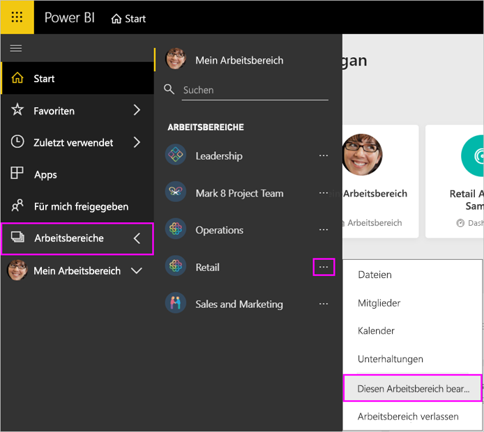
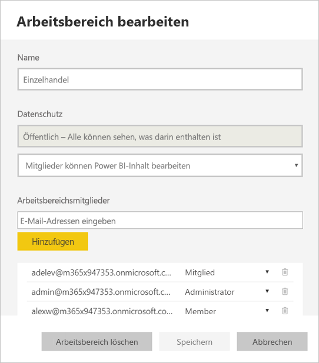
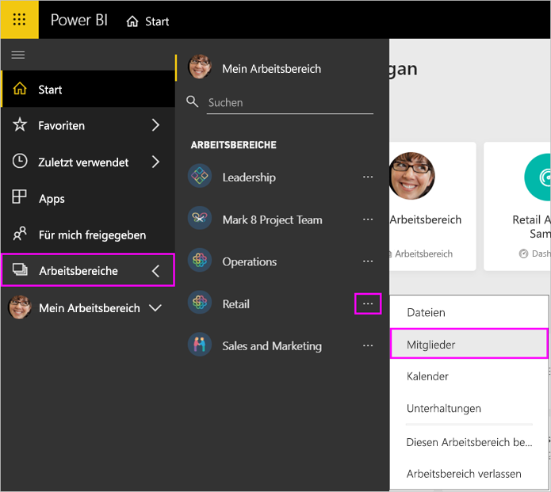
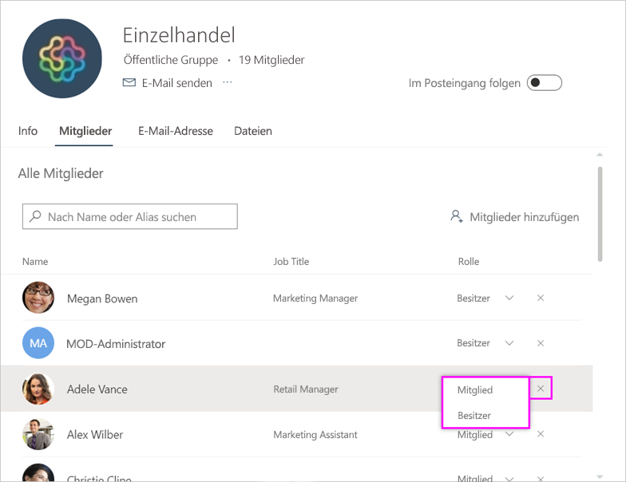
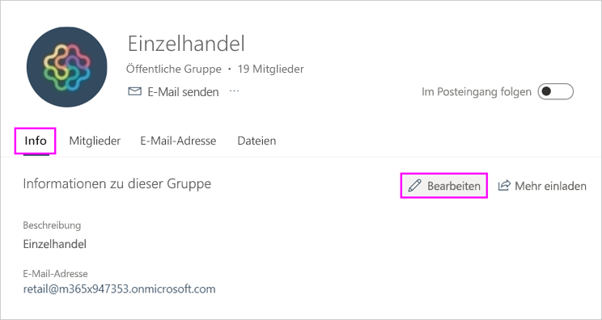
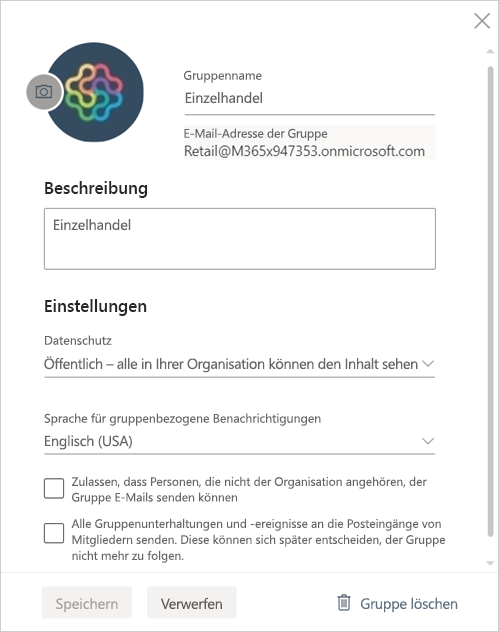

# Verwalten Ihres App-Arbeitsbereichs in Power BI und Office 365

Als Ersteller oder Administrator eines [App-Arbeitsbereichs in Power BI](service-create-distribute-apps.md) oder in Office 365 verwalten Sie einige Aspekte des Arbeitsbereichs in Power BI. Andere Aspekte werden in Office 365 verwaltet.

> [!NOTE]
> Die Vorschauversion der neuen Arbeitsbereiche ändert die Beziehung zwischen Power BI-Arbeitsbereichen und Office 365-Gruppen. Office 365-Gruppen werden nicht jedes Mal automatisch erstellt, wenn Sie einen dieser neuen Arbeitsbereiche erstellen. Erfahren Sie mehr über das [Erstellen der neuen Arbeitsbereiche](service-create-the-new-workspaces.md).

In **Power BI** können Sie die folgenden Aktionen ausführen:

* Hinzufügen oder Entfernen von App-Arbeitsbereichsmitgliedern, einschließlich Hinzufügen eines Administrators
* Bearbeiten des Namens des App-Arbeitsbereichs
* Löschen des App-Arbeitsbereichs

In **Office 365** können Sie die folgenden Aktionen ausführen:

* Hinzufügen oder Entfernen von Gruppenmitgliedern im Arbeitsbereich der App und Festlegen eines Mitglieds als Besitzer.
* Bearbeiten des Gruppennamens, des Images, der Beschreibung und anderer Einstellungen.
* Anzeigen der E-Mail-Adresse der Gruppe
* Löschen der Gruppe

Sie benötigen eine [Power BI Pro](service-features-license-type.md)-Lizenz, damit Sie Administrator oder Mitglied eines App-Arbeitsbereichs sein können. Ihre App-Benutzer benötigen ebenfalls eine Power BI Pro-Lizenz, es sei denn, der App-Arbeitsbereich befindet sich in einer Power BI Premium-Kapazität. Details finden Sie unter [Was ist Power BI Premium?](service-premium-what-is.md).

## Verwalten Ihres App-Arbeitsbereichs in Power BI

1. Wählen Sie im Power BI-Dienst den Pfeil neben **Arbeitsbereiche** aus, wählen Sie die Auslassungspunkte (...) neben dem Namen Ihres Arbeitsbereichs aus, und wählen Sie dann **Arbeitsbereich bearbeiten** aus.

   

   > [!NOTE]
   > Die Option **Diesen Arbeitsbereich bearbeiten** wird nur dann angezeigt, wenn Sie ein Administrator des App-Arbeitsbereichs sind.

1. Hier können Sie den Arbeitsbereich umbenennen, hinzufügen oder entfernen bzw. den Arbeitsbereich löschen.

   

1. Wählen Sie **Speichern** oder **Abbrechen**aus.

## Bearbeiten von Eigenschaften des Power BI-App-Arbeitsbereichs in Office 365

Sie können bestimmte Aspekte eines App-Arbeitsbereichs auch direkt in Outlook für Office 365 bearbeiten.

### Bearbeiten der Mitglieder der App-Arbeitsbereichsgruppe

1. Wählen Sie im Power BI-Dienst den Pfeil neben **Arbeitsbereiche** aus, wählen Sie die Auslassungspunkte (...) neben dem Namen Ihres Arbeitsbereichs aus, und wählen Sie dann **Mitglieder** aus.

   

   Daraufhin wird die Outlook für Office 365-Gruppenansicht Ihres App-Arbeitsbereichs geöffnet. Sie müssen sich möglicherweise mit Ihrem Geschäftskonto anmelden.

1. Wählen Sie die Rolle neben dem Namen eines Teamkollegen aus, um die Person als **Mitglied** oder **Besitzer** festzulegen. Wählen Sie das **X** aus, um die Person aus der Gruppe zu entfernen.

   

### Hinzufügen eines Bilds und Festlegen anderer Eigenschaften des Arbeitsbereichs

Wenn Sie Ihre App über den App-Arbeitsbereich verteilen, ist das Bild, das Sie hier hinzufügen, das Bild für Ihre App. Weitere Informationen finden Sie im Abschnitt [Hinzufügen eines Bilds zu Ihrem Office 365-App-Arbeitsbereich](service-create-workspaces.md#add-an-image-to-your-office-365-app-workspace-optional) im Artikel **Erstellen der neuen Arbeitsbereiche**.

1. Navigieren Sie in der Outlook für Office 365-Ansicht Ihres App-Arbeitsbereichs zur Registerkarte **Info**, und wählen Sie **Bearbeiten** aus.

    
1. Sie können den Namen, die Beschreibung und die Sprache für gruppenbezogene Benachrichtigungen bearbeiten. Sie können hier auch ein Bild hinzufügen und andere Eigenschaften festlegen.

   

1. Wählen Sie **Speichern** oder **Verwerfen**.

## Nächste Schritte

* [Veröffentlichen einer App in Power BI](service-create-distribute-apps.md)

* Weitere Fragen? [Wenden Sie sich an die Power BI-Community](http://community.powerbi.com/)
