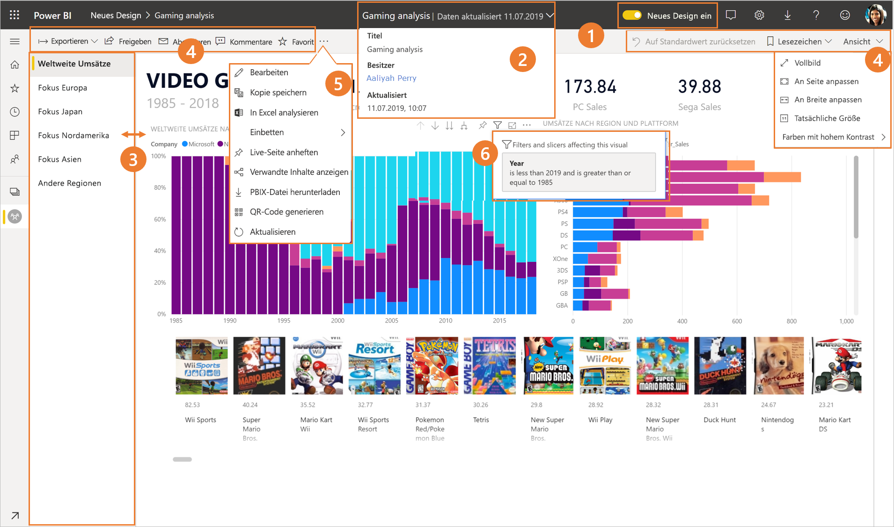
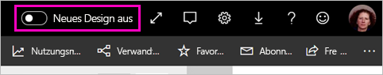
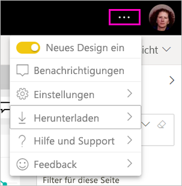
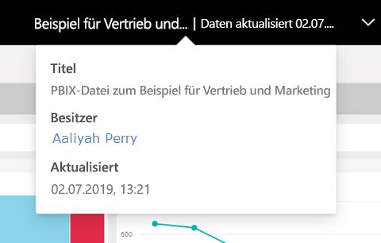
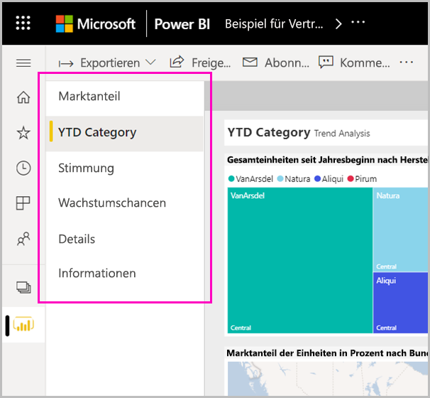
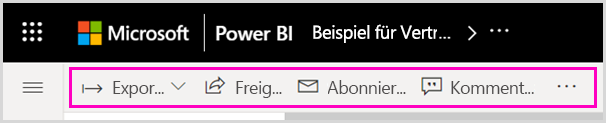
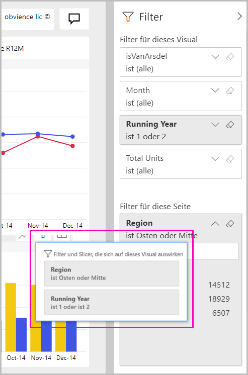

# Das neue Design des Power BI-Diensts

Der Power BI-Dienst (app.powerbi.com) verfügt über ein neues Design, das das Anzeigen und Interagieren mit Ihren Berichten vereinfacht. Das neue Design bietet eine moderne Oberfläche, die einfacher aufgebaut ist und auf dem vertrauten Aussehen anderer Microsoft-Produkte basiert. Innerhalb des gesamten Power BI-Diensts bilden nun Berichtsinhalte den wesentlichen Schwerpunkt. Dazu wurde zu einem helleren Farbdesign und aktualisierten Symbolen gewechselt. Hier sehen Sie eine Übersicht über die Änderungen beim neuen Design. Ausführlichere Informationen finden Sie in den nummerierten Abschnitten:

## Kurze Tour durch die Änderungen

Diese Animation zeigt die Änderungen im Erscheinungsbild von Berichten in Aktion.

## 1. Auswählen des neuen Designs

Jeder Benutzer des Power BI-Diensts kann das neue Design auswählen. Verschieben Sie einfach den Schalter von **Neues Design aus** zu **Neues Design ein**.

Wenn Sie das alte Design benötigen, können Sie die Option  einfach wieder in **aus** ändern. Wenn die Schaltfläche nicht angezeigt wird, klicken Sie auf das Dreipunktmenü in der oberen rechten Ecke.

## 2. Anzeigen von Berichtdetails 

Details wie das Datum der letzten Aktualisierung und Kontaktinformationen sind im oberen Banner schnell zu finden.  Öffnen Sie das Menü, um weitere Details zum Bericht anzuzeigen. Sie können sogar eine E-Mail an den Besitzer des Berichts senden.

## 3. Vertikale Seitenliste 
Seitennamen von Berichten befinden sich jetzt in einer Liste in einem vertikalen Bereich. Sie sind hervorgehoben, schwer zu übersehen und ähneln der Navigation in Word und PowerPoint. Sie können den restlichen Berichtsbereich vergrößern oder verkleinern, indem Sie die Größe des vertikalen Bereichs ändern.

## 4. Vereinfachte Aktionsleiste 

Die aktualisierte Aktionsleiste am oberen Rand links und in der Mitte enthält die wichtigsten Befehle für Berichtsnutzer. Das Exportieren, Abonnieren und Zusammenarbeiten mit anderen Benutzern ist nun einfacher, und Sie können mithilfe von Filtern und Lesezeichen tiefer in die Materie eintauchen.

## 5. Wo befinden sich die Berichtsbefehle?

Es wurde keine der Funktionen des alten Designs entfernt. Sie haben Zugriff auf die zusätzlichen Befehle wie „Bearbeiten“, „Kopie speichern“ usw., indem Sie die Auslassungspunkte (Menü „...“) in der Aktionsleiste erweitern. Außerdem können Sie über die Inhaltsliste auf die Nutzungsmetriken zugreifen.

### Wo befinden sich die Aktionen im Menü „Datei“?

Suchen Sie nach den Aktionen im Menü **Datei**? Die Aktionen, die sich bisher im Menü **Datei** befunden haben, sind jetzt ebenfalls im Menü mit den Auslassungspunkten (...) enthalten. 

## 6. Neue Filteroberfläche

Neueste Updates wie das Anzeigen angewendeter Filter und der neue Filterbereich stehen im neuen Design standardmäßig zur Verfügung. Selbst wenn die Berichts-Designer noch kein Upgrade auf die neue Filteroberfläche durchgeführt haben, wird Ihnen der neue Filterbereich angezeigt.

## Dashboardoberfläche im neuen Design 

Auch Dashboards verfügen wie Berichte und Apps über eine vereinfachte Aktionsleiste, um eine konsistente Darstellung zu gewährleisten, wobei die funktionalen Unterschiede gewahrt bleiben. Hier sehen Sie eine exemplarische Vorgehensweise für Aktionen in einem Dashboard.
 

## Keine Änderungen am Bearbeitungsmodus 

Die Erstellungsoberfläche ähnelt weiterhin der Oberfläche in Power BI Desktop. Die Änderungen durch das neue Design betreffen ausschließlich die Leseansicht.

## Nächste Schritte

[Power BI für Verbraucher](consumer/end-user-consumer.md)
