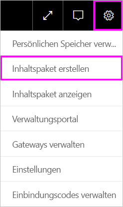
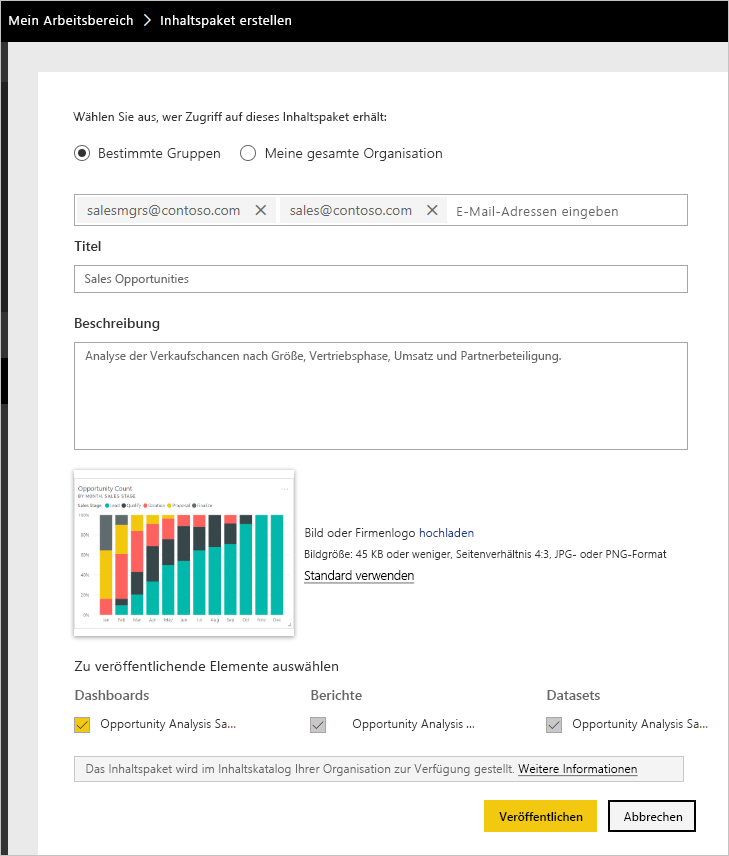
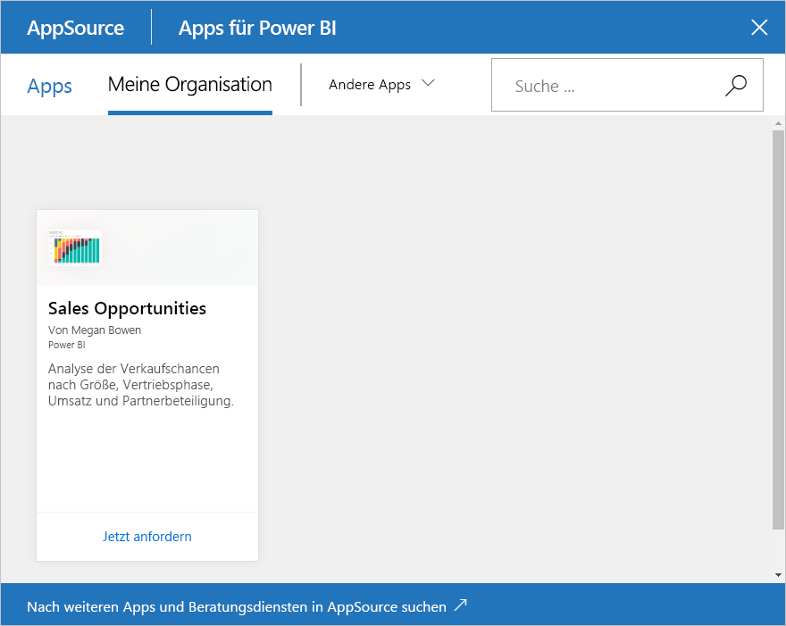

# Tutorial: Erstellen und Veröffentlichen eines organisationsbezogenen Power BI-Inhaltspakets

In diesem Tutorial erstellen Sie ein organisationsbezogenes Inhaltspaket, gewähren einer bestimmten Gruppe Zugriff darauf und veröffentlichen es in der Inhaltspaketbibliothek Ihrer Organisation in Power BI.

Das Erstellen von Inhaltspaketen unterscheidet sich vom Freigeben von Dashboards oder dem gemeinsamen Bearbeiten in einer Gruppe. Welche Option für Sie infrage kommt, erfahren Sie unter [Freigeben Ihrer Arbeit in Power BI](service-how-to-collaborate-distribute-dashboards-reports.md).

Zum Erstellen eines organisationsbezogenen Inhaltspakets benötigen Sie und Ihre Kollegen ein [Power BI Pro-Konto](https://powerbi.microsoft.com/pricing).

> [!NOTE]
> In den neuen Arbeitsbereichsumgebungen können Sie keine organisationsbezogenen Inhaltspakete erstellen oder installieren. Führen Sie jetzt ein Upgrade durch, und wandeln Sie Ihre Inhaltspakete in Apps um, falls Sie dies noch nicht getan haben. Erfahren Sie [mehr über die neuen Arbeitsbereiche](service-create-the-new-workspaces.md).

## Erstellen und Veröffentlichen eines Inhaltspakets

Nehmen Sie an, Sie wären der Release-Manager bei Contoso und bereiteten sich auf einen neue Produkteinführung vor.  Sie haben ein Dashboard mit Berichten erstellt, das Sie freigeben möchten, da andere Mitarbeiter, die ebenfalls an der Produkteinführung beteiligt sind, dieses möglicherweise nützlich finden. Jetzt möchten Sie das Dashboard und die Berichte packen und Ihren Kollegen zur Verfügung stellen.

Führen Sie hierzu die folgenden Schritte aus: Navigieren Sie im [Power BI-Dienst](https://powerbi.com) zu **Mein Arbeitsbereich**. Wechseln Sie anschließend zu **Daten abrufen** > **Beispiele** > **Analysebeispiel für Opportunity** > **Verbinden**, um eine eigene Kopie zu erhalten.

1. Klicken Sie im Navigationsbereich auf **Arbeitsbereiche** > **Mein Arbeitsbereich**.

1. Klicken Sie oben im Navigationsbereich auf das Zahnradsymbol . > **Inhaltspaket erstellen**.

   

1. Geben Sie im Fenster **Inhaltspaket erstellen** die folgenden Informationen ein.  

   Beachten Sie, dass die Inhaltspaketbibliothek Ihrer Organisation möglicherweise nach kurzer Zeit bereits zahlreiche Elemente enthält. Die Bibliothek könnte Hunderte von Inhaltspaketen umfassen, die für die Organisation oder für Gruppen veröffentlicht wurden. Wählen Sie einen aussagekräftigen Namen für das Inhaltspaket, fügen Sie eine passende Beschreibung hinzu, und wählen Sie die richtige Zielgruppe aus.  Verwenden Sie Wörter, über die das Inhaltspaket mithilfe der Suchfunktion einfach gefunden werden kann. Dies erleichtert die zukünftige Suche.

      

    1. Wählen Sie **Bestimmte Gruppen** aus.

    1. Geben Sie die vollständigen E-Mail-Adressen für Einzelpersonen, [Office 365-Gruppen](https://support.office.com/article/Create-a-group-in-Office-365-7124dc4c-1de9-40d4-b096-e8add19209e9), Verteilergruppen oder Sicherheitsgruppen ein. Beispiel: salesmgrs@contoso.com; sales@contoso.com.

        Verwenden Sie in diesem Tutorial die E-Mail-Adresse Ihrer Gruppe.

    1. Nennen Sie das Inhaltspaket *Verkaufschancen*.

        > [!TIP]
        > Es kann von Vorteil sein, den Namen des Dashboards in den Namen des Inhaltspakets einzubeziehen. Dies erleichtert es Ihren Kollegen, das Dashboard zu finden, wenn sie eine Verbindung mit Ihrem Inhaltspaket herstellen.

    1. Empfohlen: Fügen Sie eine Beschreibung hinzu. So können Kollegen das benötigte Inhaltspaket leichter finden. Fügen Sie neben der Beschreibung auch noch Schlagwörter hinzu, mit denen Ihre Kollegen nach diesem Inhaltspaket suchen können. Geben Sie auch Ihre Kontaktdaten ein, falls Ihre Kollegen eine Frage haben oder Hilfe brauchen.

    1. Laden Sie ein Bild oder ein Logo hoch, damit Gruppenmitglieder das Inhaltspaket leichter finden können.

        Bilder lassen sich schneller finden als Text. Auf dem Screenshot sehen Sie eine Kachel mit einem Säulendiagramm und der Überschrift **Opportunity Count** (Anzahl der Verkaufschancen).

    1. Wählen Sie das Dashboard **Analysebeispiel für Verkaufschancen** aus, um es dem Inhaltspaket hinzuzufügen.

        Power BI fügt den zugehörigen Bericht und das Dataset automatisch hinzu. Sie können ggf. weitere hinzufügen.

       > [!NOTE]
       > In Power BI werden nur die Dashboards, Berichte, Datasets und Arbeitsmappen aufgeführt, die Sie bearbeiten können. Daher werden von der App keine für Sie freigegebenen Elemente angezeigt.

   1. Wenn Sie über Excel-Arbeitsmappen verfügen, werden diese unter **Berichte** mit einem Excel-Symbol angezeigt. Sie können diese ebenfalls dem Inhaltspaket hinzufügen.

      

      > [!NOTE]
      > Wenn Mitglieder der Gruppe die Excel-Arbeitsmappe nicht anzeigen können, müssen Sie möglicherweise [die Arbeitsmappe in OneDrive for Business für sie freigeben](https://support.office.com/article/Share-documents-or-folders-in-Office-365-1fe37332-0f9a-4719-970e-d2578da4941c).

1. Wählen Sie **Veröffentlichen** , um das Inhaltspaket zur organisatorischen Inhaltspaketbibliothek der Gruppe hinzuzufügen.  

   Wenn das Veröffentlichen erfolgreich war, wird Ihnen eine Erfolgsmeldung angezeigt.

1. Wenn Mitglieder Ihrer Gruppe zu **Daten abrufen** > **Organisationsinhaltspakete** wechseln, wird diesen Ihr Inhaltspaket angezeigt.

   

   > [!TIP]
   > Die im Browser angezeigte URL ist eine eindeutige Adresse für dieses Inhaltspaket.  Möchten Sie Ihre Kollegen über dieses neue Inhaltspaket informieren?  Fügen Sie die URL in eine E-Mail ein.

1. Wenn die Mitglieder Ihrer Gruppe auf **Verbinden** klicken, können sie sich [Ihr Inhaltspaket anzeigen lassen und damit arbeiten](service-organizational-content-pack-copy-refresh-access.md).

## Nächste Schritte

* [Einführung in organisationsbezogene Inhaltspakete in Power BI](service-organizational-content-pack-introduction.md)

* [Verwalten, Aktualisieren und Löschen von organisationsbezogenen Inhaltspaketen](service-organizational-content-pack-manage-update-delete.md)

* [Veröffentlichen einer App in Power BI](service-create-distribute-apps.md)

* [Was ist OneDrive for Business?](https://support.office.com/article/What-is-OneDrive-for-Business-187f90af-056f-47c0-9656-cc0ddca7fdc2)

* Weitere Fragen? [Wenden Sie sich an die Power BI-Community](https://community.powerbi.com/)
