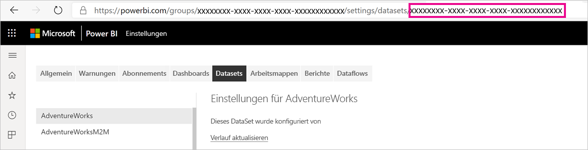
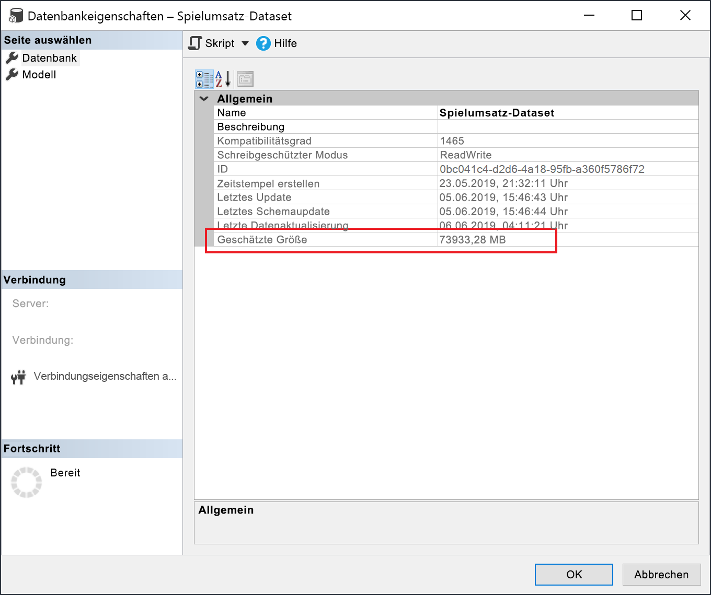

# <a name="large-models-in-power-bi-premium-preview"></a>Große Modelle in Power BI Premium (Vorschauversion)

Power BI-Datasets können Daten für eine optimierte Abfrageleistung in einem stark komprimierten, In-Memory-Cache speichern. Dies ermöglicht eine schnelle Benutzerinteraktivität über große Datasets hinweg. Mit dem Feature für große Modelle können Datasets in Power BI Premium mehr als 10 GB groß werden. Die Größe des Datasets wird stattdessen durch die Power BI Premium-Kapazitätsgröße beschränkt. Dies ähnelt in Bezug auf die Größenbeschränkungen von Modellen der Funktionsweise von Azure Analysis Services. Weitere Informationen zu Kapazitätsgrößen in Power BI Premium finden Sie unter „Kapazitätsknoten“. Sie können große Modelle für alle Premium P- und eingebettete A-SKUs einrichten. Sie funktionieren jedoch nur mit den [neuen Arbeitsbereichen](service-create-the-new-workspaces.md).

Große Modelle haben keinen Einfluss auf die PBIX-Uploadgröße. Diese ist weiterhin auf 10 GB beschränkt. Stattdessen werden Datasets bei der Aktualisierung im Dienst über 10 GB hinaus vergrößert. Mit der inkrementellen Aktualisierung können Sie ein Dataset so konfigurieren, dass es größer als 10 GB wird.

## <a name="enable-large-models"></a>Aktivieren von großen Modellen

Führen Sie die folgenden Schritte aus, um ein Dataset zu erstellen, das größer als 10 GB wird:

1. Erstellen Sie ein Dataset in Power BI Desktop, und konfigurieren Sie eine [inkrementelle Aktualisierung](service-premium-incremental-refresh.md).

1. Veröffentlichen Sie das Dataset im Power BI Premium-Dienst.

1. Aktivieren Sie das Dataset für große Modelle, indem Sie die unten aufgeführten PowerShell-Cmdlets ausführen. Durch diese Cmdlets speichert Power BI das Dataset in Azure Files Premium und erzwingt nicht die 10 GB-Grenze.

1. Starten Sie eine Aktualisierung, um historische Daten basierend auf der Richtlinie für die inkrementelle Aktualisierung zu laden. Bei der ersten Aktualisierung kann das Laden der historischen Daten einige Zeit in Anspruch nehmen. Nachfolgende Aktualisierungen sollten dann schneller gehen, da Sie inkrementell ausgeführt werden.

### <a name="powershell-cmdlets"></a>PowerShell-Cmdlets

Aktivieren Sie in der aktuellen Version der großen Modelle über PowerShell-Cmdlets, dass das Dataset in Files Premium gespeichert wird. Zum Ausführen der PowerShell-Cmdlets benötigen Sie Berechtigungen als Kapazitäts- und Arbeitsbereichadministrator.

1. Suchen Sie die Dataset-ID (GUID). Die ID finden Sie auf der Registerkarte **Datasets** des Arbeitsbereichs unter den Dataseteinstellungen in der URL.

    

1. Installieren Sie in der Eingabeaufforderung für den PowerShell-Administrator das Modul [MicrosoftPowerBIMgmt](/powershell/module/microsoftpowerbimgmt.data/).

    ```powershell
    Install-Module -Name MicrosoftPowerBIMgmt
    ```

1. Führen Sie die folgenden Cmdlets aus, um sich anzumelden und den Speichermodus des Datasets zu überprüfen.

    ```powershell
    Login-PowerBIServiceAccount

    (Get-PowerBIDataset -Scope Organization -Id <Dataset ID> -Include actualStorage).ActualStorage
    ```

    Es sollte die folgende Antwort ausgegeben werden. Als Speichermodus ist „ABF“ (Analysis Services-Sicherungsdatei) ausgewählt. Das ist die Standardeinstellung.

    ```
    Id                   StorageMode

    --                   -----------

    <Dataset ID>         Abf
    ```

1. Führen Sie die folgenden Cmdlets aus, um den Speichermodus auf Files Premium festzulegen, und überprüfen Sie es. Die Konvertierung in Files Premium kann einige Sekunden in Anspruch nehmen.

    ```powershell
    Set-PowerBIDataset -Id <Dataset ID> -TargetStorageMode PremiumFiles

    (Get-PowerBIDataset -Scope Organization -Id <Dataset ID> -Include actualStorage).ActualStorage
    ```

    Es sollte die folgende Antwort ausgegeben werden. Der Speichermodus ist jetzt auf Files Premium festgelegt.

    ```
    Id                   StorageMode
    
    --                   -----------
    
    <Dataset ID>         PremiumFiles
    ```

Sie können den Status der Dataset-Konvertierungen in und aus Files Premium mithilfe des [Get-PowerBIWorkspaceMigrationStatus](/powershell/module/microsoftpowerbimgmt.workspaces/get-powerbiworkspacemigrationstatus)-Cmdlets überprüfen.

## <a name="dataset-eviction"></a>Entfernen von Datasets

Power BI verwendet die dynamische Speicherverwaltung, um inaktive Datasets aus dem Arbeitsspeicher zu entfernen. Power BI entfernt Datasets, sodass zur Bearbeitung von Benutzeranfragen andere Datasets geladen werden können. Durch die dynamische Speicherverwaltung ist es möglich, dass die Summe der Datasetgrößen erheblich größer als der für die Kapazität verfügbare Arbeitsspeicher sein kann, ein einzelnes Dataset muss jedoch in den Arbeitsspeicher passen. Weitere Informationen zur dynamischen Speicherverwaltung finden Sie unter [Funktionsweise von Kapazitäten](service-premium-what-is.md#how-capacities-function).

Sie sollten berücksichtigen, welche Auswirkung die Entfernung auf große Modelle hat. Obwohl das Dataset relativ schnell geladen wird, kann es für die Benutzer zu einer spürbaren Verzögerung kommen, wenn sie darauf warten müssen, dass große entfernte Datasets neu geladen werden. Aus diesem Grund ist das Feature für große Modelle in seiner jetzigen Form in erster Linie für Kapazitäten vorgesehen, die für Enterprise BI-Anforderungen dediziert sind, und nicht für solche, die mit Self-Service-BI-Anforderungen kombiniert sind. Bei Kapazitäten, die für Enterprise BI-Anforderungen dediziert sind, kommt es wesentlich seltener vor, dass Datasets entfernt werden und neu geladen werden müssen. Kapazitäten für Self-Service-BI können andererseits viele kleine Datasets enthalten, die häufiger in den oder aus dem Arbeitsspeicher geladen werden.

## <a name="checking-dataset-size"></a>Überprüfen der Datasetgröße

Nach dem Laden historischer Daten können Sie [SSMS](https://docs.microsoft.com/sql/ssms/download-sql-server-management-studio-ssms) über den [XMLA-Endpunkt](service-premium-connect-tools.md) verwenden, um die geschätzte Datasetgröße im Fenster „Modelleigenschaften“ zu überprüfen.



Sie können die Größe des Datasets ebenfalls überprüfen, indem Sie die folgenden DMV-Abfragen aus SSMS ausführen. Wenn Sie die Spalten DICTIONARY\_SIZE und USED\_SIZE aus der Ausgabe addieren, erhalten Sie die Datasetgröße in Bytes.

```sql
SELECT * FROM SYSTEMRESTRICTSCHEMA
($System.DISCOVER_STORAGE_TABLE_COLUMNS,
 [DATABASE_NAME] = '<Dataset Name>') //Sum DICTIONARY_SIZE (bytes)

SELECT * FROM SYSTEMRESTRICTSCHEMA
($System.DISCOVER_STORAGE_TABLE_COLUMN_SEGMENTS,
 [DATABASE_NAME] = '<Dataset Name>') //Sum USED_SIZE (bytes)
```

## <a name="current-feature-restrictions"></a>Aktuelle Featureinschränkungen

Berücksichtigen Sie bei der Verwendung großer Modelle die folgenden Einschränkungen:

- **Verwenden der eigenen Verschlüsselungsschlüssel – BYOK-Verschlüsselung**: Für Files Premium aktivierte Datasets werden nicht durch [BYOK](service-encryption-byok.md) verschlüsselt.
- **Multi-Geo-Unterstützung**: Für Files Premium aktivierte Datasets schlagen bei Kapazitäten fehl, bei denen [Multi-Geo](service-admin-premium-multi-geo.md) ebenfalls aktiviert ist.

- **Herunterladen zu Power BI Desktop**: Wenn ein Dataset in Files Premium gespeichert wird, tritt beim Herunterladen als [PBIX](service-export-to-pbix.md)-Datei ein Fehler auf.
- **Unterstützte Regionen**: Große Modelle werden von den folgenden Regionen unterstützt:
  - Australien, Osten
  - Australien, Südosten
  - USA, Mitte
  - Asien, Osten
  - USA, Osten
  - USA, Osten 2
  - Japan, Osten
  - Japan, Westen
  - Südkorea, Mitte
  - Südkorea, Süden
  - USA, Norden-Mitte
  - Europa, Norden
  - USA, Süden-Mitte
  - Asien, Südosten
  - Vereinigtes Königreich, Süden
  - Vereinigtes Königreich, Westen
  - Europa, Westen
  - USA, Westen
  - USA, Westen 2