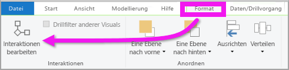
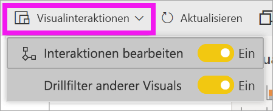
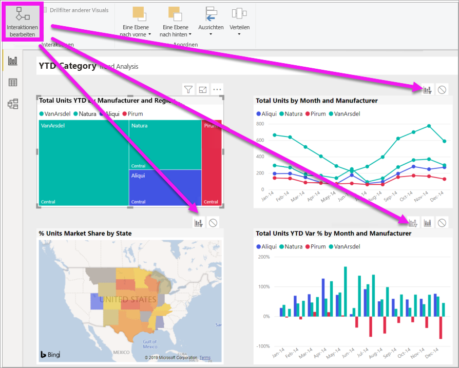
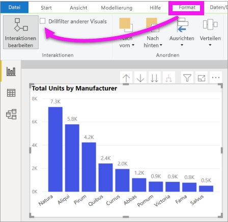

# Ändern der Interaktion von Visualisierungen in einem Power BI-Bericht
Wenn Sie über die Berechtigungen zum Bearbeiten eines Berichts verfügen, können Sie **visuelle Interaktionen** verwenden, um zu ändern, wie sich Visualisierungen auf einer Berichtsseite aufeinander auswirken. 

## Einführung in Visualinteraktionen
Standardmäßig können Visualisierungen auf einer Berichtsseite für die Kreuzfilterung und -hervorhebung der anderen Visualisierungen auf der Seite verwendet werden.
Beim Auswählen eines Status in einer Kartenvisualisierung wird beispielsweise das Säulendiagramm hervorgehoben und das Liniendiagramm gefiltert, um nur Daten anzuzeigen, die für diesen einen Status gelten.
Siehe [Informationen zum Filtern und Hervorheben](power-bi-reports-filters-and-highlighting.md). Wenn Sie über eine Visualisierung verfügen, die [Drilling](consumer/end-user-drill.md) unterstützt, hat das Drilling einer Visualisierung standardmäßig keinen Einfluss auf andere Visualisierungen auf der Berichtsseite. Diese beiden Standardverhaltensweisen können jedoch überschrieben werden, und Interaktionen können jeweils auf Basis einer Visualisierung festgelegt werden.

In diesem Artikel erhalten Sie Informationen zum Verwenden von **Visualinteraktionen** in Power BI Desktop. Der Prozess ist in der [Bearbeitungsansicht](service-interact-with-a-report-in-editing-view.md) des Power BI-Diensts identisch. Wenn Sie nur Lesezugriff haben oder der Bericht für Sie freigegeben wurde, können Sie die Einstellungen für Visualinteraktionen nicht ändern.

Die Begriffe *Kreuzfilterung* und *Kreuzhervorhebung* werden verwendet, um das hier beschriebene Verhalten davon zu unterscheiden, was geschieht, wenn Sie den Bereich **Filter** zum *Filtern* und *Hervorheben* von Visualisierungen verwenden.  

> [!NOTE]
> In diesem Video werden ältere Versionen von Power BI Desktop und des Power BI-Diensts verwendet. 
>
>

<iframe width="560" height="315" src="https://www.youtube.com/embed/N_xYsCbyHPw?list=PL1N57mwBHtN0JFoKSR0n-tBkUJHeMP2cP" frameborder="0" allowfullscreen></iframe>

## Aktivieren der Steuerelemente für Visualinteraktionen
Wenn Sie über Bearbeitungsberechtigungen für einen Bericht verfügen, können Sie die Steuerelemente für Visualinteraktionen aktivieren und dann anpassen, wie die Visualisierungen sich gegenseitig auf Ihrer Berichtsseite filtern und hervorheben. 

1. Wählen Sie eine Visualisierung aus, um sie zu aktivieren.  
2. Zeigen Sie die Optionen **Visuelle Interaktionen** an.
    

    - Klicken Sie unter Desktop auf **Format > Interaktionen**.

        

    - Öffnen Sie den Bericht im Power BI-Dienst in der Bearbeitungsansicht, und klicken Sie in der Menüleiste des Berichts auf die Dropdownliste.

        

3. Klicken Sie auf **Interaktionen bearbeiten**, um die Steuerelemente für Interaktionen von Visualisierungen anzuzeigen. Power BI fügt Symbole für die Filterung und Hervorhebung zu allen anderen Visualisierungen auf der Berichtsseite hinzu. Wie Sie sehen, führt die Strukturkarte eine Kreuzfilterung des Liniendiagramms und der Karte sowie eine Kreuzhervorhebung des Säulendiagramms durch. Sie können nun ändern, wie die ausgewählte Visualisierung mit den anderen Visualisierungen auf der Berichtsseite interagiert.
   
    

## Ändern des Interaktionsverhaltens
Machen Sie sich mit den Interaktionen Ihrer Visualisierungen vertraut, indem Sie jede Visualisierung auf Ihrer Berichtsseite einzeln auswählen.  Wählen Sie einen Datenpunkt, einen Balken oder eine Form aus, und beobachten Sie die Auswirkungen auf die anderen Visualisierungen. Wenn das gezeigte Verhalten nicht dem gewünschten Verhalten entspricht, können Sie die Interaktionen ändern. Diese Änderungen werden mit dem Bericht gespeichert, sodass Ihnen und den Benutzern Ihres Berichts dieselben Visualinteraktionen angezeigt werden.

Wählen Sie zunächst eine Visualisierung aus, um sie zu aktivieren.  Beachten Sie, dass alle anderen Visualisierungen auf der Seite nun Interaktionssymbole anzeigen. Das fettgedruckte Symbol ist das angewendete. Bestimmen Sie als Nächstes, welche Auswirkung die **ausgewählte Visualisierung** auf die anderen haben soll.  Optional können Sie diesen Schritt für alle anderen Visualisierungen auf der Berichtsseite wiederholen.

Wenn die ausgewählte Visualisierung
   
   * eine Kreuzfilterung für eine der anderen Visualisierungen auf der Seite durchführen soll, wählen Sie das **Filtersymbol** in der rechten oberen Ecke dieser Visualisierung aus .
   * eine Kreuzhervorhebung für eine der anderen Visualisierungen auf der Seite durchführen soll, wählen Sie das **Hervorhebungssymbol** aus .
   * keine Auswirkungen auf andere Visualisierungen auf der Seite haben soll, wählen Sie das Symbol **Keine Auswirkung** aus .

## Ändern der Interaktionen von Visualisierungen, für die ein Drillvorgang ausgeführt werden kann
[Für bestimmte Power BI-Visualisierungen kann ein Drillvorgang ausgeführt werden](consumer/end-user-drill.md). Wenn Sie einen Drillvorgang für eine Visualisierung ausführen, wirkt sich dies standardmäßig nicht auf die anderen Visualisierungen auf der Berichtsseite aus. Dieses Verhalten kann jedoch geändert werden. 

> [!TIP]
> Probieren Sie es mit der [Beispiel-PBIX-Datei zu Human Resources](https://download.microsoft.com/download/6/9/5/69503155-05A5-483E-829A-F7B5F3DD5D27/Human%20Resources%20Sample%20PBIX.pbix) selbst aus. Diese enthält ein Säulendiagramm mit Drilldown auf der Registerkarte **New hires** (Neueinstellungen).
>

1. Wählen Sie das Visual aus, für das Sie einen Drillvorgang ausführen möchten, um es zu aktivieren. 

2. Aktivieren Sie den Drilldown, indem Sie das Drilldownsymbol auswählen.

    

2. Wählen Sie in der Menüleiste **Format** > **Drillfilter anderer Visuals** aus.  Wenn Sie nun einen Drilldown (oder Drillup) in einer Visualisierung ausführen, ändern sich die anderen Visualisierungen auf der Berichtsseite und zeigen die aktuelle Auswahl für das Drilling an. 

    

3. Wenn das gezeigte Verhalten nicht dem gewünschten Verhalten entspricht, können Sie die Interaktionen [wie oben beschrieben](#change-the-interaction-behavior) ändern.
    
## Nächste Schritte
[Filter und Hervorhebungen in Power BI-Berichten](power-bi-reports-filters-and-highlighting.md)