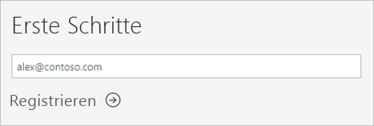

# Registrieren für Power BI als Einzelperson

Power BI kann Ihr persönliches Tool für Datenanalyse und Visualisierungen sein und darüber hinaus als Engine für Analyse und Entscheidungsfindung für Gruppenprojekte, Abteilungen oder gesamte Unternehmen dienen. In diesem Artikel wird erläutert, wie Sie sich als Einzelperson für Power BI registrieren. Wenn Sie ein Power BI-Administrator sind, finden Sie unter [Power BI-Lizenzierung in Ihrem Unternehmen](service-admin-licensing-organization.md) weitere Informationen.

## Unterstützte E-Mail-Adressen

Bevor Sie mit dem Registrierungsprozess beginnen, ist es wichtig, dass Sie erfahren, welche E-Mail-Adressen Sie in Power BI für die Registrierung verwenden können:

* Bei der Registrierung für Power BI können nur E-Mail-Adressen von Geschäfts-, Schul- oder Unikonten verwendet werden. Sie können sich nicht mit E-Mail-Adressen anmelden, die von E-Mail-Diensten für Endkunden oder von Telekommunikationsanbietern zur Verfügung gestellt werden. Dazu gehören auch outlook.com, hotmail.com, gmail.com und andere.

* Nachdem Sie sich registriert haben, [können Sie Gastbenutzer einladen](https://docs.microsoft.com/azure/active-directory/active-directory-b2b-what-is-azure-ad-b2b), um Ihren Power BI-Inhalt für diese freizugeben. Dies geht mit jeder E-Mail-Adresse, auch mit einer privaten.

* Sie können sich bei Power BI mit den Adressendungen „.gov“ oder „.mil“ anmelden, dafür ist jedoch ein anderes Verfahren notwendig. Weitere Informationen finden Sie im Artikel [Registrieren einer US-Behörde für den Power BI-Dienst](service-govus-signup.md).

## Registrierung für ein Power BI-Konto

Gehen Sie wie folgt vor, um sich für ein Power BI-Konto zu registrieren. Sobald Sie diesen Prozess abgeschlossen haben, verfügen Sie über eine Power BI Free-Lizenz (kostenlos), mit der Sie Power BI selbstständig über „Mein Arbeitsbereich“ testen, Inhalte aus einem Power BI-Arbeitsbereich, der einer Power BI Premium-Kapazität zugeordnet ist, nutzen oder eine individuelle Power BI Pro-Testversion initiieren können. Weitere Informationen finden Sie unter [Power BI features by license type (Power BI-Features nach Lizenztyp)](service-features-license-type.md). 

1. Navigieren Sie zur [Registrierungsseite](https://signup.microsoft.com/signup?sku=a403ebcc-fae0-4ca2-8c8c-7a907fd6c235).

1. Geben Sie Ihre E-Mail-Adresse ein, und klicken Sie auf **Registrieren**.

    

1. Wenn Sie eine Meldung wie diese erhalten, wählen Sie eine Option aus, um einen Prüfcode zu empfangen. Fahren Sie anschließend mit dem nächsten Schritt fort.

    

    Wenn Sie eine Nachricht wie diese erhalten, schließen Sie die Schritte zur Anmeldung und Verwendung von Power BI ab.

    

1. Geben Sie den Code ein, den Sie erhalten haben, und klicken Sie auf **Registrieren**.

    

1. Überprüfen Sie, ob Sie eine Nachricht wie diese per E-Mail erhalten haben.

    

1. Geben Sie auf dem nächsten Bildschirm Ihre Informationen sowie den Prüfcode aus der E-Mail ein. Wählen Sie eine Region aus, lesen Sie die Richtlinien durch, die Sie über einen Link aufrufen können, und klicken Sie anschließend auf **Starten**.

    

1. Sie gelangen anschließend zur [Anmeldeseite von Power BI](https://powerbi.microsoft.com/landing/signin/) und können von da an Power BI verwenden.

    

## Ablauf der Testversion

Nachdem Sie den Anmeldeprozess abgeschlossen haben, können Sie sich für eine Power BI Pro-Testversion im Power BI-Dienst anmelden. Wenn diese Testversion abläuft, ändert sich Ihre Lizenz wieder in eine Power BI Free-Lizenz (kostenlos). Danach haben Sie keinen Zugriff mehr auf Features, die eine Power BI Pro-Lizenz erfordern. Weitere Informationen finden Sie unter [Funktionen nach Lizenztyp](service-features-license-type.md).

Wenn Ihnen eine Power BI Free-Lizenz (kostenlos) ausreicht, müssen Sie nichts anderes tun. Wenn Sie die Vorteile von Power BI Pro-Features nutzen möchten, wenden Sie sich an Ihren IT-Administrator, um eine Power BI Pro-Lizenz zu erwerben.

## Behandeln von Problemen beim Registrieren

In den meisten Fällen können Sie sich bei Power BI registrieren, indem Sie den beschriebenen Prozess durchlaufen. Einige der Probleme, die Sie an der Anmeldung hindern können, sind in der folgenden Tabelle mit möglichen Abhilfemaßnahmen beschrieben.

| Symptom/Fehlermeldung | Mögliche Ursache und Lösung |
| ----------------------- | -------------------- |
| <strong>Persönliche E-Mail-Adressen (zum Beispiel nancy@gmail.com)</strong> Sie erhalten während der Registrierung eine ähnliche Meldung wie diese:    *Sie haben eine private E-Mail-Adresse eingegeben: Geben Sie Ihre geschäftliche E-Mail-Adresse ein, damit wir die Daten Ihres Unternehmens sicher speichern können.*    oder    *Bei der E-Mail-Adresse handelt es sich anscheinend um eine persönliche Adresse. Geben Sie Ihre geschäftliche Adresse ein, damit wir Sie mit anderen Personen in Ihrem Unternehmen verbinden können. Und keine Sorge: Wir geben die Adresse an niemanden weiter.* | Power BI unterstützt keine E-Mail-Adressen, die von E-Mail-Diensten für Endkunden oder von Telekommunikationsanbietern zur Verfügung gestellt werden.    Damit Sie die Registrierung abschließen können, versuchen Sie es noch einmal, und geben Sie eine E-Mail-Adresse Ihrer Organisation oder Bildungseinrichtung an.    Wenn Sie sich noch immer nicht registrieren können und zu einem erweiterten Setup bereit sind, können Sie sich [mit dieser E-Mail-Adresse für ein neues Office 365-Testabonnement registrieren](service-admin-signing-up-for-power-bi-with-a-new-office-365-trial.md).    Es ist ebenso möglich, dass ein vorhandener Benutzer [Sie als Gast einlädt](service-admin-azure-ad-b2b.md). |
| **Die Self-Service-Registrierung wurde deaktiviert:** Während der Registrierung erhalten Sie eine Meldung wie diese:    *Ihre Registrierung konnte nicht beendet werden. Ihre IT-Abteilung hat die Registrierung für Microsoft Power BI deaktiviert. Bitte wenden Sie sich an Ihre IT-Abteilung, um den Anmeldeprozess abzuschließen.*    oder    *Bei der E-Mail-Adresse handelt es sich anscheinend um eine persönliche Adresse. Geben Sie Ihre geschäftliche Adresse ein, damit wir Sie mit anderen Personen in Ihrem Unternehmen verbinden können. Und keine Sorge: Wir geben die Adresse an niemanden weiter.* | Der IT-Administrator Ihrer Organisation hat die Self-Service-Registrierung für Power BI deaktiviert.    Wenden Sie sich an Ihren IT-Administrator, und bitten Sie diesen, [die Anweisungen zu befolgen, um die Registrierung zu aktivieren](service-admin-licensing-organization.md#enable-or-disable-individual-user-sign-up-in-azure-active-directory). So können Sie den Registrierungsprozess abschließen.    Dieses Problem kann auch auftreten, wenn Sie sich [über einen Partner für Office 365 registriert haben](service-admin-syndication-partner.md). |
| **Die E-Mail-Adresse ist keine Office 365-ID**. Während der Registrierung erhalten Sie eine Meldung wie diese:    *Wir können Sie auf „contoso.com“ nicht finden.  Verwenden Sie auf der Arbeit oder in der Schule eine andere ID?    Versuchen Sie, sich damit anzumelden. Wenn es nicht funktioniert, wenden Sie sich an Ihre IT-Abteilung.* | Ihre Organisation verwendet für die Anmeldung bei Office 365 und anderen Microsoft-Diensten andere IDs als Ihre E-Mail-Adresse.  Ihre E-Mail-Adresse ist z. B., Nancy.Smith@contoso.com aber Ihre ID ist nancys@contoso.com.    Verwenden Sie die ID, die Ihre Organisation Ihnen für die Anmeldung bei Office 365 oder anderen Microsoft-Diensten zugewiesen hat, um die Registrierung abzuschließen.  Wenn Sie diese nicht kennen, wenden Sie sich an Ihren IT-Administrator.    Wenn Sie sich noch immer nicht registrieren können und zu einem erweiterten Setup bereit sind, können Sie sich [mit dieser E-Mail-Adresse für ein neues Office 365-Testabonnement registrieren](service-admin-signing-up-for-power-bi-with-a-new-office-365-trial.md). |

## Nächste Schritte

[Erwerb von Power BI Pro](service-admin-purchasing-power-bi-pro.md)  
[Power BI-Servicevertrag für Einzelbenutzer](https://powerbi.microsoft.com/terms-of-service/)  

Weitere Fragen? [Stellen Sie Ihre Frage in der Power BI-Community.](https://community.powerbi.com/)
