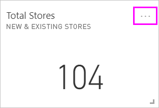
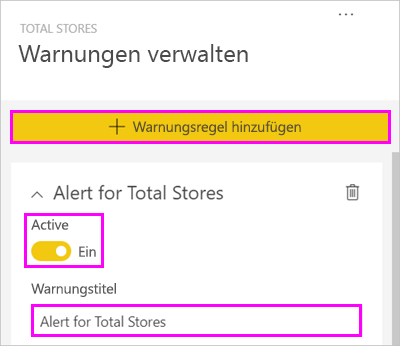
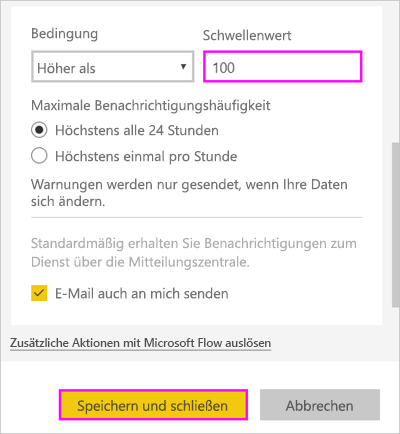
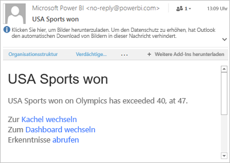
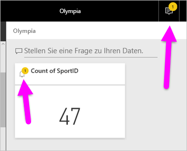
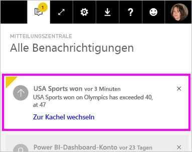
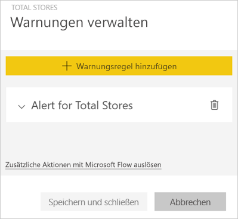
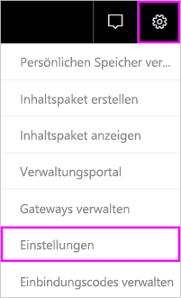
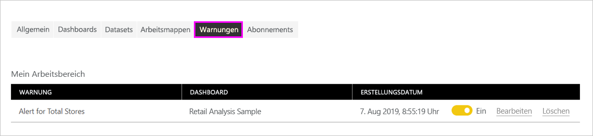

# Datenwarnungen im Power BI-Dienst

Legen Sie Warnungen fest, um Benachrichtigungen zu erhalten, wenn die Daten in den Dashboards die von Ihnen festgelegten Grenzen überschreiten.

Sie können Warnungen für Kacheln festlegen, wenn Sie über eine Power BI Pro-Lizenz verfügen. Sie können auch Warnungen festlegen, wenn jemand ein Dashboard in einer [Premium-Kapazität](service-premium-what-is.md) freigibt. Warnungen können nur für Kacheln, die über Berichtsvisuals angeheftet wurden, und nur für Messgeräte, KPIs und Karten festgelegt werden. Warnungen können für Visuals festgelegt werden, die aus Streamingdatasets erstellt wurden, die Sie aus einem Bericht an ein Dashboard anheften. Warnungen können nicht für Streamingkacheln festgelegt werden, die direkt auf dem Dashboard über **Kachel hinzufügen** > **Benutzerdefinierte Streamingdaten** erstellt wurden.

Die Warnungen werden nur Ihnen angezeigt, auch wenn Sie das Dashboard freigeben. Nicht einmal der Besitzer des Dashboards kann Warnungen anzeigen, die Sie in ihrer Ansicht Ihres Dashboards festgelegt haben. Datenwarnungen werden mit allen Plattformen synchronisiert. Sie können Datenwarnungen daher [in den mobilen Power BI-Apps](consumer/mobile/mobile-set-data-alerts-in-the-mobile-apps.md) und im Power BI-Dienst festlegen und anzeigen. Für Power BI Desktop sind sie nicht verfügbar. Sie können Warnungen sogar mit Power Automate automatisieren und integrieren. Sie können es selbst in diesem [Power Automate und Power BI](service-flow-integration.md)-Artikel ausprobieren.

> [!WARNING]
> Datengesteuerte Warnungsbenachrichtigungen liefern Informationen über Ihre Daten. Wenn Sie Ihre Power BI-Daten auf einem mobilen Gerät anzeigen und das Gerät verloren geht oder gestohlen wird, sollten Sie mithilfe des Power BI-Diensts alle Regeln für datengesteuerte Warnungen deaktivieren.

## Festlegen von Datenwarnungen im Power BI-Dienst

Sehen Sie sich an, wie Amanda einige Datenwarnungen zu Kacheln auf dem Dashboard hinzufügt. Befolgen Sie dann die schrittweisen Anleitungen unter dem Video, um es selbst ausprobieren.

<iframe width="560" height="315" src="https://www.youtube.com/embed/JbL2-HJ8clE" frameborder="0" allowfullscreen></iframe>

In diesem Beispiel wird eine Kartenkachel aus dem Beispieldashboard zur Einzelhandelsanalyse verwendet. Zum besseren Verständnis können Sie den [Bericht zum Analysebeispiel für den Einzelhandel abrufen](sample-retail-analysis.md#get-the-content-pack-for-this-sample).

1. Zunächst benötigen Sie ein Dashboard. Klicken Sie auf der Kachel **Filialen insgesamt** auf die Auslassungspunkte.

   

1. Wählen Sie das Glockensymbol  aus, um eine oder mehrere Warnungen für **Filialen insgesamt** hinzuzufügen.

1. Wählen Sie zunächst **+ Warnungsregel hinzufügen** aus, stellen Sie sicher, dass der Schieberegler **Aktiv** auf **Ein** festgelegt ist, und geben Sie der Warnung einen Titel. Durch Titel lassen sich Warnungen schnell einordnen.

   

1. Scrollen Sie nach unten, und geben Sie die Warnungsdetails ein.  In diesem Beispiel erstellen Sie eine Warnung, die Sie einmal täglich benachrichtigt, wenn die Gesamtanzahl der Filialen 100 überschreitet.

   

    Warnungen werden in Ihrer **Mitteilungszentrale** angezeigt. Wenn Sie das Kontrollkästchen aktivieren, erhalten Sie von Power BI auch eine E-Mail zur Warnung.

1. Klicken Sie auf **Speichern und schließen**.

## Empfangen von Warnungen

Wenn die nachverfolgten Daten einen der von Ihnen festgelegten Schwellenwerte erreichen, erfolgen mehrere Aktionen. Power BI überprüft zunächst, ob seit der letzten Warnung mehr als eine Stunde verstrichen ist oder mehr als 24 Stunden verstrichen sind (abhängig von der von Ihnen ausgewählten Option). Falls die Daten den Schwellenwert überschreiten, erhalten Sie eine Warnung.

Als Nächstes sendet Power BI eine Warnung an Ihre **Mitteilungszentrale** und optional eine E-Mail. Jede Warnung enthält einen direkten Link zu den entsprechenden Daten. Wählen Sie den Link aus, um die entsprechende Kachel aufzurufen, die Sie durchsuchen und freigeben können und auf der Sie weitere Informationen erhalten.  

* Wenn Sie festgelegt haben, dass bei einer Warnung eine E-Mail an Sie gesendet wird, enthält Ihr Posteingang etwa Folgendes.

   

* Power BI fügt der **Mitteilungszentrale** eine Nachricht und der entsprechenden Kachel das Symbol für eine neue Warnung hinzu.

   

* In Ihrer **Mitteilungszentrale** werden die Warnungsdetails angezeigt.

    

   > [!NOTE]
   > Warnungen funktionieren nur bei aktualisierten Daten. Wenn Daten aktualisiert werden, überprüft Power BI, ob eine Warnung für diese Daten festgelegt ist. Wenn die Daten einen Warnungsschwellenwert erreicht haben, löst Power BI eine Warnung aus.

## Verwalten von Warnungen

Es gibt viele Möglichkeiten zum Verwalten von Warnungen:

* Über die Dashboardkachel.

* Über das Power BI-Einstellungsmenü.

* Auf einer Kachel in den [mobilen Power BI-Apps](consumer/mobile/mobile-set-data-alerts-in-the-mobile-apps.md).

### Über die Dashboardkachel

1. Wenn Sie eine Warnung für eine Kachel ändern oder entfernen müssen, öffnen Sie das Fenster **Warnungen verwalten** erneut, indem Sie das Glockensymbol  auswählen.

    Power BI zeigt die Warnung(en) an, die Sie für diese Kachel festgelegt haben.

    

1. Um eine Warnung zu ändern, wählen Sie den Pfeil links neben dem Namen der Warnung.

    

1. Um eine Warnung zu löschen, wählen Sie den Papierkorb rechts neben dem Namen der Warnung.

      

### Im Menü für Power BI-Einstellungen

1. Klicken Sie auf das Zahnradsymbol in der Power BI-Menüleiste, und klicken Sie dann auf **Einstellungen**.

    .

1. Wählen Sie unter **Einstellungen** die Option **Warnungen** aus.

    

1. Hier können Sie Warnungen aktivieren und deaktivieren, das Fenster **Warnungen verwalten** öffnen, um Änderungen vorzunehmen, oder die Warnung löschen.

## Zu beachtende Aspekte und Problembehandlung

* Warnungen werden für Kartenkacheln mit Datums-/Uhrzeitmeasures nicht unterstützt.
* Warnungen können nur für numerische Datentypen ausgelöst werden.
* Warnungen erfolgen nur bei aktualisierten Daten. Sie können nicht für statische Daten ausgelöst werden.
* Für Streamingdatasets können Warnungen nur erfolgen, wenn Sie ein KPI-, Karten- oder Messgerät-Berichtsvisual erstellen, und dieses dann an das Dashboard anheften.

## Nächste Schritte

* [Erstellen Sie einen Flow in Power Automate, der eine Datenwarnung enthält.](service-flow-integration.md)

* [Legen Sie Datenwarnungen auf Ihrem mobilen Gerät fest.](consumer/mobile/mobile-set-data-alerts-in-the-mobile-apps.md)

* [Was ist Power BI?](fundamentals/power-bi-overview.md)

Weitere Fragen? [Stellen Sie Ihre Frage in der Power BI-Community.](https://community.powerbi.com/)
