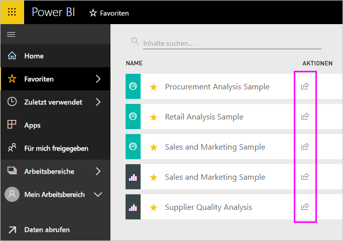
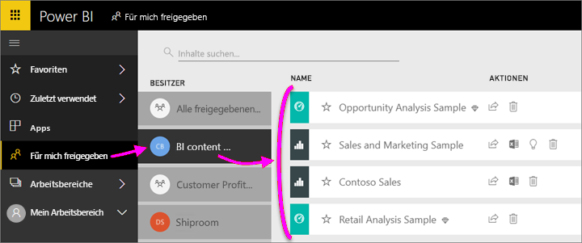

# Freigeben von Power BI-Dashboards und -Berichten für Kollegen und andere
*Freigeben* ist eine gute Möglichkeit, einigen Personen Zugriff auf Ihre Dashboards und Berichte zu gewähren. Zudem bietet Power BI [verschiedene Möglichkeiten zum gemeinsamen Bearbeiten und Verteilen von Dashboards und Berichten](service-how-to-collaborate-distribute-dashboards-reports.md).

Zum Freigeben benötigen Sie eine [Power BI Pro-Lizenz](service-features-license-type.md), egal, ob Sie Inhalte innerhalb oder außerhalb Ihrer Organisation freigeben. Auch Ihre Empfänger benötigen Power BI Pro-Lizenzen, sofern sich die Inhalte nicht in einer [Premium-Kapazität](service-premium-what-is.md) befinden. 

Sie können Dashboards und Berichte von den meisten Stellen im Power BI-Dienst aus freigeben: „Favoriten“, „Zuletzt verwendet“, „Für mich freigegeben“ (wenn der Besitzer es erlaubt), „Mein Arbeitsbereich“ oder andere Arbeitsbereiche. Wenn Sie Dashboards oder Berichts freigeben, können diejenigen, für die Sie sie freigeben, diese anzeigen und damit interagieren, aber nicht bearbeiten. Sie sehen die gleichen Daten wie Sie im Dashboard oder Bericht, es sei denn, die [Sicherheit auf Zeilenebene (RLS)](service-admin-rls.md) ist aktiviert. Die Kollegen, für die Sie Inhalte freigeben, können diese auch für ihre Kollegen freigeben, wenn Sie dies zulassen. Die Personen außerhalb Ihrer Organisation können ebenfalls das Dashboard oder den Bericht anzeigen und damit interagieren, aber diese nicht freigeben. 

Sie können [ein Dashboard auch aus einer beliebigen mobilen Power BI-App freigeben](consumer/mobile/mobile-share-dashboard-from-the-mobile-apps.md). Sie können jedoch keine Dashboards aus Power BI Desktop freigeben.

## Video: Freigeben eines Dashboards
Sehen Sie sich an, wie Amanda ihr Dashboard für Kollegen im eigenen Unternehmen und externe Personen freigibt. Befolgen Sie dann die schrittweisen Anleitungen unter dem Video, um es selbst ausprobieren.

<iframe width="560" height="315" src="https://www.youtube.com/embed/0tUwn8DHo3s?list=PL1N57mwBHtN0JFoKSR0n-tBkUJHeMP2cP" frameborder="0" allowfullscreen></iframe>

## Freigeben eines Dashboards oder Berichts

1. Wählen Sie in einer Liste von Dashboards bzw. Berichten oder in einem geöffneten Dashboard oder Bericht **Freigeben** .

2. Geben Sie im oberen Feld die vollständigen E-Mail-Adressen für Einzelpersonen, Verteilergruppen oder Sicherheitsgruppen ein. Bei dynamischen Verteilerlisten sind Freigaben nicht möglich. 
   
   Freigaben sind auch für Personen mit Adressen außerhalb der Organisation möglich. In diesem Fall wird allerdings eine Warnung angezeigt.
   
    
 
   >[!NOTE]
   >Das Eingabefeld unterstützt maximal 100 Benutzer oder Gruppen. Wenn eine Freigabe für eine große Anzahl von Benutzern nötig ist, sollten Sie das Dashboard in einem Arbeitsbereich erstellen und [als App verteilen](service-create-distribute-apps.md).
   > 
   > 

3. Wenn Sie möchten, fügen Sie eine Nachricht hinzu. Dies ist optional.
4. Damit Ihre Kollegen Ihren Inhalt für weitere Personen freigeben können, aktivieren Sie das Kontrollkästchen **Empfängern das Freigeben Ihres Dashboards (oder Berichts) erlauben**.
   
   Wenn Sie anderen Personen das Freigeben gestatten, wird dies als *erneutes Freigeben* bezeichnet. In diesem Fall können die anderen Personen die Inhalte über den Power BI-Dienst und die mobilen Apps erneut freigeben oder die E-Mail-Einladung an andere Personen in der Organisation weiterleiten. Nach einem Monat läuft die Einladung ab. Für Personen außerhalb Ihrer Organisation ist die erneute Freigabe nicht möglich. Als Besitzer des Inhalts können Sie die erneute Freigabe deaktivieren oder individuell widerrufen. Informationen finden Sie unter [Aufheben der Freigabe oder Aufheben der Freigabe durch andere](#stop-sharing-or-stop-others-from-sharing).

5. Wählen Sie **Freigeben** aus.
   
     
   
   Power BI sendet an die Personen, jedoch nicht an Gruppen, eine Einladung per E-Mail, die einen Link zum freigegebenen Inhalt enthält. Die Benachrichtigung **Erfolgreich** wird angezeigt. 
   
   Wenn Empfänger in Ihrer Organisation auf den Link klicken, wird das Dashboard bzw. der Bericht in Power BI ihrer Listenseite **Für mich freigegeben** hinzugefügt. Die Empfänger können Ihren Namen auswählen, um alle von Ihnen für sie freigegebenen Inhalte anzuzeigen. 
   
   
   
   Wenn Empfänger außerhalb der Organisation auf den Link klicken, wird das Dashboard bzw. der Bericht angezeigt, jedoch nicht im üblichen Power BI-Portal. Weitere Informationen finden Sie unter [Freigeben eines Dashboards bzw. eines Berichts für Personen außerhalb Ihrer Organisation](#share-a-dashboard-or-report-with-people-outside-your-organization).

## Wer hat Zugriff auf von Ihnen freigegebene Dashboards und Berichte?
In einigen Fällen müssen Sie sehen können, für welche Personen Sie Inhalte freigegeben haben, und für welche Personen diese die Inhalte freigegeben haben:

1. Wählen Sie in der Liste der Dashboards und Berichte oder im Dashboard bzw. Bericht selbst **Freigeben**  aus. 
2. Wählen Sie im Dialogfeld **Dashboard freigeben** oder **Bericht freigeben** die Option **Zugriff** aus.
   
    

    Personen außerhalb Ihrer Organisation werden als **Gast** aufgelistet.

## Aufheben der Freigabe oder Aufheben der Freigabe durch andere
Nur der Dashboard- bzw. Berichtbesitzer kann die erneute Freigabe aktivieren und deaktivieren.

### Wenn Sie die Freigabeeinladung noch nicht gesendet haben
* Deaktivieren Sie unten in der Einladung das Kontrollkästchen **Empfängern das Freigeben Ihres Dashboards (oder Berichts) erlauben**, bevor Sie sie senden.

### Wenn Sie das Dashboard bzw. den Bericht bereits freigegeben haben
1. Wählen Sie in der Liste der Dashboards und Berichte oder im Dashboard bzw. Bericht selbst **Freigeben**  aus. 
2. Wählen Sie im Dialogfeld **Dashboard freigeben** oder **Bericht freigeben** die Option **Zugriff** aus.
   
    
3. Klicken Sie auf die Auslassungspunkte ( **...** ) neben **Lesen und erneut freigeben**, und wählen Sie dann Folgendes:
   
   
   
   * **Lesen**, um Freigaben dieser Person für andere Personen zu verhindern.
   * **Zugriff entfernen**, um zu verhindern, dass diese Person den freigegebenen Inhalt anzeigen kann.

4. Legen Sie im Dialogfeld **Zugriff entfernen** fest, ob Sie auch den Zugriff auf verwandte Inhalte entfernen möchten, z.B. auf Berichte und Datasets. Wenn Sie Elemente mit einem Warnsymbol  entfernen, sollten Sie am besten auch verwandte Inhalte entfernen, da sie nicht korrekt angezeigt werden.

    

## Freigeben eines Dashboards bzw. eines Berichts für Personen außerhalb Ihrer Organisation
Bei einer Freigabe für Personen außerhalb Ihrer Organisation erhalten diese eine E-Mail mit einem Link zum freigegebenen Dashboard bzw. Bericht und müssen sich bei Power BI anmelden, um den Inhalt anzuzeigen. Wenn sie keine Power BI Pro-Lizenz haben, können sie sich nach Klicken auf den Link für eine Lizenz registrieren.

Nachdem sie sich angemeldet haben, sehen sie das freigegebene Dashboard bzw. den freigegebenen Bericht in einem eigenen Browserfenster und nicht in ihrem üblichen Power BI-Portal. Wenn Sie später auf dieses Dashboard oder diesen Bericht zugreifen möchten, müssen sie den Link als Favoriten speichern.

Sie können Inhalte in diesem Dashboard oder Bericht nicht bearbeiten. Obwohl Sie die Möglichkeit haben, mit den Diagrammen zu interagieren und Filter oder Datenschnitte zu ändern, können sie ihre Änderungen nicht speichern. 

Nur direkte Empfänger können das freigegebene Dashboard bzw. den freigegebenen Bericht anzeigen. Wenn Sie die E-Mail beispielsweise an Vicki@contoso.com gesendet haben, wird das Dashboard nur für Vicki angezeigt. Keine andere Person kann das Dashboard anzeigen, selbst wenn sie über den Link verfügt. Vicki muss für den Zugriff dieselbe E-Mail-Adresse verwenden. Meldet sie sich mit einer anderen E-Mail-Adresse an, hat sie keinen Zugriff auf das Dashboard.

Personen außerhalb Ihrer Organisation können keine Daten anzeigen, wenn für lokale Analysis Services-Tabellenmodelle die Sicherheit auf Rollen- oder Zeilenebene implementiert ist.

Wenn Sie aus einer mobilen Power BI-App einen Link an Personen außerhalb Ihrer Organisation senden, wird durch Klicken auf den Link das Dashboard in einem Browser und nicht in der mobilen Power BI-App geöffnet.

Wenn Sie [externen Gastbenutzern das Bearbeiten und Verwalten von Inhalten in der Organisation erlauben](service-admin-portal.md#export-and-sharing-settings), sind diese nicht auf die Nutzung nur als Standardbenutzeroberfläche beschränkt. [Weitere Informationen](service-admin-azure-ad-b2b.md).

## Einschränkungen und Überlegungen
Aspekte, die beim Freigeben von Dashboards und Berichten zu beachten sind:

* Im Allgemeinen sehen Sie und Ihre Kollegen die gleichen Daten im Dashboard bzw. Bericht. Wenn Sie folglich mehr Berechtigungen als Ihre Kollegen haben, Daten zu sehen, werden sie alle Daten in Ihrem Dashboard bzw. Bericht sehen können. Wenn jedoch die [Sicherheit auf Zeilenebene (RLS)](service-admin-rls.md) auf das einem Dashboard bzw. Bericht zugrunde liegende Dataset angewendet ist, wird anhand der Anmeldeinformationen jeder Person festgelegt, auf welche Daten sie zugreifen kann.
* Jede Person, für die Sie das Dashboard freigeben, kann es anzeigen und in der [Leseansicht](consumer/end-user-reading-view.md#reading-view) mit den verknüpften Berichten interagieren. Sie können keine Berichte erstellen oder Änderungen an vorhandenen Berichten speichern.
* Obwohl niemand das Dataset anzeigen oder herunterladen kann, ist der direkte Zugriff auf das Dataset mit dem Feature „In Excel analysieren“ möglich. Ein Administrator kann die Nutzungsmöglichkeiten von „In Excel analysieren“ für alle Mitglieder in einer Gruppe einschränken. Die Einschränkung gilt allerdings für alle Benutzer in dieser Gruppe für jeden Arbeitsbereich, zu dem die Gruppe gehört.
* Alle Benutzer können die [Daten manuell aktualisieren](refresh-data.md).
* Wenn Sie Office 365 für E-Mails verwenden, ist die Freigabe für Mitglieder einer Verteilergruppe möglich, indem Sie die der Verteilergruppe zugeordnete E-Mail-Adresse eingeben.
* Kollegen, die dieselbe E-Mail-Domäne wie Sie verwenden, und Kollegen, die zu einer anderen Domäne gehören, aber innerhalb desselben Mandanten registriert sind, können das Dashboard für andere freigeben. Wenn beispielsweise die Domänen „contoso.com“ und „contoso2.com“ im selben Mandanten registriert sind und Ihre E-Mail-Adresse konrads@contoso.com lautet, ist sowohl ravali@contoso.com als auch gustav@contoso2.com die Freigabe gestattet, sofern Sie die entsprechende Berechtigung erteilt haben.
* Wenn Ihre Kollegen bereits über den Zugriff auf ein bestimmtes Dashboard bzw. einen bestimmten Bericht verfügen, können Sie einen direkten Link senden, indem Sie die URL kopieren, wenn Sie sich auf dem Dashboard bzw. im Bericht befinden. Beispiel: `https://powerbi.com/dashboards/g12466b5-a452-4e55-8634-xxxxxxxxxxxx`
* Ebenso können Sie, wenn Ihre Kollegen bereits Zugriff auf ein bestimmtes Dashboard haben, [einen direkten Link zum zugrunde liegenden Bericht senden](service-share-reports.md). 
* Sie können mit einer einzelnen Freigabeaktion eine Freigabe für maximal 100 Benutzer oder Gruppen erzielen. Allerdings können Sie mehr als 500 Benutzern Zugriff auf ein Element gewähren. Dazu führen Sie entweder mehrmals eine Freigabe durch und geben die Benutzer einzeln an, oder Sie nehmen eine Freigabe für eine Benutzergruppe vor, die alle Benutzer enthält.

## Behandeln von Problemen bei der Freigabe

### Die Empfänger meines Dashboards sehen ein Schlosssymbol auf einer Kachel oder die Meldung „Berechtigung erforderlich“.

Den Personen, für die Sie Inhalte freigeben, wird möglicherweise eine gesperrte Kachel in einem Dashboard oder die Meldung „Berechtigung erforderlich“ angezeigt, wenn sie einen Bericht anzeigen möchten.

In diesem Fall müssen Sie ihnen eine Berechtigung für das zugrunde liegende Dataset gewähren:

1. Wechseln Sie in der Liste Ihrer Inhalte zur Registerkarte **Datasets**.

1. Wählen Sie die Auslassungspunkte ( **...** ) neben dem Dataset und dann **Berechtigungen verwalten** aus.

    

1. Wählen Sie **Benutzer hinzufügen** aus.

    

1. Geben Sie die vollständigen E-Mail-Adressen für Einzelpersonen, Verteilergruppen oder Sicherheitsgruppen ein. Bei dynamischen Verteilerlisten sind Freigaben nicht möglich.

    

1. Wählen Sie **Hinzufügen**.

### Ein Dashboard oder Bericht kann nicht freigegeben werden

Zum Freigeben eines Dashboards oder Berichts benötigen Sie die Berechtigung zum erneuten Freigeben des zugrunde liegenden Inhalts, d.h. alle zugehörigen Berichte und Datasets. Wenn eine Meldung angezeigt wird, dass die Freigabe nicht möglich ist, bitten Sie den Autor des Berichts, Ihnen für diese Berichte und Datasets die Berechtigung zum erneuten Freigeben zu gewähren.

## Nächste Schritte
* Feedback? Anregungen nehmen wir auf der [Power BI-Communitywebsite](https://community.powerbi.com/) entgegen.
* [Wie kann ich Dashboards und Berichte freigeben?](service-how-to-collaborate-distribute-dashboards-reports.md)
* [Freigeben eines gefilterten Power BI-Berichts](service-share-reports.md)
* Haben Sie Fragen? [Wenden Sie sich an die Power BI-Community](http://community.powerbi.com/).

