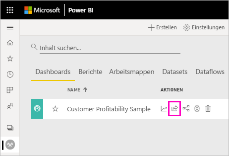
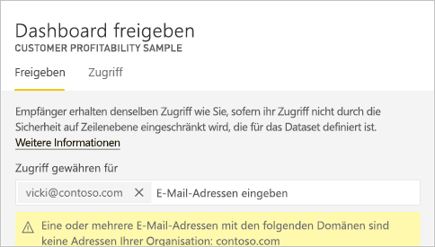
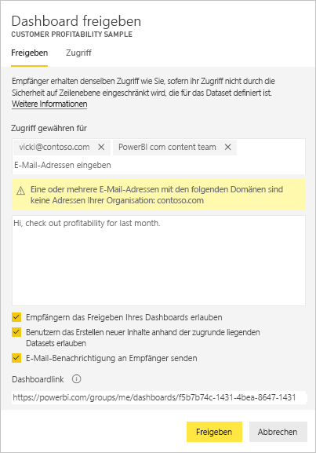
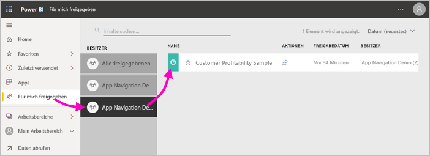
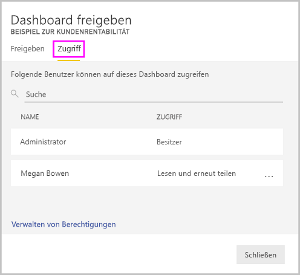
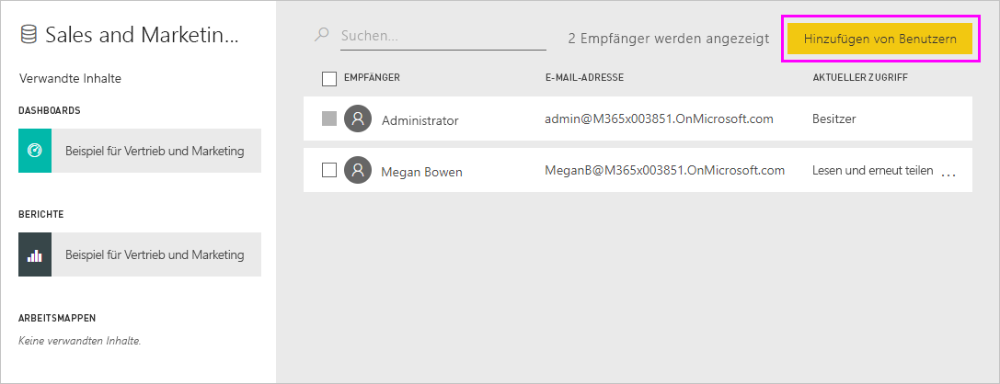
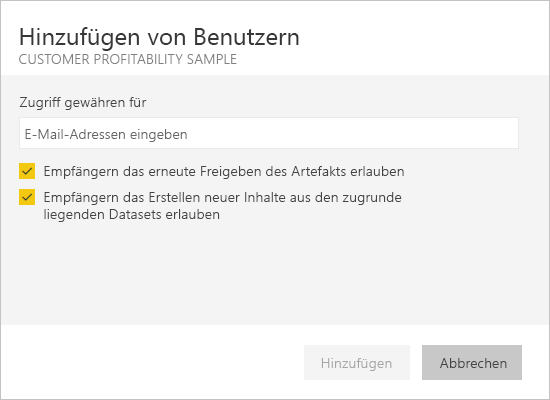

# Freigeben von Power BI-Dashboards und -Berichten für Kollegen und andere
*Freigeben* ist eine gute Möglichkeit, einigen Personen Zugriff auf Ihre Dashboards und Berichte zu gewähren. Zudem bietet Power BI [verschiedene Möglichkeiten zum gemeinsamen Bearbeiten und Verteilen von Dashboards und Berichten](service-how-to-collaborate-distribute-dashboards-reports.md).

Zum Freigeben benötigen Sie eine [Power BI Pro-Lizenz](service-features-license-type.md), egal, ob Sie Inhalte innerhalb oder außerhalb Ihrer Organisation freigeben. Auch Ihre Empfänger benötigen Power BI Pro-Lizenzen, sofern sich die Inhalte nicht in einer [Premium-Kapazität](service-premium-what-is.md) befinden. 

Sie können Dashboards und Berichte von den meisten Stellen im Power BI-Dienst aus freigeben: „Favoriten“, „Zuletzt verwendet“, „Mein Arbeitsbereich“ und „Für mich freigegeben“ (wenn der Besitzer es erlaubt). Sie können Freigaben auch über andere Arbeitsbereiche erteilen, wenn Sie über eine [Administrator-, eine Mitglieds- oder „Mitwirkender“-Rolle](service-new-workspaces.md#roles-in-the-new-workspaces) im Arbeitsbereich verfügen. 

Wenn Sie Dashboards oder Berichte freigeben, können diejenigen, für die Sie sie freigeben, diese anzeigen und damit interagieren, aber nicht bearbeiten. Sie sehen die gleichen Daten wie Sie im Dashboard oder Bericht, es sei denn, die [Sicherheit auf Zeilenebene (RLS)](service-admin-rls.md) ist aktiviert. Die Kollegen, für die Sie Inhalte freigeben, können diese auch für ihre Kollegen freigeben, wenn Sie dies zulassen. Die Personen außerhalb Ihrer Organisation können das Dashboard oder den Bericht anzeigen und damit interagieren, diese jedoch nicht freigeben. 

Sie können keine Dashboards oder Berichte direkt aus Power BI Desktop *freigeben*. [Veröffentlichen Sie Berichte aus Power BI Desktop](desktop-upload-desktop-files.md) im Power BI-Dienst. Sie können jedoch [Dashboards aus einer der mobilen Power BI-Apps freigeben](consumer/mobile/mobile-share-dashboard-from-the-mobile-apps.md).  

## Video: Freigeben eines Dashboards
Sehen Sie sich an, wie Amanda ihr Dashboard für Kollegen im eigenen Unternehmen und externe Personen freigibt. Befolgen Sie dann die schrittweisen Anleitungen unter dem Video, um es selbst ausprobieren.

<iframe width="560" height="315" src="https://www.youtube.com/embed/0tUwn8DHo3s?list=PL1N57mwBHtN0JFoKSR0n-tBkUJHeMP2cP" frameborder="0" allowfullscreen></iframe>

## Freigeben eines Dashboards oder Berichts

1. Wählen Sie in einer Liste von Dashboards bzw. Berichten oder in einem geöffneten Dashboard oder Bericht **Freigeben** .

2. Geben Sie im oberen Feld die vollständigen E-Mail-Adressen für Einzelpersonen, Verteilergruppen oder Sicherheitsgruppen ein. Bei dynamischen Verteilerlisten sind Freigaben nicht möglich. 
   
   Freigaben sind auch für Personen mit Adressen außerhalb der Organisation möglich. In diesem Fall wird allerdings eine Warnung angezeigt. In diesem Artikel finden Sie weitere Informationen zur [Freigabe außerhalb Ihrer Organisation](#share-a-dashboard-or-report-outside-your-organization).
   
    
 
   >[!NOTE]
   >Das Eingabefeld unterstützt maximal 100 separate Benutzer oder Gruppen. Im Abschnitt [Freigabe für mehr als 100 separate Benutzer](#share-with-more-than-100-separate-users) dieses Artikels erfahren Sie, wie Sie Elemente für mehrere Personen freigeben können.

3. Wenn Sie möchten, fügen Sie eine Nachricht hinzu. Dies ist optional.
4. Damit Ihre Kollegen Ihren Inhalt für weitere Personen freigeben können, aktivieren Sie das Kontrollkästchen **Empfängern das Freigeben Ihres Dashboards (oder Berichts) erlauben**.
   
   Wenn Sie anderen Personen das Freigeben gestatten, wird dies als *erneutes Freigeben* bezeichnet. In diesem Fall können die anderen Personen die Inhalte über den Power BI-Dienst und die mobilen Apps erneut freigeben oder die E-Mail-Einladung an andere Personen in der Organisation weiterleiten. Nach einem Monat läuft die Einladung ab. Für Personen außerhalb Ihrer Organisation ist die erneute Freigabe nicht möglich. Als Besitzer des Inhalts können Sie die erneute Freigabe deaktivieren oder individuell widerrufen. Weitere Informationen finden Sie im Abschnitt [Beenden oder Ändern der Freigabe](#stop-or-change-sharing) dieses Artikels.

5. Wenn Sie **Benutzern das Erstellen neuer Inhalte anhand der zugrunde liegenden Datasets erlauben** aktivieren, können Benutzer ihre eigenen Berichte in anderen Arbeitsbereichen erstellen, die auf dem Dataset für dieses Dashboard basieren. Erfahren Sie mehr zum Thema [Erstellen von Berichten auf Grundlage von Datasets aus anderen Arbeitsbereichen](service-datasets-discover-across-workspaces.md).

1. Wählen Sie **Freigeben** aus.
   
     
   
   Power BI sendet an die Personen, jedoch nicht an Gruppen, eine Einladung per E-Mail, die einen Link zum freigegebenen Inhalt enthält. Die Benachrichtigung **Erfolgreich** wird angezeigt. 
   
   Wenn Empfänger in Ihrer Organisation auf den Link klicken, wird das Dashboard bzw. der Bericht in Power BI ihrer Listenseite **Für mich freigegeben** hinzugefügt. Die Empfänger können Ihren Namen auswählen, um alle von Ihnen für sie freigegebenen Inhalte anzuzeigen. 
   
   
   
   Wenn Empfänger außerhalb der Organisation auf den Link klicken, wird das Dashboard bzw. der Bericht angezeigt, jedoch nicht im üblichen Power BI-Portal. In diesem Artikel finden Sie weitere Informationen zur [Freigabe für Personen außerhalb Ihrer Organisation](#share-a-dashboard-or-report-outside-your-organization).

## Anzeigen der Benutzer mit Zugriff auf ein Dashboard oder Bericht
In einigen Fällen müssen Sie sehen können, für welche Personen Sie Inhalte freigegeben haben, und für welche Personen diese die Inhalte freigegeben haben.

1. Wählen Sie in der Liste der Dashboards und Berichte oder im Dashboard bzw. Bericht selbst **Freigeben**  aus. 
2. Wählen Sie im Dialogfeld **Dashboard freigeben** oder **Bericht freigeben** die Option **Zugriff** aus.
   
    

    Personen außerhalb Ihrer Organisation werden als **Gast** aufgelistet.

    In dieser Ansicht können Sie [Freigabeberechtigungen aufheben oder ändern](#stop-or-change-sharing) (siehe hierzu den entsprechenden Abschnitt in diesem Artikel). 

## Freigeben eines Dashboards oder Berichts außerhalb Ihrer Organisation
Bei einer Freigabe für Personen außerhalb Ihrer Organisation erhalten diese eine E-Mail mit einem Link zum freigegebenen Dashboard oder Bericht. Sie müssen sich bei Power BI anmelden, um zu sehen, was Sie freigegeben haben. Wenn sie keine Power BI Pro-Lizenz haben, können sie sich nach Klicken auf den Link für eine Lizenz registrieren.

Nachdem sie sich angemeldet haben, sehen sie das freigegebene Dashboard bzw. den freigegebenen Bericht in einem eigenen Browserfenster und nicht im üblichen Power BI-Portal. Wenn Sie später auf dieses Dashboard oder diesen Bericht zugreifen möchten, müssen sie den Link als Favoriten speichern.

Sie können Inhalte in diesem Dashboard oder Bericht nicht bearbeiten. Aber sie haben die Möglichkeit, mit den Diagrammen zu interagieren und Änderungsfilter oder Datenschnitte zu ändern, wobei sie ihre Änderungen jedoch nicht speichern können. 

Nur direkten Empfängern wird das freigegebene Dashboard bzw. der freigegebene Bericht angezeigt. Wenn Sie die E-Mail beispielsweise an Vicki@contoso.com gesendet haben, wird das Dashboard nur für Vicki angezeigt. Keine andere Person kann das Dashboard anzeigen, auch dann nicht, wenn Vicky den Link an sie weiterleitet. Vicki muss für den Zugriff dieselbe E-Mail-Adresse verwenden. Meldet sie sich mit einer anderen E-Mail-Adresse an, hat sie keinen Zugriff auf das Dashboard.

Personen außerhalb Ihrer Organisation können keine Daten anzeigen, wenn für lokale Analysis Services-Tabellenmodelle die Sicherheit auf Rollen- oder Zeilenebene implementiert ist.

Wenn Sie aus einer mobilen Power BI-App einen Link an Personen außerhalb Ihrer Organisation senden, wird durch Klicken auf den Link das Dashboard in einem Browser und nicht in der mobilen Power BI-App geöffnet.

### Zulassen von Bearbeitungen der Inhalte durch externe Benutzer

Der Power BI-Administrator kann es externen Gastbenutzern gestatten, Inhalte in der Organisation zu bearbeiten und zu verwalten. In diesem Fall sind externe Gastbenutzer nicht auf die Nutzung der Standardbenutzeroberfläche beschränkt. Sie können Inhalte in der Organisation bearbeiten und verwalten. Weitere Informationen finden Sie unter [Verteilen von Power BI-Inhalten an externe Gastbenutzer mit Azure AD B2B](service-admin-azure-ad-b2b.md).

## Beenden oder Ändern der Freigabe
Nur der Dashboard- bzw. Berichtbesitzer kann die erneute Freigabe aktivieren und deaktivieren.

### Wenn Sie die Freigabeeinladung noch nicht gesendet haben
* Deaktivieren Sie unten in der Einladung das Kontrollkästchen **Empfängern das Freigeben Ihres Dashboards (oder Berichts) erlauben**, bevor Sie sie senden.

### Wenn Sie das Dashboard bzw. den Bericht bereits freigegeben haben
1. Wählen Sie in der Liste der Dashboards und Berichte oder im Dashboard bzw. Bericht selbst **Freigeben**  aus. 
2. Wählen Sie im Dialogfeld **Dashboard freigeben** oder **Bericht freigeben** die Option **Zugriff** aus.
   
    
3. Klicken Sie auf die Auslassungspunkte ( **...** ) neben **Lesen und erneut freigeben**, und wählen Sie dann Folgendes:
   
   
   
   * **Lesen**, um Freigaben dieser Person für andere Personen zu verhindern.
   * **Zugriff entfernen**, um zu verhindern, dass diese Person den freigegebenen Inhalt anzeigen kann.

4. Legen Sie im Dialogfeld **Zugriff entfernen** fest, ob Sie auch den Zugriff auf verwandte Inhalte entfernen möchten, z.B. auf Berichte und Datasets. Wenn Sie Elemente mit einem Warnsymbol  entfernen, sollten Sie am besten auch verwandte Inhalte entfernen. Andernfalls werden sie nicht korrekt angezeigt.

    

## Einschränkungen und Überlegungen
Aspekte, die beim Freigeben von Dashboards und Berichten zu beachten sind:

* Im Allgemeinen sehen Sie und Ihre Kollegen die gleichen Daten im Dashboard bzw. Bericht. Wenn Sie mit Ihren Berechtigungen mehr Daten sehen können als Ihre Kollegen, werden ihnen folglich alle Daten in Ihrem Dashboard bzw. Bericht angezeigt. Wenn jedoch die [Sicherheit auf Zeilenebene (RLS)](service-admin-rls.md) auf das einem Dashboard bzw. Bericht zugrunde liegende Dataset angewendet ist, wird anhand der Anmeldeinformationen jeder Person festgelegt, auf welche Daten sie zugreifen kann.
* Jede Person, für die Sie das Dashboard freigeben, kann es anzeigen und in der [Leseansicht](consumer/end-user-reading-view.md#reading-view) mit den verknüpften Berichten interagieren. Sie können im Allgemeinen keine Berichte erstellen oder Änderungen an vorhandenen Berichten speichern. Wenn Sie jedoch **Benutzern das Erstellen neuer Inhalte anhand der zugrunde liegenden Datasets erlauben** aktivieren, können Benutzer ihre eigenen Berichte in anderen Arbeitsbereichen erstellen, die auf dem Dataset für dieses Dashboard oder diesen Bericht basieren.
* Obwohl niemand das Dataset anzeigen oder herunterladen kann, ist der direkte Zugriff auf das Dataset mit dem Feature „In Excel analysieren“ möglich. Ein Administrator kann die Nutzungsmöglichkeiten von „In Excel analysieren“ für alle Mitglieder in einer Gruppe einschränken. Die Einschränkung gilt allerdings für alle Benutzer in dieser Gruppe und für jeden Arbeitsbereich, zu dem die Gruppe gehört.
* Alle Benutzer können die [Daten manuell aktualisieren](refresh-data.md).
* Wenn Sie Office 365 für E-Mails verwenden, ist die Freigabe für Mitglieder einer Verteilergruppe möglich, indem Sie die der Verteilergruppe zugeordnete E-Mail-Adresse eingeben.
* Kollegen, die dieselbe E-Mail-Domäne wie Sie verwenden, und Kollegen, die zu einer anderen Domäne gehören, aber innerhalb desselben Mandanten registriert sind, können das Dashboard für andere freigeben. Angenommen, die Domänen „contoso.com“ und „contoso2.com“ sind im selben Mandanten registriert und and Ihre E-Mail-Adresse lautet konrads@contoso.com. Sowohl ravali@contoso.com als auch gustav@contoso2.com können Ihr Dashboard freigeben, sofern Sie ihnen die Berechtigung zur Freigabe erteilen.
* Wenn Ihre Kollegen bereits über den Zugriff auf ein bestimmtes Dashboard bzw. einen bestimmten Bericht verfügen, können Sie einen direkten Link senden, indem Sie die URL kopieren, wenn Sie sich auf dem Dashboard bzw. im Bericht befinden. Beispiel: `https://powerbi.com/dashboards/g12466b5-a452-4e55-8634-xxxxxxxxxxxx`
* Ebenso können Sie, wenn Ihre Kollegen bereits Zugriff auf ein bestimmtes Dashboard haben, [einen direkten Link zum zugrunde liegenden Bericht senden](service-share-reports.md). 

### Freigabe für mehr als 100 separate Benutzer

Sie können mit einer einzelnen Freigabeaktion eine Freigabe für maximal 100 Benutzer oder Gruppen erteilen. Allerdings können Sie mehr als 500 Benutzern Zugriff auf ein Element gewähren. Hier sehen Sie einige Vorschläge:

- Erteilen Sie mehrere Male eine Freigabe, indem Sie die Benutzer einzeln angeben.
- Erteilen Sie eine Freigabe für eine Benutzergruppe, die alle Benutzer enthält. 
- Erstellen Sie den Bericht oder das Dashboard in einem Arbeitsbereich, und erstellen Sie dann eine App aus dem Arbeitsbereich. Sie können die App für viele weitere Personen freigeben. Weitere Informationen finden Sie unter [Veröffentlichen von Apps in Power BI](service-create-distribute-apps.md).

## Behandeln von Problemen bei der Freigabe

### Die Empfänger meines Dashboards sehen ein Schlosssymbol auf einer Kachel oder die Meldung „Berechtigung erforderlich“.

Den Personen, für die Sie Inhalte freigeben, wird möglicherweise eine gesperrte Kachel in einem Dashboard oder die Meldung „Berechtigung erforderlich“ angezeigt, wenn sie einen Bericht anzeigen möchten.

In diesem Fall müssen Sie ihnen eine Berechtigung für das zugrunde liegende Dataset gewähren.

1. Wechseln Sie in der Liste Ihrer Inhalte zur Registerkarte **Datasets**.

1. Wählen Sie die Auslassungspunkte ( **...** ) neben dem Dataset und dann **Berechtigungen verwalten** aus.

    

1. Wählen Sie **Benutzer hinzufügen** aus.

    

1. Geben Sie die vollständigen E-Mail-Adressen für Einzelpersonen, Verteilergruppen oder Sicherheitsgruppen ein. Bei dynamischen Verteilerlisten sind Freigaben nicht möglich.

    

1. Wählen Sie **Hinzufügen**.

### Ein Dashboard oder Bericht kann nicht freigegeben werden

Zum Freigeben eines Dashboards oder Berichts benötigen Sie die Berechtigung zum erneuten Freigeben des zugrunde liegenden Inhalts, d.h. alle zugehörigen Berichte und Datasets. Wenn eine Meldung angezeigt wird, dass die Freigabe nicht möglich ist, bitten Sie den Autor des Berichts, Ihnen für diese Berichte und Datasets die Berechtigung zum erneuten Freigeben zu gewähren.

## Nächste Schritte

* [Wie kann ich Dashboards und Berichte freigeben?](service-how-to-collaborate-distribute-dashboards-reports.md)
* [Freigeben eines gefilterten Power BI-Berichts](service-share-reports.md)
* Haben Sie Fragen? [Wenden Sie sich an die Power BI-Community](https://community.powerbi.com/)

