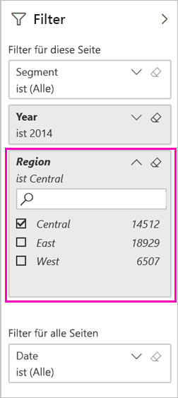
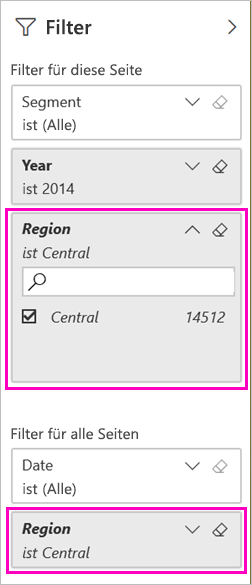

# Zwei Möglichkeiten zur Freigabe eines gefilterten Power BI-Berichts
*Freigeben* ist eine gute Möglichkeit, einigen Personen Zugriff auf Ihre Dashboards und Berichte zu gewähren. Wie gehen Sie vor, wenn Sie eine gefilterte Version eines Berichts freigeben möchten? Dabei handelt es sich möglicherweise um einen Bericht, der nur Daten für einen bestimmten Ort, einen bestimmten Vertriebsmitarbeiter oder ein bestimmtes Jahr enthält. Versuchen Sie, einen Bericht zu filtern und freizugeben, oder erstellen Sie eine benutzerdefinierte URL. Der Bericht wird gefiltert, wenn Empfänger ihn erstmalig öffnen. Sie können den Filter entfernen, indem Sie die URL ändern. 

Zudem bietet Power BI [andere Möglichkeiten zum gemeinsamen Bearbeiten und Verteilen Ihrer Berichte](service-how-to-collaborate-distribute-dashboards-reports.md). Zum Freigeben benötigen Sie und die Empfänger eine [Power BI Pro-Lizenz](service-features-license-type.md), oder es muss sich um Inhalte in einer [Premium-Kapazität](service-premium-what-is.md) handeln. 

## Zwei Möglichkeiten zum Filtern eines Berichts

Für beide Filterverfahren verwenden wir die Beispielvorlagen-App „Marketing & Sales“. Möchten Sie es ausprobieren? Sie können die [Beispielvorlagen-App „Marketing & Sales“](https://appsource.microsoft.com/product/power-bi/microsoft-retail-analysis-sample.salesandmarketingsample?tab=Overview) auch installieren.

### Festlegen eines Filters

Öffnen Sie einen Bericht in der [Bearbeitungsansicht](consumer/end-user-reading-view.md), und wenden Sie einen Filter an.

In diesem Beispiel filtern wir die Seite „YTD Category“ (Kategorie „Seit Jahresbeginn“) der Beispielvorlagen-App „Marketing & Sales“ so, dass Werte nur dort angezeigt werden, wo **Region** gleich **Central** (Mitte) ist. 
 

Speichern Sie den Bericht.

### Erstellen eines Filters in der URL

Wenn Sie den Filter am Ende der Berichtsseiten-URL hinzufügen, ist das Verhalten etwas anders. Die gefilterte Seite sieht identisch aus. Power BI fügt den Filter jedoch dem gesamten Bericht hinzu und entfernt die anderen Werte aus dem Filterbereich.  

Fügen Sie am Ende der Berichtsseiten-URL Folgendes hinzu:
   
    ?filter=*tablename*/*fieldname* eq *value*
   
Das Feld muss den Typ „number“, „datetime“ oder „string" aufweisen. Die Werte *TableName* oder *FieldName* dürfen keine Leerzeichen enthalten.
   
In diesem Beispiel lautet der Name der Tabelle **Geo**, das Feld hat den Namen **Region**, und der Wert, nach dem gefiltert werden soll, lautet **Central**:
   
    ?filter=Geo/Region eq 'Central'

Durch den Browser werden Sonderzeichen hinzugefügt, die Schrägstriche, Leerzeichen und Apostrophe darstellen, sodass die URL schließlich etwa wie folgt lautet:
   
    app.powerbi.com/groups/xxxx/reports/xxxx/ReportSection4d00c3887644123e310e?filter=Geo~2FRegion%20eq%20'Central'

Speichern Sie den Bericht.

Weitere Informationen finden Sie im Artikel [Filtern eines Berichts mithilfe von Abfragezeichenfolgenparametern in der URL](service-url-filters.md).

## Freigeben des gefilterten Berichts

1. Wenn Sie [den Bericht freigeben](service-share-dashboards.md), deaktivieren Sie das Kontrollkästchen **E-Mail-Benachrichtigungen an Empfänger senden**.

    

4. Senden Sie den Link mit dem zuvor erstellten Filter.

## Nächste Schritte
* [Freigeben Ihrer Arbeit in Power BI](service-how-to-collaborate-distribute-dashboards-reports.md)
* [Freigeben eines Dashboards](service-share-dashboards.md)
* Weitere Fragen? [Wenden Sie sich an die Power BI-Community](https://community.powerbi.com/).
* Feedback? Anregungen nehmen wir auf der [Power BI-Communitywebsite](https://community.powerbi.com/) entgegen.

