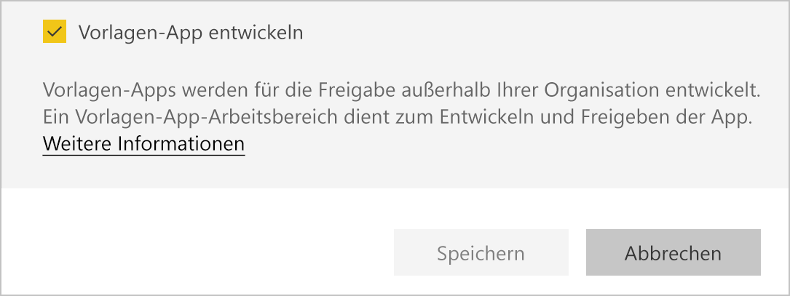
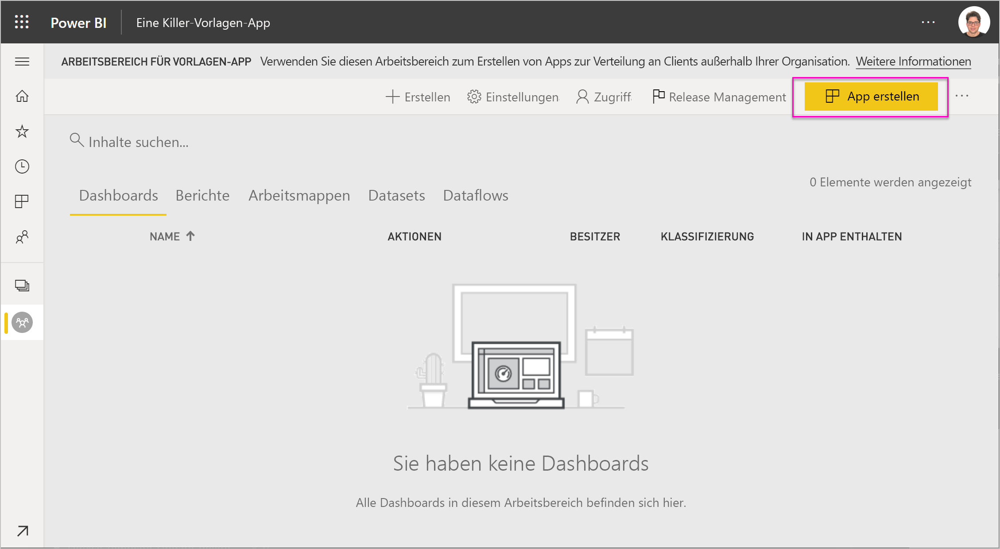
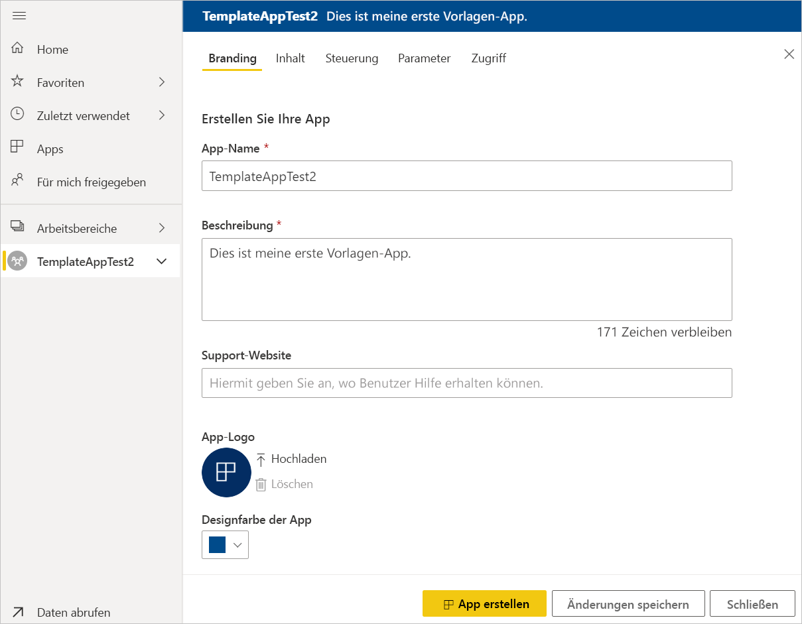
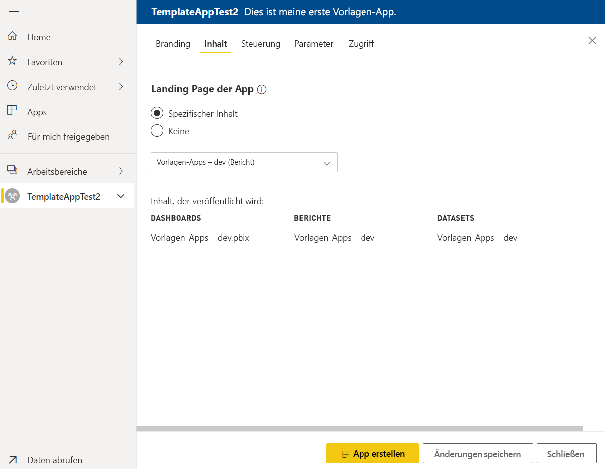
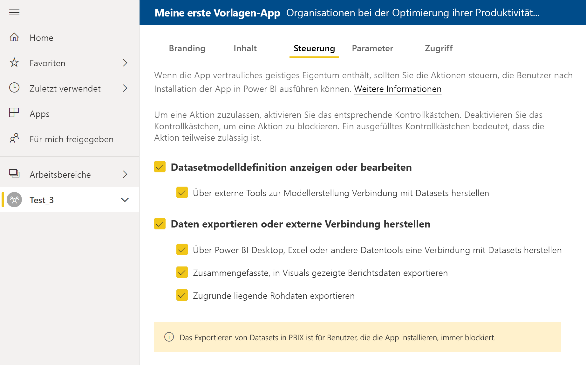
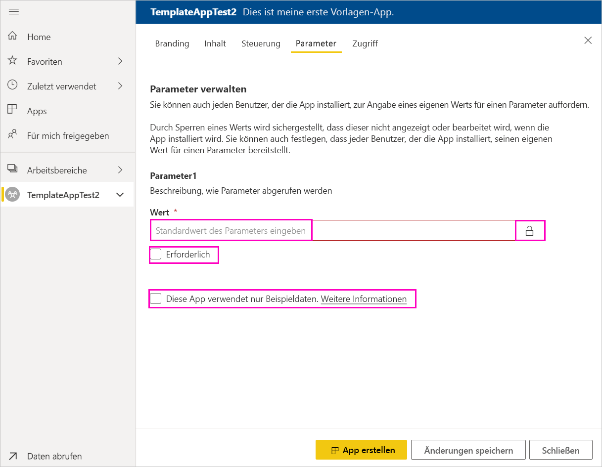
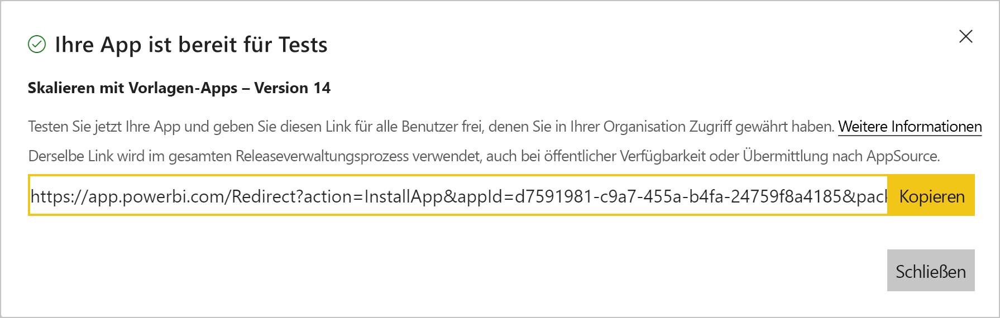
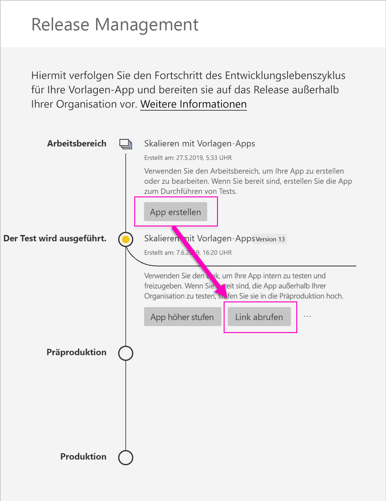
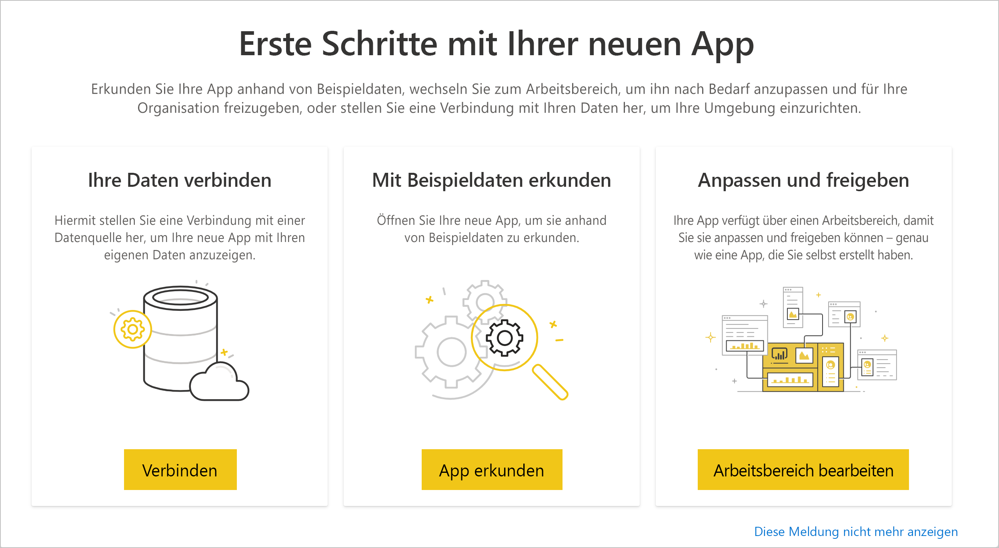
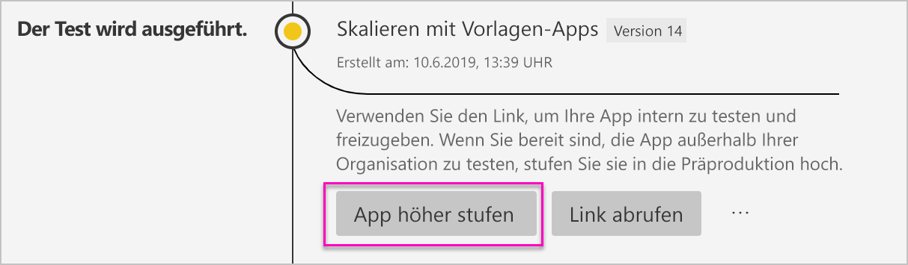

# Erstellen einer Vorlagen-App in Power BI (Vorschauversion)

Mit den neuen *Vorlagen-Apps* von Power BI können Power BI-Partner Power BI-Apps ohne oder mit nur wenig Code erstellen und für Power BI-Kunden bereitstellen.  In diesem Artikel finden Sie detaillierte Anweisungen für das Erstellen einer Power BI-Vorlagen-App.

Wenn Sie das Erstellen von Power BI-Berichten und -Dashboards beherrschen, können Sie ein *Ersteller von Vorlagen-Apps* werden und so analytische Inhalte erstellen und in einer *App* verpacken. Sie können dann Ihre App für andere Power BI-Mandaten über jede verfügbare Plattform bereitstellen (z. B. über AppSource), oder Sie können Ihren eigenen Webdienst für die Bereitstellung verwenden. Als Ersteller haben Sie die Möglichkeit, ein geschütztes Analysepaket zum Verteilen zu erstellen.

Administratoren für Power BI-Mandanten steuern und legen fest, wer in ihrer Organisation Vorlagen-Apps erstellen und installieren kann. Die autorisierten Benutzer können Ihre Vorlagen-App installieren, diese anschließend ändern und an die Power BI-Anwender in der eigenen Organisation verteilen.

## Voraussetzungen

Zum Erstellen einer Vorlagen-App ist Folgendes erforderlich:  

- [Power BI Pro-Lizenz](service-self-service-signup-for-power-bi.md)
- [Installation von Power BI Desktop](desktop-get-the-desktop.md) (optional)
- Vertrautheit mit den [grundlegenden Konzepten von Power BI](service-basic-concepts.md)
- Berechtigungen zum Erstellen einer Vorlagen-App Details finden Sie unter Power BI-[Verwaltungsportal > Vorlagen-App-Einstellungen](service-admin-portal.md#template-apps-settings-preview).

## Aktivieren des App-Entwicklermodus

Um eine Vorlagen-App zu erstellen, die Sie an andere Power BI-Mandanten verteilen können, müssen Sie sich im App-Entwicklermodus befinden. Andernfalls erstellen Sie nur eine App für Power BI-Anwender in Ihrer eigenen Organisation.

1. Öffnen Sie den Power BI-Dienst in einem Browser.
2. Navigieren Sie zu **Settings** > **General** > **Developer** > **Enable template app development mode** (Einstellungen > Allgemein > Entwickler > Entwicklermodus für Vorlagen-Apps aktivieren).

    

    Wenn diese Option nicht angezeigt wird, kontaktieren Sie Ihren Power BI-Administrator, damit er Ihnen im Verwaltungsportal [Berechtigungen für die Entwicklung von Vorlagen-Apps](service-admin-portal.md#template-apps-settings-preview) gewährt.

3. Klicken Sie auf **Übernehmen**.

## Erstellen des Arbeitsbereichs für eine Vorlagen-App

Um eine Vorlagen-App zu erstellen, die Sie an andere Power BI-Mandanten verteilen können, müssen Sie diese in einem der neuen App-Arbeitsbereiche erstellen.

1. Wählen Sie im Power BI-Dienst die Option **Arbeitsbereiche** > **App-Arbeitsbereich erstellen** aus.

    

2. Klicken Sie unter **App-Arbeitsbereich erstellen** in **Vorschau der verbesserten Arbeitsbereiche** auf **Jetzt ausprobieren**.

    

3. Geben Sie einen Namen und für Ihren App-Arbeitsbereich ein und fügen Sie optional eine Beschreibung und ein Bild des Logos hinzu.

4. Klicken Sie auf**Vorlagen-App entwickeln**.

    

5. Wählen Sie **Speichern**.
>[!NOTE]
>Sie benötigen die Berechtigungen Ihres Power BI-Administrators, um Vorlagen-Apps höher zu stufen.

## Erstellen des Inhalts in Ihrer Vorlagen-App

Wie in einem regulären Power BI-Arbeitsbereich, müssen Sie im nächsten Schritt die Inhalte im Arbeitsbereich erstellen.  In dieser Vorschauversion der Vorlagen-Apps unterstützen wir nur eine App pro Typ: ein Dataset, einen Bericht und ein Dashboard.

- [Erstellen Sie Ihren Power BI-Inhalt](power-bi-creator-landing.md) in Ihrem Arbeitsbereich.

Wenn Sie Parameter in Power Query verwenden, stellen Sie sicher, dass diese einen klar definierten Typ aufweisen (z.B. Text). Die Typen „Any“ und „Binary“ werden nicht unterstützt.

Unter [Tips for authoring template apps in Power BI (preview) (Tipps für die Erstellung von Vorlagen-Apps (Vorschauversion))](service-template-apps-tips.md) finden Sie Vorschläge, die Sie beim Erstellen von Berichten und Dashboards für Ihre Vorlagen-App beachten können.

## Erstellen der Test-Vorlagen-App

Nun, da sich Inhalt in Ihrem Arbeitsbereich befindet, können Sie diesen in einer Vorlagen-App packen. Zunächst müssen Sie eine Test-Vorlagen-App erstellen, auf die nur innerhalb Ihrer Organisation in Ihrem Mandanten zugegriffen werden kann.

1. Klicken Sie im Vorlagen-App-Arbeitsbereich auf **Create app** (App erstellen).

    

    Hier geben Sie in fünf Kategorien zusätzliche Erstellungsoptionen für Ihre Vorlagen-App ein:

    **Branding**

    
    - App-Name
    - Beschreibung
    - Supportwebsite (Sie finden den Link in der App-Info, nachdem die Vorlagen-App als Organisations-App neu verteilt wurde.)
    - App-Logo (Maximale Dateigröße: 45 Tsd.; Seitenverhältnis 1:1; Formate: .PNG, .JPG, .JPEG)
    - Designfarbe der App

    **Content (Inhalt)**

    **Landing Page der App:** Definieren Sie einen Bericht oder ein Dashboard, der bzw. das die Landing Page Ihrer App darstellen soll. Verwenden Sie eine Landing Page, die einen guten Eindruck vermittelt:

    

    **Control (Steuerung)**

    Legen Sie Begrenzungen und Einschränkungen fest, die den Zugriff der Benutzer Ihrer Anwendung auf deren Inhalt betreffen. Sie können dieses Steuerelement dazu verwenden, um geistiges Eigentum in Ihrer App zu schützen.

    

    >[!NOTE]
    >Für Benutzer, die die App installieren, wird das Exportieren in das .PBIX-Format immer blockiert.

    **Parameter**

    Verwenden Sie diese Kategorie, um das Parameterverhalten zu verwalten, wenn Sie eine Verbindung zu Datenquellen herstellen. Erfahren Sie mehr zum [Erstellen von Abfrageparametern](https://powerbi.microsoft.com/blog/deep-dive-into-query-parameters-and-power-bi-templates/).

    
    - **Wert:** Standardparameterwert
    - **Erforderlich:** Verwenden Sie diesen Parameter, damit das Installationsprogramm einen benutzerspezifischen Parameter eingibt.
    - **Sperre:** Das Sperren verhindert, dass das Installationsprogramm einen Parameter aktualisiert.
    - **Statisch:** Aktivieren Sie diesen Parameter, falls die App *ausschließlich* Beispieldaten enthält. Wenn Sie **Statisch** auswählen, weist der Installationsassistent den Benutzer nicht an, eine Datenquelle zu vernetzen.

    **Zugriff:** Entscheiden Sie in der Testphase, wer in Ihrer Organisation Ihre App installieren und testen kann. Keine Sorge, Sie können diese Einstellungen jederzeit ändern. Durch die Festlegung wird der Zugriff auf die verteilte Vorlagen-App nicht beeinflusst.

2. Klicken Sie auf **Create app** (App erstellen).

    Eine Meldung wird angezeigt, dass die App bereit ist, mit einem Link, den Sie kopieren und mit Ihren App-Testern teilen können.

    

    Sie haben nun auch bereits den ersten Schritt des nun folgenden Release Management-Prozesses getan.

## Freigabe der Vorlagen-App verwalten

Bevor Sie diese Vorlagen-App öffentlich freigeben, sollten Sie sicherstellen, dass sie einsatzbereit ist. In Power BI wurde der Release Management-Bereich erstellt, in dem Sie dem vollständigen Freigabepfad der App folgen und ihn überprüfen können. Sie können dort außerdem phasenweise den Produktübergang auslösen. Die Standardphasen sind die folgenden:

- Generieren der Test-App: nur zum Testen in Ihrer Organisation.
- Testpaket höher stufen in die Präproduktionsphase: zum Testen außerhalb Ihrer Organisation.
- Paket höher stufen von der Präproduktionsphase in die Produktionsphase: Produktionsversion.
- Löschen Sie ein Paket, oder beginnen Sie neu in der vorherigen Phase.

Die URL ändert sich nicht, wenn Sie zwischen Releasephasen wechseln. Die Höherstufung wirkt sich nicht auf die URL selbst aus.

Betrachten wir die einzelnen Phasen nun etwas genauer:

1. Wählen Sie im Vorlagen-App-Arbeitsbereich **Release Management** aus.

    

2. Klicken Sie auf **Create app** (App erstellen).

    Wenn Sie die Test-App oben unter **Erstellen der Test-Vorlagen-App** erstellt haben, ist der gelbe Punkt neben **Testing** (Tests) bereits ausgefüllt, und Sie müssen die Option **Create app** (App erstellen) hier nicht auswählen. Wenn Sie diese Option auswählen, gelangen Sie zurück in den Erstellprozess der Vorlagen-App.

3. Klicken Sie auf **Get link** (Link abrufen).

    

4. Um zu testen, wie gut sich die App installieren lässt, kopieren Sie den Link aus dem Benachrichtigungsfenster und fügen Sie ihn in einem neuen Browserfenster ein.

    Folgen Sie ab hier der gleichen Prozedur wie Ihre Kunden. Unter [Installieren und Verteilen von Vorlagen-Apps in Ihrer Organisation](service-template-apps-install-distribute.md) erhalten Sie Informationen zu deren Version.

5. Klicken Sie im Dialogfeld auf **Installieren**.

    Nach der Installation wird eine Benachrichtigung angezeigt, die angibt, dass die neue App bereit ist.

6. Klicken Sie auf **Go to app** (Zu App wechseln).
7. Unter **Erste Schritte mit Ihrer neuen App** sehen Sie die App wie Ihre Kunden sie sehen werden.

    
8. Klicken Sie auf **Explore App** (App erkunden), um die Test-App mit den Beispieldaten zu überprüfen.
9. Um Änderungen vorzunehmen, wechseln Sie zurück in den ursprünglichen Arbeitsbereich der App. Aktualisieren Sie die Test-App solange, bis Sie mit dem Ergebnis ganz zufrieden sind.
10. Wenn Sie bereit sind, Ihre App in die Präproduktionsphase höherzustufen, um Tests außerhalb Ihres Mandanten durchzuführen, wechseln Sie zurück in den **Release Management**-Bereich, und wählen Sie **Promote app** (App höher stufen) aus. 

    

    >[!NOTE]
    > Wenn die App höher gestuft wird, wird Sie außerhalb Ihrer Organisation öffentlich verfügbar.

11. Klicken Sie auf **Promote** (Höher stufen), um Ihre Auswahl zu bestätigen.
12. Kopieren Sie diese neue URL, um sie zum Testen außerhalb Ihres Mandanten freizugeben. Diesen Link können Sie auch senden, um mit dem Verteilen Ihrer App auf AppSource zu beginnen. Erstellen Sie hierzu ein [neues Cloud-Partnerportal-Angebot](https://docs.microsoft.com/azure/marketplace/cloud-partner-portal/power-bi/cpp-publish-offer). Übermitteln Sie nur Links für die Produktion an das Cloud-Partnerportal. Sobald die App genehmigt wurde und Sie die Benachrichtigung erhalten haben, dass sie in AppSource bereitgestellt wird, können Sie dieses Paket in die Produktionsphase in Power BI höher stufen.
13. Wenn Ihre App bereit ist für die Produktion oder für die Freigabe über AppSource, wechseln Sie zurück in den **Release Management**-Bereich, und wählen Sie **Promote app** (App höher stufen) neben **Pre-production** (Präproduktion) aus.
14. Klicken Sie auf **Promote** (Höher stufen), um Ihre Auswahl zu bestätigen.

    Nun befindet sich Ihre App in der Produktionsphase und ist für die Verteilung bereit.

    

Um Ihre App für tausende von Power BI-Benutzern weltweit verfügbar zu machen, empfehlen wir Ihnen die Freigabe über AppSource. Weitere Informationen darüber finden Sie unter [Power BI Application offer (Angebot für Power BI-Anwendungen)](https://docs.microsoft.com/azure/marketplace/cloud-partner-portal/power-bi/cpp-power-bi-offer).

## Aktualisieren Ihrer App

Da sich Ihre App nun in der Produktionsphase befindet, können Sie in die Testphase zurückkehren, ohne den Status der App in der Produktionsphase ändern zu müssen.

1. Klicken Sie im **Release Management**-Bereich auf **Create app** (App erstellen).
2. Wechseln Sie zurück in den App-Erstellungsprozess.
3. Nachdem Sie die Kategorien **Branding**, **Content** (Inhalt), **Control** (Steuerung) und **Access** (Zugriff) eingestellt haben, klicken Sie erneut auf **Create app** (App erstellen).
4. Wählen Sie **Close** (Schließen) aus, und wechseln Sie zurück zu **Release Management**.

   Wie Sie sehen, haben Sie nun zwei Versionen: Die Version in der Produktionsphase und zusätzlich eine neue Version in der Testphase.

    

5. Wenn Sie bereit sind, Ihre App in die Präproduktionsphase höherzustufen, um Tests außerhalb Ihres Mandanten durchzuführen, wechseln Sie zurück in den Release Management-Bereich, und wählen Sie **Promote app** (App höher stufen) neben **Testing** (Tests) aus.
6. Ihr Link ist nun live geschaltet. Senden Sie ihn noch mal an das Cloud-Partnerportal, indem Sie die Schritte unter [Aktualisieren eines Power BI-App-Angebots](https://docs.microsoft.com/azure/marketplace/cloud-partner-portal/power-bi/cpp-update-existing-offer) befolgen.

>[!NOTE]
>Stufen Sie Ihre App nur höher in die Produktionsphase, nachdem sie vom Cloud-Partnerportal genehmigt wurde und Sie sie veröffentlicht haben.

## Nächste Schritte

Sehen Sie unter [Install, customize, and distribute template apps in your organization (Installieren, anpassen und verteilen von Vorlagen-Apps in Ihrer Organisation)](service-template-apps-install-distribute.md), wie Ihre Kunden mit Ihrer Vorlagen-App interagieren.

Weitere Informationen über die Verteilung Ihrer App finden Sie unter [Power BI Application offer (Angebot für Power BI-Anwendungen)](https://docs.microsoft.com/azure/marketplace/cloud-partner-portal/power-bi/cpp-power-bi-offer).
