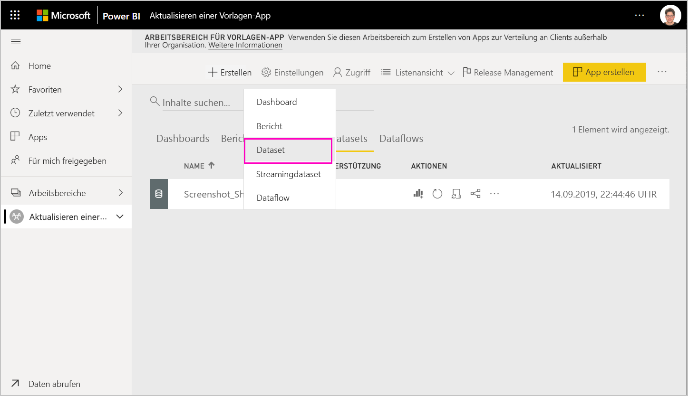
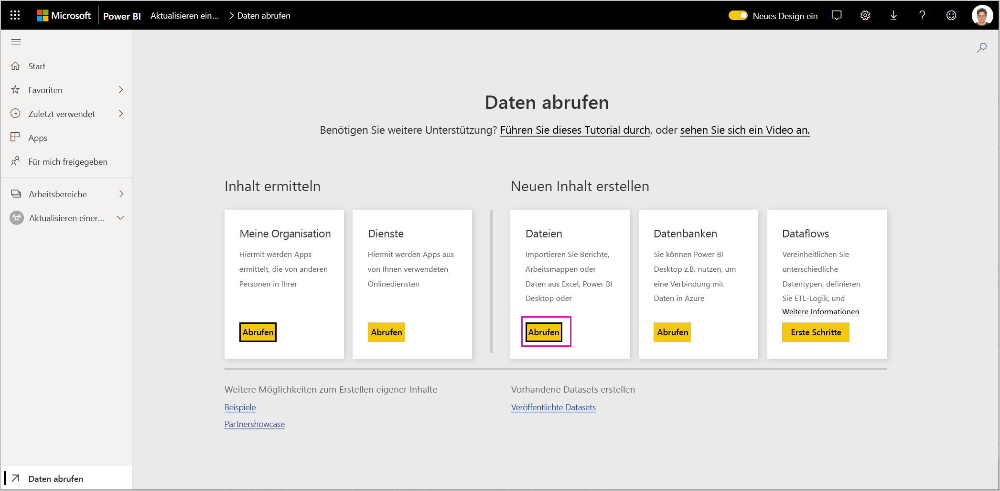
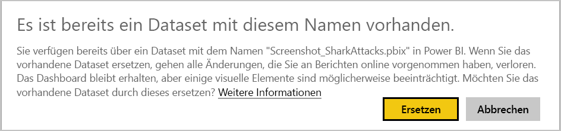
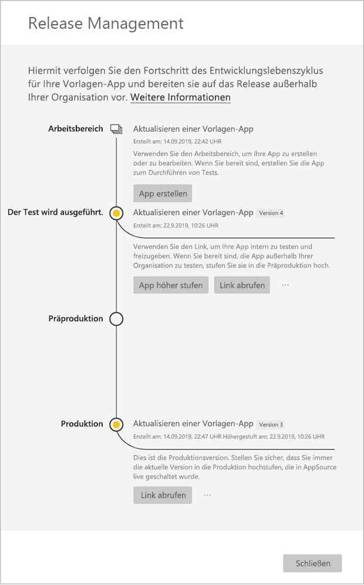
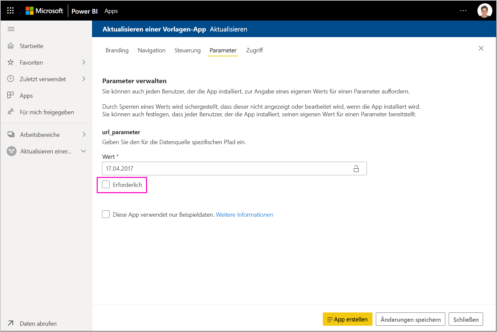

# Aktualisieren, Löschen und Extrahieren einer Vorlagen-App

Da sich Ihre App nun in der Produktionsphase befindet, können Sie in die Testphase zurückkehren, ohne den Status der App in der Produktionsphase ändern zu müssen.
## Aktualisieren Ihrer App

Wenn Sie die Änderungen in Power BI Desktop vorgenommen haben, beginnen Sie mit Schritt (1). Wenn Sie die Änderungen in Power BI Desktop nicht vorgenommen haben, beginnen Sie mit Schritt (4).

1. Laden Sie das aktualisierte Dataset hoch, und überschreiben Sie das vorhandene Dataset. **Stellen Sie sicher, dass Sie genau denselben Datasetnamen verwenden**. Wenn Sie einen anderen Namen verwenden, wird ein neues Dataset für Benutzer erstellt, die die App aktualisieren.

1. Importieren Sie die PBIX-Datei von Ihrem Computer.

1. Bestätigen Sie den Überschreibvorgang.

1. Klicken Sie im **Release Management**-Bereich auf **Create app** (App erstellen).
1. Wechseln Sie zurück in den App-Erstellungsprozess.
1. Nachdem Sie die Kategorien **Branding**, **Content** (Inhalt), **Control** (Steuerung) und **Access** (Zugriff) eingestellt haben, klicken Sie erneut auf **Create app** (App erstellen).
1. Wählen Sie **Close** (Schließen) aus, und wechseln Sie zurück zu **Release Management**.

   Wie Sie sehen, haben Sie nun zwei Versionen: Die Version in der Produktionsphase und zusätzlich eine neue Version in der Testphase.

    

5. Wenn Sie bereit sind, Ihre App in die Präproduktionsphase höherzustufen, um Tests außerhalb Ihres Mandanten durchzuführen, wechseln Sie zurück in den Release Management-Bereich, und wählen Sie **App höher stufen** neben **Tests** aus.
6. Ihr Link ist nun live geschaltet. Senden Sie ihn noch mal an das Cloud-Partnerportal (CPP), indem Sie die Schritte unter [Aktualisieren eines Power BI-App-Angebots](https://docs.microsoft.com/azure/marketplace/cloud-partner-portal/power-bi/cpp-update-existing-offer) befolgen.
7. Im Cloud-Partnerportal müssen Sie Ihr Angebot erneut **veröffentlichen** sowie erneut validieren lassen.

   >[!NOTE]
   >Stufen Sie Ihre App nur höher in die Produktionsphase, nachdem sie vom Cloud-Partnerportal genehmigt wurde und Sie sie veröffentlichen.

### Tabellenverhalten

1. Durch das Aktualisieren der App kann das Installationsprogramm der Vorlagen-App [eine Vorlagen-App](service-template-apps-install-distribute.md#update-a-template-app) im bereits installierten Arbeitsbereich aktualisieren, ohne die Verbindungskonfiguration zu verwerfen.
1. Informationen dazu, wie sich Änderungen im Dataset auf die installierte Vorlagen-App auswirken, finden Sie unter [Überschreibverhalten](service-template-apps-install-distribute.md#overwrite-behavior) des Installationsprogramms.
1. Beim Aktualisieren (Überschreiben) wird die Vorlagen-App zunächst auf die Beispieldaten zurückgesetzt, und die Verbindung mit der Benutzerkonfiguration wird automatisch wiederhergestellt (Parameter und Authentifizierung). Bis zur Fertigstellung der Aktualisierung wird in den Berichten, Dashboards und der Organisations-App das Beispieldatenbanner angezeigt.
1. Wenn Sie dem aktualisierten Dataset, für das Benutzereingaben erforderlich sind, einen neuen Abfrageparameter hinzugefügt haben, müssen Sie das Kontrollkästchen *required* (erforderlich) aktivieren. Dadurch wird das Installationsprogramm nach dem Aktualisieren der App aufgefordert, die Verbindungszeichenfolge anzugeben.
 

## Extrahieren des Arbeitsbereichs
Das Zurücksetzen auf die vorherige Version einer Template-App ist mit der Extraktionsfunktion einfacher denn je. Die folgenden Schritte extrahieren eine bestimmte App-Version aus verschiedenen Releasestufen in einen neuen Arbeitsbereich:

1. Wählen Sie im Bereich „Releaseverwaltung“ weiter **(...)** und dann **Extrahieren** aus.

     
2. Geben Sie im Dialogfeld den Namen für den extrahierten Arbeitsbereich ein. Ein neuer Arbeitsbereich wird hinzugefügt.

Ihre neue Arbeitsbereichsversionierung wird zurückgesetzt, und Sie können die Vorlagen-App aus dem neu extrahierten Workspace weiter entwickeln und verteilen.

## Löschen der Vorlagen-App-Version
Ein Vorlagen-Arbeitsbereich ist die Quelle einer aktiven verteilten Vorlagen-App. Um die Benutzer der Vorlagen-App zu schützen, ist es nicht möglich, einen Arbeitsbereich zu löschen, ohne zuvor alle erstellten App-Versionen im Arbeitsbereich zu entfernen.
Das Löschen einer App-Version löscht auch die App-URL, die nicht mehr funktioniert.

1. Wählen Sie im Bereich „Releaseverwaltung“ die Auslassungspunkte **(...)** und dann **Löschen** aus.
 
  

>[!NOTE]
>Achten Sie darauf, dass Sie keine App-Versionen löschen, die von Kunden oder **AppSource** verwendet werden, da sie sonst nicht mehr funktionieren.

## Nächste Schritte

Sehen Sie unter [Install, customize, and distribute template apps in your organization (Installieren, anpassen und verteilen von Vorlagen-Apps in Ihrer Organisation)](service-template-apps-install-distribute.md), wie Ihre Kunden mit Ihrer Vorlagen-App interagieren.

Weitere Informationen über die Verteilung Ihrer App finden Sie unter [Power BI Application offer (Angebot für Power BI-Anwendungen)](https://docs.microsoft.com/azure/marketplace/cloud-partner-portal/power-bi/cpp-power-bi-offer).
