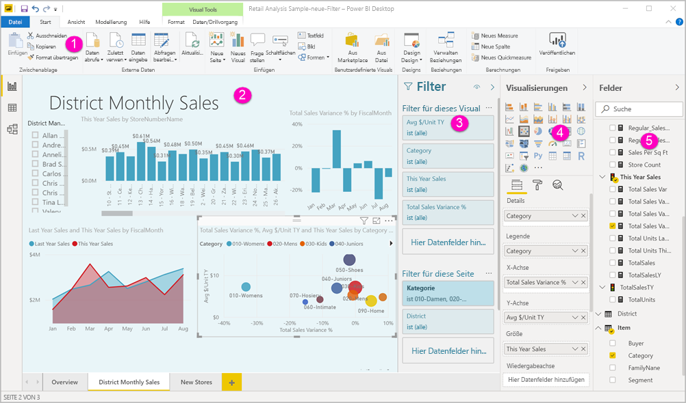
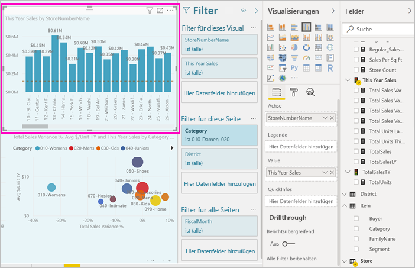
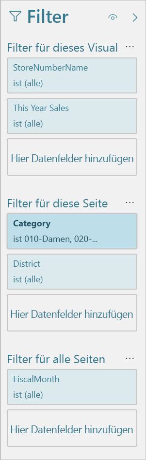
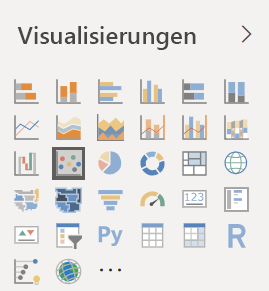
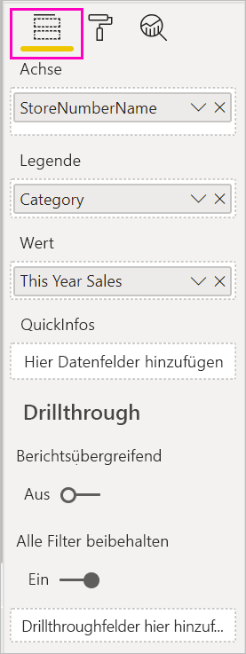
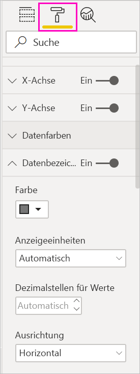
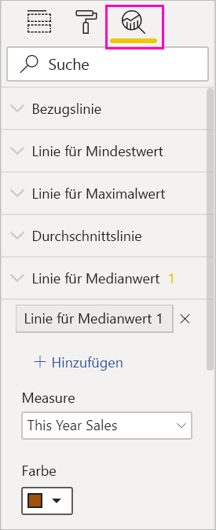
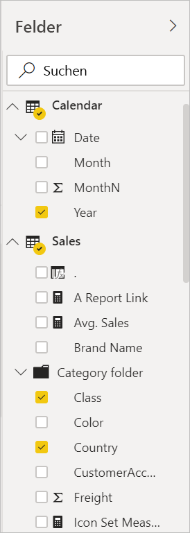

# Einführung in den Berichts-Editor in Power BI

In Power BI Desktop und im Power BI-Dienst entwerfen Sie mit dem *Berichts-Editor* die Berichte, die Ihre Kunden sehen, mit Diagrammen, Tabellen, Karten und anderen visuellen Elementen. Dieser Vorgang ist in den beiden Umgebungen ähnlich. Normalerweise beginnen Sie mit dem Erstellen eines Berichts in Power BI Desktop. Anschließend veröffentlichen Sie ihn im Power BI-Dienst. Dort können Sie ihn weiter bearbeiten. Der Power BI-Dienst ist auch der Ort, wo Sie die Dashboards auf der Grundlage Ihrer Berichte bearbeiten.

Nach dem Erstellen verteilen Sie Ihre Dashboards und Berichte an die Endbenutzer Ihrer Berichte. Abhängig von der Art der Freigabe können Ihre Endbenutzer möglicherweise mit den Berichten in der Leseansicht im Power BI-Dienst interagieren. Sie können sie allerdings nicht bearbeiten. Erfahren Sie mehr darüber, [welche Möglichkeiten Endbenutzer von Berichten im Power BI-Dienst haben](consumer/end-user-reading-view.md). 

Im folgenden Video wird der Berichts-Editor in Power BI Desktop gezeigt. In diesem Artikel wird auch der Berichts-Editor in Power BI Desktop gezeigt. 

<iframe width="560" height="315" src="https://www.youtube.com/embed/IkJda4O7oGs" frameborder="0" allowfullscreen></iframe>

Im Power BI-Dienst ist der Berichts-Editor nur in der Bearbeitungsansicht verfügbar. Wenn Sie einen Bericht in der Bearbeitungsansicht öffnen möchten, müssen Sie Besitzer oder Ersteller des Berichts oder Mitwirkender im Arbeitsbereich sein, in dem der Bericht enthalten ist.

Der Berichts-Editor von Power BI ist in verschiedene Hauptabschnitte unterteilt:  

1. Oberer Navigationsbereich
1. Zeichenbereich für den Bericht
1. Bereich „Filter“
1. Bereich „Visualisierungen“
1. Bereich „Felder“

## 1. Der obere Navigationsbereich
Die im oberen Navigationsbereich verfügbaren Aktionen sind zahlreich, und es werden kontinuierlich neue Aktionen hinzugefügt. Informationen zu einer bestimmten Aktion finden Sie im Inhaltsverzeichnis der Power BI-Dokumentation, oder verwenden Sie das Suchfeld.

## 2. Der Zeichenbereich des Berichts
Im Zeichenbereich des Berichts wird Ihre Arbeit angezeigt. Wenn Sie in den Bereichen „Felder“, „Filter“ und „Visualisierungen“ Visuals erstellen, werden diese im Zeichenbereich des Berichts erstellt und angezeigt. Jede Registerkarte am unteren Rand des Zeichenbereichs entspricht einer Seite im Bericht. Wählen Sie eine Registerkarte aus, um die entsprechende Seite zu öffnen. 

## Die Bereiche des Berichts-Editors

Wenn Sie erstmalig einen Bericht öffnen, sind drei Bereiche sichtbar: Filter, Visualisierungen und Felder. Die ersten beiden Bereiche auf der linken Seite (Filter und Visualisierungen) steuern das Aussehen Ihrer Visualisierungen: Typ, Farben, Filter und Formatierung. Im letzten Bereich auf der rechten Seite (Felder) werden die zugrunde liegenden Daten verwaltet, die in den Visualisierungen verwendet werden. Der im Berichts-Editor angezeigte Inhalt variiert je nach ausgewählten Optionen, die Sie im Berichtszeichenbereich vornehmen. 

Wenn Sie z.B. ein einzelnes visuelles Element wie dieses Säulendiagramm auswählen:

Im **Bereich Filter** werden alle Filter für das visuelle Element, die Seite oder alle Seiten angezeigt. In diesem Fall gibt es Filter auf Seitenebene, aber keine Filter auf der Ebene visueller Elemente.

**Oben im Bereich „Visualisierung“** wird der Typ des verwendeten visuellen Elements angegeben. In diesem Beispiel handelt es sich um ein gruppiertes Säulendiagramm. 

**Unten im Bereich „Visualisierung“** befinden sich drei Registerkarten:

: **Felder** zeigt die Felder im visuellen Element an. Möglicherweise müssen Sie nach unten scrollen, um alle Details anzuzeigen. Im Diagramm werden StoreNumberName und „This Year Sales“ verwendet.

 **Format**: Klicken Sie auf das Farbrollensymbol, um den Formatierungsbereich der ausgewählten Visualisierung anzuzeigen.

 **Analysen**: Wählen Sie das Lupensymbol aus, um den Analysebereich anzuzeigen.

**Im Bereich „Felder“** werden alle verfügbaren Tabellen im Datenmodell aufgelistet. Wenn Sie eine Tabelle erweitern, werden die Felder in dieser Tabelle angezeigt. Am gelben Häkchen können Sie erkennen, dass mindestens ein Feld aus dieser Tabelle in einer Visualisierung verwendet wird.

In den folgenden Abschnitten finden Sie weitere Informationen zu den einzelnen Bereichen.

## 3. Bereich „Filter“
Über den Bereich „Filter“ können Sie persistente Filter für Ihre Berichte auf Seiten-, Berichts-, Drillthrough- und visueller Ebene anzeigen, setzen und ändern. Ja, Sie können eine Ad-hoc-Filterung auf Berichtsseiten und in visuellen Elementen durchführen. Hierzu wählen Sie visuelle Elemente aus oder verwenden Werkzeuge wie „Datenschnitt“. Das Filtern im Bereich „Filter“ hat den Vorteil, dass der Zustand der Filter mit dem Bericht gespeichert wird. 

Der Bereich „Filter“ verfügt über ein weiteres leistungsstarkes Feature: das Filtern mithilfe eines Felds, *das nicht bereits in einem der visuellen Elemente in Ihrem Bericht verwendet wird*. Mit anderen Worten: Wenn Sie eine Visualisierung erstellen, fügt Power BI automatisch alle Felder in der Visualisierung dem Bereich der Filter auf visueller Ebene im Bereich „Filter“ hinzu. Wenn Sie einen Filter für ein visuelles Element, eine Seite, einen Drillthrough oder einen Bericht mithilfe eines Felds festlegen möchten, das derzeit nicht in einer Visualisierung verwendet wird, ziehen Sie ihn einfach auf einen der Filterbuckets.

Die neue Filterbenutzeroberfläche bietet mehr Flexibilität. Beispielsweise können Sie Filter so formatieren, dass sie wie der Bericht selbst aussehen. Ferner können Sie Filter sperren oder sie vor Ihren Endbenutzern verbergen. 

Erfahren Sie mehr über die [neue Filteroberfläche](power-bi-report-filter.md).

## 4. Der Bereich „Visualisierungen“

Der Bereich „Visualisierungen“ enthält vier Abschnitte. Wir beginnen oben im Bereich.

Hier wählen Sie einen Visualisierungstyp aus. Die kleinen Symbole zeigen die verschiedenen Typen von Visualisierungen an, die Sie erstellen können. In der Abbildung oben wurde ein Blasendiagramm ausgewählt. Wenn Sie mit dem Erstellen einer Visualisierung beginnen, indem Sie Felder auswählen, ohne zunächst einen Visualisierungstyp auszuwählen, wählt Power BI den Visualisierungstyp für Sie aus. Sie können die Auswahl von Power BI übernehmen oder den Typ ändern, indem Sie ein anderes Symbol auswählen.

Sie können benutzerdefinierte Visualisierungen in Power BI Desktop herunterladen. Ihre Symbole werden ebenfalls in diesem Bereich angezeigt. 

### Verwalten der Felder in einer Visualisierung

Die in diesem Bereich angezeigten Buckets (auch als *Bereiche* bezeichnet) variieren je nach Typ der ausgewählten Visualisierung.  Wenn Sie z.B. ein Balkendiagramm ausgewählt haben, werden Achse, Legende und Werte angezeigt. Wenn Sie ein Feld auswählen oder in den Zeichenbereich ziehen, fügt Power BI dieses Feld einem der Buckets hinzu.  Sie können die Felder aus der Liste „Felder“ auch direkt in die Buckets ziehen.  Einige Buckets sind auf bestimmte Datentypen beschränkt.  **Werte** akzeptiert beispielsweise keine nicht numerischen Felder. Wenn Sie also das Feld **Kategorie** in den Bucket **Werte** ziehen, ändert Power BI das Feld in **Anzahl von Kategorie**.

Weitere Informationen finden Sie unter [Hinzufügen von Visualisierungen zu einem Power BI-Bericht](visuals/power-bi-report-add-visualizations-i.md).

Dieser Teil des Bereichs bietet auch Optionen zum Steuern von [Drillthrough](desktop-drillthrough.md) und Filterverhalten.

### Formatieren von visuellen Elementen
Wählen Sie das Farbrollen-Symbol aus, um den Formatierungsbereich anzuzeigen. Die verfügbaren Optionen hängen vom ausgewählten Visualisierungstyp ab.

Ihnen stehen umfangreiche Formatierungsmöglichkeiten zur Verfügung.  Wenn Sie mehr Informationen benötigen, untersuchen Sie den Bereich selbst weiter oder lesen Sie die folgenden Artikel:

* [Anpassen von Visualisierungstitel, Hintergrund und Legende](visuals/power-bi-visualization-customize-title-background-and-legend.md)
* [Farbformatierung](visuals/service-getting-started-with-color-formatting-and-axis-properties.md)
* [Anpassen der Eigenschaften der X- und Y-Achse](visuals/power-bi-visualization-customize-x-axis-and-y-axis.md)

### Hinzufügen von Analysen in Visualisierungen
Wählen Sie das Lupensymbol aus, um den Analysebereich anzuzeigen. Die verfügbaren Optionen hängen vom ausgewählten Visualisierungstyp ab.

Mit dem Bereich „Analyse“ im Power BI-Dienst können Sie Visualisierungen dynamische Bezugslinien hinzufügen und wichtige Trends und Erkenntnisse identifizieren. Weitere Informationen finden Sie unter [Analysebereich in Power BI Desktop](desktop-analytics-pane.md).

## 5. Bereich „Felder“
Im Bereich „Felder“ werden die Tabellen, Ordner und Felder angezeigt, die in den Daten vorhanden sind und zum Erstellen von Visualisierungen verwendet werden können.

|  |  |
| --- | --- |
|  |<ul><li>Ziehen Sie ein Feld auf die Seite, um eine neue Visualisierung zu starten.  Sie können auch ein Feld auf eine vorhandene Visualisierung ziehen, um das Feld zu dieser Visualisierung hinzuzufügen.  </li> <li>Wenn Sie das Kontrollkästchen neben einem Feld aktivieren, fügt Power BI dieses Feld zur aktiven (oder neuen) Visualisierung hinzu. Außerdem legt Power BI fest, in welchem Bucket dieses Feld platziert werden soll.  Soll das Feld beispielsweise als Legende, Achse oder Wert verwendet werden? Power BI trifft eine bestmögliche Annahme, und Sie können das Feld ggf. aus diesem Bucket in einen anderen verschieben.   </li><li>In beiden Fällen wird das jeweils ausgewählte Feld im Berichts-Editor zum Bereich „Visualisierungen“ hinzugefügt.</li></ul> |

In Power BI Desktop stehen auch Optionen zum Ein- und Ausblenden von Feldern, Hinzufügen von Berechnungen usw. zur Verfügung.

## Die Feldsymbole

Power BI verwendet eine Reihe unterschiedlicher Symbole, um die Feldtypen in einem Bericht anzugeben. Wenn Sie sie identifizieren können, verstehen Sie besser, wie Sie in unterschiedlichen visuellen Elementen verhalten. Dies sind einige der häufig verwendeten Symbole.

|Symbol  |Bedeutung  |
|---------|---------|
|  | Ordner in der Liste „Felder“ |
| | Numerisches Feld: Numerische Felder sind Aggregate, die z.B. addiert werden können oder für die ein Mittelwert bestimmt werden kann. Aggregate werden mit den Daten importiert und im Datenmodell definiert, auf dem der Bericht basiert. Weitere Informationen finden Sie unter [Aggregate in Power BI-Berichten](service-aggregates.md). |
| | Berechnete Spalte mit einem nicht numerischen Datentyp: Eine neue nicht numerische Spalte, die Sie mit einer DAX-Formel (Data Analysis Expressions) erstellen, die die Werte der Spalte definiert. Weitere Informationen zu [berechneten Spalten](desktop-calculated-columns.md). |
|     |   Numerische berechnete Spalte: Eine neue Spalte, die Sie mit einer DAX-Formel (Data Analysis Expressions) erstellen, die die Werte der Spalte definiert. Weitere Informationen zu [berechneten Spalten](desktop-calculated-columns.md). |
| |  Measure: Ein Measure verfügt über eine eigene hartcodierte Formel. Die Berechnung kann nicht geändert werden, d. h. eine Summe bleibt eine Summe. Die Werte werden nicht in einer Spalte gespeichert. Sie werden spontan berechnet und hängen ausschließlich von ihrer Position in einem visuellen Element ab. Weitere Informationen finden Sie unter [Grundlegendes zu Measures](desktop-measures.md). |
|     | Measuregruppe  |
| |      KPI: Ein visueller Hinweis, mit dem der Fortschritt in Bezug auf ein messbares Ziel kommuniziert wird. Weitere Informationen zu visuellen Elementen vom Typ [Key Performance Indicator (KPI)](visuals/power-bi-visualization-kpi.md). |
|     |  Hierarchie von Feldern: Wählen Sie den Pfeil aus, um die Felder anzuzeigen, die die Hierarchie bilden.  Sehen Sie sich dieses Power BI-Video auf YouTube zum [Erstellen und Arbeiten mit Hierarchien](https://www.youtube.com/watch?v=q8WDUAiTGeU) an, um weitere Informationen zu erhalten. |
|     | Geodaten: Mithilfe dieser Felder für Ortsangaben können Kartenvisualisierungen erstellt werden. |
|      | Identitätsfeld: Felder mit diesem Symbol sind *eindeutige Felder* und wurden so festgelegt, dass alle Werte angezeigt werden, auch wenn sie Duplikate aufweisen. Ihre Daten können z.B. zwei Datensätze für Personen namens „Robin Smith“ enthalten, die jeweils als eindeutig behandelt werden. Sie werden nicht zusammengefasst.   |
|   | Parameter: Legen Sie Parameter fest, um Teile ihrer Berichte und Datenmodelle (z.B. einen Abfragefilter, einen Datenquellenverweis, eine Measuredefinition usw.) von mindestens einem Parameterwert abhängig zu machen. Weitere Informationen finden Sie in diesem Power BI-Blogbeitrag zu [Abfrageparametern](https://powerbi.microsoft.com/blog/deep-dive-into-query-parameters-and-power-bi-templates/). |
|  | Kalenderdatumsfeld mit einer integrierten Datumstabelle |

## Nächste Schritte
[Erstellen eines Berichts](service-report-create-new.md)

Weitere Informationen zu Berichten finden im [Power BI-Dienst](service-report-create-new.md), in [Power BI Desktop](desktop-report-view.md) und in den [Power BI Mobile-Apps](consumer/mobile/mobile-apps-view-phone-report.md).

[Grundlegende Konzepte für Power BI-Designer](service-basic-concepts.md)

Weitere Fragen? [Wenden Sie sich an die Power BI-Community](https://community.powerbi.com/)

