# Tutorial: Erstellen eines Machine Learning-Modells in Power BI

In diesem Tutorialartikel verwenden Sie **Automatisiertes maschinelles Lernen** zum Erstellen und Anwenden eines binären Vorhersagemodells in Power BI. Das Tutorial enthält Anleitungen zum Erstellen eines Power BI-Dataflows und zum Verwenden der im Dataflow definierten Entitäten, um ein Machine Learning-Modell direkt in Power BI zu trainieren und zu überprüfen. Wir verwenden dieses Modell dann zur Bewertung neuer Daten, um Vorhersagen zu generieren.

Zunächst erstellen Sie ein Machine Learning-Modell für die binäre Vorhersage der Kaufabsichten von Onlinekunden auf Basis eines Satzes ihrer Onlinesitzungsattribute. Für diese Übung wird ein Benchmark-Machine Learning-Dataset verwendet. Sobald ein Modell trainiert ist, generiert Power BI automatisch einen Überprüfungsbericht, in dem die Modellergebnisse erläutert werden. Sie können dann den Überprüfungsbericht auswerten und das Modell zur Bewertung auf die Daten anwenden.

Dieses Tutorial umfasst folgende Schritte:
> [!div class="checklist"]

> * Erstellen eines Dataflows mit den Eingabedaten
> * Erstellen und Trainieren eines Machine Learning-Modells
> * Auswerten des Modellüberprüfungsberichts
> * Anwenden des Modells auf eine Dataflowentität
> * Verwenden der bewerteten Ausgabe des Modells in einem Power BI-Bericht

## Erstellen eines Dataflows mit den Eingabedaten

Der erste Teil dieses Tutorials besteht darin, einen Dataflow mit Eingabedaten zu erstellen. Dieser Vorgang erfordert einige Schritte, wie in den folgenden Abschnitten beschrieben, beginnend mit dem Erfassen der Daten.

### Daten abrufen

Der erste Schritt beim Erstellen eines Dataflows besteht darin, dass Sie Ihre Datenquellen bereithalten. In unserem Fall verwenden wir ein Machine Learning-Dataset aus einer Reihe von Onlinesitzungen, wobei es in einigen davon zum Kauf kam. Das Dataset enthält eine Reihe von Attributen zu diesen Sitzungen, die wir zum Trainieren unseres Modells verwenden.

Sie können das Dataset von der UC Irvine-Website herunterladen. Auch dies steht für den Zweck dieses Tutorials über den folgenden Link zur Verfügung: [online_shoppers_intention.csv](https://raw.githubusercontent.com/santoshc1/PowerBI-AI-samples/master/Tutorial_AutomatedML/online_shoppers_intention.csv).

### Erstellen der Entitäten

Melden Sie sich beim Power BI-Dienst an, und navigieren Sie zu einem Arbeitsbereich Ihrer dedizierten Kapazität, in dem KI aktiviert ist, um die Entitäten in Ihrem Dataflow zu erstellen.

Wenn Sie noch keinen Arbeitsbereich haben, können Sie einen erstellen, indem Sie im Power BI-Dienst im Navigationsbereichsmenü **Arbeitsbereiche** und im dann angezeigten Bereich am unteren Rand **Arbeitsbereich erstellen** auswählen. Daraufhin wird rechts ein Bereich zur Eingabe der Details des Arbeitsbereichs geöffnet. Geben Sie einen Namen für den Arbeitsbereich ein, und wählen Sie **Erweitert** aus. Bestätigen Sie mithilfe des Optionsfelds „Dedizierte Kapazität“, dass der Arbeitsbereich dedizierte Kapazität verwendet und einer Instanz mit dedizierter Kapazität zugewiesen ist, für die die KI-Vorschau aktiviert ist. Klicken Sie auf **Speichern**.

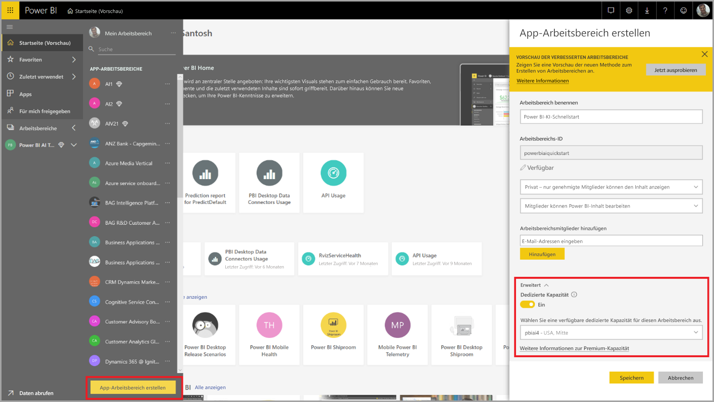

Sobald der Arbeitsbereich erstellt ist, können Sie unten rechts im Begrüßungsbildschirm **Überspringen** auswählen, wie in der folgenden Abbildung gezeigt.

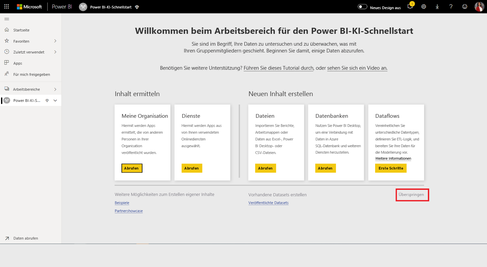

 Wählen Sie die Schaltfläche **Erstellen** oben rechts im Arbeitsbereich und dann die Schaltfläche **Dataflow** aus.

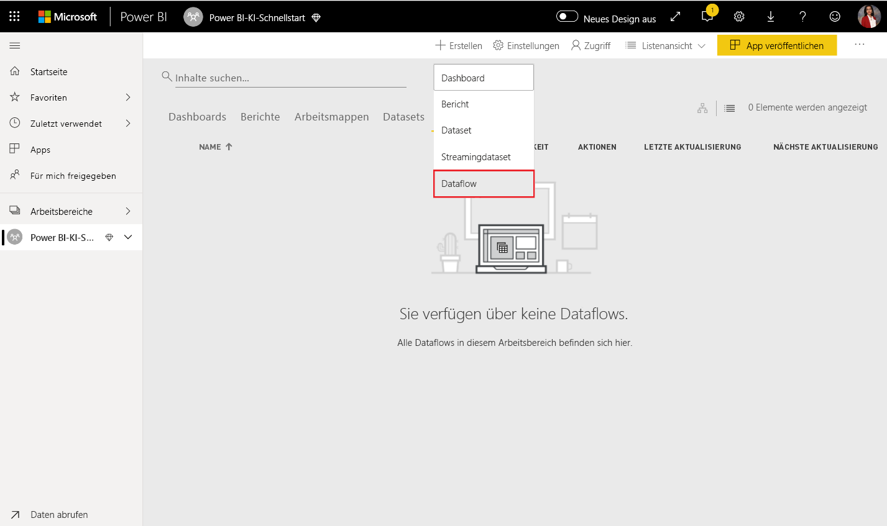

Wählen Sie **Neue Entitäten hinzufügen** aus. Damit wird ein **Power Query**-Editor im Browser gestartet.

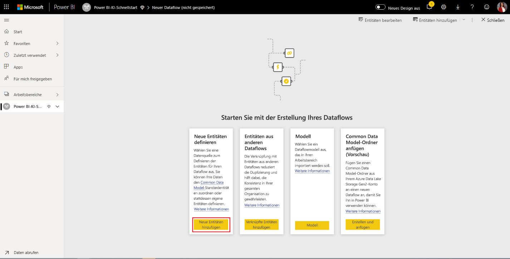

Wählen Sie **Text-/CSV-Datei** als Datenquelle aus, wie in der folgenden Abbildung dargestellt.

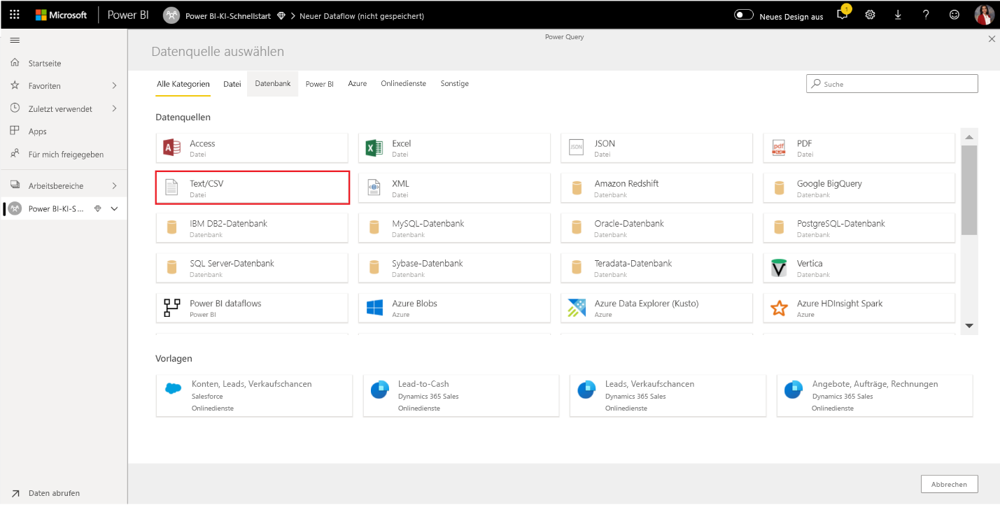

Fügen Sie auf der Seite **Mit einer Datenquelle verbinden**, die als Nächstes angezeigt wird, den folgenden Link zur Datei _online_shoppers_intention.csv_ in das Feld **Dateipfad oder URL** ein, und wählen Sie dann **Weiter** aus.

`https://raw.githubusercontent.com/santoshc1/PowerBI-AI-samples/master/Tutorial_AutomatedML/online_shoppers_intention.csv`

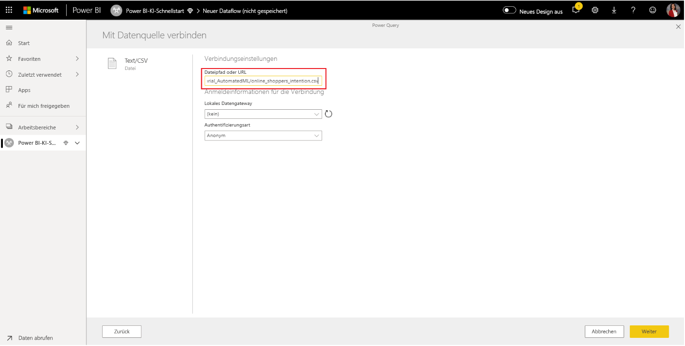

Der Power Query-Editor zeigt eine Vorschau der Daten aus der CSV-Datei an. Sie können die Abfrage in einen benutzerfreundlicheren Namen umbenennen, indem Sie den Wert im Feld „Name“ im rechten Bereich ändern. Beispielsweise könnten Sie den Abfragenamen in _Onlinebesucher_ ändern.

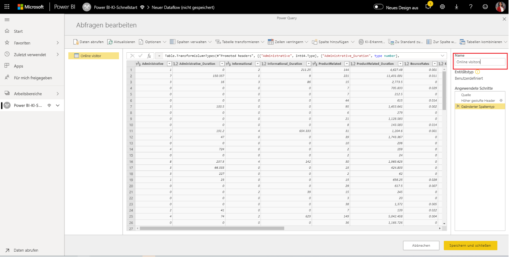

Power Query leitet automatisch den Spaltentyp ab. Sie können den Spaltentyp ändern, indem Sie auf das Symbol „Attributtyp“ am oberen Rand der Spaltenüberschrift klicken. In diesem Beispiel ändern wir den Typ der Spalte „Revenue“ (Umsatz) in „TRUE/FALSE“.

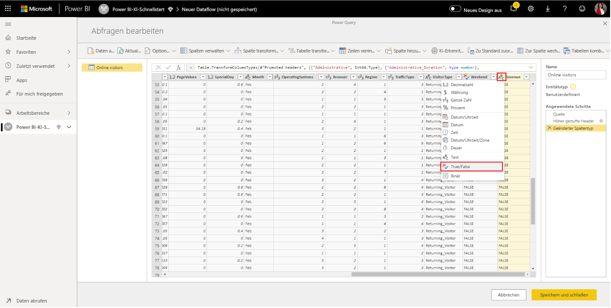

Wählen Sie die Schaltfläche **Speichern und schließen** aus, um den Power Query-Editor zu schließen. Geben Sie einen Namen für den Dataflow an, und wählen Sie dann im Dialogfeld die Option **Speichern** aus, wie in der folgenden Abbildung gezeigt.

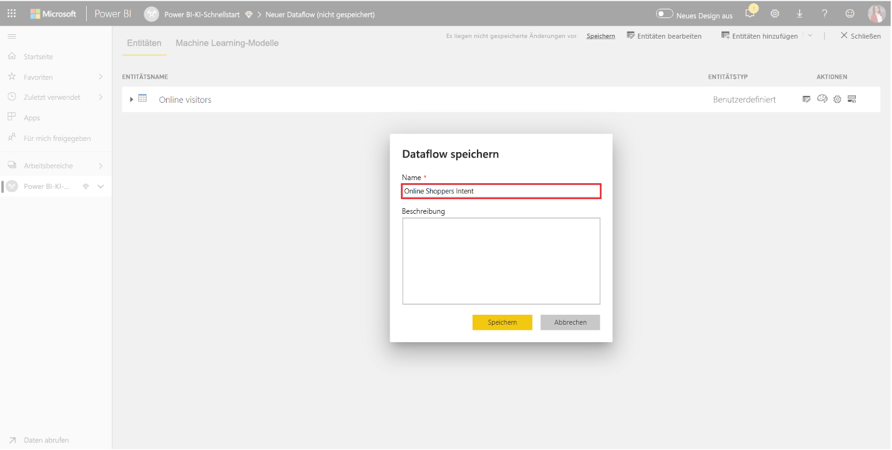

## Erstellen und Trainieren eines Machine Learning-Modells

Wählen Sie zum Hinzufügen eines Machine Learning-Modells die Schaltfläche **ML-Modell anwenden** in der Liste **Aktionen** für die Basisentität aus, die die Trainingsdaten und Bezeichnungsinformationen enthält, und wählen Sie dann **Machine Learning-Modell hinzufügen** aus.

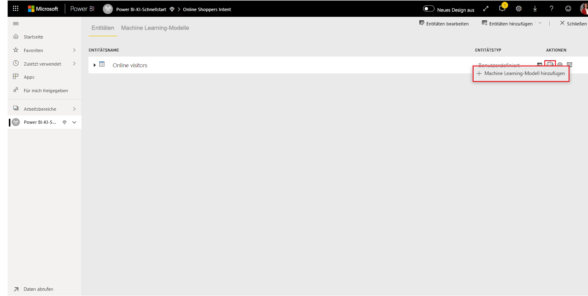

Der erste Schritt beim Erstellen unseres Machine Learning-Modells besteht darin, die Verlaufsdaten zu identifizieren, einschließlich des Ergebnisfelds, das Sie vorhersagen möchten. Das Modell wird erstellt, indem es aus diesen Daten lernt.

Im Fall des Datasets, das wir verwenden, ist dies das Feld **Revenue**. Wählen Sie **Revenue** (Umsatz) als Wert für „Ergebnisfeld“ aus, und wählen Sie dann **Weiter** aus.

Als Nächstes müssen wir den Typ des zu erstellenden Machine Learning-Modells auswählen. Power BI analysiert die Werte im Ergebnisfeld, das Sie identifiziert haben, und schlägt die Machine Learning-Modelltypen vor, die erstellt werden können, um dieses Feld vorherzusagen.

Da wir in diesem Fall ein binäres Ergebnis vorhersagen, nämlich ob ein Benutzer einen Einkauf durchführt oder nicht, wird die binäre Vorhersage empfohlen. Da wir daran interessiert sind, Benutzer vorherzusagen, die einen Kauf tätigen werden, wählen Sie „TRUE“ als Umsatzergebnis aus, an dem Sie am meisten interessiert sind. Zusätzlich können Sie benutzerfreundliche Bezeichnungen für die Ergebnisse angeben, die im automatisch generierten Bericht verwendet werden, der die Ergebnisse der Modellüberprüfung zusammenfasst. Wählen Sie dann „Weiter“ aus.

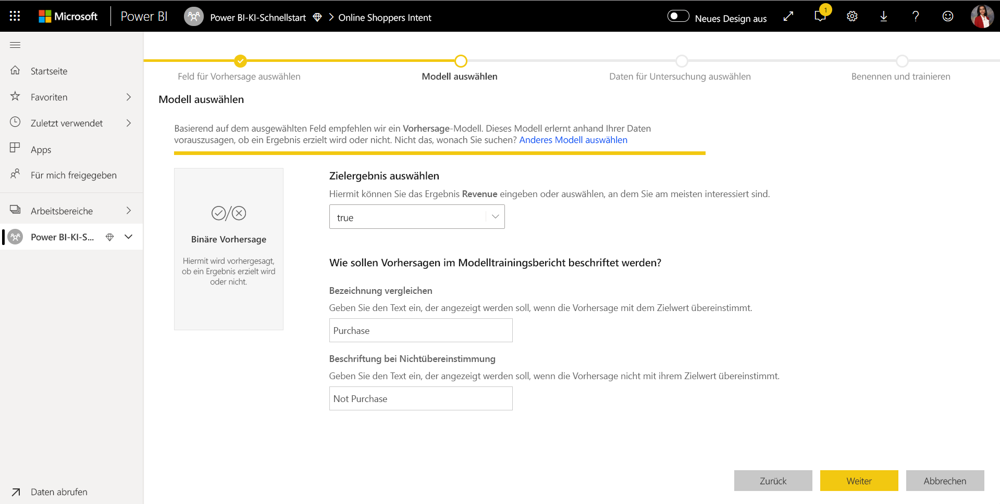

Als Nächstes führt Power BI eine vorläufige Überprüfung einer Stichprobe der Daten durch und schlägt die Eingaben vor, die genauere Vorhersagen liefern können. Wenn Power BI kein Feld empfiehlt, wird daneben eine Erklärung angezeigt. Sie haben die Möglichkeit, die Auswahl so zu ändern, dass nur die Felder einbezogen werden, die vom Modell untersucht werden sollen. Alternativ können Sie auch alle Felder auswählen, indem Sie das Kontrollkästchen neben dem Entitätsnamen aktivieren. Wählen Sie **Weiter** aus, um die Eingaben zu akzeptieren.

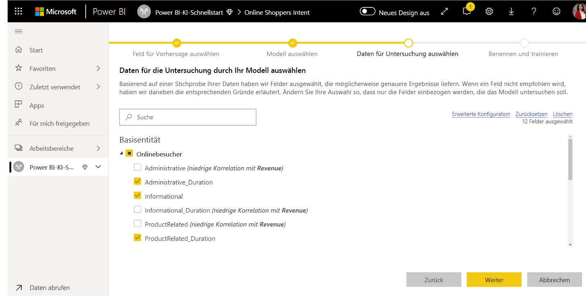

Im letzten Schritt müssen wir unserem Modell einen Namen geben. Nennen Sie das Modell _Vorhersage der Kaufabsicht_. Sie können wählen, ob Sie die Trainingszeit verkürzen möchten, um schnelle Ergebnisse zu erzielen, oder ob Sie die Trainingszeit erhöhen möchten, um das beste Modell zu erhalten. Wählen Sie dann **Speichern und trainieren** aus, um mit dem Training des Modells zu beginnen.

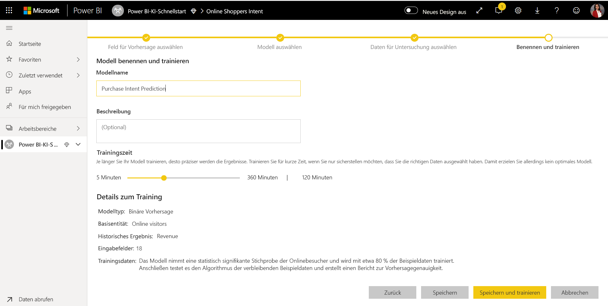

Der Trainingsprozess beginnt mit der Stichprobenentnahme und Normalisierung ihrer Verlaufsdaten sowie dem Aufteilen Ihres Datasets in zwei neue Entitäten _Purchase Intent Prediction Training Data_ (Trainingsdaten für Kaufabsichtsvorhersage) und _Purchase Intent Prediction Testing Data_ (Testdaten für Kaufabsichtsvorhersage).

Abhängig von der Größe des Datasets kann der Trainingsprozess einige Minuten bis zu der im vorherigen Bildschirm ausgewählten Trainingszeit dauern. An diesem Punkt können Sie das Modell auf der Registerkarte **Machine Learning-Modelle** des Dataflows sehen. Der Status „Bereit“ zeigt an, dass das Modell in eine Warteschlange eingereiht wurde oder gerade trainiert wird.

Sie können über den Status des Dataflows feststellen, ob das Modell trainiert und überprüft wird. Dieser wird als laufende Datenaktualisierung auf der Registerkarte **Dataflows** des Arbeitsbereichs angezeigt.

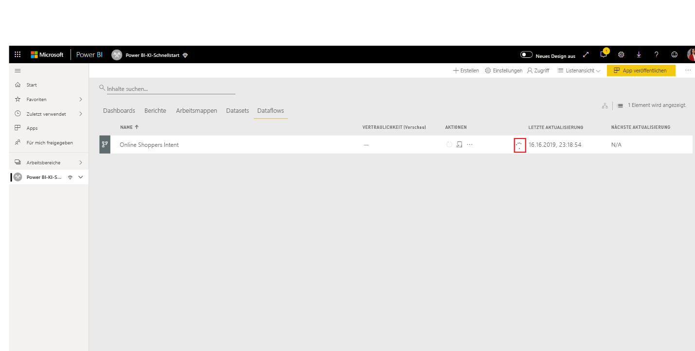

Sobald das Modelltraining abgeschlossen ist, wird für den Dataflow eine aktualisierte Aktualisierungszeit angezeigt. Sie können überprüfen, ob das Modell trainiert ist, indem Sie zur Registerkarte **Machine Learning-Modelle** im Dataflow navigieren. Für das von Ihnen erstellte Modell sollte der Status **Trainiert** angezeigt werden, und die Zeitangabe **Zuletzt trainiert** sollte jetzt aktualisiert sein.

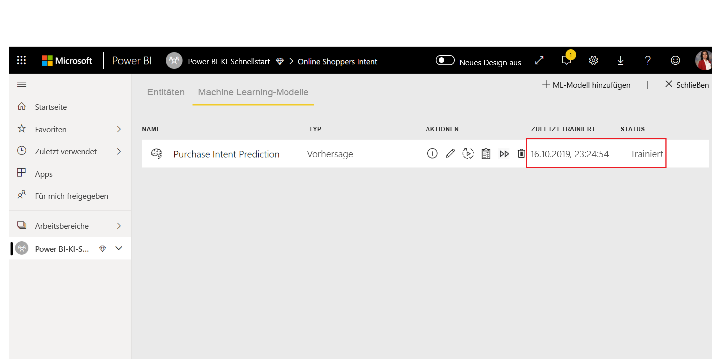

## Auswerten des Modellüberprüfungsberichts
Wählen Sie in der Registerkarte „Machine Learning-Modelle“ die Schaltfläche „Trainingsbericht anzeigen“ in der Spalte „Aktionen“ für das Modell aus, um den Modellüberprüfungsbericht auszuwerten. In diesem Bericht wird beschrieben, wie das Machine Learning-Modell wahrscheinlich durchgeführt wird.

Wählen Sie auf der Seite **Modellleistung** des Berichts **top predictors** (wichtigste Vorhersagen) aus, um die wichtigsten Vorhersagen für das Modell anzuzeigen. Sie können eine der Vorhersagen auswählen, um zu sehen, wie die Ergebnisverteilung mit dieser Vorhersage verknüpft ist.

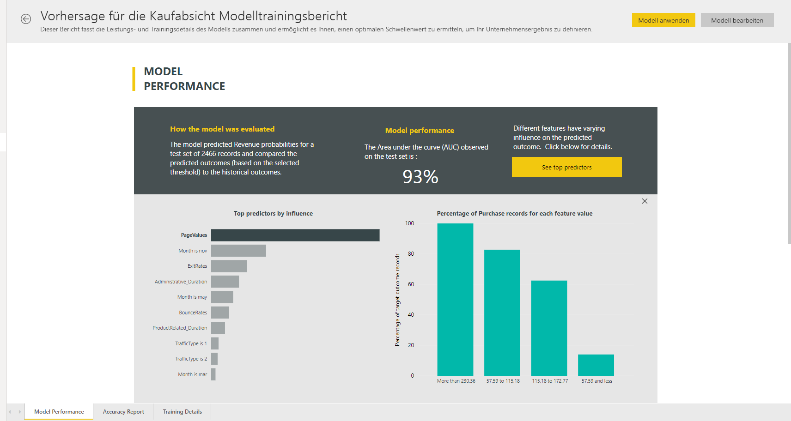

Sie können den **Wahrscheinlichkeitsschwellenwert**-Slicer auf der Seite „Modellleistung“ verwenden, um seine Auswirkung auf die Genauigkeit und den Abruf des Modells zu untersuchen.

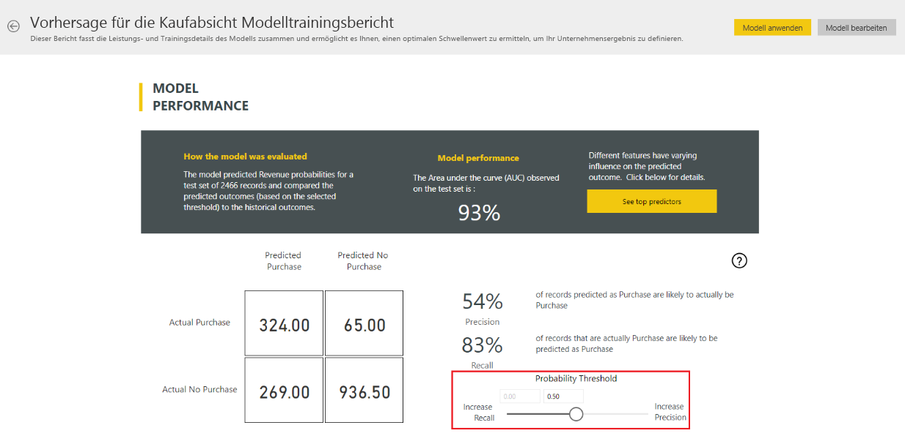

Die anderen Seiten des Berichts beschreiben die statistischen Leistungsmetriken für das Modell.

Der Bericht enthält auch eine Seite mit Trainingsdetails, die die verschiedenen ausgeführten Iterationen beschreibt, wie Features aus den Eingaben extrahiert und welche Hyperparameter für das endgültige Modell verwendet wurden.

## Anwenden des Modells auf eine Dataflowentität

Wählen Sie oben im Bericht die Schaltfläche **Modell anwenden** aus, um dieses Modell aufzurufen. Im Dialogfeld **Anwenden** können Sie die Zielentität angeben, die die Quelldaten enthält, auf die das Modell angewendet werden soll.

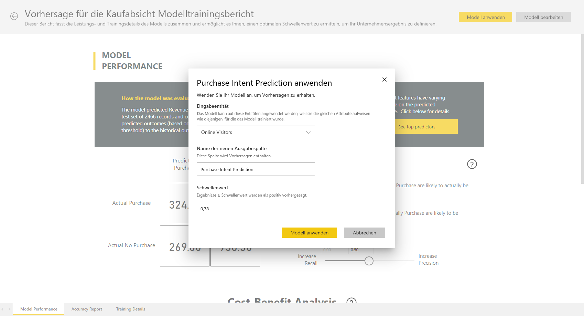

Nach Aufforderung müssen Sie den Dataflow **Aktualisieren**, um eine Vorschau der Ergebnisse Ihres Modells anzuzeigen.

Die Anwendung des Modells erzeugt zwei neue Entitäten mit dem Suffix **erweiterter <Modellname>** und **Erklärungen zu erweitertem <Modellnamen>**. In diesem Fall wird durch das Anwenden des Modells auf die **Onlinebesucher**-Entität **Online Visitors enriched Purchase Intent Prediction** (erweiterte Vorhersage der Kaufabsicht von Onlinebesuchern) erstellt, die die vorhergesagte Ausgabe des Modells einschließt, und **Online Visitors enriched Purchase Intent Prediction explanations** (Erklärungen der erweiterten Vorhersagen der Kaufabsicht von Onlinebesuchern), die die wichtigsten datensatzspezifischen Einflussfaktoren für die Vorhersage enthalten. 

Wenn Sie ein binäres Vorhersagemodell anwenden, werden vier Spalten mit dem vorhergesagten Ergebnis, der Wahrscheinlichkeitsbewertung, den wichtigsten datensatzspezifischen Einflussfaktoren für die Vorhersage und dem Erklärungsindex hinzugefügt, wobei jeweils der angegebene Spaltenname vorangestellt wird.  

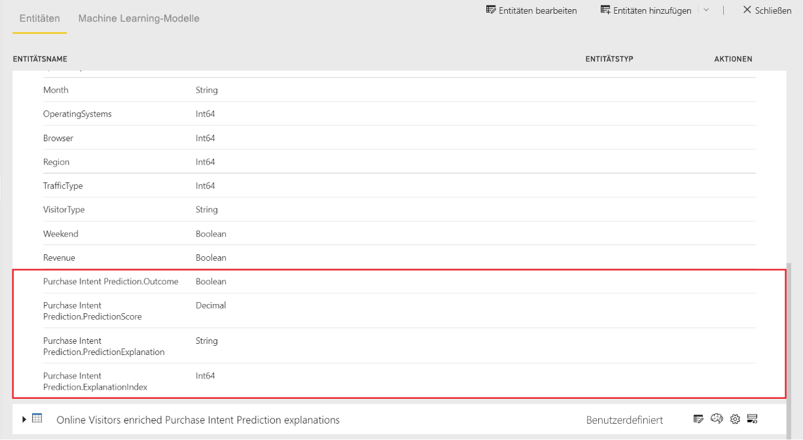

Sobald die Dataflowaktualisierung abgeschlossen ist, können Sie die **Online Visitors enriched Purchase Intent Prediction**-Entität (erweiterte Vorhersage der Kaufabsicht von Onlinebesuchern) auswählen, um die Ergebnisse anzuzeigen.

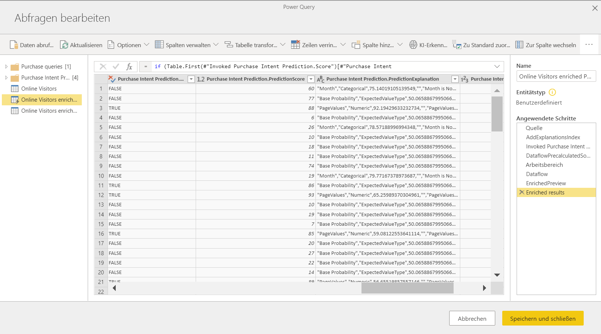

## Verwenden der bewerteten Ausgabe des Modells in einem Power BI-Bericht

Wenn Sie die bewertete Ausgabe Ihres Machine Learning-Modells verwenden möchten, können Sie mit dem Dataflows-Connector eine Verbindung mit Ihrem Dataflow über den Power BI-Desktop herstellen. Mit der **Online Visitors enriched Purchase Intent Prediction**-Entität (erweiterte Vorhersage der Kaufabsicht von Onlinebesuchern) können Sie jetzt die Vorhersagen aus dem Modell in Power BI-Berichte einbinden.

## Nächste Schritte

In diesem Tutorial haben Sie mithilfe der folgenden Schritte ein binäres Vorhersagemodell in Power BI erstellt und angewendet:

* Erstellen eines Dataflows mit den Eingabedaten
* Erstellen und Trainieren eines Machine Learning-Modells
* Auswerten des Modellüberprüfungsberichts
* Anwenden des Modells auf eine Dataflowentität
* Verwenden der bewerteten Ausgabe des Modells in einem Power BI-Bericht

Weitere Informationen zur Machine Learning-Automatisierung in Power BI finden Sie unter [Automatisiertes Machine Learning in Power BI](service-machine-learning-automated.md).
