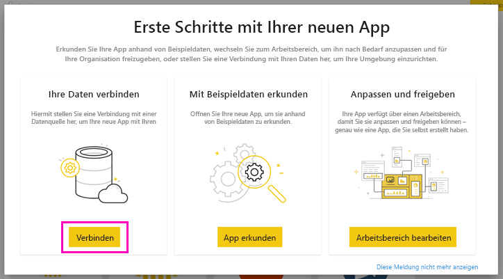
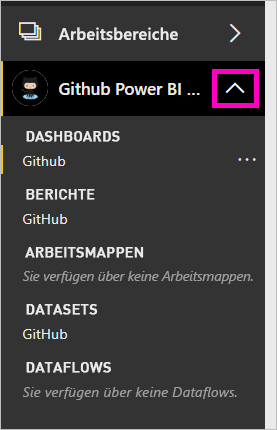

# Tutorial: Herstellen einer Verbindung mit einem GitHub-Repository mit Power BI
In diesem Tutorial stellen Sie mit Power BI eine Verbindung mit realen Daten im GitHub-Dienst her. Anschließend erstellt Power BI automatisch Dashboards und Berichte. Sie stellen eine Verbindung mit dem öffentlichen *Repository* mit Power BI-Inhalten her und erhalten Antworten auf folgende Fragen: die Anzahl der Mitwirkenden an öffentlichen Power BI-Inhalten. Sie erfahren, wer sich am aktivsten beteiligt und am welchen Tag der Woche es die meisten Beiträge gab. Und andere Fragen. 

In diesem Tutorial führen Sie die folgenden Schritte aus:

> [!div class="checklist"]
> * Registrieren für ein GitHub-Konto, falls Sie noch keines haben 
> * Anmelden bei Ihrem Power BI-Konto oder sich dafür registrieren, falls Sie noch keines haben
> * Öffnen des Power BI-Diensts
> * Navigieren zur GitHub-App
> * Eingeben der Informationen für das öffentliche GitHub-Repository von Power BI
> * Anzeigen des Dashboards und Berichts mit GitHub-Daten
> * Bereinigen von Ressourcen durch Löschen der App

Wenn Sie noch nicht bei Power BI registriert sind, müssen Sie sich zuerst für eine [kostenlose Testversion registrieren](https://app.powerbi.com/signupredirect?pbi_source=web).

## Voraussetzungen

Für dieses Tutorial benötigen Sie ein GitHub-Konto, falls Sie noch keines haben. 

- Registrieren Sie sich für ein [GitHub-Konto](https://docs.microsoft.com/contribute/get-started-setup-github).

## Herstellen der Verbindung
1. Melden Sie sich beim Power BI-Dienst (https://app.powerbi.com) ) an. 
2. Wählen Sie im Navigationsbereich **Apps** und dann **Apps abrufen** aus.
   
    

3. Wählen Sie **Apps** aus, geben Sie **GitHub** in das Suchfeld ein, und klicken Sie dann auf **Jetzt anfordern**.
   
    

4. Wählen Sie unter **Diese Power BI-App installieren?** die Option **Installieren** aus.
5. Klicken Sie im Fenster **Ihre neue App steht bereit!** auf **Zu App wechseln**.
6. Klicken Sie im Fenster **Erste Schritte mit Ihrer neuen App** auf **Verbinden**.

    

7. Geben Sie den Namen und Besitzer des Repositorys ein. Die URL für dieses Repository ist https://github.com/MicrosoftDocs/powerbi-docs , sodass **MicrosoftDocs** der **Besitzer des Repositorys** und **Powerbi-Docs** das **Repository** ist. 
   
    

5. Geben Sie die GitHub-Anmeldeinformationen ein, die Sie erstellt haben. Power BI überspringt diesen Schritt möglicherweise, wenn Sie bereits in Ihrem Browser bei GitHub angemeldet sind. 

6. Wählen Sie als **Authentifizierungsmethode** die Option **oAuth2** \> **Anmelden** aus.

7. Befolgen Sie die Anweisungen auf den Bildschirmen der GitHub-Authentifizierung. Erteilen Sie den GitHub-Daten die Berechtigung für Power BI.
   
   Jetzt kann Power BI eine Verbindung mit GitHub und den Daten herstellen.  Die Daten werden einmal täglich aktualisiert.

8. Nachdem Power BI die Daten importiert hat, werden die Inhalte Ihres neuen GitHub-Arbeitsbereichs angezeigt. 
9. Klicken Sie im Navigationsberich auf den Pfeil neben dem Namen des Arbeitsbereichs. Sie sehen, dass der Arbeitsbereich ein Dashboard und einen Bericht enthält. 

    

10. Wählen Sie neben dem Namen des Dashboards **Weitere Optionen** (...) > **Umbenennen** aus, und geben Sie **GitHub-Dashboard** ein.
 
     

8. Klicken Sie auf das Symbol für die globale Navigation, um den Navigationsbereich zu minimieren, damit Sie mehr Platz haben.

    

10. Wählen Sie Ihr GitHub-Dashboard aus.
    
    Das GitHub-Dashboard enthält Livedaten, weshalb die Ihnen angezeigten Werte ggf. anders sind.

    

    

## Frage stellen

1. Platzieren Sie den Cursor in **Stellen Sie eine Frage zu Ihren Daten**. Power BI zeigt **Fragen zum Einstieg** an. 

1. Wählen Sie **how many users are there** (wie viele Benutzer gibt es) aus.
 
    

13. Geben Sie **pull requests per** zwischen **how many** und **users are there** ein. 

     Power BI erstellt ein Balkendiagramm, das die Anzahl der Pull Requests pro Benutzer zeigt.

    

13. Klicken Sie auf das Stecknadelsymbol, um die Ergebnisse an Ihr Dashboard anzuheften, und klicken Sie dann auf **Q&A beenden**.

## Anzeigen des GitHub-Berichts 

1. Wählen Sie im GitHub-Dashboard das Spaltendiagramm **Pull Requests by Month** aus, um den zugehörigen Bericht zu öffnen.

    

2. Wählen Sie einen Benutzernamen im Diagramm **Total pull requests by user** aus. In diesem Beispiel liegt die meiste Nutzungszeit im Februar.

    

3. Wählen Sie die Registerkarte **Punktekarte** aus, um die nächste Seite im Bericht anzuzeigen. 
 
    

    Anscheinend ist dienstags 15:00 Uhr der häufigste Zeitpunkt für *Commits*, wenn Mitarbeiter ihre Arbeit einchecken.

## Bereinigen von Ressourcen

Nachdem Sie das Tutorial abgeschlossen haben, können Sie die GitHub-App löschen. 

1. Wählen Sie im Navigationsbereich **Apps** aus.
2. Zeigen Sie auf die GitHub-Kachel, und klicken Sie auf das Symbol **Löschen**.

    

## Nächste Schritte

In diesem Tutorial haben Sie eine Verbindung mit einem öffentlichen GitHub-Repository hergestellt und Daten abgerufen, die Power BI in einem Dashboard und einem Bericht formatiert hat. Sie haben einige Fragen zu den Daten beantwortet, indem Sie das Dashboard und den Bericht untersucht haben. Jetzt können Sie mehr über das Herstellen einer Verbindung mit anderen Diensten wie Salesforce, Microsoft Dynamics und Google Analytics erfahren. 
 
> [!div class="nextstepaction"]
> [Herstellen einer Verbindung mit von Ihnen verwendeten Onlinediensten](service-connect-to-services.md)

