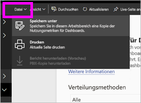
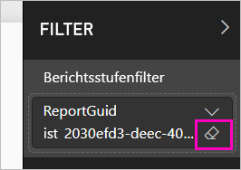

# Überwachen von Nutzungsmetriken für Power BI-Dashboards und Berichte

Wenn Sie Dashboards und Berichte erstellen, können Sie mit Nutzungsmetriken nachvollziehen, wie diese sich auswirken. Wenn Sie entweder das Dashboard zu Nutzungsmetriken oder die Berichte zu Nutzungsmetriken ausführen, können Sie ermitteln, wie die Dashboards und Berichte in der gesamten Organisation verwendet werden. Was wurde von wem und zu welchem Zweck verwendet?  

Berichte zu Nutzungsmetriken sind schreibgeschützt. Allerdings können Sie Berichte zu Nutzungsmetriken kopieren. Beim Kopieren wird ein Power BI-Standardbericht erstellt, den Sie bearbeiten können. Sie können auch eigene Berichte in Power BI Desktop auf der Grundlage des zugrunde liegenden Datasets erstellen, das Nutzungsmetriken für alle Dashboards oder alle Berichte in einem Arbeitsbereich enthält. Zunächst zeigt der kopierte Bericht nur Metriken für das ausgewählte Dashboard oder den ausgewählten Bericht an. Sie können den Standardfilter entfernen und Zugriff auf das zugrunde liegende Dataset mit sämtlichen Nutzungsmetriken für den ausgewählten Arbeitsbereich erhalten. Möglicherweise sehen Sie auch die Namen einzelner Benutzer, wenn Ihr Administrator dies zugelassen hat.

> [!NOTE]
> Nutzungsmetriken verzeichnen die Verwendung von Berichten, die in SharePoint Online eingebettet sind. Nutzungsmetriken verzeichnen jedoch keine mit den Flows „User Owns Credentials“ (Benutzer besitzt Anmeldeinformationen) und „App Owns Credentials“ (App besitzt Anmeldeinformationen) eingebetteten Dashboards und Berichte. Zudem verzeichnen Nutzungsmetriken nicht die Verwendung von Berichten, die über [Im Web veröffentlichen](service-publish-to-web.md) eingebettet wurden.

## Weshalb Nutzungsmetriken wichtig sind

Wenn Sie wissen, wie Ihre Inhalte verwendet werden, können Sie die Relevanz veranschaulichen und Prioritäten setzen. Die Nutzungsmetriken können z.B. zeigen, dass einer Ihrer Berichte täglich durch eine Vielzahl von Mitarbeitern in der Organisation verwendet wird oder dass ein von Ihnen erstelltes Dashboard überhaupt nicht angezeigt wird. Diese Art von Feedback ist für Ihre Arbeit von großem Wert.

Sie können im Power BI-Dienst nur Berichte zu Nutzungsmetriken ausführen. Wenn Sie jedoch einen Bericht zu Nutzungsmetriken speichern oder diesen an ein Dashboard anheften, können Sie diesen Bericht auf mobilen Geräten öffnen und damit interagieren.

## Voraussetzungen

- Sie benötigen eine Power BI Pro-Lizenz, um auf Nutzungsmetrikdaten zuzugreifen. Allerdings erfasst das Feature „Nutzungsmetriken“ Informationen zur Nutzung durch alle Benutzer, unabhängig davon, welche Lizenz ihnen zugewiesen ist.
- Um Zugriff auf die Nutzungsmetriken für ein bestimmtes Dashboard oder einen bestimmten Bericht zu erhalten, benötigen Sie Bearbeitungszugriff auf das entsprechende Dashboard bzw. den entsprechenden Bericht.
- Ihr Power BI-Administrator muss dafür Nutzungsmetriken für Inhaltsersteller aktiviert haben. Möglicherweise hat Ihr Power BI-Administrator darüber hinaus das Erfassen von Daten pro Benutzer in den Nutzungsmetriken aktiviert. Erfahren Sie mehr über das [Aktivieren dieser Optionen im Verwaltungsportal](service-admin-portal.md#control-usage-metrics). 

## Anzeigen eines Berichts zu Nutzungsmetriken

1. Starten Sie im Arbeitsbereich, der das Dashboard oder den Bericht enthält.
2. Klicken Sie entweder in der Inhaltsliste im Arbeitsbereich oder im Dashboard bzw. im Bericht selbst auf das Symbol für **Nutzungsmetriken** .

    

    
3. Wenn Sie erstmals so vorgehen, erstellt Power BI den Bericht zu den Nutzungsmetriken und lässt Sie wissen, wenn er bereit ist.

    
4. Wählen Sie **Nutzungsmetriken anzeigen** aus, um die Ergebnisse anzuzeigen.

    Nutzungsmetriken sind ein leistungsfähiges Werkzeug bei der Bereitstellung und Verwaltung von Dashboards und Berichten von Power BI. Fragen Sie sich, welche Seiten des Berichts besonders hilfreich sind und welche Sie allmählich löschen sollten? Unterteilen Sie die **Berichtsseiten**, um dies herauszufinden. Fragen Sie sich, ob ein mobiles Layout für das Dashboard erstellt werden sollte? Unterteilen Sie die **Plattformen**, um zu ermitteln, wie viele Benutzer auf Ihre Inhalte über die mobilen Apps bzw. wie viele Benutzer auf Ihre Inhalte über den Webbrowser zugreifen.

5. Optional können Sie auf eine Visualisierung zeigen und das Anheftsymbol auswählen, um die Visualisierung einem Dashboard hinzuzufügen. Oder wählen Sie in der oberen Menüleiste **Live-Seite anheften** aus, um einem Dashboard die gesamte Seite hinzuzufügen. Über das Dashboard können Sie die Nutzungsmetriken leichter überwachen oder sie für andere Benutzer freigeben.

    > [!NOTE]
    > Wenn Sie eine Kachel aus einem Nutzungsmetrikbericht an ein Dashboard anheften, können Sie dieses Dashboard nicht zu einer App hinzufügen.

### Bericht „Nutzungsmetriken“ für Dashboards

### Bericht „Nutzungsmetriken“ für Berichte

## Informationen zum Bericht „Nutzungsmetriken“

Wenn Sie auf **Nutzungsmetriken** oder das Symbol  neben einem Dashboard oder Bericht klicken, generiert Power BI einen vorgefertigten Bericht mit Nutzungsmetriken für den jeweiligen Inhalt für die letzten 90 Tage.  Dieser Bericht sieht ganz ähnlich aus wie die Power BI-Berichte, die Sie bereits kennen. Je nachdem, wie Ihre Endbenutzer Zugriff erhalten haben, über das Web, eine mobile App usw., können Sie Datenschnitte anlegen. So wie sich Ihre Dashboards und Berichte entwickeln, wird sich auch der Bericht zu Nutzungsmetriken entwickeln, der jeden Tag mit neuen Daten aktualisiert wird.  

Berichte zu Nutzungsmetriken werden nicht unter **Zuletzt verwendet**, **Arbeitsbereiche**, **Favoriten** oder in anderen Inhaltslisten angezeigt. Sie können nicht zu Apps hinzugefügt werden. Wenn Sie eine Kachel aus einem Nutzungsmetrikbericht an ein Dashboard anheften, können Sie dieses Dashboard nicht zu einer App hinzufügen.

Um tiefer in die Berichtsdaten einzusteigen oder auf der Grundlage des zugrunde liegenden Datasets eigene Berichte zu erstellen, bieten sich Ihnen zwei Optionen: 

- Erstellen einer Kopie des Berichts im Power BI-Dienst. Details finden Sie weiter unten in diesem Artikel unter [Speichern einer Kopie des Nutzungsmetrikberichts](#save-a-copy-of-the-usage-metrics-report).
- Herstellen einer Verbindung mit dem Dataset aus Power BI Desktop. Für jeden Arbeitsbereich ist als Namen des Datasets „Report Usage Metrics Model“ (Modell für Bericht zu Nutzungsmetriken) festgelegt. Details finden Sie unter [Herstellen einer Verbindung mit einem veröffentlichten Dataset](desktop-report-lifecycle-datasets.md#establish-a-power-bi-service-live-connection-to-the-published-dataset).

    

## Welche Metriken werden gemeldet?

| Metrik | Dashboard | Report | Beschreibung |
| --- | --- | --- | --- |
| Datenschnitt „Verteilungsmethode“ |Ja |Ja |Wie Benutzer Zugriff auf den Inhalt erhalten haben. Es gibt drei Zugriffsmethoden: 1. Können Benutzer auf das Dashboard oder den Bericht als Mitglied eines [App-Arbeitsbereichs](consumer/end-user-experience.md) zugreifen, 2. kann der Inhalt für sie [freigegeben](service-share-dashboards.md) werden, oder es kann 3. ein Inhaltspakets bzw. eine App installiert werden.  Beachten Sie, dass Aufrufe über eine App als „Inhaltspaket“ gelten. |
| Datenschnitt „Plattformen“ |Ja |Ja |Wurde auf das Dashboard oder den Bericht über den Power BI-Dienst (powerbi.com) oder ein mobiles Gerät zugegriffen? Unter „Mobil“ fallen alle unsere iOS-, Android- und Windows-Apps. |
| Datenschnitt „Berichtsseite“ |Nein |Ja |Wenn der Bericht mehr als eine Seite hat, segmentieren Sie den Bericht anhand der Seiten, die aufgerufen wurden. Wenn Sie eine Listenoption für „Blank“ sehen, bedeutet dies, dass vor Kurzem eine Berichtsseite hinzugefügt wurde (innerhalb von 24 Stunden wird der tatsächliche Name der neuen Seite in der Datenschnittliste angezeigt) bzw. dass Berichtsseiten gelöscht wurden. „Blank“ erfasst derartige Situationen. |
| Aufrufe pro Tag |Ja |Ja |Gesamtanzahl der Aufrufe pro Tag. Ein „Aufruf“ wird als Benutzervorgang zum Laden einer Berichtsseite oder eines Dashboards definiert. |
| Eindeutige Aufrufer pro Tag |Ja |Ja |Anzahl der *unterschiedlichen* Benutzer, die das Dashboard oder den Bericht (basierend auf dem AAD-Benutzerkonto) aufgerufen haben. |
| Aufrufe pro Benutzer |Ja |Ja |Anzahl der Aufrufe in den letzten 90 Tagen, aufgeschlüsselt nach einzelnen Benutzern. |
| Freigaben pro Tag |Ja |Nein |Häufigkeit, mit der das Dashboard für einen anderen Benutzer oder eine andere Gruppe freigegeben wurde. |
| Gesamtanzahl der Aufrufe |Ja |Ja |Anzahl von Aufrufe in den letzten 90 Tagen. |
| Gesamtanzahl der Aufrufer |Ja |Ja |Anzahl der eindeutigen Aufrufer in den letzten 90 Tagen. |
| Gesamtanzahl der Freigaben |Ja |Nein |Häufigkeit, mit der das Dashboard oder der Bericht in den letzten 90 Tagen freigegeben wurde. |
| Gesamtanzahl in der Organisation |Ja |Ja |Anzahl aller Dashboards oder Berichte in der gesamten Organisation, die mindestens einmal während der letzten 90 Tage aufgerufen wurden.  Wird zum Berechnen des Rangs verwendet. |
| Rang: Gesamtanzahl der Aufrufe |Ja |Ja |Der Rang dieses Dashboards oder Berichts in der Gesamtanzahl der Aufrufe aller Dashboards oder Berichte in der Organisation in den letzten 90 Tagen. |
| Rang: Gesamtanzahl der Freigaben |Ja |Nein |Der Rang dieses Dashboards oder Berichts in der Gesamtanzahl der Freigaben aller Dashboards in der Organisation in den letzten 90 Tagen. |

## Speichern einer Kopie des Nutzungsmetrikberichts

Verwenden Sie **Speichern unter**, um den Nutzungsmetrikbericht in einen gewöhnlichen Power BI-Bericht umzuwandeln, den Sie nach Ihren spezifischen Bedürfnissen anpassen können. Sie können Power BI Desktop ebenfalls zum Erstellen von benutzerdefinierten Nutzungsmetrikberichten auf dem zugrunde liegenden Dataset verwenden. Details finden Sie unter [Herstellen einer Verbindung mit einem veröffentlichten Dataset](desktop-report-lifecycle-datasets.md#establish-a-power-bi-service-live-connection-to-the-published-dataset).

Das zugrunde liegende Dataset enthält sogar die Nutzungsdetails für alle Dashboards oder Berichte im Arbeitsbereich. Dadurch öffnen sich weitere Möglichkeiten. Sie könnten z.B. einen Bericht erstellen, der alle Dashboards in Ihrem Arbeitsbereich basierend auf der Nutzung vergleicht. Oder Sie erstellen ein Dashboard „Nutzungsmetriken“ für Ihre Power BI-App, indem Sie Nutzungsdaten für alle Inhalte, die innerhalb dieser App verteilt sind, aggregieren.  Wie Sie den Filter entfernen und [sich alle Nutzungsmetriken für den Arbeitsbereich anzeigen lassen](#see-all-workspace-usage-metrics), erfahren Sie weiter unten in diesem Artikel.

### Erstellen einer Kopie des Nutzungsberichts

Wenn Sie eine Kopie des schreibgeschützten, vordefinierten Nutzungsberichts erstellen, erstellt Power BI eine bearbeitbare Kopie des Berichts. Auf den ersten Blick sieht sie genau gleich aus. Allerdings können Sie den Bericht jetzt in der Bearbeitungsansicht öffnen, neue Visualisierungen, Seiten und Filter hinzufügen, vorhandene Visualisierungen ändern oder löschen usw. Power BI speichert den neuen Bericht im aktuellen Arbeitsbereich.

1. Klicken Sie im vorgefertigten Bericht „Nutzungsmetriken“ auf **Datei > Speichern unter**. Power BI erstellt einen bearbeitbaren Power BI-Bericht, der im aktuellen Arbeitsbereich gespeichert wird.

    
2. Öffnen Sie den Bericht in der Bearbeitungsansicht, und [interagieren Sie mit ihm wie mit anderen Power BI-Berichten](service-interact-with-a-report-in-editing-view.md). Fügen Sie z.B. neue Seiten hinzu, erstellen Sie neue Visualisierungen, fügen Sie Filter hinzu, formatieren Sie die Schriftarten und Farben usw.

    
3. Der neue Bericht wird auf der Registerkarte **Berichte** im aktuellen Arbeitsbereich gespeichert und auch der Inhaltsliste **Zuletzt verwendet** hinzugefügt.

    

## Anzeigen *aller* Nutzungsmetriken im Arbeitsbereich

Um die Metriken für alle Dashboards oder für alle Berichte im Arbeitsbereich angezeigt zu bekommen, müssen Sie einen Filter entfernen. Der Bericht wird standardmäßig gefiltert, um nur Metriken für das Dashboard oder den Bericht anzuzeigen, das bzw. den Sie für die Erstellung verwendet haben.

1. Wählen Sie **Bericht bearbeiten** aus, um den neuen bearbeitbaren Bericht in der Bearbeitungsansicht zu öffnen.

    
2. Suchen Sie im Bereich „Filter“ den Bucket **Berichtsstufenfilter**, und entfernen Sie den Filter, indem Sie auf den Radierer neben **Berichts-GUID** klicken.

    

    Jetzt zeigt Ihr Bericht Metriken für den gesamten Arbeitsbereich an.

## Power BI-Administratorsteuerelemente für Nutzungsmetriken

Berichte zu Nutzungsmetriken sind ein Feature, das Power BI- oder Office 365-Administratoren aktivieren oder deaktivieren können. Administratoren können präzise steuern, welche Benutzer Zugang zu Nutzungsmetriken haben. In der Standardeinstellung sind diese für alle Benutzer in der Organisation auf **EIN** festgelegt.

> [!NOTE]
> Nur Administratoren für den Power BI-Mandanten können die Einstellungen des Verwaltungsportals und die Bearbeitungseinstellungen sehen. 

Die benutzerspezifischen Daten sind standardmäßig für die Nutzungsmetriken aktiviert, und die Kontoinformationen des Inhaltsnutzers sind im Bericht zu den Nutzungsmetriken enthalten. Wenn die Administratoren diese Informationen für einige oder alle Benutzer nicht offenlegen möchten, können sie das Feature für angegebene Sicherheitsgruppen oder eine gesamte Organisation deaktivieren. Die Kontoinformationen werden im Bericht dann als *Unnamed* (Unbenannt) angezeigt.

Beim Deaktivieren von Nutzungsmetriken für die gesamte Organisation können Administratoren mit der Option **Alle vorhandenen Inhalte von Nutzungsmetriken löschen** alle vorhandenen Berichte und Dashboardkacheln löschen, die mit den Berichten der Nutzungsmetriken erstellt wurden. Durch diese Option wird jeglicher Zugriff auf Nutzungsmetriken für alle Benutzer der Organisation entfernt, die diese möglicherweise bereits nutzen. Das Löschen vorhandener Inhalte von Nutzungsmetriken kann nicht rückgängig gemacht werden.

Details zu diesen Einstellungen finden Sie unter [Steuern von Nutzungsmetriken](service-admin-portal.md#control-usage-metrics) im Artikel zum Verwaltungsportal. 

## Verwenden von Metriken in nationalen Clouds

Power BI ist in separaten nationalen Clouds verfügbar. Diese Clouds entsprechen hinsichtlich Sicherheit, Datenschutz, Konformität und Transparenz dem Niveau der weltweiten Power BI-Version und verwenden darüber hinaus ein einmaliges Modell für regionale Regelungen zu Servicebereitstellung, Speicherort der Daten, Zugriff und Kontrolle. Aufgrund dieses einzigartigen Modells für regionale Regelungen sind Nutzungsmetriken nicht in nationalen Clouds verfügbar. Weitere Informationen finden Sie in den [Informationen zu den nationalen Clouds](https://powerbi.microsoft.com/clouds/).

## Überlegungen und Einschränkungen

Es ist wichtig zu verstehen, dass beim Vergleich von Nutzungsmetriken und Überwachungsprotokollen Unterschiede auftreten können, und man sollte die Ursachen hierfür kennen. *Überwachungsprotokolle* werden mithilfe von Daten aus dem Power BI-Dienst gesammelt, und *Nutzungsmetriken* werden auf dem Client erfasst. Die aggregierten Zahlen der Aktivitäten in Überwachungsprotokollen stimmen möglicherweise nicht immer mit den Nutzungsmetriken überein. Dies hat folgende Gründe:

* Die Zahlen in Nutzungsmetriken können aufgrund von inkonsistenten Netzwerkverbindungen, Anzeigenblockern oder anderen Problemen, die das Senden von Ereignissen vom Client stören können, zu niedrig sein.
* Bestimmte Ansichtstypen sind in den Nutzungsmetriken nicht enthalten, wie zuvor in diesem Artikel beschrieben.
* In den Nutzungsmetriken kann es vorkommen, dass zu viele Aktivitäten gezählt werden, z.B. wenn der Client eine Aktualisierung durchführt, ohne dass eine Anforderung an den Power BI-Dienst zurückgesendet werden muss.

## Häufig gestellte Fragen

Neben dem Verständnis der möglichen Unterschiede zwischen Nutzungsmetriken und Überwachungsprotokollen können die folgenden Fragen und Antworten zu Nutzungsmetriken für Benutzer und Administratoren hilfreich sein:

**F:**    Warum kann ich keine Nutzungsmetriken auf einem Dashboard oder Bericht ausführen?

**A:**    Sie können nur Nutzungsmetriken für Inhalte sehen, die Sie besitzen oder für die Sie über eine Berechtigung zum Bearbeiten verfügen.

**F:**    Verzeichnen Nutzungsmetriken Ansichten aus eingebetteten Dashboards und Berichten?

**A:**    Mit Nutzungsmetriken kann derzeit nicht erfasst werden, wie eingebettete Dashboards und Berichte sowie der Flow [Im Web veröffentlichen](service-publish-to-web.md) genutzt werden. In diesen Fällen wird empfohlen, zum Nachverfolgen der Nutzung für die Host-App oder das Hostportal Webanalyseplattformen zu verwenden.

**F:**    Ich kann für keine Inhalte Nutzungsmetriken erfassen.

**A1:**    Administratoren können diese Funktion für ihre Organisation deaktivieren.  Wenden Sie sich an Ihren Administrator, um festzustellen, ob dies der Fall ist.

**A2:**    Nutzungsmetriken sind eine Funktion von Power BI Pro.

**F:**    Die Daten scheinen nicht aktuell zu sein. Beispielsweise werden Verteilungsmethoden nicht angezeigt, Berichtsseiten fehlen usw.

**A:**    Die Aktualisierung der Daten kann bis zu 24 Stunden dauern.

**F:**    Es gibt vier Berichte im Arbeitsbereich. Warum zeigt der Bericht zu den Nutzungsmetriken nur drei davon an?

**A:**    Der Bericht zu den Nutzungsmetriken enthält nur die Berichte (oder Dashboards), auf die in den vergangenen 90 Tagen zugegriffen wurde.  Wenn Ihnen ein Bericht (oder ein Dashboard) nicht angezeigt wird, wurde es wahrscheinlich seit mehr als 90 Tagen nicht verwendet.

## Nächste Schritte

[Verwalten von Power BI im Verwaltungsportal](service-admin-portal.md)

Weitere Fragen? [Wenden Sie sich an die Power BI-Community](http://community.powerbi.com/)
