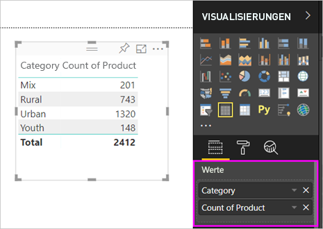
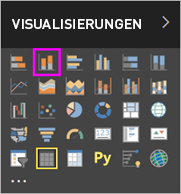

# Teil 1 – Hinzufügen von Visualisierungen zu einem Power BI-Bericht

Dieser Artikel enthält eine kurze Einführung in das Erstellen einer Visualisierung in einem Bericht. Er gilt sowohl für den Power BI-Dienst als auch für Power BI Desktop. Komplexere Inhalte [finden Sie in Teil 2](power-bi-report-add-visualizations-ii.md) dieser Serie. Sehen Sie, wie Amanda verschiedene Methoden zum Erstellen, Bearbeiten und Formatieren von Visuals im Berichtszeichenbereich demonstriert. Versuchen Sie es dann selbst, indem Sie das [Beispiel für Vertrieb und Marketing](../sample-datasets.md) verwenden, um einen eigenen Bericht zu erstellen.

<iframe width="560" height="315" src="https://www.youtube.com/embed/IkJda4O7oGs" frameborder="0" allowfullscreen></iframe>

## Öffnen eines Berichts und Hinzufügen einer neuen Seite

1. Öffnen Sie einen Bericht in der [Bearbeitungsansicht](../service-interact-with-a-report-in-editing-view.md).

    In diesem Lernprogramm wird das [Beispiel für Vertrieb und Marketing](../sample-datasets.md) genutzt.

1. Wenn der **Felderbereich** nicht sichtbar ist, wählen Sie das Pfeilsymbol aus, um ihn zu öffnen.

   

1. Fügen Sie dem Bericht eine leere Seite hinzu.

## Hinzufügen von Visualisierungen zum Bericht

1. Erstellen Sie eine Visualisierung durch Auswahl eines Felds aus dem Bereich **Felder** .

    Beginnen Sie mit einem numerischen Feld wie **SalesFact** > **Sales $** . Power BI erstellt ein Säulendiagramm mit einer einzelnen Spalte.

    

    Beginnen Sie alternativ mit einem Kategoriefeld, z.B. **Name** oder **Produkt**. Power BI erstellt eine Tabelle und fügt das Feld dem Bereich **Werte** hinzu.

    

    Beginnen Sie alternativ mit einem geografischen Feld wie **Geo** > **City** (Stadt). Power BI und Bing Maps erstellen eine Kartenvisualisierung.

    

1. Erstellen Sie eine Visualisierung, und ändern Sie deren Typ. Wählen Sie **Product** (Produkt) > **Category** (Kategorie) und dann **Product** > **Count of Product** (Produktanzahl) aus, um beide dem Bereich **Values** (Werte) hinzuzufügen.

   

1. Ändern Sie die Visualisierung in einem Säulendiagramm, indem Sie das Symbol **Gestapeltes Säulendiagramm** auswählen.

   

1. Wenn Sie Visualisierungen in Ihrem Bericht erstellen, können Sie sie [an Ihr Dashboard anheften](../service-dashboard-pin-tile-from-report.md). Um die Visualisierung anzuheften, wählen Sie das Anheftsymbol  aus.

   
  
## Nächste Schritte

 Fahren Sie fort mit:

* [Teil 2: Hinzufügen von Visualisierungen zu einem Power BI-Bericht](power-bi-report-add-visualizations-ii.md)

* [Mit den Visualisierungen](../consumer/end-user-reading-view.md) im Bericht interagieren

* [Weiter Aktionen mit Visualisierungen ausführen](power-bi-report-visualizations.md)

* [Den Bericht speichern](../service-report-save.md)
