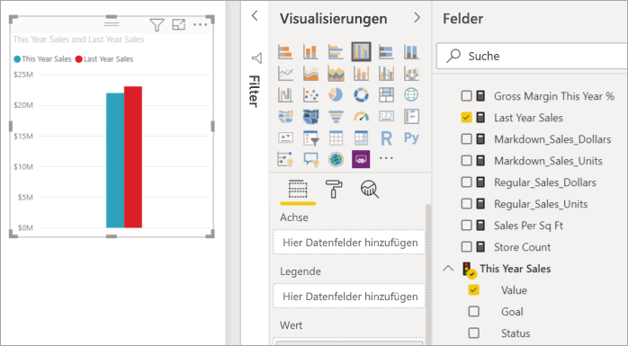
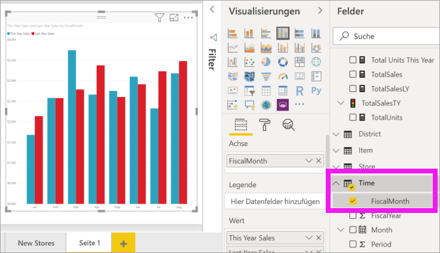
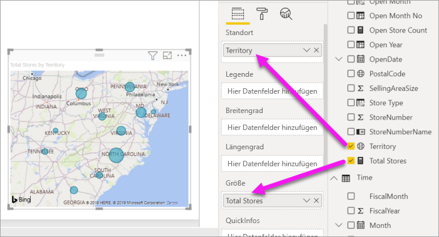
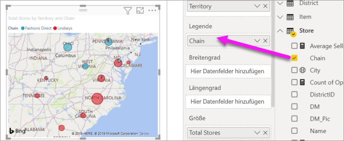

# Teil 2 – Hinzufügen von Visualisierungen zu einem Power BI-Bericht

[!INCLUDE [power-bi-visuals-desktop-banner](../includes/power-bi-visuals-desktop-banner.md)]

In [Teil 1](power-bi-report-add-visualizations-i.md) haben Sie eine einfache Visualisierung erstellt, indem Sie Kontrollkästchen neben Feldnamen aktiviert haben.  In Teil 2 lernen Sie, wie Sie Drag & Drop verwenden und die Funktionen der Bereiche **Felder** und **Visualisierungen** nutzen, um Visualisierungen zu erstellen und zu ändern.

## Erstellen einer neuen Visualisierung
In diesem Tutorial verwenden wir unser Dataset mit Einzelhandelsdaten und erstellen einige wichtige Visualisierungen.

## Voraussetzungen

In diesem Tutorial wird die [PBIX-Datei mit einem Analysebeispiel für den Einzelhandel](https://download.microsoft.com/download/9/6/D/96DDC2FF-2568-491D-AAFA-AFDD6F763AE3/Retail%20Analysis%20Sample%20PBIX.pbix) verwendet.

1. Wählen Sie im oberen linken Bereich der Power BI Desktop-Menüleiste **Datei** > **Öffnen** aus.
   
2. Suchen Sie Ihre Kopie der **PBIX-Datei mit einem Analysebeispiel für den Einzelhandel**.

1. Öffnen Sie die **PBIX-Datei mit einem Analysebeispiel für den Einzelhandel** in der Berichtsansicht .

1. Auswählen  um eine neue Seite hinzuzufügen.

## Hinzufügen von Visualisierungen zum Bericht

Erstellen Sie eine Visualisierung durch Auswahl eines Felds aus dem Bereich **Felder** . Dieser erstellte Visualisierungstyp hängt vom Typ des ausgewählten Feldes ab. In Power BI wird der Datentyp verwendet, um zu bestimmen, welche Visualisierung zum Anzeigen der Ergebnisse verwendet werden soll. Sie können die verwendete Visualisierung ändern, indem Sie im Bereich „Visualisierungen“ ein anderes Symbol auswählen. Beachten Sie, dass nicht alle Visualisierungen Ihre Daten anzeigen können. Beispielsweise werden geografische Daten mit einem Trichterdiagramm oder Liniendiagramm nicht gut angezeigt. 

### Hinzufügen eines Flächendiagramms, mit dem der Umsatz dieses Jahres mit dem Umsatz des Vorjahrs verglichen wird

1. Wählen Sie in der Tabelle **Verkäufe** zunächst **Verkäufe in diesem Jahr** > **Wert** und dann **Verkäufe im letzten Jahr** aus. Power BI erstellt ein Säulendiagramm.  Dieses Diagramm sieht interessant aus, und Sie möchten noch mehr erfahren. Wie hoch sind die Verkäufe pro Monat?  
   
   

2. Ziehen Sie aus der Zeittabelle **FiscalMonth** in den Bereich **Achse**.  
   

3. [Ändern Sie die Visualisierung](power-bi-report-change-visualization-type.md) in ein Flächendiagramm.  Es gibt viele Arten von Visualisierung, aus denen Sie wählen können. In den dazugehörigen [Beschreibungen, Tipps für bewährte Methoden und Tutorials](power-bi-visualization-types-for-reports-and-q-and-a.md) finden Sie Hilfe zum Auswählen des geeigneten Typs. Wählen Sie im Bereich „Visualisierungen“ das Flächendiagrammsymbol  aus.

4. Sortieren Sie die Visualisierungen, indem Sie **Weitere Optionen** (...) und dann **Sortieren nach** >   **FiscalMonth** auswählen.

5. [Ändern Sie die Größe der Visualisierung](power-bi-visualization-move-and-resize.md), indem Sie die Visualisierung auswählen und einen der Konturkreise per Ziehbewegung verschieben. Machen Sie die Visualisierung so breit, dass die Scrollleiste ausgeblendet wird, und klein genug, damit noch Platz für eine weitere Visualisierung ist.
   
   
6. [Speichern Sie den Bericht](../service-report-save.md).

### Hinzufügen einer Kartenvisualisierung für Verkäufe nach Standort

1. Wählen Sie in der Tabelle **Geschäft** **Gebiet** aus. Ziehen Sie **Läden gesamt** in den Bereich „Werte“. Power BI erkennt, dass „Gebiet“ ein Ort ist, und erstellt eine Kartenvisualisierung.  
   

2. Fügen Sie eine Legende hinzu.  Ziehen Sie **Store** > **Kette** in den Bereich „Legende“, um die Daten nach dem Namen des Geschäfts anzuzeigen.  
   

## Nächste Schritte
* Weitere Informationen zu [Visualisierungen in Power BI-Berichten](power-bi-report-visualizations.md).  
* Weitere Fragen? [Wenden Sie sich an die Power BI-Community](https://community.powerbi.com/)

