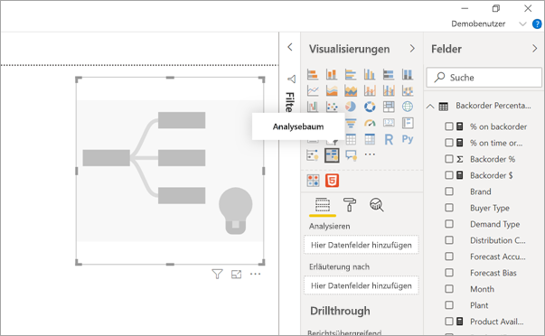
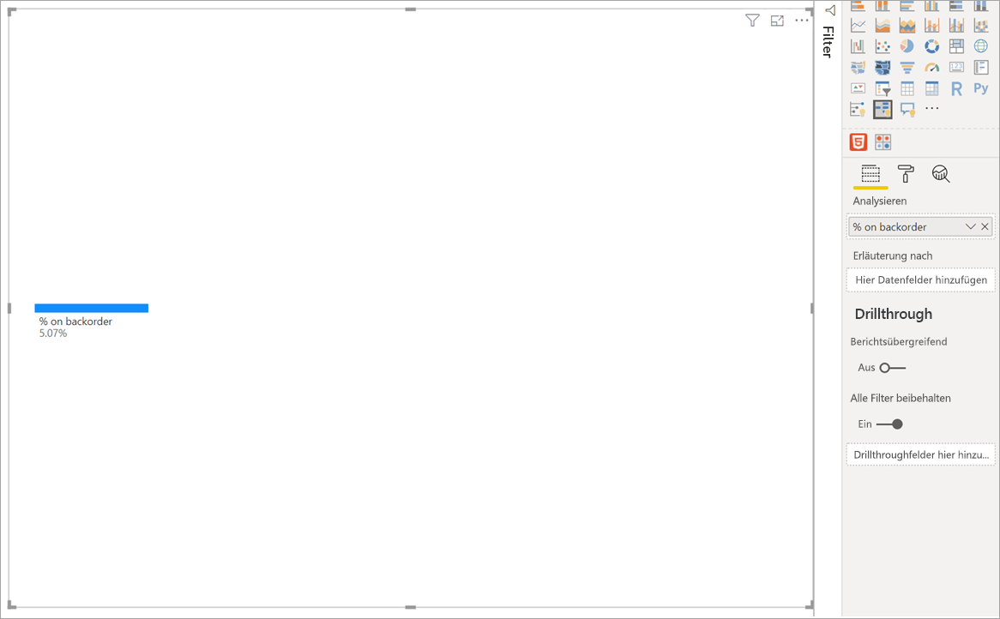
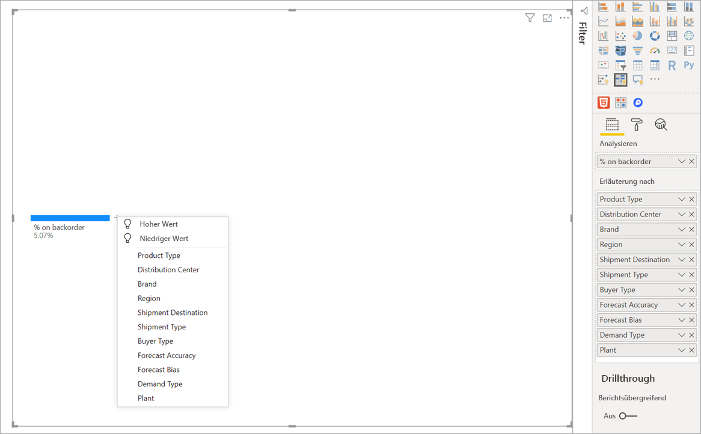
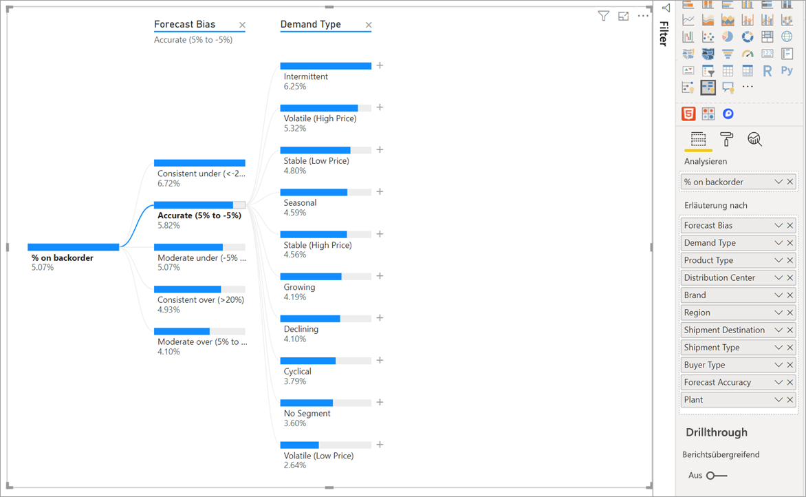
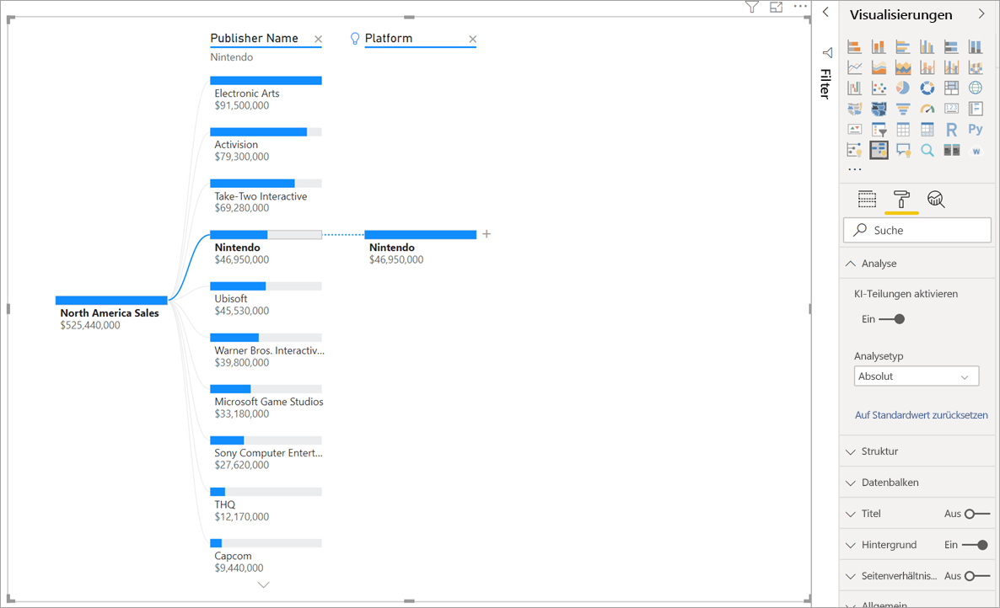
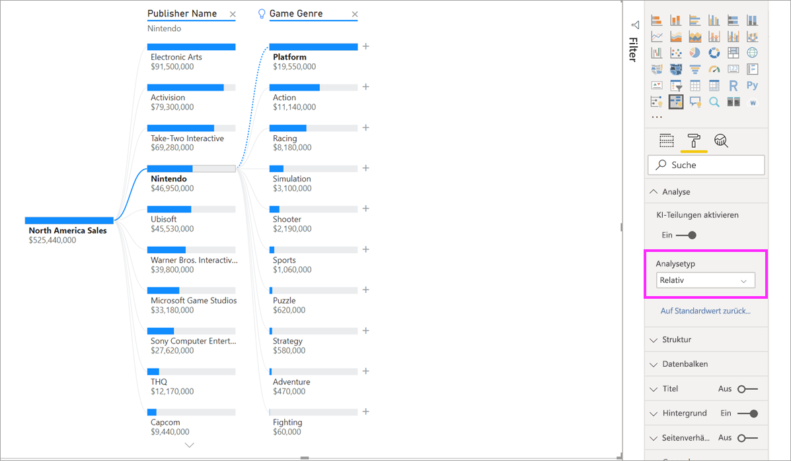
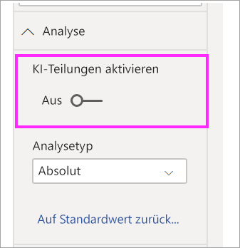

# Verwenden des Analysebaumvisuals in Power BI (Vorschau)
[!INCLUDE [power-bi-visuals-desktop-banner](../includes/power-bi-visuals-desktop-banner.md)]

Mit dem Analysebaumvisual in Power BI ist es möglich, dimensionsübergreifend Daten zu visualisieren. Es aggregiert Daten automatisch und ermöglicht einen Drilldown für Ihre Dimensionen in beliebiger Reihenfolge. Gleichzeitig handelt es sich um eine KI-Visualisierung, sodass Sie basierend auf bestimmten Kriterien eine Suche nach der nächsten Dimension anfordern können, für die Sie einen Drilldown durchführen möchten. Dies macht es zu einem nützlichen Werkzeug für die Ad-hoc-Erkundung und die Durchführung von Ursachenanalysen.

In diesem Tutorial werden zwei Beispiele verwendet:

- Ein Lieferkettenszenario, das den Prozentsatz der Produkte analysiert, die ein Unternehmen nicht vorrätig hat (Produkt ist vergriffen).  
- Ein Vertriebsszenario, das den Verkauf von Videospielen nach zahlreichen Faktoren wie Spielgenre und Herausgeber aufgliedert.

## Erste Schritte
Wählen Sie im Bereich „Visualisierungen“ das Symbol für den Analysebaum aus.

Die Visualisierung erfordert zwei Arten von Eingaben.

**Analyse**: Die Metrik, die Sie analysieren möchten. Hierbei muss es sich um ein Measure oder um ein Aggregat handeln.  
**Erläuterung nach**: Mindestens eine Dimension, für die ein Drilldown durchgeführt werden soll.

Sobald Sie Ihr Measure in das Feld ziehen, wird die Visualanzeige mit dem aggregierten Measure aktualisiert. Im Beispiel unten wird die durchschnittliche Anzahl von Produkten mit Lieferrückstand in Prozent angezeigt (5,07 %) 

Im nächsten Schritt werden Dimensionen eingeführt, für die ein Drilldown durchgeführt werden soll. Fügen Sie die Felder im Bereich **Erläuterung nach** hinzu. Beachten Sie, dass neben Ihrem Stammknoten ein Pluszeichen angezeigt wird. Durch Auswahl des Pluszeichens (+) können Sie auswählen, für welche Felder ein Drilldown durchgeführt werden soll (der Drilldown kann in beliebiger Reihenfolge erfolgen).

Das Auswählen von **Prognosetrend** führt dazu, dass der Baum erweitert und das Measure nach den Werten in der Spalte aufgeschlüsselt wird. Dieser Vorgang kann wiederholt werden, um einen anderen Knoten für den Drilldown auszuwählen.

Durch die Auswahl eines Knotens aus der letzten Ebene wird eine Kreuzfilterung für die Daten durchgeführt. Durch die Auswahl eines Knotens aus einer vorherigen Ebene wird der Pfad geändert.

Durch eine Interaktion mit anderen Visuals wird eine Kreuzfilterung für den Analysebaum durchgeführt. Dadurch kann sich die Reihenfolge der Knoten innerhalb der Ebenen ändern.
Im Beispiel unten erfolgt eine Kreuzfilterung nach Ubisoft. Der Pfad wird aktualisiert, und die Xbox-Verkäufe verschieben sich vom ersten auf den zweiten Platz – hinter PlayStation. 

Wenn wir dann eine Kreuzfilterung des Baums nach Nintendo durchführen, sind die Xbox-Verkäufe leer, weil keine Nintendo-Spiele für Xbox entwickelt werden. Xbox wird zusammen mit dem nachfolgenden Pfad aus der Ansicht herausgefiltert.

Obwohl der Pfad nicht mehr angezeigt wird, bleiben die vorhandenen Ebenen (in diesem Fall das Spielgenre) weiter angeheftet. Bei Auswahl des Knotens „Nintendo“ wird der Baum deshalb automatisch auf das Spielgenre erweitert.

## KI-Teilung

Sie können über „KI-Teilungen“ herausfinden, wonach Sie als Nächstes in den Daten suchen sollten. Diese Teilungen erscheinen oben in der Liste und sind mit einer Glühlampe gekennzeichnet. Die Teilungen unterstützen Sie dabei, automatisch hohe und niedrige Werte in den Daten zu ermitteln.

Die Analyse kann abhängig von Ihren Präferenzen auf zwei Arten erfolgen. Das Standardverhalten lautet wie folgt:

**Höchstwert**: Berücksichtigt alle verfügbaren Felder und ermittelt, für welches Feld ein Drilldown durchgeführt werden muss, um den höchsten Wert des zu analysierenden Measures zu erhalten.  
**Tiefstwert**: Berücksichtigt alle verfügbaren Felder und ermittelt, für welches Feld ein Drilldown durchgeführt werden muss, um den niedrigsten Wert des zu analysierenden Measures zu erhalten.  

Die Auswahl von **Höchstwert** im Beispiel zum Lieferrückstand führt zu diesen Ergebnissen: 

Die Glühlampe neben **Product Type** (Produkttyp) weist darauf hin, dass es sich um eine KI-Teilung handelt. Der Baum enthält außerdem eine gestrichelte Linie, die den Knoten **Patient Monitoring** (Patientenüberwachung) empfiehlt, weil der Lieferrückstand hier am höchsten ist (9,2 %). 

Bewegen Sie den Cursor über die Glühlampe, um eine QuickInfo anzuzeigen. In diesem Beispiel wird in der QuickInfo darauf hingewiesen, dass der Lieferrückstand (in Prozent) für Produkte aus dem Bereich der Patientenüberwachung am höchsten ist.

Sie können das Visual so konfigurieren, dass anstelle von **absoluten** KI-Teilungen **relative** KI-Teilungen ermittelt werden. 

Im relativen Modus wird nach Höchstwerten gesucht, die (im Vergleich zu den restlichen Daten in der Spalte) herausstechen. Betrachten wir zur Verdeutlichung das folgende Beispiel: 

Im Screenshot oben betrachten wir die Verkäufe von Videospielen in Nordamerika. Zuerst erfolgt eine Teilung des Baums nach **Publisher Name** (Herausgebername), dann wird ein Drilldown für Nintendo durchgeführt. Die Auswahl von **Höchstwert** führt zur Erweiterung von **Plattform „Nintendo“** . Da Nintendo (der Herausgeber) nur für Nintendo-Konsolen entwickelt, ist nur ein Wert vorhanden, und dieser ist wenig überraschend der höchste Wert.

Eine interessantere Teilung wäre jedoch die Betrachtung, welcher Wert sich relativ zu den anderen Werten in derselben Spalte abhebt. Wenn wir den Analysetyp von **Absolut** in **Relativ** ändern, erhalten wir für Nintendo das folgende Ergebnis: 

In diesem Fall lautet der empfohlene Wert **Plattform in Spielgenre**.  Die Plattform erzielt keinen höheren absoluten Wert als Nintendo (19.950.000 USD gegenüber 46.950.000 USD). Dennoch ist es ein Wert, der heraussticht.

Genauer gesagt: Da es 10 Werte für das Spielgenre gibt, würde der erwartete Wert für die Plattform bei einer gleichmäßigen Aufteilung 4,6 Mio. USD betragen. Der Plattformwert von knapp 20 Mio. USD ist interessant, weil er viermal höher ist als das erwartete Ergebnis.

Die Berechnung lautet wie folgt:

Verkäufe in Nordamerika für Plattform / Abs(Durchschn.(Verkäufe in Nordamerika für Spielgenre))  
im Vergleich zu  
Verkäufe in Nordamerika für Nintendo / Abs(Durchschn.(Verkäufe in Nordamerika für Plattform))  

Übersetzt:

19.550.000 / (19.550.000 + 11.140.000 + ... + 470.000 + 60.000 /10) = 4,25x  
im Vergleich zu  
46.950.000/ (46.950.000/1) = 1x  

Wenn Sie es vorziehen, keine KI-Teilungen im Baum zu verwenden, können Sie diese unter den Optionen **Analyseformatierung** deaktivieren:  

## Bauminteraktionen mit KI-Teilungen

Es können mehrere aufeinanderfolgende KI-Ebenen vorhanden sein. Sie können auch verschiedene Arten von KI-Ebenen kombinieren (Wechsel von „Höchstwert“ zu „Tiefstwert“ und zurück zu „Höchstwert“): 

Wenn Sie einen anderen Knoten im Baum auswählen, werden die KI-Teilungen von Grund auf neu berechnet. Im Beispiel unten wurde der ausgewählte Knoten in der Ebene **Prognosetrend** geändert. Die nachfolgenden Ebenen werden geändert, um die richtigen Höchst- und Tiefstwerte zu liefern. 

Die KI-Ebenen werden auch neu berechnet, wenn Sie für den Analysebaum eine Kreuzfilterung anhand eines anderen Visuals durchführen. Im Beispiel unten ist ersichtlich, dass der Lieferrückstand in Prozent für „Plant #0477“ am höchsten ist.

Aber wenn wir im Balkendiagramm **April** auswählen, gibt es für **Produkttyp „Advanced Surgical“** (Moderne Chirurgie) die meisten Änderungen. In diesem Fall wurden nicht nur die Knoten neu angeordnet, sondern es wurde eine komplett andere Spalte ausgewählt. 

Wenn sich KI-Ebenen wie Nicht-KI-Ebenen verhalten sollen, klicken Sie auf die Glühlampe, um das Standardverhalten wiederherzustellen. 

Mehrere KI-Ebenen können verkettet werden, aber eine Nicht-KI-Ebene kann nicht auf eine KI-Ebene folgen. Wenn wir nach einer KI-Teilung eine manuelle Teilung durchführen, verschwindet die Glühbirne aus der KI-Ebene, und die Ebene wird in eine normale Ebene umgewandelt. 

## Sperrung

Ein Inhaltsautor kann Ebenen für Berichtsconsumer sperren. Wenn eine Ebene gesperrt ist, kann sie weder entfernt noch geändert werden. Ein Consumer kann unterschiedliche Pfade innerhalb der gesperrten Ebenen erkunden, aber die Ebene selbst nicht ändern. Als Inhaltsautor können Sie den Mauszeiger über vorhandene Ebenen bewegen, um das Schlosssymbol anzuzeigen. Sie können beliebig viele Ebenen sperren, aber gesperrten Ebenen können keine nicht gesperrten Ebenen vorangehen.

Im Beispiel unten sind die ersten zwei Ebenen gesperrt. Dies bedeutet, dass Berichtsconsumer die Ebenen 3 und 4 ändern und sogar nachfolgende Ebenen erstellen können. Die ersten zwei Ebenen können jedoch nicht geändert werden:

## Bekannte Einschränkungen

Der Analysebaum wird in den folgenden Szenarien nicht unterstützt:  
-   Lokale Analysis Services-Instanzen

KI-Teilungen werden in den folgenden Szenarien nicht unterstützt:  
-   Azure Analysis Services
-   Direkte Abfrage
-   Power BI-Berichtsserver
-   Webveröffentlichung
-   Komplexe Measures und Measures aus Erweiterungsschemas in „Analyse“

Weitere Vorschaueinschränkungen:
- Power BI Mobile  
- Anheftung an das Dashboard
- Funktionalität zur Datenanzeige
- Unterstützung innerhalb von Q&A

## Nächste Schritte

[Power BI-Ringdiagramm](power-bi-visualization-doughnut-charts.md)

[Power BI-Visualisierungen](power-bi-report-visualizations.md)

