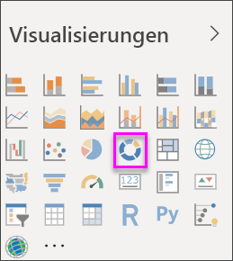
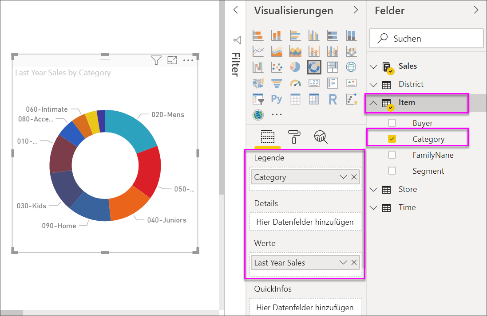

# Ringdiagramme in Power BI

[!INCLUDE [power-bi-visuals-desktop-banner](../includes/power-bi-visuals-desktop-banner.md)]

Ein Ringdiagramm ähnelt einem Kreisdiagramm insofern, als dass es die Beziehung von Teilen zu einem Ganzen zeigt. Der einzige Unterschied ist, dass die Mitte leer und Platz für eine Beschriftung oder ein Symbol bleibt.

## Voraussetzung

Dieses Tutorial verwendet die [PBIX-Datei mit einem Analysebeispiel für den Einzelhandel](http://download.microsoft.com/download/9/6/D/96DDC2FF-2568-491D-AAFA-AFDD6F763AE3/Retail%20Analysis%20Sample%20PBIX.pbix).

1. Wählen Sie im oberen linken Bereich der Menüleiste die Option **Datei** > **Öffnen** aus.
   
2. Suchen Sie Ihre Kopie der **PBIX-Datei mit einem Analysebeispiel für den Einzelhandel**.

1. Öffnen Sie die **PBIX-Datei mit einem Analysebeispiel für den Einzelhandel** in der Berichtsansicht .

1. Auswählen  um eine neue Seite hinzuzufügen.

## Erstellen eines Ringdiagramms

1. Beginnen Sie auf einer leeren Berichtsseite, und wählen Sie im Bereich „Felder“ die Option **Sales** \> **Last Year Sales**.  
   
3. Wählen Sie im Bereich „Visualisierungen“ das Symbol für ein Ringdiagramm  aus, um das Balkendiagramm in ein Ringdiagramm zu konvertieren. Wenn sich die Kategorie **Verkäufe im letzten Jahr** nicht im Bereich **Werte** befindet, ziehen Sie diese dorthin.
     
   

4. Wählen Sie **Element** \> **Kategorie** aus, um die Kategorie dem Bereich **Legende** hinzuzufügen. 
     
    

5. Optional können Sie [die Textgröße und -farbe des Diagramms anpassen](power-bi-visualization-customize-title-background-and-legend.md). 

## Zu beachtende Aspekte und Problembehandlung
* Die Summe der Ringdiagrammwerte muss insgesamt 100 % betragen.
* Zu viele Kategorien erschweren das Lesen und Interpretieren der Werte.
* Ringdiagramme werden am besten zum Vergleichen eines bestimmten Bereichs gegenüber dem Ganzen verwendet, anstatt einzelne Abschnitte miteinander zu vergleichen. 

## Nächste Schritte
[Trichterdiagramme in Power BI](power-bi-visualization-funnel-charts.md)

[Visualisierungstypen in Power BI](power-bi-visualization-types-for-reports-and-q-and-a.md)

