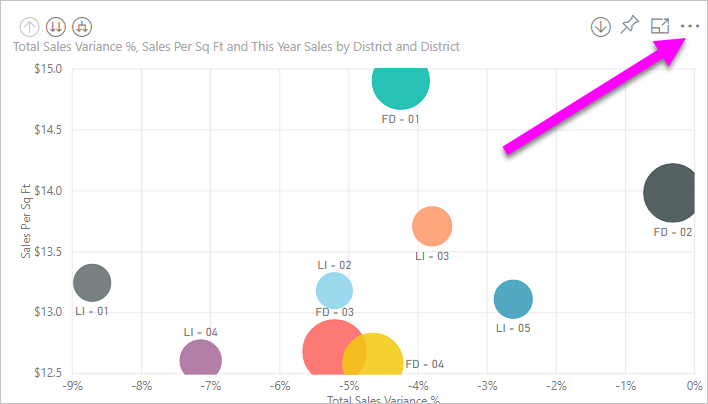
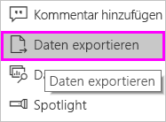
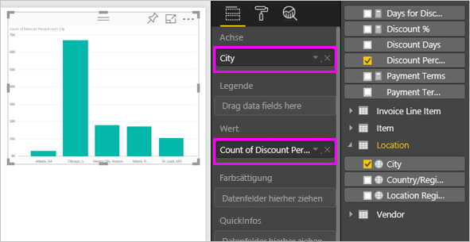
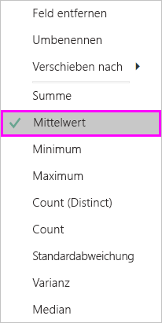
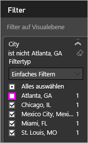
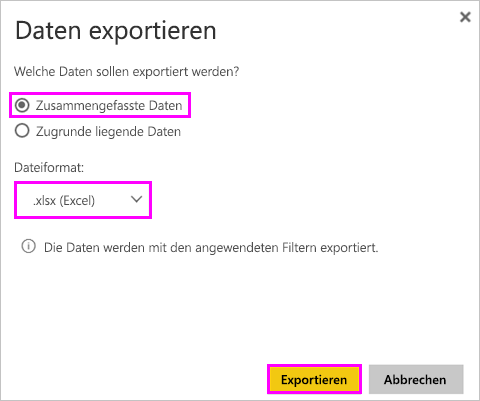
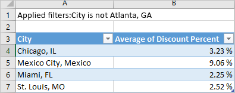
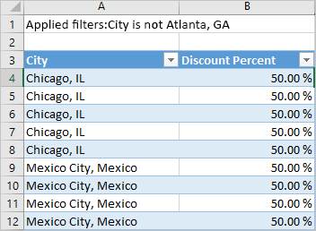
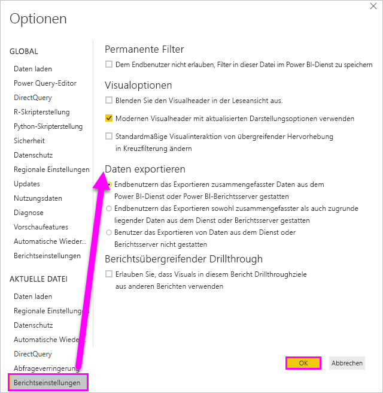

# Exportieren von Daten aus Visualisierungen

Wenn Sie die Daten anzeigen möchten, auf deren Grundlage eine Visualisierung erstellt wurde, können Sie die [Daten in Power BI anzeigen](service-reports-show-data.md). Sie können diese Daten auch als *XLSX*- oder *CSV*-Datei in Excel exportieren. Für das Exportieren von Daten sind eine Pro- oder Premium-Lizenz und Bearbeitungsberechtigungen für das Dataset und den Bericht erforderlich.

Sehen Sie zu, wie Will Daten aus einer der Visualisierungen in seinem Bericht exportiert, als *XLSX*-Datei speichert und dann in Excel öffnet. Befolgen Sie dann die schrittweisen Anleitungen unter dem Video, um es selbst ausprobieren.

<iframe width="560" height="315" src="https://www.youtube.com/embed/KjheMTGjDXw" frameborder="0" allowfullscreen></iframe>

## Exportieren von Daten aus einem Power BI-Dashboard

1. Wählen Sie die Auslassungspunkte in der rechten oberen Ecke der Visualisierung aus.

    

1. Wählen Sie das Symbol **Daten exportieren** aus.

    

1. Power BI exportiert die Daten in eine *CSV*-Datei. Wenn Sie die Visualisierung gefiltert haben, filtert die App die heruntergeladenen Daten.

1. Sie werden im Browser zum Speichern der Datei aufgefordert.  Öffnen Sie die *CSV*-Datei nach dem Speichern in Excel.

    

## Exportieren von Daten aus einem Bericht

Öffnen Sie den [Bericht „Procurement analysis sample“ (Analysebeispiel für Beschaffung)](../sample-procurement.md) in der Bearbeitungsansicht, um dem Tutorial zu folgen. Fügen Sie eine neue leere Berichtsseite hinzu. Befolgen Sie anschließend die untenstehenden Schritte, um eine Aggregation und einen Filter auf Visualisierungsebene hinzuzufügen.

1. Erstellen Sie ein neues **Gestapeltes Säulendiagramm**.

1. Wählen Sie im Bereich **Fields** (Felder) **Location > City** (Ort > Stadt) und **Invoice > Discount Percent** (Rechnung > Rabatt in Prozent) aus.  Sie müssen **Discount Percent** (Rabatt in Prozent) möglicherweise in den Bereich **Value** (Wert) verschieben.

    

1. Ändern Sie die Aggregation für **Discount Percent** (Rabatt in Prozent) von **Count** (Anzahl) in **Average** (Durchschnitt). Wählen Sie im Bereich **Value** (Wert) den Pfeil rechts neben **Discount Percent** (Rabatt in Prozent) aus, wobei die Bezeichnung auch **Count of Discount Percent** (Höhe von Rabatt in Prozent) lauten kann, und wählen Sie **Average** (Durchschnitt) aus.

    

1. Fügen Sie **City** (Stadt) einen Filter hinzu, wählen Sie alle Städte aus, und entfernen Sie dann **Atlanta**.

    

   Nun können Sie beide Optionen für das Exportieren von Daten ausprobieren.

1. Wählen Sie die Auslassungspunkte in der rechten oberen Ecke der Visualisierung aus. Wählen Sie **Daten exportieren** aus.

    

    Wenn Ihre Visualisierung in Power BI Online ein Aggregat aufweist (wenn Sie beispielsweise **Count** (Anzahl) in *average* Durchschnitt, *sum* (Summe) oder *Minimum* geändert haben), sind zwei Optionen verfügbar:

    - **Zusammengefasste Daten**

    - **Zugrunde liegende Daten**

    In Power BI Desktop haben Sie nur die Option für **Zusammengefasste Daten**. Weitere Informationen zu Aggregaten finden Sie unter [Aggregate in Power BI](../service-aggregates.md).

1. Wählen Sie unter **Daten exportieren** **Zusammengefasste Daten**, dann entweder *.xlsx* oder *.csv* und anschließend **Exportieren** aus. Die Daten werden aus Power BI exportiert.

    

    Wenn Sie Filter auf die Visualisierung angewendet haben, werden die Daten entsprechend den Filtereinstellungen exportiert. Wenn Sie **Exportieren** auswählen, werden Sie in Ihrem Browser zum Speichern aufgefordert. Öffnen Sie die Datei nach dem Speichern in Excel.

    **Zusammengefasste Daten**: Wählen Sie diese Option aus, wenn Sie die im visuellen Element angezeigten Daten exportieren möchten.  Diese Exportart zeigt nur die Daten (Spalten und Measures) an, die Sie zum Erstellen des Visuals ausgewählt haben.  Wenn das Visual über ein Aggregat verfügt, exportieren Sie aggregierte Daten. Wenn Sie beispielsweise über ein Balkendiagramm mit vier Balken verfügen, erhalten Sie vier Datenzeilen. Zusammengefasste Daten sind im *XLSX*- und *CSV*-Format verfügbar.

    In diesem Beispiel wird im Excel-Export eine Summe für jede Stadt angezeigt. Da Atlanta herausgefiltert wurde, ist die Stadt nicht in den Ergebnissen enthalten. In der ersten Zeile der Tabelle sind die Filter aufgeführt, die Power BI beim Extrahieren der Daten angewendet hat.

    

1. Versuchen Sie nun, **Zugrunde liegende Daten**, *.xlsx* und **Exportieren** auszuwählen. Die Daten werden aus Power BI exportiert. 

    > [!NOTE]
    > Abhängig von den Berichtseinstellungen steht Ihnen möglicherweise die Option zum Exportieren zugrunde liegender Daten zur Verfügung.

    Wenn Sie Filter auf die Visualisierung angewendet haben, werden die Daten entsprechend den Filtereinstellungen exportiert. Wenn Sie **Exportieren** auswählen, werden Sie in Ihrem Browser zum Speichern aufgefordert. Öffnen Sie die Datei nach dem Speichern in Excel.

    >[!WARNING]
    >Wenn die zugrunde liegenden Daten exportiert werden, sind alle detaillierten Daten – jede Spalte in den Daten – für die Benutzer sichtbar. Power BI-Dienst-Administratoren können dies für ihre Organisation deaktivieren. Wenn Sie Datasetbesitzer sind, können Sie proprietäre Spalten auf **Ausgeblendet** festlegen, sodass diese weder in Desktop noch im Power BI-Dienst in der **Feldliste** angezeigt werden.

    **Zugrunde liegende Daten**: Wählen Sie diese Option aus, wenn Sie die Daten im Visual ***und*** zusätzliche Daten aus dem Modell anzeigen möchten. Im unten stehenden Diagramm erhalten Sie weitere Informationen. Wenn Ihre Visualisierung über ein Aggregat verfügt, wird dieses durch *Zugrunde liegende Daten* entfernt. Wenn Sie **Exportieren** auswählen, exportiert Power BI die Daten in eine *XLSX*-Datei, und Sie werden im Browser dazu aufgefordert, die Datei zu speichern. Öffnen Sie die Datei nach dem Speichern in Excel.

    In diesem Beispiel enthält der Excel-Export eine Zeile für jede einzelne Zeile „City“ (Stadt) im Dataset sowie den Rabatt in Prozent für den jeweiligen Eintrag. Power BI vereinfacht die Daten. Power BI aggregiert sie nicht. In der ersten Zeile der Tabelle sind die Filter aufgeführt, die Power BI beim Extrahieren der Daten angewendet hat.  

    

## Details zum Exportieren zugrunde liegender Daten

Die Anzeige beim Auswählen von **Zugrunde liegende Daten** variiert. Ihr Administrator oder Ihre IT-Abteilung kann Sie beim Verstehen der Details unterstützen. In Power BI Desktop oder im Power BI-Dienst wird in der Berichtsansicht ein *Measure* in der **Felderliste** mit einem Taschenrechnersymbol  angezeigt. Power BI Desktop erstellt Measures. Der Power BI-Dienst nicht.

| Visual enthält | Was beim Export angezeigt wird  |
|---------------- | ---------------------------|
| Aggregate | das *erste* Aggregat und nicht ausgeblendete Daten der gesamten Tabelle für dieses Aggregat |
| Aggregate | verknüpfte Daten, wenn das Visual Daten aus anderen Datentabellen verwendet, die mit der Datentabelle *verknüpft* sind, die das Aggregat enthält (wenn die Beziehung \*:1 oder 1:1 ist) |
| Measures | alle Measures im Visual *und* alle Measures aus einer beliebigen Datentabelle, die ein Measure, das in diesem Visual verwendet wird, enthält |
| Measures | alle nicht ausgeblendeten Daten aus Tabellen, die dieses Measure enthalten (wenn die Beziehung \*:1 oder 1:1 ist) |
| Measures | alle Daten aus allen Tabellen, die mit mindestens einer Tabelle, die die Measures enthalten, verknüpft sind (über eine Kette von \*:1 von 1:1) |
| Nur Measures | alle nicht ausgeblendeten Spalten aus allen verknüpften Tabellen (um das Measure zu erweitern) |
| Nur Measures | zusammengefasste Daten für alle doppelten Zeilen für Modellmeasures |

### Festlegen der Exportoptionen

Power BI-Bericht-Designer kontrollieren die Typen der Datenexportoptionen, die für ihre Benutzer verfügbar sind. Die Optionen sind:

- Endbenutzern das Exportieren zusammengefasster Daten aus dem Power BI-Dienst oder Power BI-Berichtsserver gestatten

- Endbenutzern das Exportieren sowohl zusammengefasster als auch zugrunde liegender Daten aus dem Dienst oder Berichtsserver gestatten

- Benutzer das Exportieren von Daten aus dem Dienst oder Berichtsserver nicht gestatten

    > [!IMPORTANT]
    > Es wird empfohlen, dass die Designer von Berichten ältere Berichte erneut überprüfen und die Exportoption bei Bedarf manuell zurücksetzen.

So legen Sie diese Optionen fest:

1. Starten Sie in Power BI Desktop.

1. Wählen Sie in der oberen linken Ecke **Datei** > **Optionen und Einstellungen** > **Optionen** aus.

1. Wählen Sie unter **AKTUELLE DATEI** die Option **Berichtseinstellungen** aus.

    

1. Treffen Sie Ihre Auswahl im Abschnitt **Daten exportieren**.

Sie können diese Einstellung auch im Power BI-Dienst aktualisieren.

Es ist wichtig, zu beachten, dass die Administratoreinstellungen die Datenexporteinstellungen außer Kraft setzen, wenn die Einstellungen im Power BI-Administratorportal mit den Berichtseinstellungen für den Export von Daten in Konflikt stehen.

## Einschränkungen und Überlegungen
Diese Einschränkungen und Überlegungen gelten für Power BI Desktop und Power BI-Dienst, einschließlich Power BI Pro und Premium.

- Um die Daten aus einem visuellen Element exportieren zu können, benötigen Sie [Erstellungsberechtigungen für freigegebene Datasets](https://docs.microsoft.com/power-bi/service-datasets-build-permissions#build-permissions-for-shared-datasets).

-  Die maximale Anzahl von Zeilen, die **Power BI Desktop** und **Power BI-Dienst** in das *CSV*-Format exportieren können, ist 30.000.

- Die maximale Anzahl von Zeilen, die die Anwendungen in eine *XLSX*-Datei exportieren können, ist 150.000.

- Das Exportieren mit *zugrunde liegenden Daten* funktioniert nicht, wenn:

  - Die Datenquelle eine Analysis Services-Liveverbindung ist.

  - Die Version älter als 2016 ist.

  - Die Tabellen im Modell keinen eindeutigen Schlüssel aufweisen.
    
  -  Wenn ein Administrator oder Berichtsdesigner dieses Feature deaktiviert hat.

- Das Exportieren mithilfe *Zugrunde liegender Daten* ist nicht möglich, wenn Sie für die Visualisierung, die Power BI exportiert, die Option *Elemente ohne Daten anzeigen* aktivieren.

- Wenn Sie DirectQuery verwenden, kann Power BI maximal 16MB Daten exportieren. Ein unbeabsichtigtes Ergebnis kann sein, dass Sie weniger als die maximale Anzahl von Zeilen exportieren. Dies ist wahrscheinlich, wenn:

    - Viele Spalten vorhanden sind.

    - Die Daten schwierig zu komprimieren sind.

    - Andere Faktoren sind im Spiel, die die Dateigröße erhöhen und die Anzahl der Zeilen verringern, die Power BI exportieren kann.

- Wenn die Visualisierung Daten aus mehreren Datentabellen verwendet und keine Beziehung zwischen diesen Tabellen im Datenmodell besteht, exportiert Power BI nur Daten der ersten Tabelle.

- Benutzerdefinierte Visuals und R-Visuals werden derzeit nicht unterstützt.

- Die Funktion zum Exportieren von Daten steht Benutzern, die der Organisation nicht angehören und ein Dashboard verwenden, das ein interner Benutzer für sie freigegeben hat, nicht zur Verfügung.

- Ein Feld (eine Spalte) können Sie in Power BI umbenennen, indem Sie doppelt auf das Feld klicken und einen neuen Namen eingeben. Power BI behandelt den neuen Namen wie einen *Alias*. Es ist möglich, dass im Power BI-Bericht doppelte Feldnamen vorhanden sind. Excel erlaubt jedoch keine Duplikate. Wenn Power BI die Daten also in Excel importiert, werden die Feldaliase auf ihre ursprünglichen Feld- bzw. Spaltennamen zurückgesetzt.  

- Wenn Unicode-Zeichen in der *CSV*-Datei vorhanden sind, wird der Text in Excel möglicherweise nicht korrekt angezeigt. Beispiele für Unicode-Zeichen sind Währungssymbole und Fremdwörter. Sie können die Datei im Editor öffnen, und die Unicode-Zeichen werden richtig angezeigt. Wenn Sie die Datei in Excel öffnen möchten, importieren Sie die *CSV*-Datei zur Problemumgehung. So importieren Sie die Datei in Excel:

  1. Öffnen Sie Excel.

  1. Wechseln Sie zur Registerkarte **Daten**.
  
  1. Wählen Sie **Externe Daten abrufen** > **Aus Text** aus.
  
  1. Wechseln Sie zu dem lokalen Ordner, in dem die Datei gespeichert ist, und wählen Sie die *CSV*-Datei aus.

- Power BI-Administratoren können das Exportieren von Daten deaktivieren.

Weitere Fragen? [Stellen Sie Ihre Frage in der Power BI-Community.](http://community.powerbi.com/)