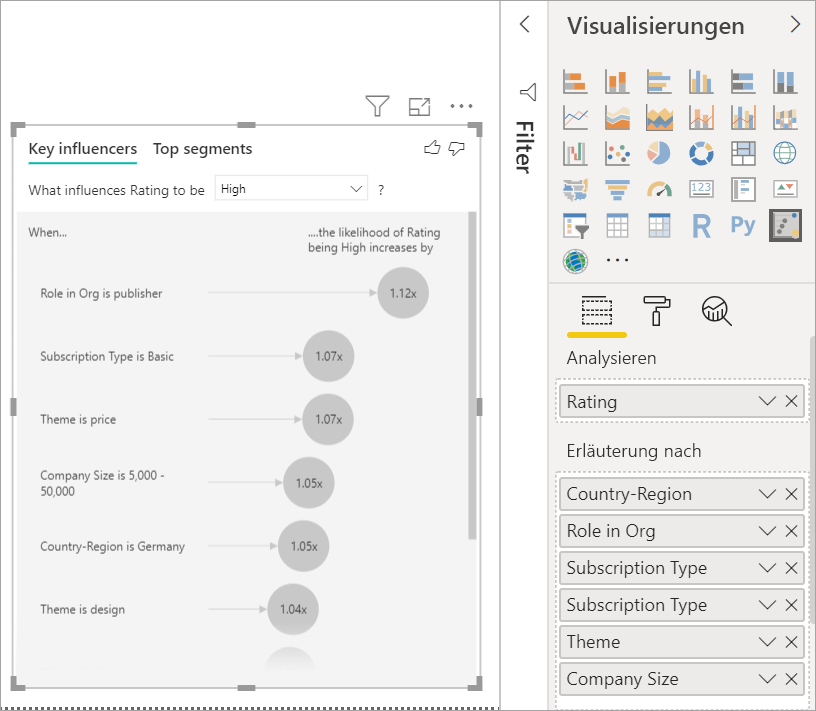
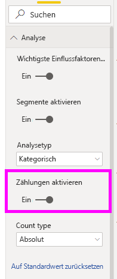
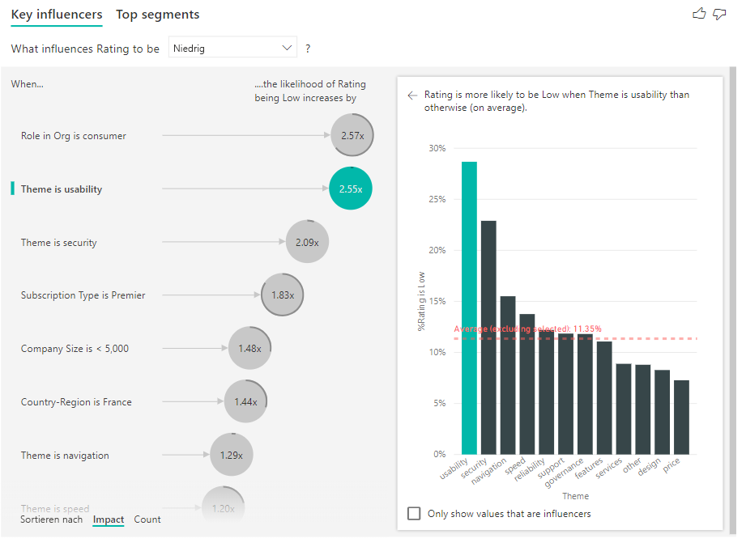
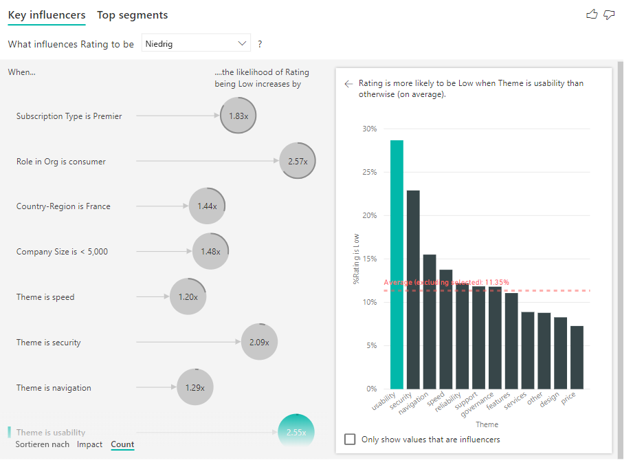
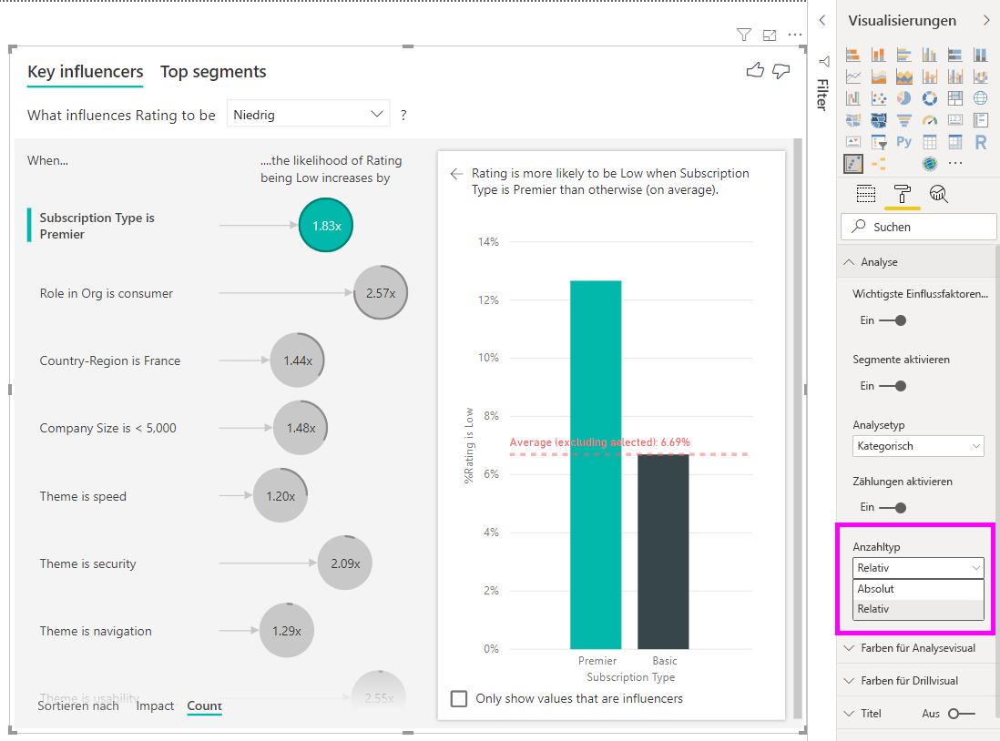
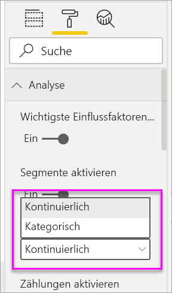
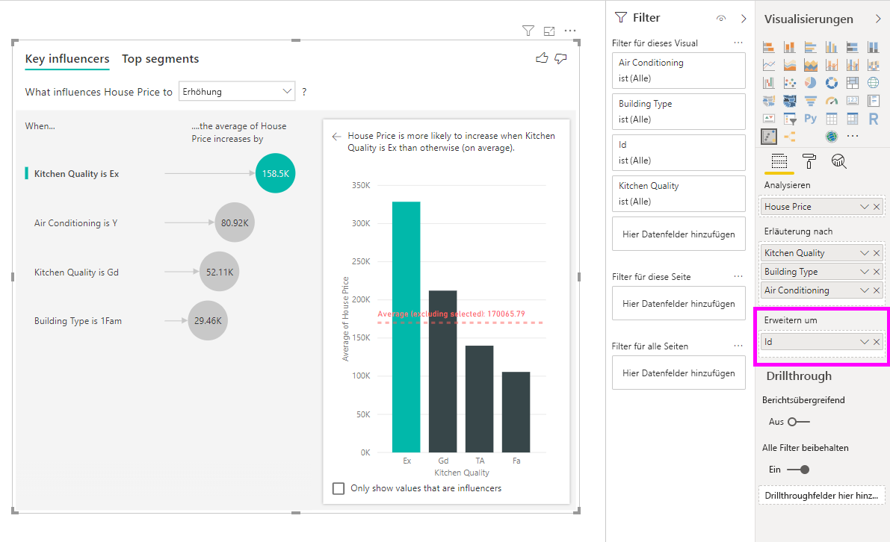

# Visual „Wichtige Einflussfaktoren“
Mithilfe des Visuals „Wichtige Einflussfaktoren“ können Sie die wichtigen Faktoren einer für Sie relevanten Metrik besser nachvollziehen. Es analysiert die Daten, erstellt eine Rangfolge für wichtige Faktoren und stellt diese dar. Angenommen, Sie möchten beispielsweise ermitteln, wodurch die Personalfluktuation oder Abwanderung beeinflusst wird. Dabei können z. B. die Länge des Anstellungsvertrags oder das Alter des Mitarbeiters wichtige Faktoren darstellen. 
 
## Wann empfiehlt sich die Verwendung des Visuals „Wichtige Einflussfaktoren“? 
Sie können das Visual in folgenden Fällen erfolgreich verwenden: 
- Zur Übersicht über die Faktoren, die sich auf die analysierte Metrik auswirken.
- Zum Vergleich der relativen Wichtigkeit dieser Faktoren, z.B. bei der Frage, ob Kurzzeitverträge sich stärker als Langzeitverträge auf die Fluktuation auswirken. 

## Features des Visuals „Wichtige Einflussfaktoren“

1. **Registerkarten**: Klicken Sie auf eine Registerkarte, um die Ansicht zu wechseln. Auf der Registerkarte **Wichtige Einflussfaktoren** wird dargestellt, wodurch der ausgewählte Metrikwert beeinflusst wird. Auf der Registerkarte **Wichtigste Segmente** werden die Segmente dargestellt, die den größten Einfluss auf den ausgewählten Metrikwert haben. Ein *Segment* besteht aus einer Kombination mehrerer Werte. Beispielsweise könnte ein Segment sich aus den Verbrauchern zusammensetzen, die seit mindestens 20 Jahren zur Kundschaft zählen und im Westen des Landes leben. 

2. **Dropdown-Listenfeld**: Der Wert der Metrik, die untersucht werden soll. In diesem Beispiel geht es um die Metrik **Bewertung**. Der ausgewählte Wert lautet **Niedrig**.

3. **Neudarstellung**: Diese Ansicht unterstützt Sie beim Interpretieren des Visuals im linken Bereich.

4. **Linker Bereich**: Im linken Bereich wird ein Visual dargestellt. In diesem Beispiel handelt es sich um eine Liste der wichtigsten Einflussfaktoren.

5. **Neudarstellung**: Diese Ansicht unterstützt Sie beim Interpretieren des Visuals im rechten Bereich.

6. **Rechter Bereich**: Im rechten Bereich wird ein Visual dargestellt. In diesem Fall werden im Säulendiagramm alle Werte für den links ausgewählten Faktor **Theme** (Thema) des Visuals „Wichtige Einflussfaktoren“ dargestellt. Der spezifische Wert **Usability** (Benutzerfreundlichkeit) im linken Bereich wird in Grün angezeigt. Alle anderen Werte für **Theme** (Thema) werden in Schwarz angezeigt.

7. **Durchschnittslinie**: Der Durchschnitt wird für alle möglichen Werte für **Theme** (Design) berechnet, außer für **Usability** (Benutzerfreundlichkeit) (dies ist der ausgewählte Einflussfaktor). Die Berechnung setzt sich also aus allen schwarz dargestellten Werten zusammen. Daraus wird ersichtlich, welcher Prozentsatz der anderen **Designs** eine niedrige Bewertung hatte. In diesem Fall hatte 11,35 % eine niedrige Bewertung (angezeigt durch die gepunktete Linie).

8. **Kontrollkästchen**: Filtert das Visual im rechten Bereich heraus, sodass nur Werte angezeigt werden, die Einflussfaktoren für dieses Feld sind. In diesem Beispiel würde es das Visual nach Benutzerfreundlichkeit, Sicherheit und Navigation filtern.

## Analysieren einer kategorischen Metrik
 
Sehen Sie sich dieses Video an, um zu erfahren, wie ein Visual für wichtige Einflussfaktoren mit einer kategorischen Metrik erstellt wird. Führen Sie anschließend die folgenden Schritte aus, um ein Visual zu erstellen. 

<iframe width="560" height="315" src="https://www.youtube.com/embed/fDb5zZ3xmxU" frameborder="0" allow="accelerometer; autoplay; encrypted-media; gyroscope; picture-in-picture" allowfullscreen></iframe>

Ihr Produkt-Manager möchte, dass Sie ermitteln, welche Faktoren dazu führen, dass Kunden negative Bewertungen zu Ihrem Clouddienst abgeben. Öffnen Sie die Datei [customerfeedback.pbix](https://github.com/Microsoft/powerbi-desktop-samples/blob/master/2019/customerfeedback.pbix) in Power BI Desktop, um diesem Tutorial zu folgen. Sie können außerdem die Excel-Datei [customerfeedback.xlsx](https://github.com/Microsoft/powerbi-desktop-samples/blob/master/2019/customerfeedback.xlsx) für den Power BI-Dienst oder Power BI Desktop herunterladen. 

> [!NOTE]
> Das Customer Feedback-Dataset basiert auf dem Werk [Moro et al., 2014] S. Moro, P. Cortez und P. Rita. „A Data-Driven Approach to Predict the Success of Bank Telemarketing“. *Decision Support Systems*, Elsevier, 62:22-31, Juni 2014. 

1. Öffnen Sie den Bericht, und klicken Sie auf das Symbol **Wichtige Einflussfaktoren**. 

    

2. Verschieben Sie die Metrik, die Sie analysieren möchten, in das Feld **Analyse**. Um festzustellen, warum Kunden den Service niedrig bewerten, wählen Sie **Customer Table (Kundentabelle)**  > **Bewertung** aus.

3. Verschieben Sie die Felder, von denen Sie vermuten, dass sie sich auf die **Bewertung** auswirken, in das Feld **Erläuterung nach**. Sie können beliebig viele Felder verschieben. Beginnen Sie in diesem Beispiel mit den folgenden Feldern:
    - Country-Region 
    - Role in Org (Rolle in der Organisation) 
    - Subscription Type (Abonnementtyp) 
    - Company Size (Unternehmensgröße) 
    - Theme
    
4. Lassen Sie das Feld **Erweitern um** leer. Dieses Feld wird nur beim Analysieren eines Measures oder eines zusammengefassten Felds verwendet. 

5. Um den Fokus auf die negativen Bewertungen zu richten, wählen Sie im Dropdownfeld **What influences Rating to be** (Welche Faktoren zu einer Bewertung im Bereich) den Eintrag **Niedrig** aus.  

    

Die Analyse wird auf Tabellenebene des entsprechenden Felds ausgeführt. In diesem Beispiel wird die Metrik **Bewertung** verwendet. Diese Metrik wird auf Kundenebene definiert. Jeder Kunde hat entweder eine hohe oder eine niedrige Bewertung abgegeben. Alle erläuternden Faktoren für das Visual müssen auf Kundenebene definiert werden, damit sie verwendet werden können. 

Im obigen Beispiel weisen alle erläuternden Faktoren eine 1:1- oder eine n:1-Beziehung zur Metrik auf. In diesem Fall hat jeder Kunde seiner Bewertung ein einzelnes Design zugewiesen. Entsprechend stammen die Kunden aus einem Land, weisen einen Mitgliedschaftstyp auf und haben eine Rolle in der Organisation inne. Bei den erläuternden Faktoren handelt es sich um bereits vorhandenen Attribute eines Kunden, sodass keine Transformation nötig ist. Das Visual kann die Attribute direkt verwenden. 

Im Verlauf des Tutorials werden komplexere Beispiele mit 1:n-Beziehungen behandelt. In solchen Fällen müssen Spalten zunächst auf Kundenebene aggregiert werden, bevor die Analyse ausgeführt werden kann. 

Measures und Aggregate, die als erläuternde Faktoren verwendet werden, werden in der Metrik **Analyse** ebenfalls auf Tabellenebene ausgewertet. Im weiteren Verlauf des Artikels finden Sie hierfür Beispiele. 

## Interpretieren von kategorischen wichtigen Einflussfaktoren 
Nun sehen wir uns die wichtigsten Einflussfaktoren für niedrige Bewertungen genauer an. 

### Faktor, der am wahrscheinlichsten zu einer niedrigen Bewertung führt

Der Kunde in diesem Beispiel kann drei Rollen haben: Verbraucher, Administrator und Verleger. Die Rolle des Verbrauchers führt dabei am wahrscheinlichsten zu einer niedrigen Bewertung. 

Genauer gesagt ist es 2,57-mal wahrscheinlicher, dass ein Verbraucher eine negative Bewertung zu Ihrem Dienst abgibt. Im Diagramm „Wichtige Einflussfaktoren“ wird **Role in Org is consumer** (Rolle in der Organisation ist Verbraucher) auf der linken Seite ganz oben aufgeführt. Wenn Sie **Role in Org is consumer** (Rolle in der Organisation ist Verbraucher) auswählen, werden im rechten Bereich von Power BI weitere Details angezeigt. Die vergleichende Wirkung der einzelnen Rollen auf die Wahrscheinlichkeit einer niedrigen Bewertung wird angezeigt.
  
- 14,93 % der Verbraucher geben eine niedrige Bewertung ab. 
- Im Durchschnitt geben nur 5,78 % aller anderen Rollen eine niedrige Bewertung ab.
- Die Wahrscheinlichkeit, dass Verbraucher eine im Vergleich zu anderen Rollen niedrigere Bewertung abgeben, ist 2,57-mal höher. Diesen Wert können Sie ermitteln, indem Sie die grüne Leiste durch die rot gestrichelte Linie dividieren. 

### Faktor, der am zweitwahrscheinlichsten zu einer niedrigen Bewertung führt

Mit dem Visual „Wichtige Einflussfaktoren“ können die Faktoren aus vielen verschiedenen Variablen verglichen und nach Rangfolge sortiert werden. Der zweitgrößte Einflussfaktor unterscheidet sich sehr von **Role in Org** (Rolle in der Organisation). Wählen Sie in der Liste den zweitgrößten Einflussfaktor aus: **Theme is usability** (Thema ist gleich Benutzerfreundlichkeit). 

Der zweitwichtigste Faktor bezieht sich auf das Thema der Kundenbewertung. Verbraucher, die Feedback zur Benutzerfreundlichkeit des Produkts abgegeben haben, haben 2,55-mal wahrscheinlicher eine schlechte Bewertung abgegeben als Kunden, die Feedback zu den Themen Zuverlässigkeit, Design oder Geschwindigkeit abgegeben haben. 

Der durch die rot gestrichelte Linie dargestellte Durchschnitt hat sich im Vergleich zum vorherigen Visual von 5,78 % auf 11,34 % geändert. Der Durchschnittswert ist dynamisch, da er auf dem Durchschnitt aus allen anderen Werten basiert. Beim ersten Einflussfaktor wurde die Verbraucherrolle aus dem Durchschnitt ausgeschlossen. Beim zweiten Einflussfaktor wurde das Thema Benutzerfreundlichkeit ausgeschlossen. 
 
Aktivieren Sie das Kontrollkästchen **Nur Werte anzeigen, die Einflussfaktoren sind**, um nur mithilfe der beeinflussenden Werte zu filtern. In diesem Beispiel sind sie die Rollen, die für eine niedrige Bewertung verantwortlich sind. Die zwölf Themen werden auf die vier begrenzt, die von Power BI als die Themen identifiziert wurden, die für niedrige Bewertungen verantwortlich sind. 

## Interaktion mit anderen Visuals 
 
Immer, wenn Sie auf einen Slicer, einen Filter oder ein anderes Visual im Zeichenbereich klickt, führt das Visual für wichtige Einflussfaktoren die Analyse für die neu ausgewählten Daten nochmals aus. Sie können beispielsweise **Company Size** (Unternehmensgröße) in den Bericht verschieben und als Slicer verwenden. Verwenden Sie es, um festzustellen, ob sich die wichtigen Einflussfaktoren für Unternehmenskunden von denen der restlichen Kunden unterscheiden. Ein Unternehmen definiert sich hierbei über eine Größe von mehr als 50.000 Mitarbeitern.
 
Wenn Sie **> 50.000** auswählen, wird die Analyse noch mal ausgeführt, und Sie werden feststellen, dass sich auch die Einflussfaktoren geändert haben. Bei großen Unternehmenskunden ist das Thema Sicherheit der wichtigste Einflussfaktor für eine niedrige Bewertung. Sie sollten nun weiter untersuchen, ob es bestimmte Sicherheitsfeatures gibt, mit denen große Kunden nicht zufrieden sind. 

## Interpretieren von kontinuierlichen wichtigen Einflussfaktoren 
 
Bisher haben wir das Visual verwendet, um zu ermitteln, wie sich unterschiedliche Kategoriefelder auf niedrige Bewertungen auswirken. Im Feld **Erläuterung nach** können jedoch auch kontinuierliche Faktoren wie Alter, Höhe und Preis verwendet werden. Beobachten Sie, was geschieht, wenn **Tenure** (Verwendungsdauer) aus „Customer Table“ (Kundentabelle) in **Erläuterung nach** verschoben wird. Die Verwendungsdauer gibt an, wie lange der Kunde den Dienst bereits verwendet. 
 
Bei einem höheren Wert für „Tenure“ (Verwendungsdauer) steigt die Wahrscheinlichkeit, dass eine niedrige Bewertung abgegeben wird. Dieser Trend lässt darauf schließen, dass Langzeitkunden häufiger eine negative Bewertung abgeben. Diese Information ist interessant. Sie sollten sie später weiterverfolgen. 
 
Aus dem Visual ist ersichtlich, dass sich die Wahrscheinlichkeit einer niedrigen Bewertung um das 1,23-Fache erhöht, wenn die Verwendungsdauer um 13,44 Monate erweitert wird. In diesem Fall stellen 13,44 Monate die Standardabweichung der Verwendungsdauer dar. Sie ziehen also Erkenntnisse daraus, wie sich die Erweiterung der Verwendungsdauer um eine Standardmenge, d. h. die Standardabweichung der Verwendungsdauer auf die Wahrscheinlichkeit einer niedrigen Bewertung auswirkt. 
 
Im Punktdiagramm im rechten Bereich wird durchschnittliche Prozentsatz der niedrigen Bewertungen für die einzelnen Werte der Verwendungsdauer dargestellt. Die Steigung wird mit einer Trendlinie hervorgehoben.

## Klassifizierte kontinuierliche wichtige Einflussfaktoren

In einigen Fällen stellen Sie möglicherweise fest, dass ihre kontinuierlichen Faktoren automatisch in kategorische Faktoren umgewandelt wurden. Ursache hierfür ist die Feststellung, dass die Beziehung zwischen den Variablen nicht linear ist, weshalb die Beziehung nicht als einfach größer oder kleiner werdend beschrieben werden kann (wie dies im obigen Beispiel der Fall ist).

Es werden Korrelationstests ausgeführt, um zu bestimmen, wie linear der Einflussfaktor in Bezug auf das Ziel ist. Ist das Ziel kontinuierlich, werden Pearson-Korrelationstests ausgeführt, und ist das Ziel kategorisch, werden punktbiseriale Korrelationstests ausgeführt. Wird festgestellt, dass die Beziehung nicht ausreichend linear ist, wird eine überwachte Klassifizierung ausgeführt und werden maximal fünf Klassen generiert. Um herauszufinden, welche Klassen am sinnvollsten sind, wird eine überwachte Klassifizierungsmethode verwendet, in der die Beziehung zwischen dem erläuternden Faktor und dem analysierten Ziel untersucht wird.

## Interpretieren von Measures und Aggregaten als wichtige Einflussfaktoren 
 
Sie können Measures und Aggregate als erläuternde Faktoren in Ihren Analysen verwenden. Angenommen, Sie möchten herausfinden, welche Auswirkung die Anzahl der Supporttickets oder die Öffnungsdauer eines Tickets auf die abgegebene Bewertung hat. 
 
In diesem Fall müssen Sie ermitteln, ob die Anzahl der Supporttickets, die ein Kunde erstellt, sich auf die Bewertung auswirkt. Hierfür beziehen Sie die **Supportticket-ID** aus der Tabelle „Support Ticket“ (Supportticket) ein. Da ein Kunde mehrere Supporttickets öffnen kann, aggregieren Sie die ID auf die Kundenebene. Die Aggregation ist wichtig, da die Analyse auf Kundenebene ausgeführt wird, weshalb alle Treiber auf dieser Ebene definiert werden müssen. 
 
Betrachten wir nun die Anzahl der IDs. Jeder Kundenzeile ist eine Anzahl Supporttickets zugeordnet. In diesem Fall geht daraus hervor, dass mit dem Anstieg der Supporttickets auch die Wahrscheinlichkeit einer niedrigen Bewertung um das 5,51-Fache steigt. Mit dem Visual im rechten Bereich wird die durchschnittliche Anzahl von Supporttickets nach unterschiedlichen **Rating-Werten** gemäß Auswertung auf Kundenebene dargestellt. 

## Interpretation der Ergebnisse: Wichtigste Segmente 
 
Mithilfe der Registerkarte **Wichtige Einflussfaktoren** können Sie die jeweiligen Faktoren einzeln bewerten. Sie können auch die Registerkarte **Wichtigste Segmente** verwenden, um zu ermitteln, wie sich eine Kombination aus verschiedenen Faktoren auf die Metrik auswirkt, die Sie analysieren. 
 
Auf der Registerkarte „Wichtigste Segmente“ wird zunächst eine Übersicht über alle von Power BI ermittelten Segmente angezeigt. Das folgende Beispiel zeigt, dass sechs Segmente gefunden wurden. Diese Segmente wurden nach dem Prozentsatz der niedrigen Bewertung innerhalb der einzelnen Segmente angeordnet. Daraus geht beispielsweise hervor, dass 74,3 % aller Kundenbewertungen in Segment 1 niedrig sind. Je höher der Kreis positioniert ist, desto größer ist der Anteil der niedrigen Bewertungen. Die Größe des Kreises gibt an, wie viele Kunden in einem Segment vorhanden sind. 

Wenn Sie auf einen Kreis klicken, werden die Details zu diesem Segment angezeigt. Wenn Sie beispielsweise „Segment 1“ auswählen, werden Sie feststellen, dass es sich mehr oder weniger aus Stammkunden zusammensetzt. Sie sind seit mehr als 29 Monaten Kunden und haben mehr als vier Supporttickets. Außerdem handelt es sich bei diesen Benutzern nicht um Herausgeber. Daher muss es sich also um Verbraucher oder Administratoren handeln. 
 
In dieser Gruppe haben 74,3 % der Kunden eine niedrige Bewertung abgegeben. Im Durschnitt gaben 11,7 % aller Benutzer eine negative Bewertung ab. Somit ist der Anteil der niedrigen Bewertung in diesem Segment also größer. Er ist 63 Prozent größer. Segment 1 enthält zudem 2,2 % aller Daten und stellt damit einen adressierbaren Anteil aller Benutzer dar. 

## Hinzufügen von Zählungen

Manchmal kann ein Einflussfaktor eine große Auswirkung haben, aber nur sehr wenig Daten darstellen. Beispielsweise ist „**Theme** is **usability**“ der zweitgrößte Einflussfaktor für niedrige Bewertungen. Es gibt jedoch möglicherweise nur wenige Kunden, die sich über die Nutzbarkeit beschwert haben. Mit Zählungen können Sie priorisieren, auf welche Einflussfaktoren Sie sich konzentrieren möchten.

Sie können die Zählung über die **Analysekarte** im Formatierungsbereich aktivieren.

Wenn Zählungen aktiviert sind, wird ein Ring um die Blase der einzelnen Einflussfaktoren angezeigt, der den ungefähren Prozentsatz der Daten darstellt, die der Einflussfaktor enthält. Je mehr die Blase von dem Ring eingeschlossen ist, desto mehr Daten sind in ihr enthalten. Wir sehen, dass „**Theme** is **usability**“ einen sehr kleinen Teil der Daten enthält.

Sie können auch die Option „Sortieren nach“ unten links im Visual verwenden, um die Blasen zuerst nach Zählung anstelle von Auswirkung zu sortieren. „**Subscription Type** is **Premier**“ ist der wichtigste Einflussfaktor, der auf Zählung basiert.

Wenn Sie einen vollständigen Ring um den Kreis sehen, bedeutet dies, dass der Einflussfaktor 100 % der Daten enthält. Sie können den Zählungstyp so ändern, dass er relativ zum maximalen Einflussfaktor ist, indem Sie die Dropdownliste **Zählungstyp** in der **Analysekarte** des Formatierungsbereichs verwenden. Nun wird der Einflussfaktor mit der größten Menge an Daten durch einen vollständigen Ring dargestellt, und alle anderen Zählungen in Relation zu diesem.

## Analysieren einer numerischen Metrik

Wenn Sie ein nicht numerisches Feld in das Feld **Analyse** verschieben, können Sie entscheiden, wie dieses Szenario behandelt wird. Sie können das Verhalten des Visuals ändern, indem Sie den **Formatierungsbereich** aufrufen und zwischen dem **Analysetyp „Kategorisch“** und dem **Analysetyp „Kontinuierlich“** wechseln.

Der **Analysetyp „Kategorisch“** verhält sich wie oben beschrieben. Wenn Sie beispielsweise nach Umfragebewertungen zwischen 1 und 10 suchen würden, könnten Sie die Frage stellen: „Welche Faktoren bewirken, dass Umfragebewertungen den Wert 1 ergeben?“

Beim **Analysetyp „Kontinuierlich“** ändert sich die Fragestellung in eine kontinuierliche Frage. Im obigen Beispiel würde die neue Frage lauten: „Welche Faktoren bewirken, dass der Wert der Umfragebewertung ansteigt/abfällt?“

Diese Unterscheidung ist sehr hilfreich, wenn im zu analysierenden Feld zahlreiche Einzelwerte vorhanden sind. Im folgenden Beispiel betrachten wir Immobilienpreise. Es ist nicht besonders sinnvoll zu fragen, welche Faktoren bewirken, dass der Immobilienpreis bei 156.214 liegt, da dies eine sehr spezifische Fragestellung ist und sehr wahrscheinlich nicht genügend Daten vorliegen, um ein Muster ableiten zu können.

Stattdessen sollten wir fragen, welche Faktoren einen Anstieg der Immobilienpreise bewirken. Dadurch ist es möglich, Immobilienpreise als Bereich statt als Einzelwerte zu behandeln.

## Interpretation der Ergebnisse: Wichtigste Einflussfaktoren 

In diesem Szenario untersuchen wir, welche Faktoren einen Anstieg der Immobilienpreise bewirken. Wir betrachten eine Reihe von erläuternden Faktoren, die sich auf den Immobilienpreis auswirken können, wie **YearBuilt** (das Jahr, in dem die Immobilie gebaut wurde), **KitchenQual** (Qualität der Küche) und **YearRemodAdd** (Jahr, in dem das Haus modernisiert wurde). 

Im folgenden Beispiel untersuchen wir den wichtigsten Einflussfaktor, nämlich eine sehr gute Küchenqualität. Die Ergebnisse sind sehr ähnlich wie bei der Analyse kategorischer Metriken. Es gibt jedoch einige wichtige Unterschiede:

- Mit dem Säulendiagramm im rechten Bereich werden anstelle der Prozentsätze die Durchschnittswerte untersucht. Es stellt den durchschnittlichen Immobilienpreis für ein Haus mit einer sehr guten Küchenqualität (grüne Säule) im Vergleich zum durchschnittlichen Immobilienpreis für ein Haus ohne sehr gute Küchenqualität (gestrichelte Linie) dar.
- Im Kreis wird auch hier die Differenz zwischen der rot gestrichelten Linie und der grünen Säule angegeben, jedoch als Zahl (USD 158.000,49) und nicht als Wahrscheinlichkeit (1,93-fach). Häuser mit einer sehr guten Küchenqualität sind im Durchschnitt also nahezu 160.000 USD teurer als Häuser ohne sehr gute Küchenqualität.

Im folgenden Beispiel untersuchen wir die Auswirkungen eines kontinuierlichen Faktors (Jahr, in dem das Haus modernisiert wurde) auf den Immobilienpreis. Im Vergleich zur Analyse von kontinuierlichen Einflussfaktoren gibt es bei kategorischen Metriken folgende Unterschiede:

-   Im Punktdiagramm im rechten Bereich wird der durchschnittliche Immobilienpreis für jeden einzelnen Wert für das Jahr dargestellt, in dem das Haus modernisiert wurde. 
-   Der Wert im Kreis gibt an, um wie viel der durchschnittliche Immobilienpreis ansteigt (hier 2.870 USD), wenn der Wert für das Jahr, in dem das Haus modernisiert wurde, um die Standardabweichung (hier 20 Jahre) zunimmt.

Abschließend betrachten wir bei Measures den Durchschnittswert für das Jahr, in dem das Haus gebaut wurde. Die Analyse hier sieht wie folgt aus:

-   Im Punktdiagramm im rechten Bereich wird der durchschnittliche Immobilienpreis für jeden einzelnen Wert dargestellt.
-   Der Wert im Kreis gibt an, um wie viel der durchschnittliche Immobilienpreis ansteigt (hier 1.350 USD), wenn der durchschnittliche Wert für das Jahr um die Standardabweichung (hier 30 Jahre) zunimmt.

## Interpretation der Ergebnisse: Wichtigste Segmente

In den wichtigsten Segmenten für numerische Zielsetzungen werden Gruppen angegeben, bei denen die Immobilienpreise im Durchschnitt höher sind als im Dataset insgesamt. Im Folgenden ist beispielsweise zu sehen, dass sich **Segment 1** aus Häusern zusammensetzt, bei denen **GarageCars** (Anzahl der Kraftfahrzeuge, die in der Garage untergebracht werden können) größer als 2 und für **RoofStyle** die Option „Hip“ (Walmdach) festgelegt ist. Bei Häusern mit diesen Merkmalen liegt der Durchschnittspreis bei 355.000 USD. Im Vergleich dazu liegt der allgemeine Durchschnittspreis der Daten bei 180.000 USD.

## Analysieren einer Metrik, die ein Measure oder eine zusammengefasste Spalte ist

Im Fall eines Measures oder einer zusammengefassten Spalte wird die Analyse standardmäßig auf den [oben](https://docs.microsoft.com/en-us/power-bi/visuals/power-bi-visualization-influencers#analyze-a-metric-that-is-numeric) beschriebenen **Continuous Analysis Type** (kontinuierlichen Analysetyp) festgelegt. Dies kann nicht geändert werden. Der größte Unterschied zwischen der Analyse eines Measures oder einer zusammengefassten Spalte und einer nicht zusammengefassten numerischen Spalte ist die Ebene, auf der die Analyse ausgeführt wird.

Im Fall von nicht zusammengefassten Spalten wird die Analyse immer auf Tabellenebene ausgeführt. Im obigen Beispiel des Immobilienpreises haben wir die Metrik **House Price** (Hauspreis) analysiert, um zu sehen, was den Preis für ein Haus steigen oder sinken lässt. Die Analyse wird automatisch auf Tabellenebene ausgeführt. Unsere Tabelle verfügt über eine eindeutige ID für jedes Haus, damit die Analyse auf Hausebene ausgeführt wird.

Bei Measures und zusammengefassten Spalten wissen wir nicht sofort, auf welcher Ebene Sie analysiert werden. Wenn **House Price** (Hauspreis) als **Average** (Mittelwert) zusammengefasst würde, müssten wir festlegen, auf welcher Ebene dieser Durchschnittspreis für das Haus berechnet werden soll. Handelt es sich um den Durchschnittshauspreis auf Nachbarschaftsebene? Oder vielleicht auf regionaler Ebene?

Measures und zusammengefasste Spalten werden automatisch auf der Ebene der verwendeten **Erläuterung nach**-Felder analysiert. Angenommen, Sie haben drei **Erläuterung nach**-Felder, an denen wir interessiert sind: **Kitchen Quality** (Qualität der Küche), **Building Type** (Gebäudetyp) und **Air Conditioning** (Klimaanlage). Der Wert **Average House Price** (durchschnittlicher Hauspreis) würde für jede eindeutige Kombination dieser drei Felder berechnet werden. Häufig ist es hilfreich, zu einer Tabellenansicht zu wechseln, um zu sehen, wie die auszuwertenden Daten aussehen.

Diese Analyse ist extrem zusammengefasst, sodass es für das Regressionsmodell schwierig ist, in den Daten Muster zu finden, aus denen es lernen kann. Wir sollten die Analyse detaillierter ausführen, um bessere Ergebnisse zu erzielen. Wenn wir den Hauspreis auf der Hausebene analysieren möchten, müssen wir das **ID**-Feld der Analyse explizit hinzufügen. Trotzdem möchten wir nicht, dass die Haus-ID als Einflussfaktor angesehen wird. Es hilft uns nicht, zu erfahren, dass der Preis für ein Haus steigt, wenn die Haus-ID sich erhöht. An dieser Stelle ist die Feldoption **Erweitern durch** praktisch. Mithilfe der Feldoption **Erweitern durch** können Sie Felder hinzufügen, die Sie verwenden möchten, um die Ebene der Analyse festzulegen, ohne nach neuen Einflussfaktoren suchen zu müssen.

Sehen Sie sich an, wie die Visualisierung aussieht, nachdem Sie die **ID** für die Feldoption **Erweitern durch** hinzugefügt haben. Nachdem Sie die Ebene definiert haben, auf der das Measure ausgewertet werden soll, erfolgt das Interpretieren von Einflussfaktoren genau gleich wie bei [nicht zusammengefassten numerischen Spalten](https://docs.microsoft.com/en-us/power-bi/visuals/power-bi-visualization-influencers#analyze-a-metric-that-is-numeric).

Wenn Sie mehr darüber erfahren möchten, wie Sie Measures mit der Visualisierung der wichtigen Einflussfaktoren analysieren können, sehen Sie sich das folgende Tutorial an.

<iframe width="1167" height="631" src="https://www.youtube.com/embed/2X1cW8oPtc8" frameborder="0" allow="accelerometer; autoplay; encrypted-media; gyroscope; picture-in-picture" allowfullscreen></iframe>

## Zu beachtende Aspekte und Problembehandlung 
 
**Welche Einschränkungen gibt es für das Visual?** 
 
Für das Visual „Wichtige Einflussfaktoren“ gibt es einige Einschränkungen:

- Direkte Abfrage wird nicht unterstützt.
- Liveverbindung mit Azure Analysis Services und SQL Server Analysis Services wird nicht unterstützt.
- Webveröffentlichung wird nicht unterstützt.
- .NET Framework 4.6 oder höher ist erforderlich.

**Es wird ein Fehler angezeigt, dass keine Einflussfaktoren oder Segmente gefunden wurden. Wieso?** 

Dieser Fehler tritt auf, wenn Sie Felder in **Erläuterung nach** eingeschlossen haben, aber keine Einflussfaktoren gefunden wurden. 
- Sie haben die analysierte Metrik in **Analysieren** und **Erläuterung nach** eingeschlossen. Entfernen Sie sie aus **Erläuterung nach**. 
- Die erläuternden Felder enthalten zu viele Kategorien, in denen nur wenige Beobachtungen vorhanden sind. In dieser Situation ist es für das Visual schwierig zu erkennen, welche Faktoren Einflussfaktoren sind. Eine Generalisierung auf Basis weniger Beobachtungen ist schwierig. Bei der Analyse eines numerischen Felds sollten Sie im **Formatierungsbereich** auf der Karte **Analyse** von der **kategorischen Analyse** zur **kontinuierlichen Analyse** wechseln.
- Die erläuternden Faktoren enthalten zwar ausreichend Beobachtungen für eine Generalisierung, aber das Visual konnte keine sinnvollen Korrelationen ermitteln, aus denen ein Bericht erstellt werden kann.
 
**Es wird ein Fehler angezeigt, dass die zu analysierende Metrik nicht genügend Daten für eine Analyse enthält. Wieso?** 

Das Visual funktioniert so, dass in den Daten für eine Gruppe nach Mustern gesucht und mit anderen Gruppen verglichen wird. So wird beispielsweise nach Kunden gesucht, die im Vergleich zu anderen Kunden, die hohe Bewertungen abgegeben haben, niedrige Bewertungen abgegeben haben. Wenn die Daten in Ihrem Modell nur wenige Beobachtungen enthalten, können Muster nur schwer ermittelt werden. Wenn im Visual nicht genügend Daten enthalten sind, um aussagekräftige Einflussfaktoren zu ermitteln, wird angezeigt, dass mehr Daten benötigt werden, um die Analyse durchzuführen. 

Für den ausgewählten Zustand sollten mindestens 100 Beobachtungen vorhanden sein. In diesem Beispiel steht der Zustand für Kunden, die abwandern. Ferner benötigen Sie mindestens 10 Beobachtungen für die Zustände, die Sie für den Vergleich verwenden. In diesem Beispiel steht der Vergleichszustand für Kunden, die nicht abwandern.

Bei der Analyse eines numerischen Felds sollten Sie im **Formatierungsbereich** auf der Karte **Analyse** von der **kategorischen Analyse** zur **kontinuierlichen Analyse** wechseln.

**Es wird eine Fehlermeldung angezeigt, dass die Analyse immer auf Zeilenebene der übergeordneten Tabelle ausgeführt wird, wenn „Analysieren“ nicht zusammengefasst ist. Das Ändern dieser Ebene über die „Erweitern durch“-Felder ist nicht zulässig. Wieso?**

Wenn eine numerische Spalte oder eine kategorische Spalte analysiert wird, wird die Analyse immer auf der Tabellenebene ausgeführt. Wenn Sie z. B. Hauspreise analysieren und Ihre Tabelle eine ID-Spalte enthält, wird die Analyse automatisch auf der Haus-ID-Ebene ausgeführt. 

Wenn Sie ein Measure oder eine zusammengefasste Spalte analysieren, müssen Sie explizit angeben, auf welcher Ebene die Analyse ausgeführt werden soll. Mithilfe der Feldoption **Erweitern durch** können Sie die Ebene der Analyse für Measures und zusammengefasste Spalten ändern, ohne neue Einflussfaktoren hinzuzufügen. Wenn **House Price** (Hauspreis) als Measure definiert wurde, können Sie die Spalte „House ID“ der Feldoption **Erweitern durch** hinzufügen, um die Analyseebene zu ändern.

**Es wird ein Fehler angezeigt, dass ein Feld in *Erläuterung nach* keine eindeutige Beziehung zu der Tabelle aufweist, die die analysierte Metrik enthält. Wieso?**
 
Die Analyse wird auf Tabellenebene des entsprechenden Felds ausgeführt. Wenn Sie beispielsweise Kundenfeedback für Ihren Dienst analysieren, besitzen Sie möglicherweise eine Tabelle, aus der hervorgeht, ob ein Kunde eine hohe oder eine niedrige Bewertung abgegeben hat. In diesem Fall wird die Analyse auf Ebene der Kundentabelle durchgeführt. 

Wenn Sie eine verknüpfte Tabelle besitzen, die auf einer präziseren Ebene als die Tabelle, die Ihre Metrik enthält, definiert ist, wird dieser Fehler angezeigt. Beispiel: 
 
- Sie analysieren, was Kunden dazu bewegt, eine niedrige Bewertung für Ihren Dienst abzugeben.
- Sie möchten wissen, ob sich das Gerät, auf dem Ihre Kunden den Dienst verwenden, auf die Bewertung auswirkt.
- Kunden können den Dienst auf unterschiedlichen Geräten verwenden.
- Im folgenden Beispiel verwendet Kunde 10000000 sowohl einen Browser als auch ein Tablet, um auf den Dienst zuzugreifen.

Wenn Sie versuchen, die Spalte „device“ als erläuternden Faktor zu verwenden, wird folgender Fehler angezeigt: 

Dieser Fehler wird angezeigt, da das Gerät nicht auf Kundenebene definiert wurde. Kunden können den Dienst auf mehreren Geräten verwenden. Damit das Visual Muster ermitteln kann, muss „device“ ein Attribut von „customer“ sein. Es gibt verschiedene Lösungen, die von Ihren Kenntnissen des Geschäfts abhängen: 
 
- Sie können die Zusammenfassung von zu zählenden Geräten ändern. Verwenden Sie beispielsweise „count“, wenn sich die Anzahl von Geräten möglicherweise auf die Bewertung auswirkt, die ein Kunde abgibt. 
- Sie können die Spalte „device“ pivotieren, um festzustellen, ob sich die Verwendung des Diensts auf einem bestimmten Gerät auf die Kundenbewertung auswirkt.
 
In diesem Beispiel wurden die Daten pivotiert, um neue Spalten für Browser, Mobilgeräte und Tablets zu erstellen (Sie dürfen nicht vergessen, die Beziehungen in der Modellierungsansicht zu löschen und neu zu erstellen, nachdem Sie die Daten pivotiert haben). Nun können Sie diese Geräte in **Erläuterung nach** verwenden. Daraus ergibt sich, dass alle Geräte Einflussfaktoren sind, wobei der Browser jedoch die größte Auswirkung auf die Kundenbewertung hat.

Genauer gesagt ist die Wahrscheinlichkeit, dass Kunden eine niedrige Bewertung abgeben, 3,79-mal höher, wenn sie den Dienst nicht über den Browser verwenden. Für mobile Geräte weiter unten in der Liste gilt das Gegenteil. Die Wahrscheinlichkeit, dass Kunden eine niedrige Bewertung abgeben, ist höher, wenn sie die mobile App verwenden. 

**Es wird ein Fehler angezeigt, dass die Measures nicht in die Analyse einbezogen wurden. Wieso?** 

Die Analyse wird auf Tabellenebene des entsprechenden Felds ausgeführt. Wenn Sie die Abwanderung von Kunden analysieren, haben Sie möglicherweise eine Tabelle erstellt, die aussagt, ob ein Kunde den Anbieter gewechselt hat. In diesem Fall wird die Analyse auf Ebene der Kundentabelle durchgeführt.
 
Measures und Aggregate werden standardmäßig auf Tabellenebene analysiert. Wenn Sie ein Measure für die durchschnittlichen monatlichen Ausgaben erstellt hätten, würde dieses auf Ebene der Kundentabelle analysiert werden. 

Wenn die Kundentabelle keinen eindeutigen Bezeichner aufweist, können deren Measures nicht ausgewertet werden, und die Tabelle wird aus der Analyse ausgeschlossen. Sorgen Sie zur Vermeidung dieser Situation dafür, dass die Tabelle in Ihrer Metrik einen eindeutigen Bezeichner enthält. In diesem Fall ist es die Kundentabelle, und der eindeutige Bezeichner ist die Kunden-ID. Mithilfe von Power Query können Sie zudem einfach eine Indexspalte hinzufügen.
 
**Es wird eine Warnung angezeigt, dass die analysierte Metrik mehr als 10 Einzelwerte aufweist und somit die Qualität der Analyse beeinträchtigen kann. Wieso?** 

Mit dem KI-Visual können Kategoriefelder und numerische Felder analysiert werden. Beispiele für Kategoriefelder: „Abwanderung“ ist „Ja“ oder „Nein“ und „Kundenzufriedenheit“ ist „Hoch“, „Mittel“ oder „Niedrig“. Wenn Sie die Anzahl der zu analysierenden Kategorien erhöhen, gibt es weniger Beobachtungen pro Kategorie. Dann ist es für das Visual schwierig, in den Daten Muster zu erkennen. 

Bei der Analyse von numerischen Feldern können Sie die numerischen Felder wie Text behandeln. Dann wird dieselbe Analyse ausgeführt wie für kategorische Daten (**kategorische Analyse**). Wenn viele Einzelwerte vorliegen sollten Sie jedoch eine **kontinuierliche Analyse** ausführen, da damit die Zahlen nicht einzeln betrachtet, sondern Muster abgeleitet werden, wenn sich Zahlen erhöhen oder verringern. Sie können im **Formatierungsbereich** auf der Karte **Analyse** von der **kategorischen Analyse** zur **kontinuierlichen Analyse** wechseln.

Es wird empfohlen, ähnliche Werte in einer einzigen Einheit zu gruppieren, um aussagekräftigere Einflussfaktoren zu ermitteln. Bei einer Metrik für den Preis erhalten Sie beispielsweise bessere Ergebnisse, wenn Sie ähnliche Preise in Kategorien wie „Hoch“, „Mittel“ oder „Niedrig“ gruppieren, anstatt einzelne Preispositionen zu verwenden. 

**In den Daten sind Faktoren vorhanden, bei denen es sich nicht um wichtige Einflussfaktoren handelt, obwohl sie es sein sollten. Wie kann es dazu kommen?**

Im folgenden Beispiel geben Kunden, die Verbraucher sind, niedrige Bewertungen ab. Dabei sind 14,93 % der Bewertungen niedrig. Der Anteil der niedrigen Bewertungen ist bei Benutzern mit der Rolle Administrator ebenfalls hoch (13,42 %), aber diese werden nicht als Einflussfaktoren gewertet. 

Der Grund dafür ist, dass vom Visual beim Auffinden von Einflussfaktoren auch die Anzahl der Datenpunkte berücksichtigt werden. Im folgenden Beispiel geht es um mehr als 29.000 Verbraucher und 10-mal weniger Administratoren, also etwa 2.900. Nur 390 Administratoren haben eine niedrige Bewertung abgegeben. Das Visual verfügt nicht über genügend Daten, um zu ermitteln, ob bei den Administratoren ein Muster vorliegt oder ob es sich um einen Zufall handelt. 

**Wie werden wichtige Einflussfaktoren für die kategorische Analyse ermittelt?**

Das KI-Visual verwendet [ML.NET](https://dotnet.microsoft.com/apps/machinelearning-ai/ml-dotnet) im Hintergrund, um eine logistische Regression zum Ermitteln der wichtigen Einflussfaktoren auszuführen. Bei einer logistischen Regression handelt es sich um ein Statistikmodell, das verschiedene Gruppen miteinander vergleicht. 

Während Sie sich darauf konzentrieren, was Benutzer zu niedrigen Bewertungen bewegt, ermittelt die logistische Regression, was der Unterschied zwischen den Kunden ist, die eine niedrige oder eine hohe Bewertung abgegeben haben. Bei Verwendung mehrerer Kategorien wie „Hoch“, „Neutral“ und „Niedrig“ können Sie untersuchen, wie sich die Kunden, die eine niedrige Bewertung abgegeben haben, von denjenigen Kunden unterscheiden, die keine niedrige Bewertung abgegeben haben. In diesem Fall untersuchen Sie, wie sich Kunden, die eine niedrige Bewertung abgegeben haben, von denjenigen Kunden, die eine hohe oder neutrale Bewertung abgegeben haben. 
 
Im Rahmen der logistischen Regression wird in den Daten nach Mustern gesucht, um zu ermitteln, wie sich die Kunden, die eine niedrige abgegeben haben, von denjenigen Kunden unterscheiden, die eine hohe Bewertung abgegeben haben. So lässt sich möglicherweise feststellen, dass Kunden mit vielen Supporttickets einen höheren prozentualen Anteil an den niedrigen Bewertungen ausmachen als die Kunden mit wenigen oder keinen Supporttickets.
 
Bei der logistischen Regression wird auch die Anzahl der Datenpunkte berücksichtigt. Wenn Kunden mit Administratorrolle beispielsweise anteilig mehr negative Bewertungen abgeben, aber es nur sehr wenige Administratoren gibt, wird dieser Faktor nicht als Einflussfaktor gewertet, da zum Ableiten eines Musters nicht genügend Datenpunkte vorhanden sind. Es wird ein statistischer Test (Wald-Test) verwendet, um zu bestimmen, ob ein Faktor als Einflussfaktor gewertet werden kann. Im Visual wird ein p-Wert von 0,05 verwendet, um den Schwellenwert zu berechnen. 

**Wie werden wichtige Einflussfaktoren für die numerische Analyse ermittelt?**

Das KI-Visual verwendet [ML.NET](https://dotnet.microsoft.com/apps/machinelearning-ai/ml-dotnet) im Hintergrund, um eine lineare Regression zum Ermitteln der wichtigen Einflussfaktoren auszuführen. Bei der linearen Regression handelt es sich um ein Statistikmodell, mit dem untersucht wird, wie sich das Ergebnis des Felds, das Sie analysieren, basierend auf den erläuternden Faktoren ändert.

Bei der Analyse von Immobilienpreisen kann mit einer linearen Regression beispielsweise untersucht werden, welche Auswirkungen eine sehr gute Küchenqualität auf den Immobilienpreis hat. Lassen sich mit Häusern mit einer sehr guten Küchenqualität generell niedrigere oder höhere Immobilienpreise erzielen als mit Häusern ohne sehr gute Küchenqualität?

Bei der linearen Regression wird auch die Anzahl der Datenpunkte berücksichtigt. Wenn sich mit Häusern mit einem Tennisplatz höhere Preise erzielen lassen, jedoch nur sehr wenige Häuser mit einem Tennisplatz im Angebot sind, wird dieser Faktor nicht als Einflussfaktor gewertet, da zum Ableiten eines Musters nicht genügend Datenpunkte vorhanden sind. Es wird ein statistischer Test (Wald-Test) verwendet, um zu bestimmen, ob ein Faktor als Einflussfaktor gewertet werden kann. Im Visual wird ein p-Wert von 0,05 verwendet, um den Schwellenwert zu berechnen. 

**Wie werden Segmente berechnet?**

Das KI-Visual verwendet [ML.NET](https://dotnet.microsoft.com/apps/machinelearning-ai/ml-dotnet) im Hintergrund, um eine Entscheidungsstruktur zum Ermitteln interessanter Untergruppen auszuführen. Das Ziel der Entscheidungsstruktur besteht darin, eine Untergruppe von Datenpunkten zu ermitteln, die in der relevanten Metrik relativ stark vertreten ist. Das können Kunden sein, die niedrige Bewertungen abgegeben haben, oder Häuser, mit denen sich hohe Preise erzielen lassen.

Anhand der Entscheidungsstruktur wird jeder erläuternde Faktor analysiert und versucht zu ermitteln, welcher die beste *Aufteilung* bietet. Wenn die Daten z. B. so gefiltert werden, dass nur große Unternehmenskunden berücksichtigt werden, stellt sich beispielsweise die Frage, ob Kunden aussortiert werden, die eine hohe bzw. niedrige Bewertung abgegeben haben. Weiterhin stellt sich die Frage, ob es sich als besser erweist, die Daten so zu filtern, dass nur Kunden berücksichtigt werden, die eine Bewertung zum Thema Sicherheit abgegeben haben. 

Nachdem im Rahmen der Entscheidungsstruktur eine Aufteilung vorgenommen wurde, wird für die Untergruppe von Daten die nächstbeste Aufteilung für diese Daten ermittelt. In diesem Beispiel besteht die Untergruppe aus Kunden, die eine Bewertung zum Thema Sicherheit abgegeben haben. Nach jeder Aufteilung wird ebenfalls analysiert, ob in dieser Gruppe genügend Datenpunkte vorliegen und diese somit als repräsentative Gruppe in Frage kommt, von der ein Muster abgeleitet werden kann. Es könnte sich aber auch um eine Anomalie in den Daten und somit nicht um ein zu berücksichtigendes Segment handeln. Ein weiterer statistischer Test mit dem p-Wert 0,05 wird durchgeführt, um die statistische Relevanz der Aufteilungsbedingung zu überprüfen. 

Nach der Ausführung der Entscheidungsstruktur werden aus allen Aufteilungen wie Feedback zum Thema Sicherheit und große Unternehmen Power BI-Filter erstellt. Diese Filter werden im Visual zu einem Segment kombiniert. 
 
**Warum werden bestimmte zu Einflussfaktoren bzw. aus den Einflussfaktoren entfernt, wenn mehr Felder in das Feld *Erläuterung nach* verschoben werden?**

Das Visual wertet alle erläuternden Faktoren zusammen aus. So kann ein Faktor für sich genommen ein Einflussfaktor sein, unter Berücksichtigung anderer Faktoren ist er es jedoch möglicherweise nicht. Angenommen, Sie möchten analysieren, wodurch der Preis eines Hauses steigt und verwenden dabei die erläuternden Faktoren „Schlafzimmer“ und „Fläche“:

- Als einzelner Faktor kann die Anzahl der Schlafzimmer den Preis eines Hauses erhöhen.
- Unter Einbeziehung der Fläche in die Analyse wird untersucht, wie sich die Anzahl der Schlafzimmer bei konstanter Fläche des Hauses auswirkt.
- Bei einer festen Hausgröße von 1.500 Quadratfuß ist es unwahrscheinlich, dass eine kontinuierliche Zunahme bei der Anzahl der Schlafzimmer eine deutliche Erhöhung des Immobilienpreises zur Folge hat. 
- Die Anzahl der Schlafzimmer stellt somit kein so wichtiger Faktor mehr dar wie vor der Berücksichtigung der Hausgröße. 

## Nächste Schritte
- [Kombinationsdiagramm in Power BI](power-bi-visualization-combo-chart.md)
- [Visualisierungstypen in Power BI](power-bi-visualization-types-for-reports-and-q-and-a.md)
