# Einführung in Q&A-Visuals in Power BI

[!INCLUDE [power-bi-service-new-look-include](../includes/power-bi-service-new-look-include.md)]

## Was ist ein Q&A-Visual?

Über ein Q&A-Visual können Benutzer in natürlicher Sprache Fragen stellen und erhalten Antworten in Form eines Visuals. 

[!INCLUDE [power-bi-visuals-desktop-banner](../includes/power-bi-visuals-desktop-banner.md)]

Q&A-Visuals können sowohl von *Benutzern* als Tool für schnelle Antworten auf Datenfragen verwendet werden als auch von *Designern*, die durch Doppelklicken an einer beliebigen Stelle in einem Bericht Visuals in natürlicher Sprache erstellen können. Ein Q&A-Visual unterstützt wie jedes andere Visual Kreuzfilterung, Kreuzhervorhebung und auch Lesezeichen. Zudem unterstützt es Designs und andere Standardformatierungsoptionen, die in Power BI verfügbar sind.

Q&A-Visuals bestehen aus vier Kernkomponenten:

- Dem Fragefeld: Hier geben Benutzer ihre Frage ein und können sie mithilfe von angezeigten Vorschlägen vervollständigen.
- Einer bereits ausgefüllten Liste mit vorgeschlagenen Fragen.
- Einem Symbol zu Umwandlung eines Q&A-Visuals in ein Standardvisual. 
- Einem Symbol zum Öffnen der Q&A-Tools, mit denen Designer die zugrunde liegende Engine für natürliche Sprache konfigurieren können.

## Voraussetzungen

1. In diesem Tutorial wird die [PBIX-Beispieldatei für Vertrieb und Marketing](https://download.microsoft.com/download/9/7/6/9767913A-29DB-40CF-8944-9AC2BC940C53/Sales%20and%20Marketing%20Sample%20PBIX.pbix) verwendet. 

1. Klicken Sie im oberen linken Bereich der Power BI Desktop-Menüleiste auf **Datei** > **Öffnen**.
   
2. Suchen Sie nach Ihrer Kopie der **PBIX-Beispieldatei für Vertrieb und Marketing**.

1. Öffnen Sie die Datei in der Berichtsansicht. .

1. Auswählen  um eine neue Seite hinzuzufügen.

Wird beim Erstellen eines Q&A-Visuals ein Fehler angezeigt, überprüfen Sie im Artikel zu den [Einschränkungen](../natural-language/q-and-a-limitations.md), ob die Datenquellenkonfiguration unterstützt wird.

## Erstellen eines Q&A-Visuals über eine vorgeschlagene Frage
In dieser Übung wird zum Erstellen eines Q&A-Visuals eine der vorgeschlagenen Fragen ausgewählt. 

1. Öffnen Sie eine leere Berichtseite, und klicken Sie im Bereich „Visualisierungen“ auf das Symbol für Q&A-Visuals.

    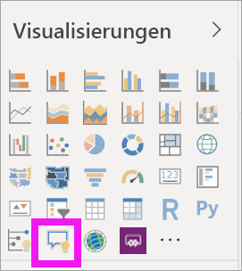

2. Ziehen Sie den Rahmen des Visuals auf die gewünschte Größe.

    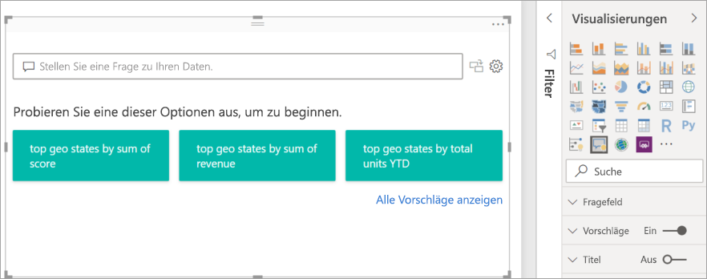

3. Wählen Sie eine der vorgeschlagenen Fragen aus, oder beginnen Sie mit der Eingabe im Fragefeld, um das Visual zu erstellen. In diesem Beispiel wurde der Vorschlag **top geo states by sum of revenue** (Staaten mit dem höchsten Gesamtumsatz) ausgewählt. Power BI wählt den am besten geeigneten Visualtyp aus. In diesem Fall ist dies eine Karte.

    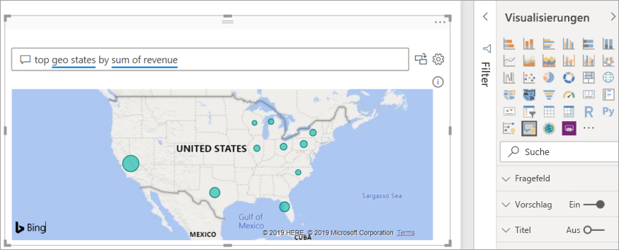

    Wenn Sie einen bestimmten Visualtyp bevorzugen, fügen Sie diese Angabe Ihrer Abfrage in natürlicher Sprache hinzu. Bedenken Sie jedoch, dass nicht jeder Visualtyp auch zu Ihren Daten passen muss. Mit diesen Daten könnten Sie beispielsweise kein sinnvolles Punktdiagramm erstellen. Ein Flächenkartogramm ist jedoch gut geeignet.

    

## Erstellen eines Q&A-Visuals über eine Abfrage in natürlicher Sprache
Im vorherigen Beispiel wurde das Q&A-Visual über eine der vorgeschlagenen Fragen erstellt.  In dieser Übung geben Sie selbst eine Frage ein. Während Sie die Frage eingeben, stellt Power BI automatische Vervollständigungen, Vorschläge und Feedback bereit.

Wenn Sie sich nicht sicher sind, wie die Frage aussehen oder welche Terminologie verwendet werden soll, erweitern Sie die Option **Alle Vorschläge anzeigen**. Alternativ können Sie auch den Bereich „Felder“ auf der rechten Seite des Zeichenbereichs durchsuchen. Auf diese Weise können Sie sich mit den Begriffen und Inhalten des Datasets „Vertrieb und Marketing“ vertraut machen.

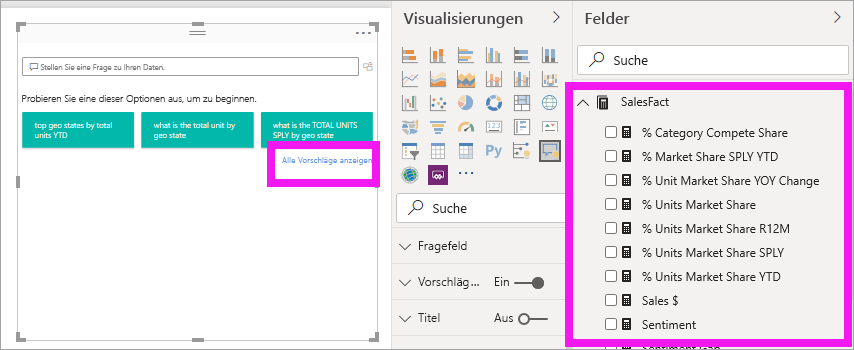

1. Geben Sie im Q&A-Fragefeld eine Frage ein. Power BI unterstreicht Wörter, die nicht erkannt werden, mit einer doppelten roten Linie. Nach Möglichkeit versucht Power BI, nicht erkannte Wörter zu definieren.  Im Beispiel sind beide Vorschläge geeignet.  

    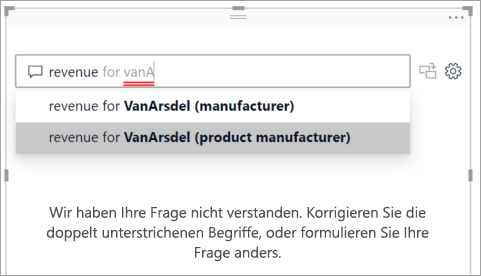

2. Wenn Sie mit der Eingabe der Frage fortfahren, teilt Ihnen Power BI mit, dass die Frage nicht verstanden wird und macht weitere Vorschläge. Im Beispiel unten schlägt Power BI unter „Meinten Sie...“ eine andere Möglichkeit der Formulierung vor, die die Terminologie des Datasets aufgreift. 

    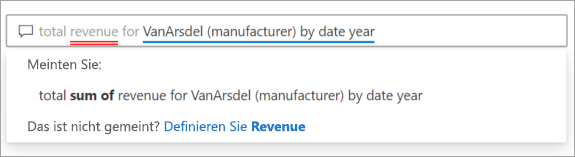

5. Mithilfe der Vorschläge von Power BI war es schließlich möglich, eine Frage bestehend aus erkannten Begriffen zu formulieren. Power BI stellt die Ergebnisse als Liniendiagramm dar. 

    

6. Auf die folgende Weise können Sie das Visual in ein Säulendiagramm ändern. 

    

## Formatieren und Anpassen von Q&A-Visuals
Q&A-Visuals können mithilfe des Bereichs „Formatierung“ und durch Anwenden eines Designs angepasst werden. 

### Anwenden eines Designs
Ein ausgewähltes Design wird auf die gesamte Berichtseite angewendet. Dabei stehen viele Designs zur Auswahl. Probieren Sie aus, mit welchem Design Sie das gewünschte Ergebnis erzielen. 

1. Klicken Sie in der Menüleiste auf die Registerkarte **Start** und anschließend auf **Design wechseln**. 

    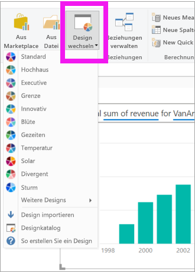

    
    
2. Dieses Beispiel zeigt die ausgewählten Optionen **Weitere Designs** > **Für Farbenblinde geeignet**.

    

### Formatieren von Q&A-Visuals
Sie können ein Q&A-Visual, das Fragefeld und die Art der Anzeige von Vorschlägen formatieren. Dabei können Sie beispielsweise den Hintergrund eines Titels oder die Farbe der Linien beim Zeigen auf nicht erkannte Wörter ändern. Im folgenden Beispiel wurden dem Fragefeld ein grauer Hintergrund hinzugefügt und die Farbe der Unterstreichungen in gelb und grün geändert. Der Titel wurde zentriert und besitzt einen gelben Hintergrund. 

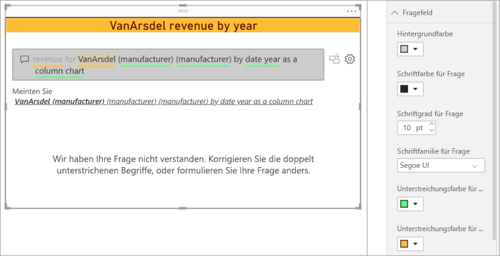

## Umwandeln eines Q&A-Visuals in ein Standardvisual
Dem Säulendiagramm mit dem für Farbenblinde geeigneten Design wurden weitere Formatierungen hinzugefügt: ein Titel und ein Rahmen. Nun können Sie es in ein Standardvisual für den Bericht umwandeln oder an ein Dashboard anheften.

Wählen Sie das Symbol  aus, um **Dieses Q&A-Ergebnis in ein Standardvisual umzuwandeln**.

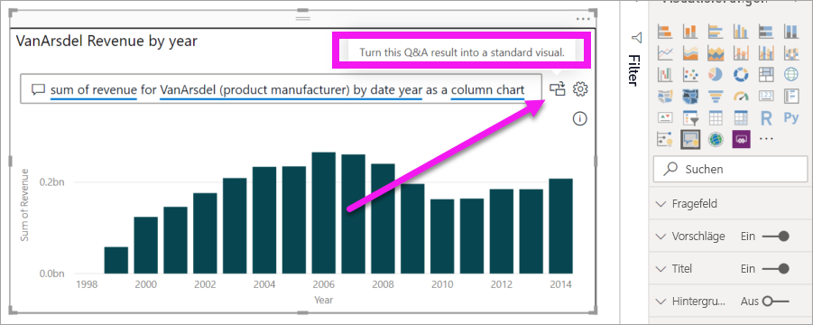

Dieses Visual stellt nun kein Q&A-Visual mehr dar, sondern ein Standardsäulendiagramm. Nun kann es an ein Dashboard angeheftet werden. Im Bericht verhält sich das Visual wie jedes andere Standardvisual. Beachten Sie, dass nun im Bereich „Visualisierungen“ das Symbol für Säulendiagramme ausgewählt ist anstelle des Symbols für Q&A-Visuals.

Wenn Sie den ***Power BI-Dienst*** verwenden, können Sie das Visual jetzt an ein Dashboard anheften, indem Sie auf das Stecknadelsymbol klicken. 

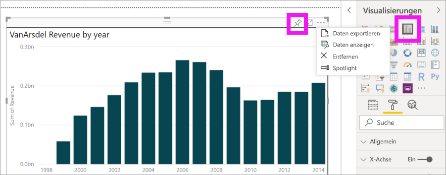

## Erweiterte Funktionen für Q&A-Visuals
Klicken Sie auf das Zahnradsymbol, um den Bereich mit den Q&A-Tools zu öffnen. 

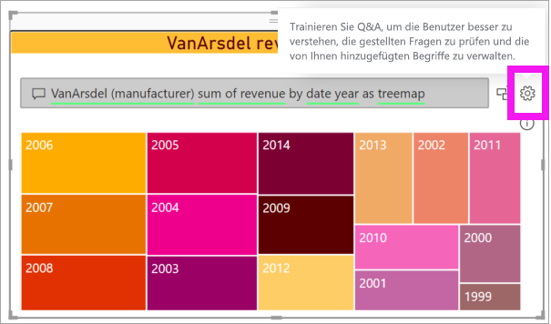

Im Bereich „Tools“ können Sie Q&A für nicht erkannte Begriffe trainieren, diese Begriffe verwalten sowie die vorgeschlagenen Fragen für dieses Dataset und den Bericht verwalten. Sie können außerdem die über dieses Q&A-Visual gestellten Fragen überprüfen sowie Fragen, die von Benutzern gekennzeichnet wurden. Weitere Informationen finden Sie unter [Einführung in Q&A-Tools](../natural-language/q-and-a-tooling-intro.md).

## Zu beachtende Aspekte und Problembehandlung
Q&A-Visuals sind in Office und Bing integriert, um gängige nicht erkannte Wörter nach Möglichkeit mit Feldern in Ihrem Dataset abzugleichen.  

## Nächste Schritte

Sie können natürliche Sprache auf verschiedene Weise integrieren. Weitere Informationen finden Sie in den folgenden Artikeln:

* [Q&A-Tools](../natural-language/q-and-a-tooling-intro.md)
* [Q&A: Bewährte Methoden](../natural-language/q-and-a-best-practices.md)
