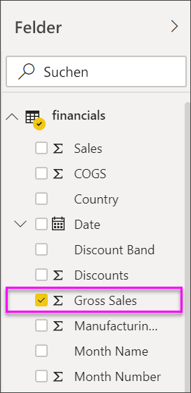
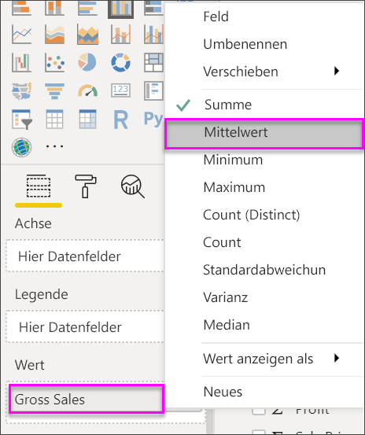
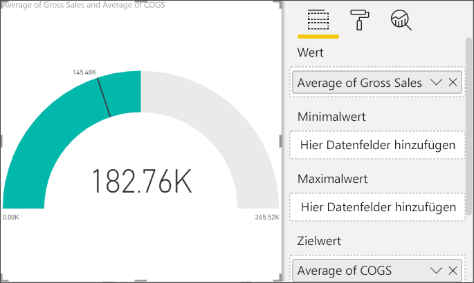
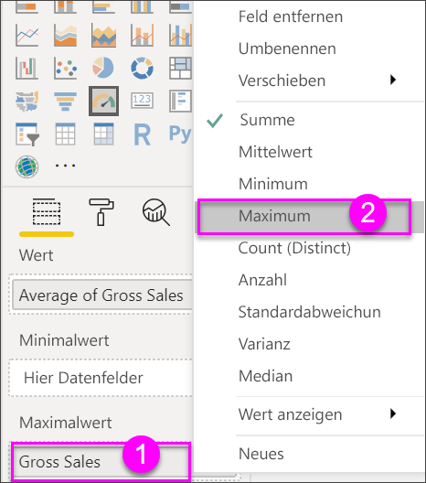
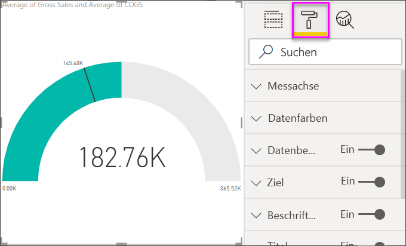
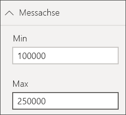
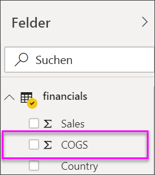
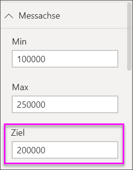
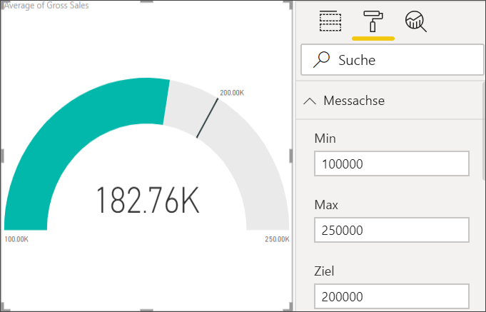

# Radialmessgerät-Diagramme in Power BI

[!INCLUDE [power-bi-visuals-desktop-banner](../includes/power-bi-visuals-desktop-banner.md)]

Ein Diagramm für ein radiales Messgerät verfügt über einen Kreisbogen und zeigt einen einzelnen Wert an, mit dem der Fortschritt bei Erreichen eines Ziels oder ein Key Performance Indicator (KPI) gemessen wird. Die Linie (oder *Nadel*) stellt das Ziel oder den Wert dar. Der Fortschritt beim Erreichen des Ziels wird durch die Schattierung dargestellt. Der Wert innerhalb des Bogens stellt den Fortschrittswert dar. Power BI verteilt alle möglichen Werte gleichmäßig auf dem Bogen, vom kleinsten Wert (ganz links) bis zum höchsten Wert (ganz rechts).

In diesem Beispiel sind Sie ein Autohändler, der die durchschnittlichen Verkäufe seines Vertriebsteams pro Monat verfolgt. Die Nadel stellt ein Verkaufsziel von 140 Autos dar. Der kleinste Wert für die durchschnittlichen Verkäufe ist 0, und der höchste Wert ist auf 200 festgelegt.  Die blaue Schattierung zeigt, dass das Team im aktuellen Monat einen Durchschnitt von ca. 120 Verkäufen erzielt hat. Glücklicherweise ist noch eine Woche Zeit, um das Ziel zu erreichen.

Schauen Sie Will beim Erstellen von Einzelmetrikvisualisierungen wie Messgeräten, Karten und KPIs zu.
   > [!NOTE]
   > Dieses Video verwendet eine ältere Version von Power BI Desktop.
   > 
   > 
<iframe width="560" height="315" src="https://www.youtube.com/embed/xmja6EpqaO0?list=PL1N57mwBHtN0JFoKSR0n-tBkUJHeMP2cP" frameborder="0" allowfullscreen></iframe>

## Einsatzmöglichkeiten für ein radiales Messgerät

Radiale Messgeräte sind gut für folgende Zwecke geeignet:

* Anzeigen des Fortschritts beim Erreichen eines Ziels.

* Darstellen eines Quantilmeasures, z.B. eines KPI.

* Anzeigen der Integrität eines Measures.

* Anzeigen von Informationen, die Sie schnell überprüfen und verstehen können.

## Voraussetzungen

Dieses Tutorial verwendet die [Excel-Datei mit dem Finanzbeispiel](https://download.microsoft.com/download/9/6/D/96DDC2FF-2568-491D-AAFA-AFDD6F763AE3/Retail%20Analysis%20Sample%20PBIX.pbix).

1. Wählen Sie im oberen linken Bereich der Menüleiste **Daten abrufen** > **Excel** aus.
   
2. Suchen Sie Ihre Kopie der **Excel-Datei mit dem Finanzbeispiel**.

1. Öffnen Sie die **Excel-Datei mit dem Finanzbeispiel** in der Berichtsansicht .

1. Wählen Sie **Finanzdaten** und **Blatt1** aus.

1. Klicken Sie auf **Laden**.

1. Auswählen  um eine neue Seite hinzuzufügen.

## Erstellen eines einfachen radialen Messgeräts

### Schritt 1: Erstellen eines Messgeräts zum Nachverfolgen des Bruttoumsatzes

1. Beginnen Sie auf einer leeren Berichtsseite.

1. Wählen Sie im Bereich **Felder** die Option **Bruttoumsatz** aus.

   

1. Ändern Sie die Aggregation in **Mittelwert**.

   

1. Wählen Sie das Messgerätsymbol aus  um das Säulendiagramm in ein Messgerätdiagramm zu konvertieren.

    

    Je nachdem, wann Sie die **Finanzbeispiel**-Datei herunterladen, werden möglicherweise Zahlen angezeigt, die mit diesen Zahlen nicht übereinstimmen.

    > [!TIP]
    > Power BI erstellt standardmäßig ein Messgerätdiagramm, in dem der aktuelle Wert (hier: **Mittelwert des Bruttoumsatzes**) in der Mitte der Messgerätskala angeordnet ist. Da der **Mittelwert des Bruttoumsatzes** 182.760 US-Dollar beträgt, ist der Startwert (Minimum) auf 0 und der Endwert (Maximum) auf das Doppelte des aktuellen Werts festgelegt.

### Schritt 3: Festlegen eines Zielwerts

1. Ziehen Sie **COGS** aus dem Bereich **Felder** auf den Bereich **Zielwert**.

1. Ändern Sie die Aggregation in **Mittelwert**.

   Power BI fügt eine Nadel hinzu, um den Zielwert von **145.480 US-Dollar**anzugeben.

   

    Sie sehen also, dass wir unser Ziel übererfüllt haben.

   > [!NOTE]
   > Sie können auch manuell einen Zielwert eingeben. Siehe Abschnitt [Verwenden manueller Formatierungsoptionen zum Festlegen der Werte für Minimum, Maximum und Ziel](#use-manual-format-options-to-set-minimum-maximum-and-target-values).

### Schritt 4: Festlegen eines Maximalwerts

In Schritt 2 verwendete Power BI das Feld **Wert**, um den kleinsten und den höchsten Wert automatisch festzulegen. Was geschieht, wenn Sie einen eigenen Maximalwert festlegen möchten? Angenommen, Sie möchten nicht die Verdopplung des aktuellen Werts als möglichen Maximalwert verwenden, sondern Sie möchten ihn auf den höchsten Bruttoumsatzwert in Ihrem Dataset festlegen.

1. Ziehen Sie **Bruttoumsatz** aus dem Bereich **Felder** in den Bereich **Maximalwert**.

1. Ändern Sie die Aggregation in **Maximum**.

   

   Das Messgerät wird mit dem neuen Endwert – Bruttoumsatz von 1,21 Millionen – neu gezeichnet.

   

### Schritt 5: Bericht speichern

1. [Speichern Sie den Bericht](../service-report-save.md).

## Verwenden manueller Formatierungsoptionen zum Festlegen der Werte für Minimum, Maximum und Ziel

1. Entfernen Sie **Maximaler Bruttoumsatz** aus dem Bereich **Maximalwert** .

1. Wählen Sie das Farbrollensymbol aus, um den Bereich **Format** zu öffnen.

   

1. Erweitern Sie **Messachse**, und geben Sie Werte für **Min** und **Max** ein.

    

1. Deaktivieren Sie die Option **COGS** im Bereich **Felder**, um den Zielwert zu entfernen.

    

1. Wenn das Feld **Ziel** unter **Messachse**angezeigt wird, geben Sie einen Wert ein.

     

1. Optional können Sie mit der Formatierung des Tachometerdiagramms fortfahren.

Nachdem Sie diese Schritte abgeschlossen haben, haben Sie ein Messgerätdiagramm, das etwa wie folgt aussieht:

## Nächster Schritt

* [KPI-Visualisierung](power-bi-visualization-kpi.md)

* [Visualisierungstypen in Power BI](power-bi-visualization-types-for-reports-and-q-and-a.md)

Weitere Fragen? [Wenden Sie sich an die Power BI-Community](https://community.powerbi.com/)
