# Tabellen in Power BI-Berichten und -Dashboards

Eine Tabelle ist ein Raster, das zusammengehörende Daten in einer logischen Folge von Zeilen und Spalten enthält. Zudem können auch Kopfzeilen und eine Zeile für Summen enthalten sein. Tabellen empfehlen sich insbesondere für quantitative Vergleiche, bei denen Sie viele Werte einer einzigen Kategorie betrachten. In dieser Tabelle werden beispielsweise fünf verschiedene Measures für die **Kategorie** angezeigt.

Erstellen Sie Tabellen in Berichten, und heben Sie Elemente in der Tabelle mit anderen Visuals auf der gleichen Berichtsseite übergreifend hervor. Sie können Zeilen, Spalten und sogar einzelne Zellen für die Kreuzhervorhebung auswählen. Sie können auch einzelne und mehrere ausgewählte Zellen kopieren und in andere Anwendungen einfügen.

## Verwenden von Tabellen

Tabellen sind für folgende Zwecke gut geeignet:

* Anzeigen und Vergleichen detaillierter Daten und genauer Werte (anstelle von visuellen Darstellungen).

* Auflisten von Daten in einem Tabellenformat.

* Anzeigen numerischer Daten nach Kategorien.

> [!NOTE]
> Enthält eine Tabelle zu viele Werte, erwägen Sie, sie in eine Matrix zu konvertieren und/oder die Drilldownfunktion zu verwenden. Es werden maximal 3.500 Datenpunkte angezeigt.

## Voraussetzungen

* Der Power BI-Dienst oder Power BI Desktop

* Bericht zum Analysebeispiel für den Einzelhandel

## Abrufen des Berichts zum Analysebeispiel für den Einzelhandel

In dieser Anleitung wird das Analysebeispiel für den Einzelhandel verwendet. Zum Erstellen einer Visualisierung benötigen Sie Bearbeitungsberechtigungen für das Dataset und den Bericht. Erfreulicherweise können die Power BI-Beispiele alle bearbeitet werden. Wenn jemand einen Bericht für Sie freigegeben hat, können Sie keine Visualisierungen in Berichten erstellen. Öffnen Sie zum besseren Verständnis den [Bericht zum Analysebeispiel für den Einzelhandel](../sample-datasets.md).

Nach dem Abrufen des Datasets für das **Analysebeispiel für den Einzelhandel** können Sie beginnen.

## Erstellen einer Tabelle

Sie erstellen die am Anfang des Artikels abgebildete Tabelle, um Umsatzwerte nach Artikelkategorien anzuzeigen.

1. Wählen Sie in **Mein Arbeitsbereich** die Option **Datasets** > **Bericht erstellen** aus.

    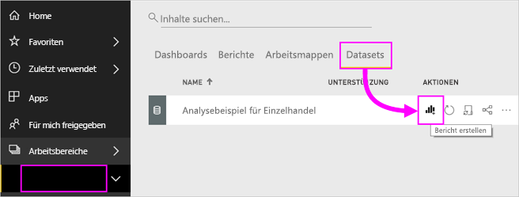

1. Wählen Sie im Bereich **Felder** **Element** > **Kategorie** aus.

    Power BI erstellt automatisch eine Tabelle, in der alle Kategorien aufgelistet werden.

    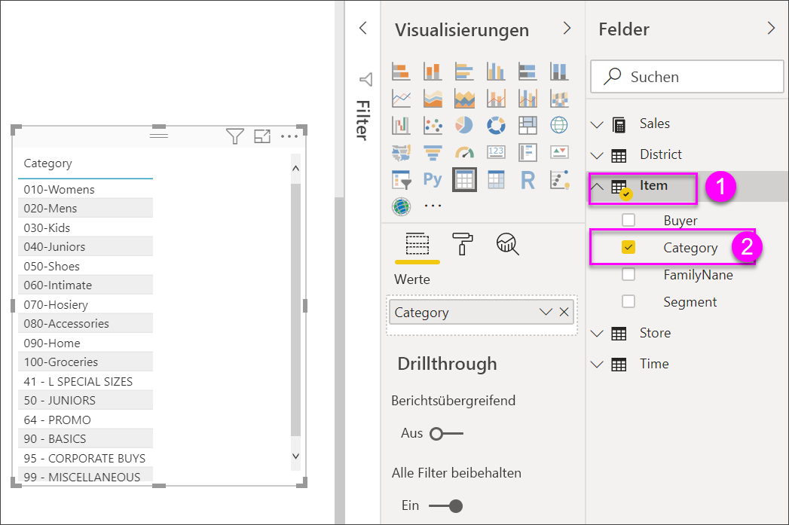

1. Wählen Sie **Verkäufe > Durchschnittlicher Einzelpreis** und **Verkäufe > Verkäufe im letzten Jahr** aus.

1. Wählen Sie dann **Verkäufe > Verkäufe in diesem Jahr** aus, und wählen Sie alle drei Optionen aus: **Wert**, **Ziel** und **Status**.

1. Suchen Sie im Bereich **Visualisierung** den Bereich **Werte**, und verschieben Sie die Werte mit Drag & Drop, bis die Reihenfolge der Diagrammspalten der in der ersten Abbildung auf dieser Seite entspricht. Ihre **Werte** sehen nun wie folgt aus:

    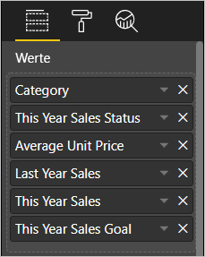

1. Heften Sie die Tabelle durch Auswählen des Anheften-Symbols am Dashboard an  in der rechten oberen Ecke des Visuals.

## Formatieren der Tabelle

Es gibt viele Möglichkeiten, eine Tabelle zu formatieren. Nur wenige werden hier behandelt. Eine hervorragende Möglichkeit, die weiteren Formatierungsoptionen kennenzulernen ist, den Bereich **Format** zu öffnen (Farbrollensymbol ) und ihn genauer zu betrachten.

* Experimentieren Sie mit der Formatierung des Tabellenrasters. Hier fügen Sie ein blaues vertikales Raster hinzu sowie Abstand zwischen den Zeilen und vergrößern Kontur und Text.

    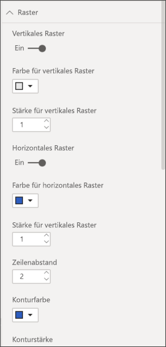

    

* Ändern Sie bei den Spaltenüberschriften die Hintergrundfarbe, fügen Sie eine Kontur hinzu und setzen Sie die Schriftgröße herauf.

    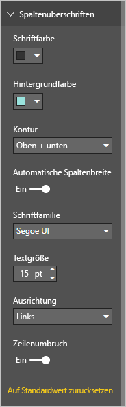

    

* Sie können sogar einzelne Spalten und Spaltenheader formatieren. Erweitern Sie dazu zunächst die **Feldformatierung**, und wählen Sie die zu formatierende Spalte aus der Dropdownliste aus. Je nach Spaltenwerten können Sie über die **Feldformatierung** u.a. Folgendes festlegen: Anzeigeeinheiten, Schriftfarbe, Anzahl der Dezimalstellen, Hintergrund, Ausrichtung und mehr. Wenn Sie die Einstellungen angepasst haben, können Sie diese auch auf die Header und die Ergebniszeile anwenden.

    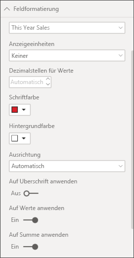

    

* Unten sehen Sie die fertige Tabelle nach einigen weiteren Formatierungen.

    

### Bedingte Formatierung

*Bedingte Formatierung* ist eine Art der Formatierung. Power BI wendet bedingte Formatierung auf Felder im Bereich **Werte** des Bereichs **Visualisierungen** an.

Mit der bedingten Formatierung für Tabellen können Sie benutzerdefinierte Hintergrundfarben für Zellen und Schriftfarben auf Grundlage von Zellwerten angeben, u.a. mit Verlaufsfarben.

1. Wählen Sie im Bereich **Visualisierungen** das Symbol **Felder**  aus.

1. Wählen Sie im Bereich **Werte** neben dem Wert, den Sie formatieren möchten, den nach unten gerichteten Pfeil aus (oder klicken Sie mit der rechten Maustaste in das Feld).

    > [!NOTE]
    > Sie können die bedingte Formatierung nur für Felder im Bereich **Werte** des Bereichs **Felder** verwalten.

    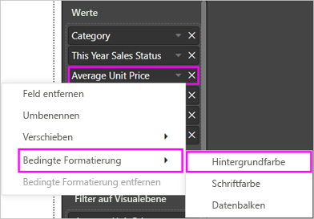

1. Wählen Sie **Hintergrundfarbe** aus.

1. Im angezeigten Dialogfeld können Sie die Farbe sowie die Werte für **Minimum** und **Maximum** konfigurieren. Wenn Sie die Option **Abweichend** aktivieren, können Sie auch einen optionalen Wert für **Zentriert** konfigurieren.

    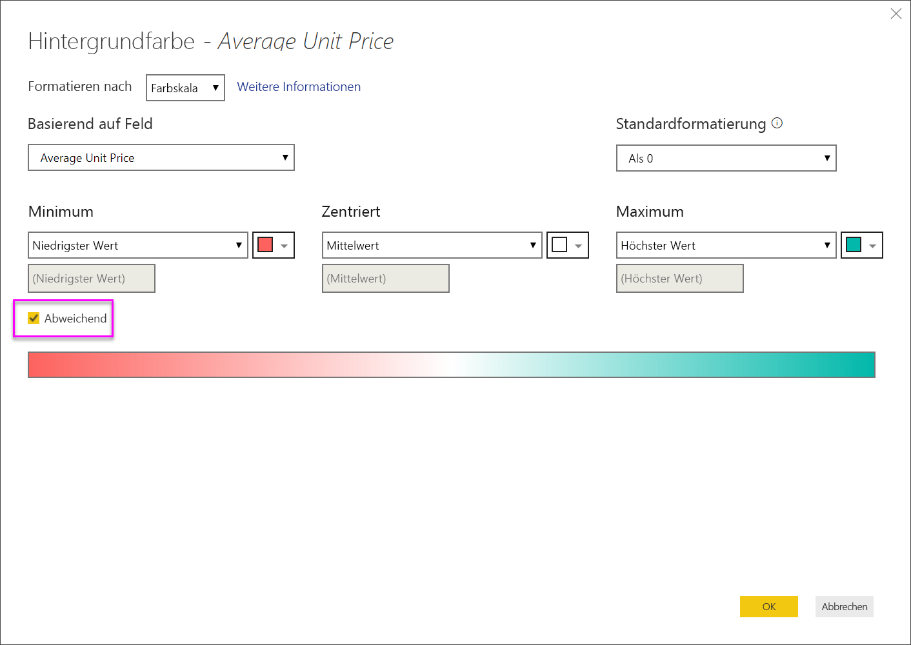

    Lassen Sie uns jetzt einige benutzerdefinierte Formatierungen auf die Werte für den durchschnittlichen Einzelpreis anwenden. Wählen Sie **Abweichend** aus, fügen Sie Farben hinzu, und wählen Sie **OK** aus.

    
1. Fügen Sie der Tabelle ein neues Feld mit positiven und negativen Werten hinzu. Wählen Sie **Verkäufe > Gesamtabweichung Verkäufe** aus.

    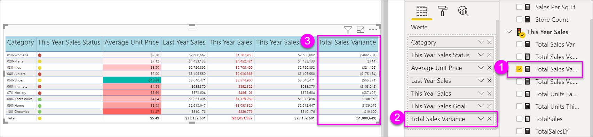

1. Fügen Sie eine bedingte Formatierung für Datenbalken hinzu, indem Sie den Dropdownpfeil neben **Gesamtabweichung Verkäufe** und dann **Bedingte Formatierung > Datenbalken** auswählen.

    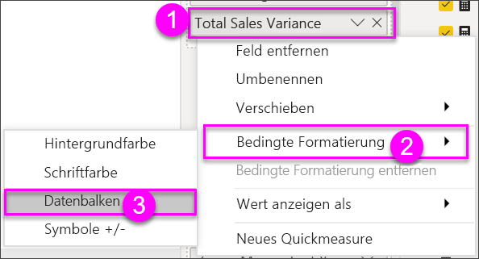

1. Legen Sie im daraufhin angezeigten Dialogfeld Farben für **Positiver Balken** und **Negativer Balken** fest, aktivieren Sie die Option **Nur Balken anzeigen**, und nehmen Sie ggf. weitere Änderungen vor.

    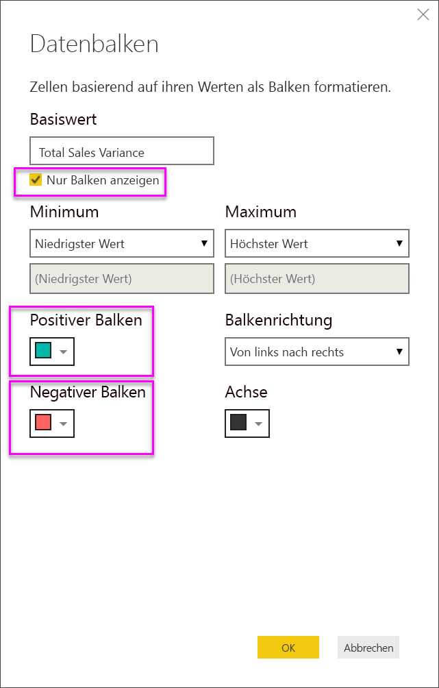

1. Wählen Sie **OK**aus.

    Datenbalken ersetzen die numerischen Werte in der Tabelle und sind so leichter zu erkennen.

    

Wenn Sie eine bedingte Formatierung aus einer Visualisierung entfernen möchten, klicken Sie einfach mit der rechten Maustaste erneut auf das Feld, und wählen Sie **Bedingte Formatierung entfernen** aus.

> [!TIP]
> Die bedingte Formatierung ist auch über den Bereich **Format** verfügbar. Wählen Sie den zu formatierenden Wert aus, und legen Sie dann **Farbskalen** oder **Datenbalken** auf **Ein** fest, um die Standardeinstellungen zu übernehmen. Wenn Sie die Einstellungen anpassen möchten, wählen Sie **Erweiterte Steuerelemente** aus.

## Kopieren von Werten aus Power BI-Tabellen zum Verwenden in anderen Anwendungen

Womöglich enthält Ihre Matrix oder Tabelle Inhalte, die Sie in anderen Anwendungen wie Dynamics CRM oder Excel oder sogar in anderen Power BI-Berichten verwenden möchten. Wenn Sie in Power BI mit der rechten Maustaste in eine Zelle klicken, können sie in die Daten in einer einzelnen Zelle oder einer Zellenauswahl in Ihre Zwischenablage kopieren und in die andere Anwendung einfügen.

So kopieren Sie den Wert einer einzelnen Zelle:

1. Wählen Sie die Zelle aus, die Sie kopieren möchten.

1. Klicken Sie mit der rechten Maustaste in die Zelle.

1. Wählen Sie **Kopieren** > **Wert kopieren** aus.

    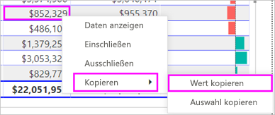

    Der unformatierte Zellenwert befindet sich in der Zwischenablage und lässt sich in eine andere Anwendung einfügen.

So kopieren Sie mehrere Zellen:

1. Markieren Sie einen Zellbereich, oder verwenden Sie die **STRG-TASTE**, um eine oder mehrere Zellen auszuwählen.

1. Klicken Sie mit der rechten Maustaste in eine der Zellen, die Sie ausgewählt haben.

1. Wählen Sie **Kopieren** > **Auswahl kopieren** aus.

    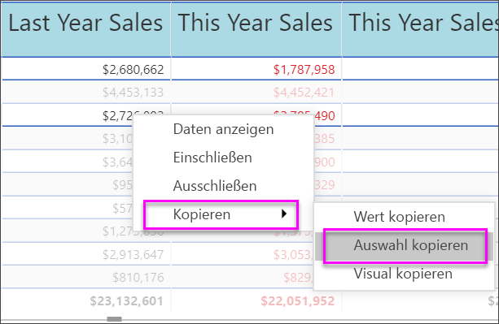

    Die Kopie enthält die Spalten- und Zeilenüberschriften.

    

## Anpassen der Spaltenbreite in einer Tabelle

Gelegentlich wird in Power BI eine Spaltenüberschrift in einem Bericht oder in einem Dashboard abgeschnitten. Zeigen Sie zum Anzeigen des gesamten Spaltennamens mit dem Mauszeiger auf den Bereich rechts neben der Überschrift, um die Doppelpfeile einzublenden, wählen Sie sie aus, und ziehen Sie sie.

## Zu beachtende Aspekte und Problembehandlung

Wenn Sie die Spaltenformatierung anwenden, können Sie nur eine Ausrichtungsoption pro Spalte auswählen: **Auto**, **Links**, **Zentriert**, **Rechts**. Normalerweise enthält eine Spalte den gesamten Text oder alle Zahlen und keine Mischung daraus. In Fällen, in denen eine Spalte jeweils Zahlen und Text enthält, wird durch die Auswahl von **Auto** der Text links ausgerichtet, und die Zahlen werden rechts ausgerichtet. Dieses Verhalten unterstützt Sprachen, bei denen von links nach rechts gelesen wird.

## Nächste Schritte

* [Treemaps in Power BI](power-bi-visualization-treemaps.md)

* [Visualisierungstypen in Power BI](power-bi-visualization-types-for-reports-and-q-and-a.md)
