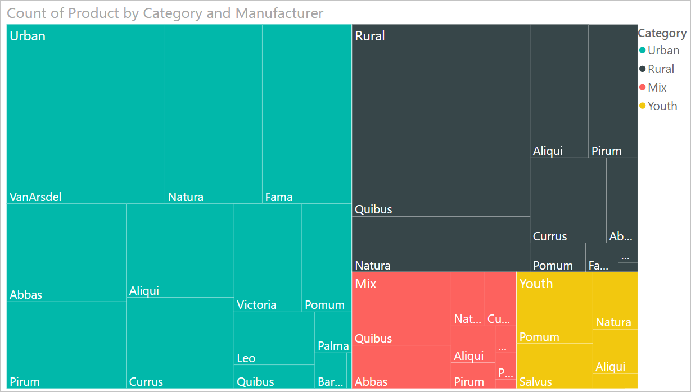
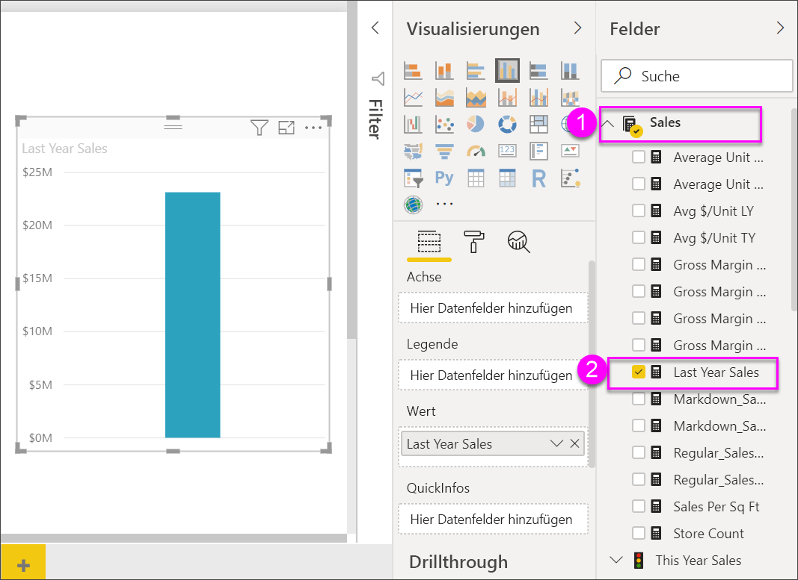
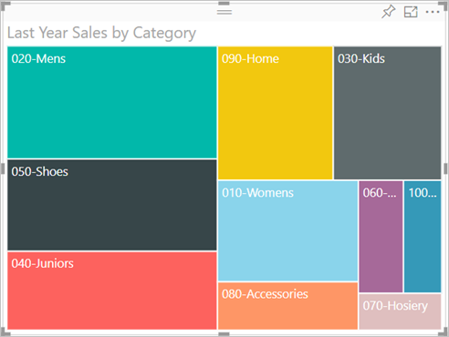
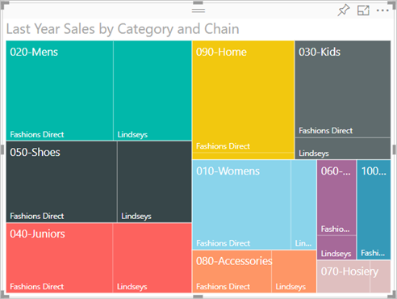
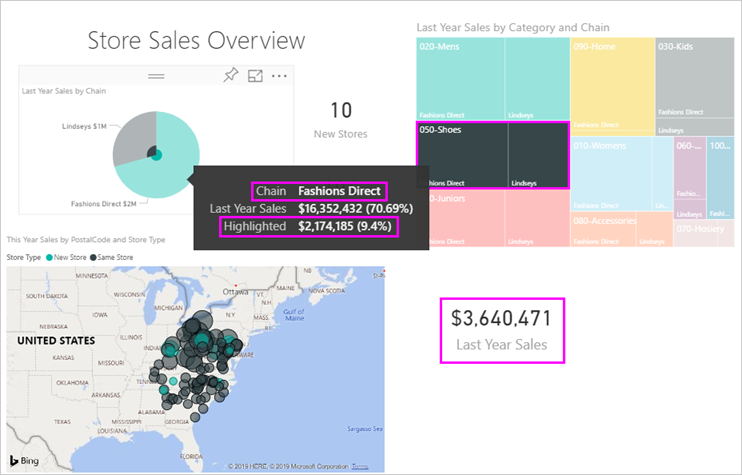

# Treemaps in Power BI

[!INCLUDE [power-bi-visuals-desktop-banner](../includes/power-bi-visuals-desktop-banner.md)]

Treemaps zeigen hierarchische Daten als verschachtelten Rechtecke an. Jede Hierarchieebene wird durch ein farbiges Rechteck (Verzweigung) dargestellt, das kleinere Rechtecke (Blätter) enthält. Power BI macht die Größe der Fläche in jedem Rechteck vom gemessenen Wert abhängig. Die Rechtecke werden von oben links (das Größte) nach unten rechts (das Kleinste) angeordnet.

Wenn Sie beispielsweise Ihre Verkäufe analysieren, haben Sie möglicherweise Verzweigungen auf höchster Ebene für die Kleidungskategorien: **In der Stadt**, **Auf dem Land**, **Jugend** und **Mix**. Power BI würde für die Bekleidungshersteller innerhalb dieser Kategorie Ihre Kategorierechtecke in Blätter aufteilen. Die Größe und Schattierungen dieser Blätter werden wiederum den Verkaufszahlen angepasst.

In der Verzweigung **In der Stadt** wurden viele Kleidungsstücke von **VanArsdel** verkauft. Von **Natura** und **Fama** wurde weniger verkauft. Nur wenig wurde von **Leo** verkauft. Demnach sieht die Verzweigung **In der Stadt** Ihres Treemap-Diagramms wie folgt aus:

* Das größte Rechteck für **VanArsdel** befindet sich oben links in der Ecke.

* Die Rechtecke für **Natura** und **Fama** sind etwas kleiner.

* Es gibt viele Rechtecke für alle anderen verkauften Kleidungsstücke.

* Es gibt ein kleines Rechteck für **Leo**.

Sie könnten die Anzahl der in anderen Kleidungskategorien verkauften Artikeln durch Vergleich von Größe und Schattierung der einzelnen Blattknoten vergleichen. Je größer und dunkler schattiert das Rechteck ist, desto höher ist der Wert.

Sie möchten sich zunächst einmal ansehen, wie ein Treemap-Diagramm erstellt wird? Ab Position 2:10 erläutert Amanda in diesem Video das Erstellen eines Treemap-Diagramms.

   > [!NOTE]
   > Dieses Video verwendet eine ältere Version von Power BI Desktop.
   > 
   > 

<iframe width="560" height="315" src="https://www.youtube.com/embed/IkJda4O7oGs" frameborder="0" allowfullscreen></iframe>

## Verwenden von Treemaps

Treemaps sind gut geeignet:

* Zum Anzeigen großer Mengen hierarchischer Daten.

* Bei einer Anzahl von Werten, die für ein Balkendiagramm zu groß wäre.

* Zum Darstellen des Verhältnisses zwischen den einzelnen Teilen und der Gesamtmenge.

* Zum Anzeigen der Verteilung der einzelnen Werte innerhalb jeder Kategorieebene in der Hierarchie.

* Zum Anzeigen von Attributen über Größe und Farbcodierung.

* Zum Erkennen von Mustern, Ausreißern, der wichtigsten Einflussfaktoren und Ausnahmen.

## Voraussetzung

Dieses Tutorial verwendet die [PBIX-Datei mit einem Analysebeispiel für den Einzelhandel](https://download.microsoft.com/download/9/6/D/96DDC2FF-2568-491D-AAFA-AFDD6F763AE3/Retail%20Analysis%20Sample%20PBIX.pbix).

1. Wählen Sie im oberen linken Bereich der Menüleiste **Datei** > **Öffnen** aus.
   
2. Suchen Sie Ihre Kopie der **PBIX-Datei mit einem Analysebeispiel für den Einzelhandel**.

1. Öffnen Sie die **PBIX-Datei mit einem Analysebeispiel für den Einzelhandel** in der Berichtsansicht .

1. Auswählen  um eine neue Seite hinzuzufügen.

Nach dem Abrufen des Datasets für das **Analysebeispiel für den Einzelhandel** können Sie beginnen.

## Erstellen eines einfachen Treemap-Diagramms

Sie erstellen einen Bericht und fügen ein einfaches Treemap-Diagramm hinzu.

1. Wählen Sie im Bereich **Felder** das Measure **Verkäufe** > **Verkäufe im letzten Jahr** aus.

   

1. Wählen Sie das Treemap-Diagrammsymbol  aus, um das Diagramm in ein Treemap-Diagramm umzuwandeln.

   

1. Wählen Sie **Element** > **Kategorie** aus, wodurch dem Bereich **Gruppe** noch **Kategorie** hinzugefügt wird.

    Power BI erstellt ein Treemap-Diagramm, in dem die Größe der Rechtecke auf dem Gesamtumsatz basiert und die Farbe die Kategorie widerspiegelt. Im Wesentlichen haben Sie eine Hierarchie erstellt, die die relative Größe des Gesamtumsatzes nach Kategorie visuell darstellt. In der Kategorie **Herren** wurden die höchsten Umsätze verzeichnet, in der Kategorie **Strumpfwaren** hingegen die niedrigsten.

    

1. Wählen Sie **Laden** > **Kette** aus, wodurch dem Bereich **Details** noch **Kette** hinzugefügt wird, um das Treemap-Diagramm zu vervollständigen. Sie können den Vorjahresumsatzes jetzt nach Kategorie und Kette vergleichen.

   

   > [!NOTE]
   > Farbsättigung und Details können nicht gleichzeitig verwendet werden.

1. Zeigen Sie auf einen **Kettenbereich** , um die QuickInfo für diesen Teil der **Kategorie**anzuzeigen.

    Wenn Sie in dem Rechteck **090-Home** z.B. mit dem Mauszeiger über **Fashions Direct** fahren, wird die QuickInfo zum Fashions Direct-Teil der Kategorie „Home“ angezeigt.

   

## Hervorheben und Kreuzfiltern

Das Markieren von **Kategorien** oder **Details** in einem Treemap-Diagramm ermöglicht die Kreuzhervorhebung und Kreuzfilterung anderer Visualisierungen auf der Berichtsseite. Fügen Sie dieser Berichtsseite entweder einige Visuals hinzu, oder kopieren Sie das Treemap-Diagramm auf eine der anderen Seiten in diesem Bericht. Im folgenden Bild wurde das Treemap-Diagramm auf die Seite **Übersicht** kopiert. 

1. Wählen Sie im Treemap-Diagramm entweder eine **Kategorie** oder eine **Kette** innerhalb einer **Kategorie** aus. Dadurch erfolgt eine Kreuzhervorhebung der anderen Visualisierungen auf der Seite. Wenn Sie beispielsweise **050-Schuhe** auswählen, wird für Schuhe ein Umsatz von **16.352.432 $** für das letzte Jahr angezeigt, wobei **2.174.185 $** auf **Fashions Direct** entfielen.

   

1. Wählen Sie im Kreisdiagramm **Verkäufe im letzten Jahr nach Kette** das Segment **Fashions Direct** aus, um eine Kreuzfilterung des Treemap-Diagramms durchzuführen.
   

1. Informationen zum Steuern der Kreuzhervorhebung und Kreuzfilterung von Diagrammen finden Sie unter [Ändern der Interaktion von Visualisierungen in einem Power BI-Bericht](../service-reports-visual-interactions.md).

## Nächste Schritte

* [Wasserfalldiagramme in Power BI](power-bi-visualization-waterfall-charts.md)

* [Visualisierungstypen in Power BI](power-bi-visualization-types-for-reports-and-q-and-a.md)
