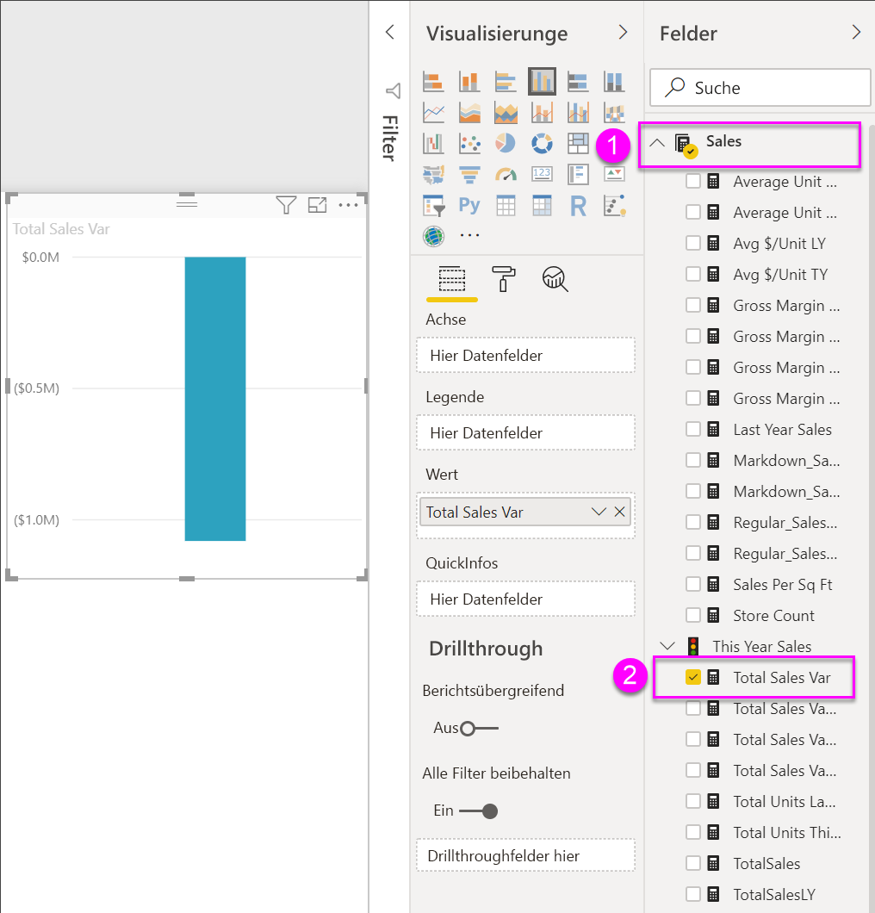
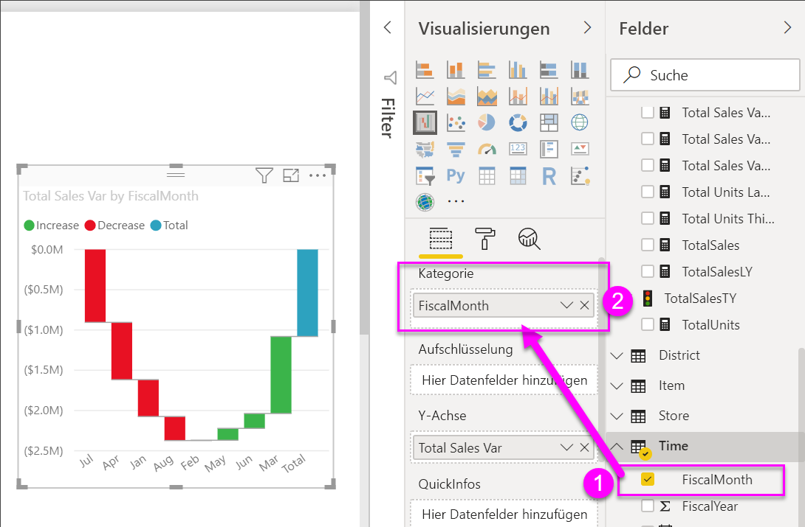
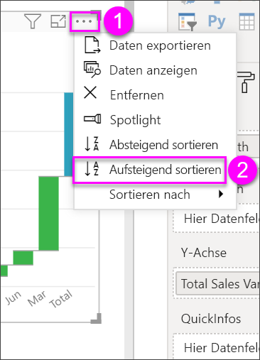
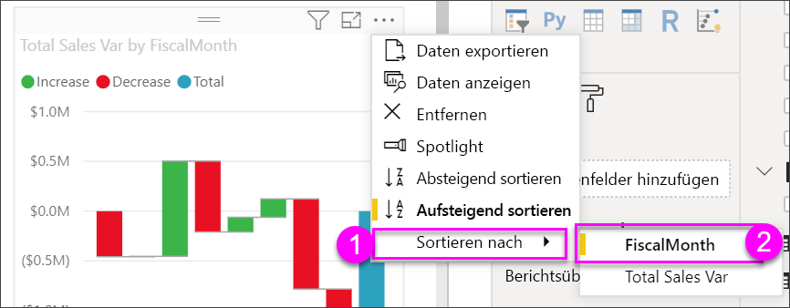
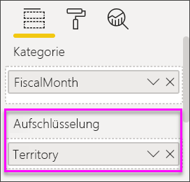
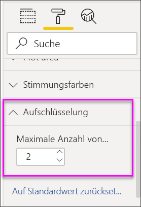

# Wasserfalldiagramme in Power BI

[!INCLUDE [power-bi-visuals-desktop-banner](../includes/power-bi-visuals-desktop-banner.md)]

Wasserfalldiagramme zeigen eine laufende Summe an, während Power BI Werte hinzugefügt oder entfernt. Sie sind nützlich, um zu verdeutlichen, wie ein anfänglicher Wert (z.B. das Nettoeinkommen) durch eine Reihe von positiven und negativen Änderungen beeinflusst wird.

Die Säulen sind farbkodiert, damit Sie Zu- und Abnahmen der Werte schnell erkennen können. Die Säulen für den Anfangs- und den Endwert [gehen häufig von der horizontalen Achse aus](https://support.office.com/article/Create-a-waterfall-chart-in-Office-2016-for-Windows-8de1ece4-ff21-4d37-acd7-546f5527f185#BKMK_Float "Starten Sie auf der horizontalen Achse"), während die Zwischenwerte unverankerte Säulen sind. Aufgrund dieses Aussehens werden Wasserfalldiagramme auch als „Brückendiagramme“ bezeichnet.

   > [!NOTE]
   > Dieses Video verwendet eine ältere Version von Power BI Desktop.
   > 
   > 

<iframe width="560" height="315" src="https://www.youtube.com/embed/qKRZPBnaUXM" frameborder="0" allow="autoplay; encrypted-media" allowfullscreen></iframe>

## Einsatz von Wasserfalldiagrammen

Wasserfalldiagramme sind gut für folgende Zwecke geeignet:

* Bei Änderungen der Zahlen im Laufe der Zeit, für eine Serie oder über verschiedene Kategorien hinweg.

* Zum Überwachen der wichtigsten Änderungen am Gesamtwert.

* Zum Anzeigen des jährlichen Gewinns Ihres Unternehmens mithilfe einer Darstellung verschiedener Umsatzquellen und letztendlich des Gesamtgewinns (oder -verlusts).

* Zum Illustrieren der Mitarbeiterzahl Ihres Unternehmens zu Jahresbeginn und -ende.

* Zum Visualisieren Ihrer Einnahmen und Ausgaben pro Monat und des laufenden Kontostands für Ihr Konto.

## Voraussetzung

Dieses Tutorial verwendet die [PBIX-Datei mit einem Analysebeispiel für den Einzelhandel](https://download.microsoft.com/download/9/6/D/96DDC2FF-2568-491D-AAFA-AFDD6F763AE3/Retail%20Analysis%20Sample%20PBIX.pbix).

1. Wählen Sie im oberen linken Bereich der Menüleiste **Datei** > **Öffnen** aus.
   
2. Suchen Sie Ihre Kopie der **PBIX-Datei mit einem Analysebeispiel für den Einzelhandel**.

1. Öffnen Sie die **PBIX-Datei mit einem Analysebeispiel für den Einzelhandel** in der Berichtsansicht .

1. Auswählen  um eine neue Seite hinzuzufügen.

## Erstellen eines Wasserfalldiagramms

Sie erstellen ein Wasserfalldiagramm, mit dem Abweichungen beim Umsatz (geschätzter Umsatz im Vergleich zu tatsächlichen Verkaufszahlen) nach Monat dargestellt werden.

1. Wählen Sie im Bereich **Felder** die Option **Verkäufe** > **Gesamtabweichung Verkäufe** aus.

   

1. Wählen Sie das Wasserfallsymbol 

    

1. Wählen Sie **Zeit** > **FiscalMonth** aus, um den Wert dem Bereich **Kategorie** hinzuzufügen.

    

1. Stellen Sie sicher, dass Power BI das Wasserfalldiagramm chronologisch sortiert hat. Wählen Sie in der rechten oberen Ecke des Diagramms **Weitere Optionen** (...) aus.

    In diesem Beispiel wird **Aufsteigend sortieren** verwendet.

    Überprüfen Sie, ob sich links von **Aufsteigend sortieren** ein gelber Indikator befindet. Dies gibt an, dass die ausgewählte Option angewendet wird.

    

    Klicken Sie als nächstes auf **Sortieren nach**, und wählen Sie **FiscalMonth** aus. Wie beim vorherigen Schritt zeigt ein gelber Indikator neben Ihrer Auswahl an, wann Ihre Auswahloption angewendet wird.

    

    Sie können auch die Werte auf der X-Achse betrachten und sehen dann, dass sie in der Reihenfolge von **Jan** bis **Aug** sortiert sind.

    Analysieren Sie die Informationen genauer, um zu ermitteln, was von Monat zu Monat am stärksten zu den Änderungen beiträgt.

1.  Wählen Sie **Laden** > **Gebiet** aus, wodurch dem Bucket **Aufschlüsselung** noch **Gebiet** hinzugefügt wird.

    

    Standardmäßig fügt Power BI die wichtigsten fünf Faktoren für die Steigerungen oder Verringerungen pro Monat hinzu. Das folgende Bild hat den Visualisierungsbereich erweitert, um weitere Daten einzuschließen. 

    

    Sie interessieren sich aber nur für die ersten beiden Faktoren.

1. Wählen Sie im Bereich **Format** **Aufschlüsselung** aus, und legen Sie für **Max. Aufschlüsselungen** **2** fest.

    

    Ein kurzer Blick zeigt, dass die Gebiete „Ohio“ und „Pennsylvania“ im Wasserfalldiagramm den größten Anteil an positiven wie negativen Änderungen haben.

    

## Nächste Schritte

* [Ändern der Interaktion von Visualisierungen in einem Power BI-Bericht](../service-reports-visual-interactions.md)

* [Visualisierungstypen in Power BI](power-bi-visualization-types-for-reports-and-q-and-a.md)
