# Tipps und Tricks zur Farbformatierung in Power BI
Power BI bietet viele unterschiedliche Methoden zum Anpassen der Dashboards und Berichte. In diesem Artikel erhalten Sie Tipps, wie Sie Ihre Power BI-Visualisierungen ansprechender, interessanter und personalisierter gestalten können.

Nachfolgend finden Sie einige Tipps. Haben Sie weitere tolle Tipps? Sehr gut! Wenn Sie sie uns zukommen lassen, nehmen wir sie möglicherweise in diese Liste auf.

* Anwenden eines Designs auf den gesamten Bericht
* Farbe eines einzelnen Datenpunkts ändern
* Farben eines Diagramms nach einem numerischen Wert vergeben
* Farbe der Datenpunkte nach einem numerischen Wert vergeben
* Farben in der Farbskala anpassen
* Abweichende Farbskalen verwenden
* Änderungen in Power BI rückgängig machen

Um Änderungen vorzunehmen, müssen Sie einen Bericht bearbeiten. Öffnen Sie den Bericht, und wählen Sie in der Menüleiste **Bericht bearbeiten** aus, wie im folgenden Bild gezeigt.

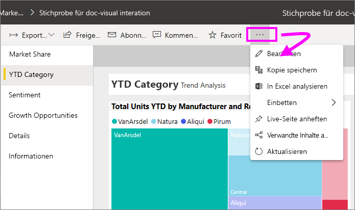

Wenn die Bereiche **Filter** und **Visualisierungen** auf der rechten Seite des Berichtszeichenbereichs angezeigt werden, können Sie den Bericht anpassen. Wenn die Bereiche nicht angezeigt werden, klicken Sie auf den Pfeil in der oberen rechten Ecke, um sie zu öffnen.

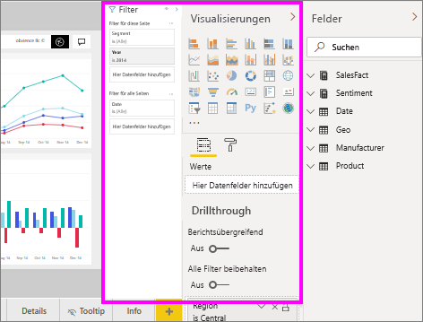

## Anwenden eines Designs
Mit Berichtsdesigns können Sie Entwurfsänderungen auf den gesamten Bericht anwenden, z. B. die Verwendung von Unternehmensfarben, das Ändern von Symbolsätzen oder das Anwenden der neuen Standardformatierung für Visuals. Wenn Sie ein Berichtsdesign anwenden, verwenden alle Visuals im Bericht die Farben und Formatierung des ausgewählten Designs. Weitere Informationen finden Sie unter [Verwenden von Berichtdesigns](../desktop-report-themes.md).

Hier wurde das Design **Innovate** auf den Bericht für Vertrieb und Marketing angewendet.

## Farbe eines einzelnen Datenpunkts ändern
Unter Umständen möchten Sie einen bestimmten Datenpunkt markieren. Möglicherweise handelt es sich dabei um die Verkaufszahlen für ein neu eingeführtes Produkt oder bessere Qualitätsergebnisse nach der Einführung eines neuen Programms. Mit Power BI können Sie einen bestimmten Datenpunkt hervorheben, indem Sie seine Farbe ändern.

In der folgenden Visualisierung werden verkaufte Einheiten nach Produktsegment angeordnet. 

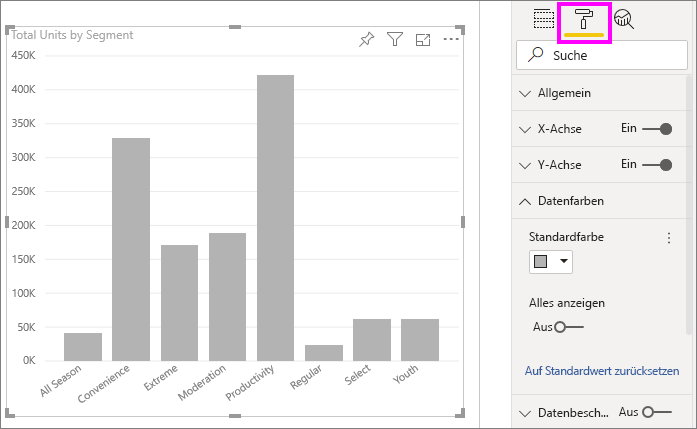

Stellen Sie sich vor, dass Sie das Segment **Convenience** farblich hervorheben möchten, um zu zeigen, wie gut dieses brandneue Segment abschneidet. Gehen Sie wie folgt vor:

Erweitern Sie den Abschnitt **Datenfarben**, und aktivieren Sie den Schieberegler für **Alles einblenden**. Die Farben für jedes Datenelement in der Visualisierung werden angezeigt. Ändern Sie einen beliebigen Datenpunkt.

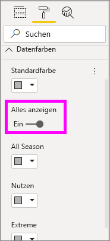

Legen Sie **Convenience** auf Orange fest. 

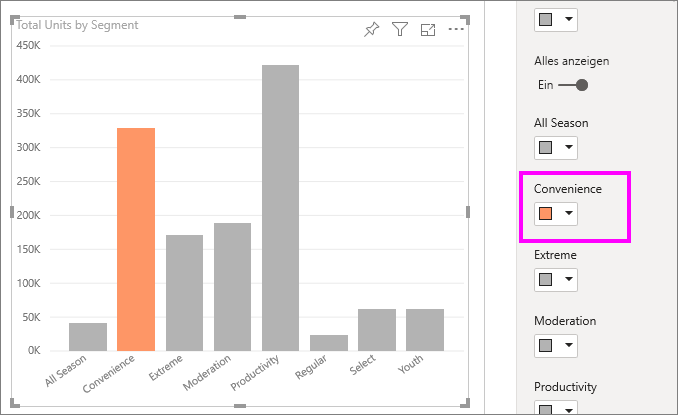

Sobald die Auswahl getroffen wurde, wird der Datenpunkt **Convenience** in einem ansprechenden Orange hervorgehoben.

Auch wenn Sie Visualisierungstypen ändern und später zurückkehren, speichert Power BI Ihre Auswahl und markiert **Convenience** in Orange.

Sie können die Farbe eines Datenpunkts für einzelne, mehrere oder alle Datenelemente in der Visualisierung ändern. Vielleicht möchten Sie Ihr Visual an Ihre Unternehmensfarben Gelb, Grün und Blau anpassen. 

Farben bieten Ihnen viele Gestaltungsmöglichkeiten. Im nächsten Abschnitt prüfen wir Farbverläufe.

## Bedingte Formatierung für Visualisierungen
Visualisierungen lassen sich mit dynamischen Farbeinstellungen nach dem numerischen Wert eines Felds ansprechend gestalten. Dadurch können Sie einen anderen als für die Größe eines Balkens verwendeten Wert anzeigen und die beiden Werte in einer einzelnen Grafik anzeigen. Sie können damit auch Datenpunkte markieren, die über (oder unter) einem bestimmten Wert liegen, z. B. Bereiche mit geringer Rentabilität.

Die folgenden Abschnitte zeigen die verschiedene Methoden, Farben auf Grundlage eines numerischen Werts anzupassen.

### Farbe von Datenpunkten nach einem numerischen Wert vergeben
Um die Farbe anhand eines Werts zu ändern, wählen Sie eine Visualisierung aus, um diese zu aktivieren. Öffnen Sie den Formatierungsbereich, indem Sie das Farbrollersymbol auswählen und die Karte **Datenfarben** aufklappen. Zeigen Sie auf die Karte, klicken Sie auf die drei vertikalen Punkte, und wählen Sie **Bedingte Formatierung** aus.  

Verwenden Sie im Bereich **Standardfarbe** die Dropdownlisten, um die Felder zu identifizieren, die für die bedingte Formatierung verwendet werden. In diesem Beispiel wird das Feld **Sales fact** > **Total Units** ausgewählt und hellblau für **Niedrigster Wert** bzw. dunkelblau für **Höchster Wert** verwendet. 

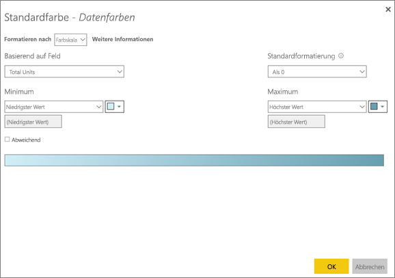

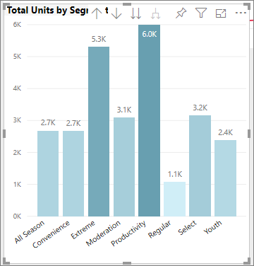

Sie können die Farbe des Visuals mithilfe eines Felds formatieren, das nicht Teil des Visuals ist. In der folgenden Abbildung wird **%Market Share SPLY YTD** (% Marktanteil im gleichen Vorjahreszeitraum seit Jahresbeginn) verwendet. 

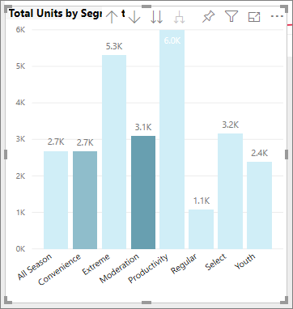

Sie sehen, dass zwar mehr Einheiten aus den Bereichen **Productivity** (Produktivität) und **Extreme** verkauft wurden (die Säulen sind höher), **Moderation** aber dennoch einen höheren Wert für **%Market Share SPLY YTD** (% Marktanteil im gleichen Vorjahreszeitraum seit Jahresbeginn) aufweist (die Säule zeigt eine stärkere Farbsättigung).

### Farben in der Farbskala individuell anpassen
Sie können auch ändern, wie die Werte diesen Farben zugeordnet werden. In der folgenden Abbildung werden für **Minimal** und **Maximal** die Farben Orange und Grün festgelegt.

Achten Sie im ersten Bild darauf, wie die Balken im Diagramm den Farbverlauf in der Farbverlaufsleiste widerspiegeln. Der höchste Wert ist Grün, ist der niedrigste ist Orange, und jeder Balken dazwischen wird mit einer Farbe zwischen Grün und Orange gekennzeichnet.

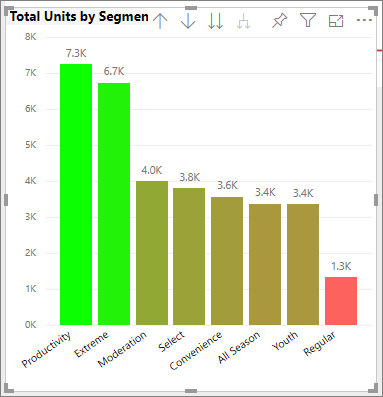

Lassen Sie uns überprüfen, was passiert, wenn wir in den Feldern **Minimum** und **Maximum** numerische Werte angeben. Wählen Sie **Anzahl** aus den Dropdownfeldern sowohl für **Minimum** als auch **Maximum** aus, und legen Sie **Minimum** auf 3.500 und **Maximum** auf 6.000 fest.

Werden diese Werte festgelegt, wird der Farbverlauf nicht mehr auf die Werte im Diagramm angewendet, die unter dem **Minimum** oder über dem **Maximum** liegen. Alle Balken mit Werten oberhalb des **Maximums** werden grün, alle Balken mit Werten unterhalb des **Minimums** rot markiert.

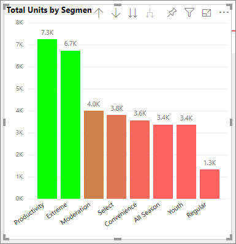

### Abweichende Farbskalen verwenden
Manchmal verfügen Ihre Daten über natürlich abweichende Skalen. Beispielsweise liegt bei einem Temperaturbereich die natürliche Mitte am Gefrierpunkt, und eine Rentabilitätsbewertung hat einen natürlichen Mittelpunkt (Null).

Aktivieren Sie das Kontrollkästchen **Abweichend**, um abweichende Farbskalen zu verwenden. Wenn **Abweichend** aktiviert ist, wird wie im Folgenden dargestellt eine zusätzliche Farbauswahl namens **Mitte** angezeigt.

Wenn der Schieberegler **Abweichend** aktiviert ist, können Sie die Farben für **Minimal**, **Maximal** und **Mitte** separat auswählen. In der folgenden Abbildung wird die **Mitte** für **% Market Share SPLY YTD** (% Marktanteil im gleichen Vorjahreszeitraum seit Jahresbeginn) auf „0,2“ festgelegt, sodass Balken mit Werten über 0,2 in einem Grünton und Balken mit Werten unter 0,2 in einem Rotton angezeigt werden.

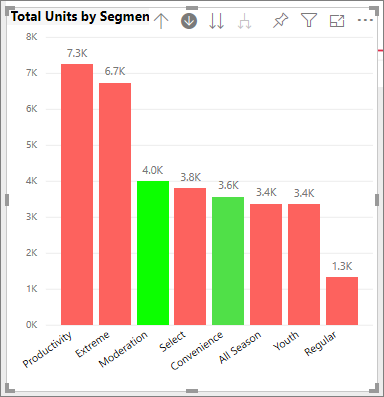

## Änderungen in Power BI rückgängig machen
Wie viele andere Microsoft-Dienste und Software bietet Power BI eine einfache Möglichkeit, den letzten Befehl rückgängig zu machen. Nehmen wir an, Sie ändern die Farbe eines Datenpunkts oder eine Reihe von Datenpunkten, und die Farbe gefällt Ihnen nicht, wenn sie in der Visualisierung angezeigt wird. Sie wissen nicht genau, wie die Farbe zuvor festgelegt war, aber Sie möchten wieder diese Farbe angezeigt bekommen.

Sie können Ihre letzte Aktion bzw. die letzten paar Aktionen ganz einfach **rückgängig machen**: STRG + Z.

## Feedback
Haben Sie einen Tipp, von dem Sie berichten möchten? Bitte lassen Sie ihn uns zukommen –möglicherweise nehmen wir ihn in diese Liste auf.

>[!NOTE]
>Die Farb- und Achseneinstellungen sowie die zugehörigen Anpassungen, die bei Auswahl des Symbols **Format** verfügbar sind, stehen auch in Power BI Desktop zur Verfügung.

## Nächste Schritte
[Erste Schritte mit Farbeinstellungen und Achseneigenschaften](service-getting-started-with-color-formatting-and-axis-properties.md)

